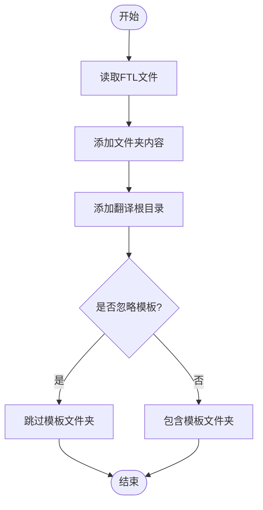

# 本地化流程

<cite>
**本文档引用的文件**
- [extract.rs](file://rslib/i18n/extract.rs)
- [gather.rs](file://rslib/i18n/gather.rs)
- [write_strings.rs](file://rslib/i18n/write_strings.rs)
- [python.rs](file://rslib/i18n/python.rs)
- [typescript.rs](file://rslib/i18n/typescript.rs)
- [update-ankidroid-usage.sh](file://ftl/update-ankidroid-usage.sh)
- [core](file://ftl/core)
- [qt](file://ftl/qt)
</cite>

## 目录
1. [简介](#简介)
2. [项目结构](#项目结构)
3. [核心组件](#核心组件)
4. [架构概述](#架构概述)
5. [详细组件分析](#详细组件分析)
6. [依赖分析](#依赖分析)
7. [性能考虑](#性能考虑)
8. [故障排除指南](#故障排除指南)
9. [结论](#结论)

## 简介
Anki的本地化流程是一个复杂的系统，旨在支持多语言环境下的软件开发。该流程通过一系列工具和脚本实现，确保Rust、Python和TypeScript代码中的国际化字符串能够被正确提取、收集和生成。本文档详细描述了从代码中提取国际化字符串的完整工作流，包括extract.rs和gather.rs工具的协作机制，以及如何生成FTL文件并保持与AnkiDroid和AnkiMobile的同步。

## 项目结构
Anki的本地化相关文件主要分布在`ftl`目录下，该目录包含了核心功能和Qt界面的翻译文件。此外，`rslib/i18n`目录下的Rust代码负责处理本地化逻辑。

**图示来源**
- [core](file://ftl/core)
- [qt](file://ftl/qt)
- [extract.rs](file://rslib/i18n/extract.rs)
- [gather.rs](file://rslib/i18n/gather.rs)
- [write_strings.rs](file://rslib/i18n/write_strings.rs)
- [python.rs](file://rslib/i18n/python.rs)
- [typescript.rs](file://rslib/i18n/typescript.rs)

**本节来源**
- [ftl](file://ftl)
- [rslib/i18n](file://rslib/i18n)

## 核心组件
Anki的本地化流程依赖于几个核心组件，这些组件协同工作以确保国际化字符串的正确处理。主要组件包括`extract.rs`、`gather.rs`和`write_strings.rs`，它们分别负责提取、收集和生成本地化字符串。

**本节来源**
- [extract.rs](file://rslib/i18n/extract.rs)
- [gather.rs](file://rslib/i18n/gather.rs)
- [write_strings.rs](file://rslib/i18n/write_strings.rs)

## 架构概述
Anki的本地化架构设计旨在高效地处理多语言支持。整个流程从源代码中的字符串提取开始，经过收集和处理，最终生成可供不同平台使用的本地化文件。

**图示来源**
- [extract.rs](file://rslib/i18n/extract.rs)
- [gather.rs](file://rslib/i18n/gather.rs)
- [write_strings.rs](file://rslib/i18n/write_strings.rs)
- [python.rs](file://rslib/i18n/python.rs)
- [typescript.rs](file://rslib/i18n/typescript.rs)

## 详细组件分析

### extract.rs分析
`extract.rs`是Anki本地化流程中的关键组件之一，负责从FTL文件中提取字符串及其元数据。

**图示来源**
- [extract.rs](file://rslib/i18n/extract.rs)

**本节来源**
- [extract.rs](file://rslib/i18n/extract.rs)

### gather.rs分析
`gather.rs`负责从文件系统中读取FTL文件，并将其内容组织成适合进一步处理的数据结构。

**图示来源**
- [gather.rs](file://rslib/i18n/gather.rs)

**本节来源**
- [gather.rs](file://rslib/i18n/gather.rs)

### write_strings.rs分析
`write_strings.rs`负责将收集到的本地化数据转换为可在Rust代码中使用的格式。

**图示来源**
- [write_strings.rs](file://rslib/i18n/write_strings.rs)

**本节来源**
- [write_strings.rs](file://rslib/i18n/write_strings.rs)

## 依赖分析
Anki的本地化流程涉及多个组件之间的复杂依赖关系。这些依赖关系确保了本地化数据能够在不同平台和语言之间正确传递。

**图示来源**
- [extract.rs](file://rslib/i18n/extract.rs)
- [gather.rs](file://rslib/i18n/gather.rs)
- [write_strings.rs](file://rslib/i18n/write_strings.rs)
- [python.rs](file://rslib/i18n/python.rs)
- [typescript.rs](file://rslib/i18n/typescript.rs)
- [update-ankidroid-usage.sh](file://ftl/update-ankidroid-usage.sh)

**本节来源**
- [rslib/i18n](file://rslib/i18n)
- [ftl](file://ftl)

## 性能考虑
Anki的本地化流程在设计时考虑了性能因素。通过使用高效的字符串处理算法和数据结构，确保了本地化操作不会成为性能瓶颈。此外，本地化数据的缓存机制也进一步提高了运行时性能。

## 故障排除指南
在进行本地化工作时，可能会遇到各种问题。以下是一些常见的故障排除建议：
- 确保所有FTL文件都以换行符结尾
- 检查字符串键是否唯一，避免重复
- 验证变量类型是否正确匹配
- 确认本地化文件路径配置正确

**本节来源**
- [check.rs](file://rslib/i18n/check.rs)

## 结论
Anki的本地化流程是一个精心设计的系统，通过多个组件的协同工作，实现了高效的多语言支持。该流程不仅支持Rust、Python和TypeScript等多种编程语言，还能够与AnkiDroid和AnkiMobile等移动客户端保持同步。通过理解这个流程，开发者可以更有效地参与Anki的国际化工作，为全球用户提供更好的使用体验。