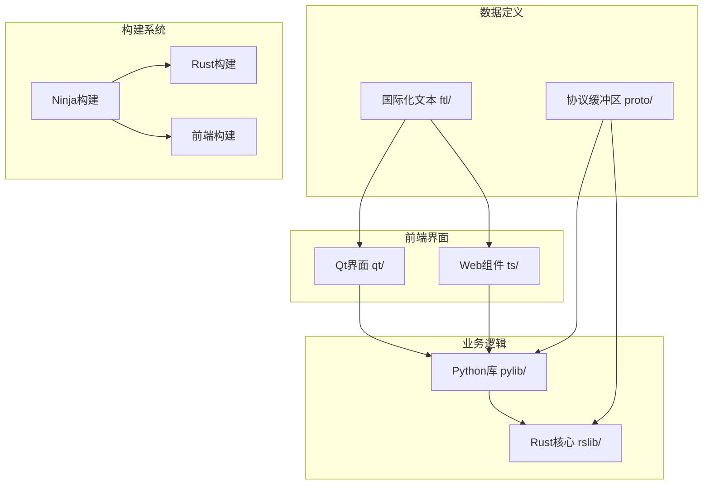

# 开发者指南

<cite>
**本文档中引用的文件**  
- [README.md](file://README.md)
- [docs/development.md](file://docs/development.md)
- [docs/contributing.md](file://docs/contributing.md)
- [docs/windows.md](file://docs/windows.md)
- [docs/mac.md](file://docs/mac.md)
- [docs/linux.md](file://docs/linux.md)
- [docs/editing.md](file://docs/editing.md)
- [pyproject.toml](file://pyproject.toml)
- [Cargo.toml](file://Cargo.toml)
- [package.json](file://package.json)
- [rust-toolchain.toml](file://rust-toolchain.toml)
- [tools/run.py](file://tools/run.py)
- [qt/runanki.py](file://qt/runanki.py)
- [rslib/src/lib.rs](file://rslib/src/lib.rs)
- [pylib/anki/_backend.py](file://pylib/anki/_backend.py)
- [qt/aqt/main.py](file://qt/aqt/main.py)
- [ts/vite.config.ts](file://ts/vite.config.ts)
</cite>

## 目录
1. [简介](#简介)
2. [项目结构](#项目结构)
3. [环境设置](#环境设置)
4. [调试技巧](#调试技巧)
5. [贡献指南](#贡献指南)
6. [开发入门](#开发入门)
7. [高级开发技巧](#高级开发技巧)
8. [结论](#结论)

## 简介
Anki是一款基于间隔重复算法的记忆软件，其桌面版本的源代码托管在GitHub仓库中。本指南旨在为开发者提供全面的开发指导，涵盖从环境搭建到代码贡献的完整流程。项目采用多语言技术栈，包括Rust、Python、TypeScript和Qt框架，支持跨平台开发（Windows、macOS、Linux）。开发者可以通过构建源码来运行开发版本，参与功能开发或修复问题。项目使用Ninja作为构建系统，通过一系列自动化脚本简化开发流程。本指南将详细介绍环境配置、调试方法、代码贡献规范以及针对不同经验水平开发者的实用技巧。

## 项目结构
Anki项目采用模块化设计，核心组件按功能分离。Rust代码（rslib/）实现核心逻辑和性能敏感功能，Python代码（pylib/）提供业务逻辑和API接口，Qt界面（qt/）构建桌面应用，TypeScript（ts/）处理前端交互。协议缓冲区（proto/）定义跨语言数据结构，FTL文件（ftl/）管理国际化文本。构建系统依赖Rust、Python和Node.js工具链，通过Ninja协调多语言编译。这种架构实现了核心逻辑与用户界面的解耦，支持独立开发和测试。



**图示来源**
- [README.md](file://README.md)
- [docs/development.md](file://docs/development.md)

**本节来源**
- [README.md](file://README.md#L1-L34)
- [docs/development.md](file://docs/development.md#L1-L210)

## 环境设置
### 依赖安装
Anki开发环境需要安装多种工具链。首先必须安装Rustup（https://rustup.rs/），项目通过rust-toolchain.toml文件锁定Rust版本。构建系统依赖N2或Ninja，可通过`tools/install-n2`脚本安装。Python环境需要64位Python 3.9或更高版本。前端构建需要Node.js和Yarn包管理器。协议缓冲区编译器（protoc）在构建过程中自动下载，也可通过环境变量PROTOC_BINARY指定本地版本。

平台特定依赖：
- **Windows**：需要Visual Studio Community（C++桌面开发）和MSYS2（提供git和rsync）
- **macOS**：需要Xcode命令行工具和Homebrew安装的mpv、lame音频工具
- **Linux**：需要基础开发工具（gcc、make、git）和Qt6库，某些发行版需安装libxcrypt-compat

### 配置步骤
1. 克隆仓库到无空格的短路径目录
2. 安装Rustup并运行`rustup show`确保正确版本
3. 安装N2/Ninja构建工具
4. 根据平台安装相应依赖（Windows的VS和MSYS2，macOS的Xcode和Homebrew包，Linux的开发包）
5. 运行`./run`（Windows用`.\run`）触发首次构建

构建过程会自动下载Python虚拟环境、Node.js模块和协议缓冲区编译器。首次构建耗时较长，后续构建将利用缓存加速。

### 验证安装
运行`./ninja check`执行完整测试套件验证环境正确性。成功构建后，执行`./run`应能启动Anki开发版本。若启动失败，可设置`QT_DEBUG_PLUGINS=1 ./run`查看缺失的Qt插件依赖。音频功能需要mpv和lame在系统路径中。可通过创建测试配置文件验证核心功能。

**本节来源**
- [docs/development.md](file://docs/development.md#L35-L210)
- [docs/windows.md](file://docs/windows.md#L1-L58)
- [docs/mac.md](file://docs/mac.md#L1-L21)
- [docs/linux.md](file://docs/linux.md#L1-L123)

## 调试技巧
### 日志分析
Anki提供多个环境变量控制日志输出：
- **ANKIDEV**：启用开发模式，输出额外日志并禁用自动备份
- **TRACESQL**：打印所有执行的SQL语句，用于数据库操作调试
- **LOGTERM**：将错误和警告信息同时输出到终端
- **ANKI_PROFILE_CODE**：退出时生成Python性能分析数据

日志文件通常位于用户配置目录的collection2.log中。结合ANKIDEV和LOGTERM可在终端实时监控应用行为。对于Rust后端，可通过Rust标准日志设施查看详细跟踪信息。

### 断点设置
推荐使用Visual Studio Code进行调试。配置步骤：
1. 运行`./run`完成首次构建生成依赖
2. 创建.vscode目录并链接推荐配置：`mkdir .vscode && cd .vscode && ln -sf ../.vscode.dist/* .`
3. 在VS Code中打开项目，安装推荐扩展（Python、Rust Analyzer、ESLint等）
4. 配置Python解释器指向`out/pyenv/bin/python`

对于PyCharm用户，需通过File>Project Structure将pylib/标记为源代码根目录。Rust代码可通过Rust Analyzer实现智能感知和断点调试。

### 性能分析
使用ANKI_PROFILE_CODE环境变量生成cProfile数据，可用`pstats`模块分析。对于前端性能，TypeScript代码通过Vite构建系统，可利用浏览器开发者工具分析。数据库操作性能可通过TRACESQL输出的SQL语句评估，重点关注复杂查询的执行时间。核心算法（如调度器）的性能瓶颈可通过Rust的性能分析工具定位。

**本节来源**
- [docs/development.md](file://docs/development.md#L185-L210)
- [docs/editing.md](file://docs/editing.md#L1-L56)

## 贡献指南
### 代码风格
新代码应遵循标准Python命名规范（snake_case）。由于插件兼容性要求，重命名现有函数时必须保留旧名称作为别名。Rust代码遵循rustfmt默认格式，可通过`./ninja format`自动格式化。TypeScript代码使用ESLint规则，可通过`./ninja fix`修复问题。

类型提示是强制要求，所有新Python代码必须包含完整类型注解。对于Qt类型提示问题，可使用`qconnect()`辅助函数或`cast()`。循环导入可通过启用`annotations`未来导入并使用完全限定名解决。

### 提交规范
每个补丁应专注于解决单一问题，避免包含无关更改。提交前必须确保`./ninja check`全部通过。建议在`.git/hooks/pre-commit`中添加自动检查脚本：

```sh
#!/bin/bash
./ninja check
```

非平凡的更改应附带单元测试。首次贡献需在CONTRIBUTORS文件中添加姓名。

### 审查流程
大型变更应在开始前通过论坛沟通确认可行性。避免纯重构的PR，