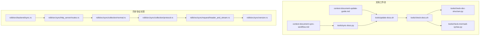
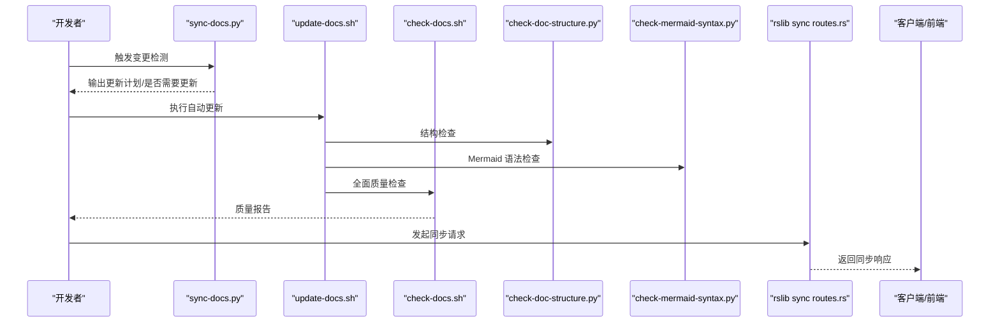
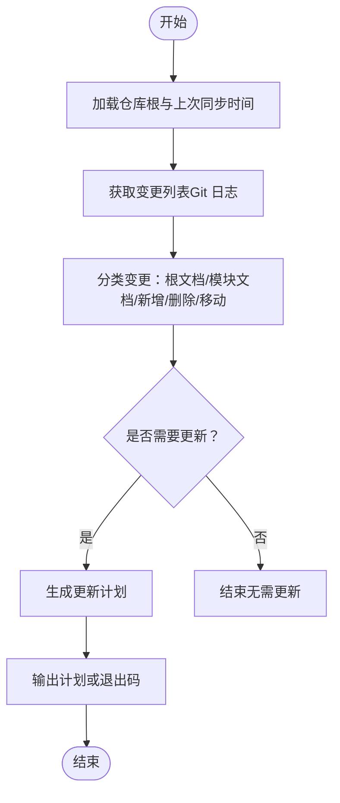
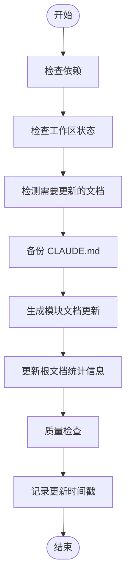
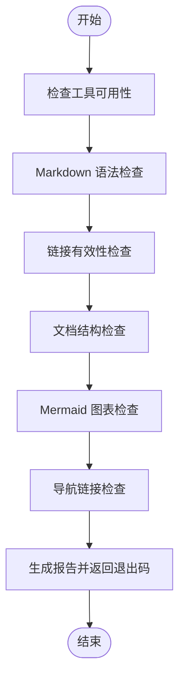
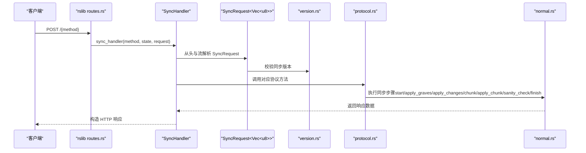
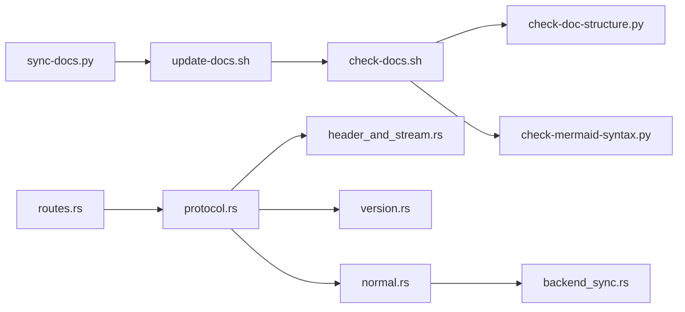

# 文档同步工作流

<cite>
**本文引用的文件**
- [context-document-sync-workflow.md](file://docs/context-document-sync-workflow.md)
- [context-document-update-guide.md](file://docs/context-document-update-guide.md)
- [architecture.md](file://docs/architecture.md)
- [sync-docs.py](file://tools/sync-docs.py)
- [update-docs.sh](file://tools/update-docs.sh)
- [check-docs.sh](file://tools/check-docs.sh)
- [check-doc-structure.py](file://tools/check-doc-structure.py)
- [check-mermaid-syntax.py](file://tools/check-mermaid-syntax.py)
- [routes.rs](file://rslib/src/sync/http_server/routes.rs)
- [normal.rs](file://rslib/src/sync/collection/normal.rs)
- [protocol.rs](file://rslib/src/sync/collection/protocol.rs)
- [header_and_stream.rs](file://rslib/src/sync/request/header_and_stream.rs)
- [version.rs](file://rslib/src/sync/version.rs)
- [backend_sync.rs](file://rslib/src/backend/sync.rs)
</cite>

## 目录
1. [简介](#简介)
2. [项目结构](#项目结构)
3. [核心组件](#核心组件)
4. [架构总览](#架构总览)
5. [详细组件分析](#详细组件分析)
6. [依赖分析](#依赖分析)
7. [性能考虑](#性能考虑)
8. [故障排查指南](#故障排查指南)
9. [结论](#结论)
10. [附录](#附录)

## 简介
本文面向“文档同步工作流”的落地实践，围绕 Anki 仓库中的上下文文档（CLAUDE.md）同步更新机制展开，覆盖从变更检测、增量更新、质量校验到自动化集成的全流程。同时补充同步协议层面的实现要点，帮助读者理解“代码-文档-测试”闭环如何协同保障项目可维护性与一致性。

## 项目结构
- 文档同步工作流由“文档工作流说明文档 + 自动化脚本 + 同步协议实现”三部分组成：
  - 文档工作流说明：定义原则、流程、最佳实践与故障处理
  - 自动化脚本：检测变更、生成更新计划、执行更新、质量检查
  - 同步协议实现：服务端路由、请求封装、版本协商与错误映射

**图表来源**
- [context-document-sync-workflow.md](file://docs/context-document-sync-workflow.md#L1-L446)
- [context-document-update-guide.md](file://docs/context-document-update-guide.md#L1-L373)
- [sync-docs.py](file://tools/sync-docs.py#L1-L235)
- [update-docs.sh](file://tools/update-docs.sh#L1-L224)
- [check-docs.sh](file://tools/check-docs.sh#L1-L333)
- [check-doc-structure.py](file://tools/check-doc-structure.py#L1-L150)
- [check-mermaid-syntax.py](file://tools/check-mermaid-syntax.py#L1-L227)
- [routes.rs](file://rslib/src/sync/http_server/routes.rs#L1-L117)
- [normal.rs](file://rslib/src/sync/collection/normal.rs#L1-L179)
- [protocol.rs](file://rslib/src/sync/collection/protocol.rs#L60-L92)
- [header_and_stream.rs](file://rslib/src/sync/request/header_and_stream.rs#L30-L73)
- [version.rs](file://rslib/src/sync/version.rs#L1-L29)
- [backend_sync.rs](file://rslib/src/backend/sync.rs#L43-L77)

**章节来源**
- [context-document-sync-workflow.md](file://docs/context-document-sync-workflow.md#L1-L446)
- [context-document-update-guide.md](file://docs/context-document-update-guide.md#L1-L373)

## 核心组件
- 文档同步检测工具：基于 Git 日志与文件类型，识别受影响模块与根文档，生成更新计划或仅做“是否需要更新”的判定
- 文档自动更新脚本：按顺序执行备份、模块更新、根文档更新、质量检查，并记录更新时间戳
- 文档质量检查脚本：多维检查（语法、链接、结构、Mermaid、导航一致性），并汇总报告
- 结构与 Mermaid 检查工具：对 CLAUDE.md 的结构与图表语法进行专项校验
- 同步协议实现：服务端路由分发、请求体解码、版本协商、错误映射与响应构造

**章节来源**
- [sync-docs.py](file://tools/sync-docs.py#L1-L235)
- [update-docs.sh](file://tools/update-docs.sh#L1-L224)
- [check-docs.sh](file://tools/check-docs.sh#L1-L333)
- [check-doc-structure.py](file://tools/check-doc-structure.py#L1-L150)
- [check-mermaid-syntax.py](file://tools/check-mermaid-syntax.py#L1-L227)
- [routes.rs](file://rslib/src/sync/http_server/routes.rs#L1-L117)
- [normal.rs](file://rslib/src/sync/collection/normal.rs#L1-L179)
- [protocol.rs](file://rslib/src/sync/collection/protocol.rs#L60-L92)
- [header_and_stream.rs](file://rslib/src/sync/request/header_and_stream.rs#L30-L73)
- [version.rs](file://rslib/src/sync/version.rs#L1-L29)
- [backend_sync.rs](file://rslib/src/backend/sync.rs#L43-L77)

## 架构总览
文档同步工作流与同步协议实现分别位于“文档侧”和“代码侧”，二者通过“变更驱动 + 自动化校验”的方式协同，确保文档与代码变更保持一致。

**图表来源**
- [sync-docs.py](file://tools/sync-docs.py#L1-L235)
- [update-docs.sh](file://tools/update-docs.sh#L1-L224)
- [check-docs.sh](file://tools/check-docs.sh#L1-L333)
- [check-doc-structure.py](file://tools/check-doc-structure.py#L1-L150)
- [check-mermaid-syntax.py](file://tools/check-mermaid-syntax.py#L1-L227)
- [routes.rs](file://rslib/src/sync/http_server/routes.rs#L1-L117)

## 详细组件分析

### 组件A：文档同步检测（sync-docs.py）
- 功能要点
  - 扫描仓库中所有 CLAUDE.md，定位主模块（ts、qt、pylib、rslib、build、ftl、proto、qt/launcher）
  - 读取“.last-doc-sync”时间戳，基于 Git 日志计算自上次同步以来的变更
  - 分析变更文件归属模块，分类影响根文档与模块文档
  - 生成更新计划或仅返回“是否需要更新”的退出码
- 关键流程
  - 读取仓库根目录与上次同步时间
  - 执行 Git 命令获取变更列表
  - 归属模块与影响判定
  - 生成更新计划或退出码

**图表来源**
- [sync-docs.py](file://tools/sync-docs.py#L1-L235)

**章节来源**
- [sync-docs.py](file://tools/sync-docs.py#L1-L235)

### 组件B：文档自动更新（update-docs.sh）
- 功能要点
  - 依赖检查（Python、Git）
  - 工作区状态检查（未提交变更提示）
  - 生成更新计划、备份现有文档、调用模块更新与根文档更新、质量检查、记录更新时间
- 关键流程
  - 检查依赖与工作区状态
  - 调用 sync-docs.py 生成更新计划
  - 备份 CLAUDE.md
  - 调用模块更新与根文档更新脚本
  - 调用 check-docs.sh 进行质量检查
  - 写入“.last-doc-sync”

**图表来源**
- [update-docs.sh](file://tools/update-docs.sh#L1-L224)

**章节来源**
- [update-docs.sh](file://tools/update-docs.sh#L1-L224)

### 组件C：文档质量检查（check-docs.sh）
- 功能要点
  - 语法检查（markdownlint）、链接有效性检查（markdown-link-check）
  - 结构一致性检查（check-doc-structure.py）
  - Mermaid 图表语法检查（check-mermaid-syntax.py）
  - 导航链接一致性检查（根文档模块链接）
  - 生成错误/警告计数与报告
- 关键流程
  - 工具可用性检查
  - 遍历所有 CLAUDE.md 执行检查
  - 汇总报告并返回退出码

**图表来源**
- [check-docs.sh](file://tools/check-docs.sh#L1-L333)
- [check-doc-structure.py](file://tools/check-doc-structure.py#L1-L150)
- [check-mermaid-syntax.py](file://tools/check-mermaid-syntax.py#L1-L227)

**章节来源**
- [check-docs.sh](file://tools/check-docs.sh#L1-L333)

### 组件D：同步协议实现（rslib 同步）
- 功能要点
  - 服务端路由：按方法名分发到具体处理器（host_key、meta、start、apply_graves、apply_changes、chunk、apply_chunk、sanity_check、finish、abort、upload、download）
  - 请求封装：从 HTTP 头与流中解析 SyncRequest，支持 zstd 解压与最大负载限制
  - 版本协商：支持最小/最大同步版本常量与版本校验
  - 错误映射：将内部错误转换为 HTTP 响应
  - 正常同步流程：meta → start → apply_graves → apply_changes → chunk/apply_chunk → sanity_check → finish
- 关键流程
  - 客户端发起同步请求（HTTP POST）
  - 服务端路由根据方法名分发
  - 请求体解码与版本校验
  - 执行同步步骤并返回响应

**图表来源**
- [routes.rs](file://rslib/src/sync/http_server/routes.rs#L1-L117)
- [header_and_stream.rs](file://rslib/src/sync/request/header_and_stream.rs#L30-L73)
- [version.rs](file://rslib/src/sync/version.rs#L1-L29)
- [protocol.rs](file://rslib/src/sync/collection/protocol.rs#L60-L92)
- [normal.rs](file://rslib/src/sync/collection/normal.rs#L1-L179)

**章节来源**
- [routes.rs](file://rslib/src/sync/http_server/routes.rs#L1-L117)
- [header_and_stream.rs](file://rslib/src/sync/request/header_and_stream.rs#L30-L73)
- [version.rs](file://rslib/src/sync/version.rs#L1-L29)
- [protocol.rs](file://rslib/src/sync/collection/protocol.rs#L60-L92)
- [normal.rs](file://rslib/src/sync/collection/normal.rs#L1-L179)
- [backend_sync.rs](file://rslib/src/backend/sync.rs#L43-L77)

## 依赖分析
- 文档侧依赖
  - sync-docs.py 依赖 Git 命令与 Python 标准库，用于变更检测
  - update-docs.sh 依赖 sync-docs.py 与各检查脚本，串联更新流程
  - check-docs.sh 依赖 markdownlint、markdown-link-check 与 Python 脚本
  - check-doc-structure.py 与 check-mermaid-syntax.py 依赖正则与文件系统
- 协议侧依赖
  - routes.rs 依赖 protocol.rs、request 模块与版本常量
  - normal.rs 依赖 protocol.rs、http_client、error 与进度处理
  - header_and_stream.rs 依赖 zstd 解码与最大负载限制
  - backend_sync.rs 依赖 proto 映射与错误类型

**图表来源**
- [sync-docs.py](file://tools/sync-docs.py#L1-L235)
- [update-docs.sh](file://tools/update-docs.sh#L1-L224)
- [check-docs.sh](file://tools/check-docs.sh#L1-L333)
- [check-doc-structure.py](file://tools/check-doc-structure.py#L1-L150)
- [check-mermaid-syntax.py](file://tools/check-mermaid-syntax.py#L1-L227)
- [routes.rs](file://rslib/src/sync/http_server/routes.rs#L1-L117)
- [protocol.rs](file://rslib/src/sync/collection/protocol.rs#L60-L92)
- [header_and_stream.rs](file://rslib/src/sync/request/header_and_stream.rs#L30-L73)
- [version.rs](file://rslib/src/sync/version.rs#L1-L29)
- [normal.rs](file://rslib/src/sync/collection/normal.rs#L1-L179)
- [backend_sync.rs](file://rslib/src/backend/sync.rs#L43-L77)

**章节来源**
- [sync-docs.py](file://tools/sync-docs.py#L1-L235)
- [update-docs.sh](file://tools/update-docs.sh#L1-L224)
- [check-docs.sh](file://tools/check-docs.sh#L1-L333)
- [routes.rs](file://rslib/src/sync/http_server/routes.rs#L1-L117)
- [protocol.rs](file://rslib/src/sync/collection/protocol.rs#L60-L92)
- [header_and_stream.rs](file://rslib/src/sync/request/header_and_stream.rs#L30-L73)
- [version.rs](file://rslib/src/sync/version.rs#L1-L29)
- [normal.rs](file://rslib/src/sync/collection/normal.rs#L1-L179)
- [backend_sync.rs](file://rslib/src/backend/sync.rs#L43-L77)

## 性能考虑
- 文档侧
  - 变更检测基于 Git 日志，建议限定时间窗口（如自上次同步时间）以减少扫描范围
  - 质量检查脚本可选择性执行（仅语法或仅链接），以缩短 CI 时间
- 协议侧
  - 请求体采用 zstd 压缩，服务端解压时设置最大解压字节数，避免内存压力
  - 版本协商与最小/最大版本常量确保兼容性与安全

[本节提供一般性指导，不直接分析具体文件]

## 故障排查指南
- 文档同步检测无输出或报错
  - 确认当前目录为 Git 仓库
  - 检查“.last-doc-sync”是否存在且格式正确
- 自动更新脚本中断
  - 工作区存在未提交变更时会提示确认，按需提交或暂存后再继续
  - 若模块更新脚本缺失，将跳过该步骤，但仍会更新根文档与质量检查
- 质量检查失败
  - 语法错误：使用 markdownlint 修复
  - 链接失效：使用 check-docs.sh 的链接检查定位并修复
  - 结构问题：使用 check-doc-structure.py 逐项修正
  - Mermaid 图表语法错误：使用 check-mermaid-syntax.py 定位并修正
- 同步协议异常
  - 版本不兼容：检查版本常量与客户端版本
  - 负载过大：服务端对上传大小有限制，避免超过阈值

**章节来源**
- [sync-docs.py](file://tools/sync-docs.py#L1-L235)
- [update-docs.sh](file://tools/update-docs.sh#L1-L224)
- [check-docs.sh](file://tools/check-docs.sh#L1-L333)
- [check-doc-structure.py](file://tools/check-doc-structure.py#L1-L150)
- [check-mermaid-syntax.py](file://tools/check-mermaid-syntax.py#L1-L227)
- [version.rs](file://rslib/src/sync/version.rs#L1-L29)
- [header_and_stream.rs](file://rslib/src/sync/request/header_and_stream.rs#L30-L73)

## 结论
通过“文档同步工作流 + 同步协议实现”的双轨协同，Anki 项目实现了“代码变更驱动文档更新、自动化质量校验、持续集成保障”的闭环。文档侧以工具链为核心，协议侧以路由与版本管理为基础，两者共同确保项目在演进过程中保持文档与代码的一致性与可维护性。

[本节为总结性内容，不直接分析具体文件]

## 附录
- 文档工作流说明与最佳实践详见：
  - [context-document-sync-workflow.md](file://docs/context-document-sync-workflow.md#L1-L446)
  - [context-document-update-guide.md](file://docs/context-document-update-guide.md#L1-L373)
- 同步协议实现参考：
  - [routes.rs](file://rslib/src/sync/http_server/routes.rs#L1-L117)
  - [normal.rs](file://rslib/src/sync/collection/normal.rs#L1-L179)
  - [protocol.rs](file://rslib/src/sync/collection/protocol.rs#L60-L92)
  - [header_and_stream.rs](file://rslib/src/sync/request/header_and_stream.rs#L30-L73)
  - [version.rs](file://rslib/src/sync/version.rs#L1-L29)
  - [backend_sync.rs](file://rslib/src/backend/sync.rs#L43-L77)