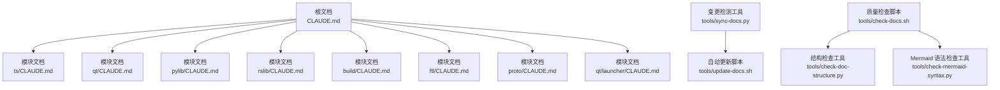
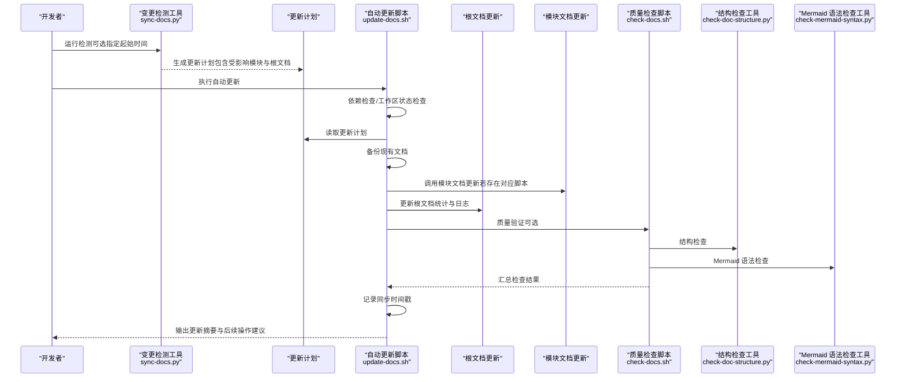
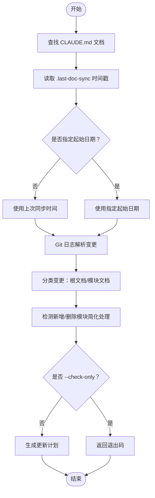
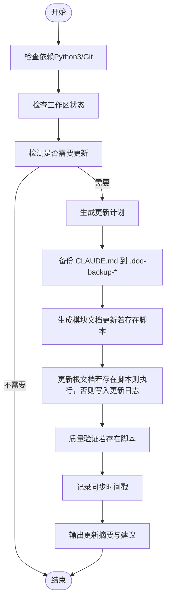
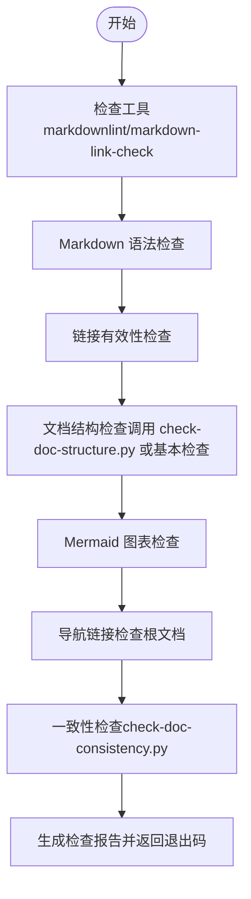
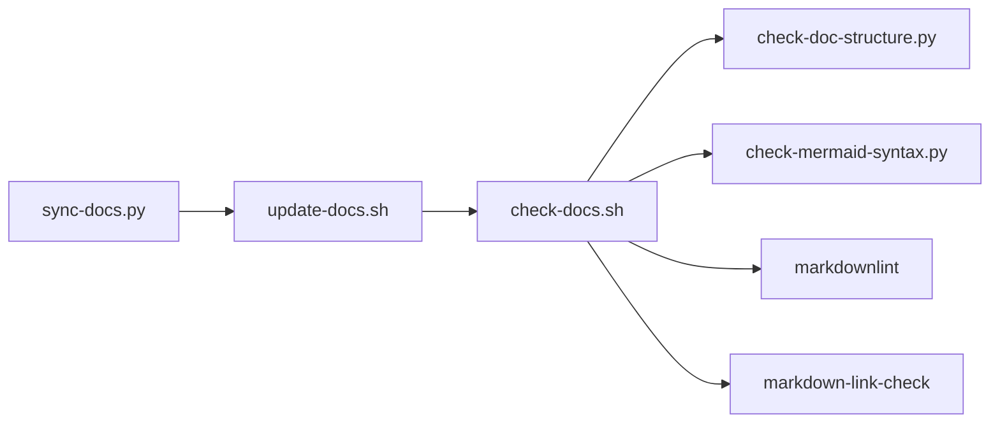

# 文档更新指南

<cite>
**本文引用的文件**
- [README.md](file://README.md)
- [docs/context-document-update-guide.md](file://docs/context-document-update-guide.md)
- [docs/.doc-update-example.md](file://docs/.doc-update-example.md)
- [docs/architecture.md](file://docs/architecture.md)
- [docs/development.md](file://docs/development.md)
- [docs/build.md](file://docs/build.md)
- [tools/sync-docs.py](file://tools/sync-docs.py)
- [tools/update-docs.sh](file://tools/update-docs.sh)
- [tools/check-docs.sh](file://tools/check-docs.sh)
- [tools/check-doc-structure.py](file://tools/check-doc-structure.py)
- [tools/check-mermaid-syntax.py](file://tools/check-mermaid-syntax.py)
</cite>

## 目录
1. [简介](#简介)
2. [项目结构](#项目结构)
3. [核心组件](#核心组件)
4. [架构总览](#架构总览)
5. [详细组件分析](#详细组件分析)
6. [依赖分析](#依赖分析)
7. [性能考虑](#性能考虑)
8. [故障排查指南](#故障排查指南)
9. [结论](#结论)
10. [附录](#附录)

## 简介
本指南面向维护 Anki 项目上下文文档（CLAUDE.md）的贡献者，提供一套标准化、可重复、可自动化的文档更新流程与工具链。通过“变更检测—生成更新计划—自动更新—质量校验—记录同步”的闭环，确保文档与代码变更保持同步，提升团队协作效率与文档质量。

## 项目结构
Anki 的文档更新围绕以下关键位置展开：
- 根文档：根目录下的 CLAUDE.md，用于汇总项目愿景、架构概览、模块索引与更新日志。
- 模块文档：各主要模块目录下的 CLAUDE.md，描述模块职责、文件结构、技术栈、依赖关系等。
- 工具链：位于 tools/ 下的 Python/Shell 脚本，负责检测变更、生成更新计划、执行自动更新、质量检查等。

**图表来源**
- [tools/sync-docs.py](file://tools/sync-docs.py#L1-L235)
- [tools/update-docs.sh](file://tools/update-docs.sh#L1-L224)
- [tools/check-docs.sh](file://tools/check-docs.sh#L1-L333)
- [tools/check-doc-structure.py](file://tools/check-doc-structure.py#L1-L150)
- [tools/check-mermaid-syntax.py](file://tools/check-mermaid-syntax.py#L1-L227)

**章节来源**
- [docs/context-document-update-guide.md](file://docs/context-document-update-guide.md#L1-L373)
- [docs/.doc-update-example.md](file://docs/.doc-update-example.md#L1-L190)

## 核心组件
- 变更检测工具（sync-docs.py）：基于 Git 日志分析代码变更，识别受影响的模块与根文档，生成更新计划或直接判定是否需要更新。
- 自动更新脚本（update-docs.sh）：按顺序执行依赖检查、工作区状态检查、生成更新计划、备份文档、调用模块/根文档更新逻辑、质量验证、记录同步时间，并给出后续操作建议。
- 质量检查脚本（check-docs.sh）：对 Markdown 语法、链接有效性、文档结构、Mermaid 图表、导航链接、一致性进行多维度检查，支持仅语法/仅链接模式。
- 结构检查工具（check-doc-structure.py）：验证根文档与模块文档的结构完整性（章节、标题层级、导航、空行等）。
- Mermaid 语法检查工具（check-mermaid-syntax.py）：针对流程图、时序图、类图等进行基础语法校验。

**章节来源**
- [tools/sync-docs.py](file://tools/sync-docs.py#L1-L235)
- [tools/update-docs.sh](file://tools/update-docs.sh#L1-L224)
- [tools/check-docs.sh](file://tools/check-docs.sh#L1-L333)
- [tools/check-doc-structure.py](file://tools/check-doc-structure.py#L1-L150)
- [tools/check-mermaid-syntax.py](file://tools/check-mermaid-syntax.py#L1-L227)

## 架构总览
文档更新的端到端流程如下：

**图表来源**
- [tools/sync-docs.py](file://tools/sync-docs.py#L1-L235)
- [tools/update-docs.sh](file://tools/update-docs.sh#L1-L224)
- [tools/check-docs.sh](file://tools/check-docs.sh#L1-L333)
- [tools/check-doc-structure.py](file://tools/check-doc-structure.py#L1-L150)
- [tools/check-mermaid-syntax.py](file://tools/check-mermaid-syntax.py#L1-L227)

## 详细组件分析

### 变更检测工具（sync-docs.py）
- 功能要点
  - 查找所有 CLAUDE.md 文档，限定于主要模块与根目录。
  - 读取 .last-doc-sync 时间戳作为默认起始时间，支持 --since 指定日期。
  - 基于 Git 日志分析变更文件，归类为“根文档影响”和“模块文档影响”两类。
  - 支持 --check-only 返回退出码，便于 CI 判定。
  - 支持 --ci-mode 输出 JSON，便于流水线集成。
  - 支持 --output 将更新计划写入文件。
- 影响判定
  - 根文档影响：涉及 proto/、build/、Cargo.toml、package.json、pyproject.toml、requirements.txt、ninja、workspace 等路径或文件名。
  - 模块文档影响：按文件扩展名与模块归属进行分类，优先覆盖主要模块目录。
- 输出
  - 更新计划包含受影响模块清单、变更文件数量与示例、建议操作等。

**图表来源**
- [tools/sync-docs.py](file://tools/sync-docs.py#L1-L235)

**章节来源**
- [tools/sync-docs.py](file://tools/sync-docs.py#L1-L235)

### 自动更新脚本（update-docs.sh）
- 功能要点
  - 依赖检查：Python3、Git。
  - 工作区检查：提示未提交变更并询问是否继续。
  - 检测更新：调用 sync-docs.py --check-only，若需要则生成 .doc-update-plan.md。
  - 备份：将所有 CLAUDE.md 复制到 .doc-backup-时间戳 目录。
  - 模块更新：尝试执行 generate-module-docs.py（若存在）。
  - 根文档更新：尝试执行 update-root-doc.py（若存在），否则回退到写入根文档更新日志。
  - 质量验证：尝试执行 check-docs.sh（若存在）。
  - 记录同步：写入 .last-doc-sync 时间戳。
  - 摘要：打印后续操作建议（查看计划、查看变更、提交推送）。
- 参数
  - --help/-h：显示帮助。
  - --check-only：仅检查是否需要更新。
  - --no-backup：跳过备份。

**图表来源**
- [tools/update-docs.sh](file://tools/update-docs.sh#L1-L224)

**章节来源**
- [tools/update-docs.sh](file://tools/update-docs.sh#L1-L224)

### 质量检查脚本（check-docs.sh）
- 功能要点
  - 工具检查：markdownlint、markdown-link-check（可选）。
  - Markdown 语法检查：基于配置过滤规则，避免对中文排版的误判。
  - 链接有效性检查：支持忽略本地链接与锚点，设置超时与重试。
  - 文档结构检查：优先调用 check-doc-structure.py；若不存在则执行基本结构检查（章节存在性、标题层级、空行等）。
  - Mermaid 图表检查：统计图表块，检查节点/箭头数量与子图配对。
  - 导航链接检查：根文档需包含主要模块链接且链接指向的文件存在。
  - 一致性检查：调用 check-doc-consistency.py（若存在）。
  - 报告：汇总错误与警告数量，返回退出码。
- 子命令
  - --syntax-only：仅语法检查。
  - --links-only：仅链接检查。

**图表来源**
- [tools/check-docs.sh](file://tools/check-docs.sh#L1-L333)
- [tools/check-doc-structure.py](file://tools/check-doc-structure.py#L1-L150)
- [tools/check-mermaid-syntax.py](file://tools/check-mermaid-syntax.py#L1-L227)

**章节来源**
- [tools/check-docs.sh](file://tools/check-docs.sh#L1-L333)

### 结构检查工具（check-doc-structure.py）
- 功能要点
  - 根文档：检查“项目愿景/架构概览/模块结构图/模块索引/运行和开发/更新日志”等章节；要求包含 Mermaid 模块结构图与模块索引表。
  - 模块文档：检查标题层级、章节标题、导航面包屑等。
  - 通用检查：空行过多、标题层级跳跃、中英文混用标点等。
- 输出：错误/警告列表或通过信息。

**章节来源**
- [tools/check-doc-structure.py](file://tools/check-doc-structure.py#L1-L150)

### Mermaid 语法检查工具（check-mermaid-syntax.py）
- 功能要点
  - 提取文档中所有 Mermaid 代码块，按图表类型进行针对性检查。
  - 流程图：检查节点数量、边引用节点存在性、subgraph/end 匹配。
  - 时序图：检查参与者与消息引用的参与者存在性。
  - 类图：检查类与关系引用类的存在性。
- 输出：错误/警告列表或通过信息。

**章节来源**
- [tools/check-mermaid-syntax.py](file://tools/check-mermaid-syntax.py#L1-L227)

## 依赖分析
- 工具链耦合关系
  - sync-docs.py 与 Git 交互，读取变更并生成更新计划。
  - update-docs.sh 串联 sync-docs.py、模块/根文档更新脚本、check-docs.sh。
  - check-docs.sh 依赖外部工具（markdownlint、markdown-link-check）与内部工具（check-doc-structure.py、check-mermaid-syntax.py）。
- 外部依赖
  - Python3、Git。
  - 可选：markdownlint-cli、markdown-link-check。
- 潜在循环依赖
  - 工具之间无直接循环导入，均为独立脚本，耦合度低。
- 集成点
  - CI：sync-docs.py --ci-mode 输出 JSON，供流水线判断是否需要更新。

**图表来源**
- [tools/sync-docs.py](file://tools/sync-docs.py#L1-L235)
- [tools/update-docs.sh](file://tools/update-docs.sh#L1-L224)
- [tools/check-docs.sh](file://tools/check-docs.sh#L1-L333)
- [tools/check-doc-structure.py](file://tools/check-doc-structure.py#L1-L150)
- [tools/check-mermaid-syntax.py](file://tools/check-mermaid-syntax.py#L1-L227)

**章节来源**
- [tools/sync-docs.py](file://tools/sync-docs.py#L1-L235)
- [tools/update-docs.sh](file://tools/update-docs.sh#L1-L224)
- [tools/check-docs.sh](file://tools/check-docs.sh#L1-L333)

## 性能考虑
- 变更检测
  - 仅扫描主要模块与根文档，避免遍历全仓库，减少 IO 与解析开销。
  - 使用 Git 日志增量分析，时间复杂度与变更文件数量线性相关。
- 自动更新
  - 备份采用复制父路径方式，适合小规模文档；大规模文档建议在 CI 中并行化或分批执行。
  - 根文档更新回退逻辑避免频繁调用外部脚本，减少不必要的 I/O。
- 质量检查
  - 外部工具（markdownlint、markdown-link-check）可选安装；未安装时会跳过相应检查，避免阻塞。
  - Mermaid 检查按文档内代码块数量线性扫描，建议在 CI 中限制检查范围以优化速度。

[本节为通用指导，不直接分析具体文件]

## 故障排查指南
- 常见问题与处理
  - 误报更新：若检测到需要更新但实际已最新，可通过更新 .last-doc-sync 或使用 --since 指定更早时间。
  - 更新后检查失败：运行 check-docs.sh 定位问题；Mermaid 语法错误可用 check-mermaid-syntax.py 定位。
  - 需要回滚：查看 .doc-backup-* 目录，恢复对应 CLAUDE.md 后提交回滚。
  - CI 失败：使用 sync-docs.py --ci-mode 生成 JSON，解析 needs_update 字段并设置退出码。
- 建议流程
  - 先运行 ./tools/check-docs.sh --syntax-only 或 --links-only 快速定位问题。
  - 若涉及 Mermaid 图表，单独运行 tools/check-mermaid-syntax.py。
  - 若结构异常，运行 tools/check-doc-structure.py 获取详细问题清单。

**章节来源**
- [docs/.doc-update-example.md](file://docs/.doc-update-example.md#L1-L190)
- [tools/check-docs.sh](file://tools/check-docs.sh#L1-L333)
- [tools/check-mermaid-syntax.py](file://tools/check-mermaid-syntax.py#L1-L227)
- [tools/check-doc-structure.py](file://tools/check-doc-structure.py#L1-L150)

## 结论
通过上述工具链与流程，Anki 的文档更新实现了“可检测、可计划、可自动、可验证、可回溯”。建议在日常开发中：
- 代码变更后及时运行 ./tools/sync-docs.py --check-only。
- 使用 ./tools/update-docs.sh 执行自动更新与质量验证。
- 在 CI 中集成 sync-docs.py --ci-mode，确保文档质量门槛。
- 遵循文档质量标准与最佳实践，持续改进更新效率与准确性。

[本节为总结性内容，不直接分析具体文件]

## 附录

### 快速上手
- 自动更新（推荐）
  - 检查是否需要更新：./tools/sync-docs.py --check-only
  - 执行自动更新：./tools/update-docs.sh
  - 查看更新内容：git diff --name-only | grep CLAUDE.md
  - 提交更新：git add . && git commit -m "docs: 更新上下文文档 (YYYY-MM-DD)" && git push origin main
- 手动更新
  - 分析变更影响：git log --oneline --since="1 week ago" --name-only；python3 tools/sync-docs.py
  - 更新相关文档：根文档与模块文档；更新模块结构图（Mermaid）与索引统计
  - 验证质量：./tools/check-docs.sh

**章节来源**
- [docs/context-document-update-guide.md](file://docs/context-document-update-guide.md#L1-L373)
- [docs/.doc-update-example.md](file://docs/.doc-update-example.md#L1-L190)

### 文档质量标准
- 内容要求：准确性、完整性、清晰性
- 格式要求：Markdown 规范、Mermaid 图表、代码块
- 一致性要求：术语统一、结构统一

**章节来源**
- [docs/context-document-update-guide.md](file://docs/context-document-update-guide.md#L180-L221)

### CI 集成示例
- 在 PR 中检测文档是否需要更新，使用 sync-docs.py --ci-mode 输出 JSON，解析 needs_update 字段决定退出码。

**章节来源**
- [docs/.doc-update-example.md](file://docs/.doc-update-example.md#L107-L138)
- [tools/sync-docs.py](file://tools/sync-docs.py#L186-L235)

### 相关文档
- 项目架构概览与模块划分：参见 docs/architecture.md
- 开发与构建：参见 docs/development.md、docs/build.md
- 项目入口与贡献说明：参见 README.md

**章节来源**
- [docs/architecture.md](file://docs/architecture.md#L1-L47)
- [docs/development.md](file://docs/development.md#L1-L210)
- [docs/build.md](file://docs/build.md#L1-L41)
- [README.md](file://README.md#L1-L34)