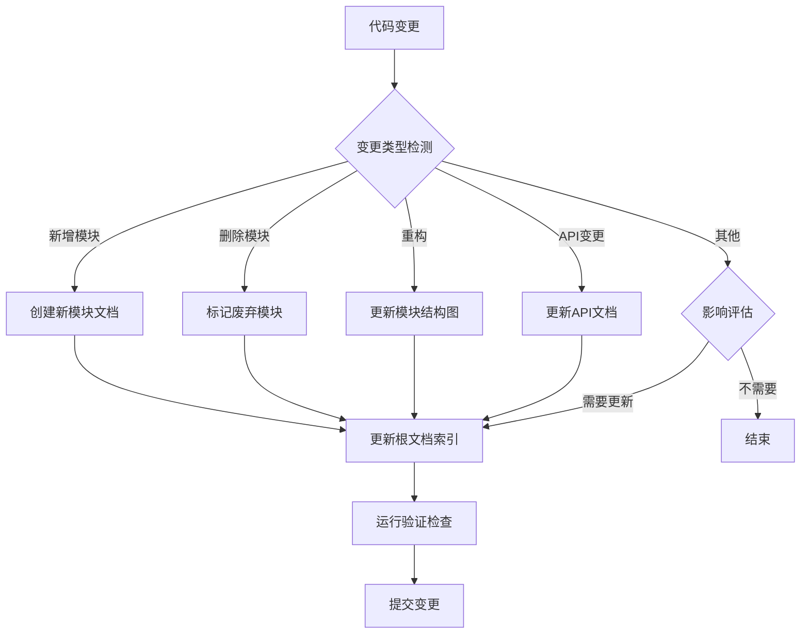

# 文档质量保证

<cite>
**本文档引用的文件**  
- [README.md](file://README.md)
- [docs/architecture.md](file://docs/architecture.md)
- [docs/contributing.md](file://docs/contributing.md)
- [docs/development.md](file://docs/development.md)
- [docs/build.md](file://docs/build.md)
- [docs/editing.md](file://docs/editing.md)
- [docs/context-document-sync-workflow.md](file://docs/context-document-sync-workflow.md)
- [docs/context-document-update-guide.md](file://docs/context-document-update-guide.md)
- [docs/ninja.md](file://docs/ninja.md)
- [tools/check-doc-structure.py](file://tools/check-doc-structure.py)
- [tools/check-mermaid-syntax.py](file://tools/check-mermaid-syntax.py)
- [tools/sync-docs.py](file://tools/sync-docs.py)
- [pylib/tests/test_cards.py](file://pylib/tests/test_cards.py)
- [rslib/src/lib.rs](file://rslib/src/lib.rs)
</cite>

## 目录
1. [简介](#简介)
2. [文档质量保证体系](#文档质量保证体系)
3. [文档更新工作流程](#文档更新工作流程)
4. [自动化工具链](#自动化工具链)
5. [质量检查机制](#质量检查机制)
6. [集成开发环境支持](#集成开发环境支持)
7. [最佳实践](#最佳实践)
8. [故障排除](#故障排除)
9. [结论](#结论)

## 简介

Anki项目建立了一套完整的文档质量保证体系，确保技术文档与代码库保持同步和一致。该体系通过自动化工具、标准化流程和严格的质量检查，维护文档的准确性、完整性和可维护性。文档质量被视为项目开发的重要组成部分，与代码质量和测试覆盖同等重要。

**Section sources**
- [README.md](file://README.md#L1-L34)
- [docs/architecture.md](file://docs/architecture.md#L1-L47)

## 文档质量保证体系

Anki的文档质量保证体系建立在"文档即代码"的核心原则之上，将文档视为与源代码同等重要的资产。该体系确保所有文档变更都经过版本控制、代码审查和自动化验证，形成完整的质量闭环。

### 核心原则

文档质量保证体系遵循三大核心原则：

1. **文档即代码**：所有文档文件（特别是CLAUDE.md）都纳入Git版本控制，文档变更需要经过与代码变更相同的审查流程。
2. **增量更新**：采用增量式更新策略，只更新实际发生变更的部分，保留历史变更记录，使用结构化的更新日志。
3. **一致性保证**：确保所有模块文档格式统一，导航链接有效，依赖关系准确反映代码库的实际情况。

这些原则确保文档能够及时、准确地反映项目状态，为开发者和贡献者提供可靠的参考。

**Section sources**
- [docs/context-document-sync-workflow.md](file://docs/context-document-sync-workflow.md#L1-L23)
- [docs/context-document-update-guide.md](file://docs/context-document-update-guide.md#L1-L21)

## 文档更新工作流程

Anki建立了标准化的文档更新工作流程，确保文档与代码变更保持同步。该流程定义了从代码变更到文档更新的完整生命周期，包括触发条件、实施步骤和验证机制。

### 代码变更触发文档更新

文档更新流程始于代码变更。系统会识别需要文档更新的特定场景：

| 变更类型 | 文档更新需求 | 更新级别 |
|---------|-------------|---------|
| 新增模块/目录 | 需要创建新的模块文档 | 高 |
| 删除模块/目录 | 需要删除或标记为废弃 | 高 |
| 重构/重组 | 需要更新模块结构和依赖关系 | 高 |
| API 变更 | 需要更新接口文档和示例 | 中 |
| 新功能开发 | 需要更新功能描述和使用指南 | 中 |
| 配置变更 | 需要更新构建和运行说明 | 低 |
| Bug 修复 | 通常不需要文档更新 | 最低 |



**Diagram sources**
- [docs/context-document-sync-workflow.md](file://docs/context-document-sync-workflow.md#L42-L60)

### 文档更新实施步骤

文档更新实施包括四个主要阶段：

1. **准备阶段**：确保代码库是最新的，运行完整构建验证代码正确性，创建专门的文档更新分支。
2. **分析变更影响**：使用Git工具分析自上次文档更新以来的变更，评估变更对文档的影响范围。
3. **更新文档内容**：根据变更类型更新相应的文档内容，包括根文档和模块文档。
4. **验证更新质量**：运行自动化检查工具验证文档语法、链接有效性和格式一致性。

**Section sources**
- [docs/context-document-sync-workflow.md](file://docs/context-document-sync-workflow.md#L64-L112)

## 自动化工具链

Anki提供了一套完整的自动化工具链，支持文档的同步检测、自动更新和质量验证。这些工具大大降低了文档维护的复杂性，提高了更新效率。

### 文档同步检测工具

`tools/sync-docs.py`是文档同步检测的核心工具，能够自动检测代码变更并识别需要更新的文档：

```bash
# 基本使用
python3 tools/sync-docs.py

# 仅检查是否需要更新
python3 tools/sync-docs.py --check-only

# 指定起始日期
python3 tools/sync-docs.py --since 2025-01-01

# 输出到文件
python3 tools/sync-docs.py --output update-plan.md

# CI 模式（JSON 输出）
python3 tools/sync-docs.py --ci-mode
```

该工具通过分析Git历史记录，确定哪些模块的文档需要更新，并生成详细的更新计划。

**Section sources**
- [tools/sync-docs.py](file://tools/sync-docs.py#L1-L235)
- [docs/context-document-update-guide.md](file://docs/context-document-update-guide.md#L223-L240)

### 文档自动更新脚本

`tools/update-docs.sh`是文档自动更新脚本，实现了从检测到更新的完整流程：

```bash
#!/bin/bash
# Anki 文档自动更新脚本

set -e

SCRIPT_DIR="$(cd "$(dirname "${BASH_SOURCE[0]}")" && pwd)"
REPO_ROOT="$(dirname "$SCRIPT_DIR")"

# 1. 检查工作目录状态
# 2. 运行文档同步检测
# 3. 生成模块文档更新
# 4. 更新根文档
# 5. 验证文档质量
# 6. 记录更新时间
```

该脚本确保文档更新过程的一致性和可靠性，避免了手动更新可能引入的错误。

**Section sources**
- [docs/context-document-sync-workflow.md](file://docs/context-document-sync-workflow.md#L235-L282)

## 质量检查机制

Anki建立了多层次的质量检查机制，确保文档的语法正确性、结构一致性和内容准确性。

### 文档结构检查

`tools/check-doc-structure.py`工具验证CLAUDE.md文件的结构是否符合标准：

```python
class DocumentStructureChecker:
    def check_all_documents(self) -> bool:
        """检查所有文档"""
        docs = list(self.repo_root.rglob("CLAUDE.md"))
        
        # 执行多项结构检查
        self._check_root_document()
        self._check_module_document()
        self._check_general_structure()
        
        return len(self.issues) == 0
```

该工具检查文档是否包含必要的章节，标题层级是否合理，以及是否存在格式问题。

**Section sources**
- [tools/check-doc-structure.py](file://tools/check-doc-structure.py#L1-L150)

### Mermaid图表语法检查

`tools/check-mermaid-syntax.py`工具专门验证Mermaid图表的语法正确性：

```python
class MermaidSyntaxChecker:
    def check_all_documents(self, repo_root: Path) -> bool:
        """检查所有文档中的 Mermaid 图表"""
        doc_files = list(repo_root.rglob("CLAUDE.md"))
        
        for doc_file in doc_files:
            self._check_document(doc_file)
            
        return len(self.errors) == 0
```

该工具支持多种Mermaid图表类型，包括流程图、时序图和类图，确保图表能够正确渲染。

**Section sources**
- [tools/check-mermaid-syntax.py](file://tools/check-mermaid-syntax.py#L1-L227)

### 综合质量检查

`tools/check-docs.sh`脚本整合了多项检查，提供全面的文档质量验证：

```bash
#!/bin/bash
# 文档质量检查脚本

# 1. Markdown 语法检查
# 2. 链接有效性检查
# 3. 文档结构一致性检查
# 4. Mermaid 图表语法检查
```

该脚本作为文档更新流程的最后防线，确保只有高质量的文档才能被提交。

**Section sources**
- [docs/context-document-sync-workflow.md](file://docs/context-document-sync-workflow.md#L285-L334)

## 集成开发环境支持

Anki为开发者提供了完善的集成开发环境支持，确保文档编辑体验与代码开发一致。

### Visual Studio Code 配置

推荐使用Visual Studio Code进行文档编辑，项目提供了优化的workspace设置：

```bash
# 设置推荐的 workspace 配置
mkdir .vscode && cd .vscode
ln -sf ../.vscode.dist/* .
```

这将自动配置编辑器的设置和推荐的扩展，提供最佳的开发体验。

### PyCharm/IntelliJ 配置

对于PyCharm/IntelliJ用户，项目提供了相应的配置支持：

```bash
# 设置 Python 环境
mkdir .idea && cd .idea
ln -sf ../.idea.dist/* .
```

这将自动配置源代码路径和Python解释器，确保代码补全和类型检查正常工作。

**Section sources**
- [docs/editing.md](file://docs/editing.md#L1-L60)

## 最佳实践

遵循文档质量保证的最佳实践，可以最大化文档的价值和维护效率。

### 更新时机

- **功能开发**：功能实现完成后立即更新文档
- **重构**：重构完成后批量更新相关文档
- **API 变更**：接口变更前先更新文档，作为设计评审的一部分
- **定期维护**：每周运行一次完整的文档同步检查

### 提交规范

使用清晰的提交信息，便于追踪文档变更：

```bash
# 好的提交信息
git commit -m "docs: 更新调度器模块文档，添加新的 FSRS 算法说明"

# 包含变更范围
git commit -m "docs(ts): 更新前端模块，新增 React 组件说明"
```

### 审查流程

建立多层次的审查流程：
1. **自我审查**：运行自动化检查工具
2. **同行审查**：请相关模块专家审查技术准确性
3. **自动化验证**：CI系统自动运行质量检查

**Section sources**
- [docs/context-document-update-guide.md](file://docs/context-document-update-guide.md#L284-L314)

## 故障排除

文档质量保证体系可能遇到的常见问题及解决方案：

### 常见问题

1. **文档与代码不同步**
   - 原因: 代码变更后未更新文档
   - 解决: 运行 `tools/update-docs.sh` 重新同步

2. **链接失效**
   - 原因: 文件或章节被移动/删除
   - 解决: 运行 `tools/check-docs.sh` 定位并修复

3. **格式不一致**
   - 原因: 手动编辑导致格式差异
   - 解决: 使用自动化工具格式化文档

4. **Mermaid 图表渲染失败**
   - 原因: 语法错误或版本兼容问题
   - 解决: 使用 `tools/check-mermaid-syntax.py` 验证

**Section sources**
- [docs/context-document-sync-workflow.md](file://docs/context-document-sync-workflow.md#L419-L436)

## 结论

Anki的文档质量保证体系通过自动化工具、标准化流程和严格的质量检查，确保了技术文档的准确性、完整性和可维护性。这套体系将文档视为与代码同等重要的资产，建立了"代码-文档-测试"的完整闭环。

通过实施这套体系，Anki项目能够：
1. **及时性**：代码变更后文档能够及时更新
2. **准确性**：通过自动化工具保证文档与代码的一致性
3. **质量**：通过检查机制保证文档质量
4. **可维护性**：标准化的流程降低维护成本

建议将此工作流程完全集成到日常开发中，形成持续的文档维护习惯，确保文档始终反映项目的最新状态。