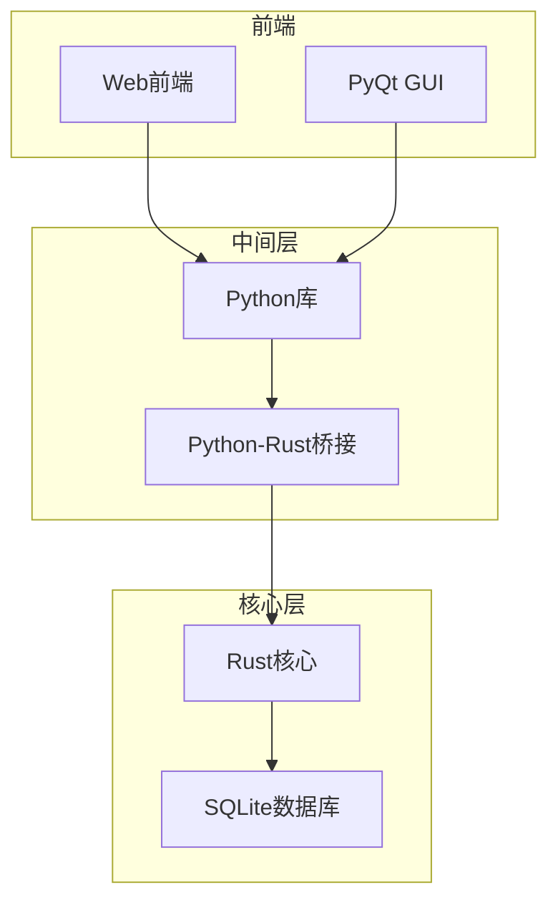
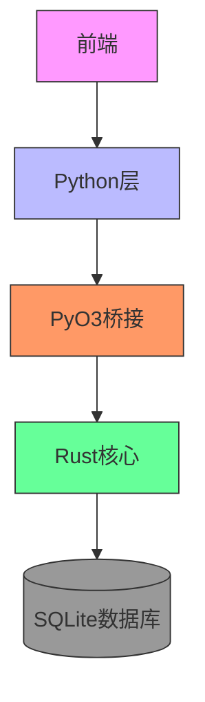
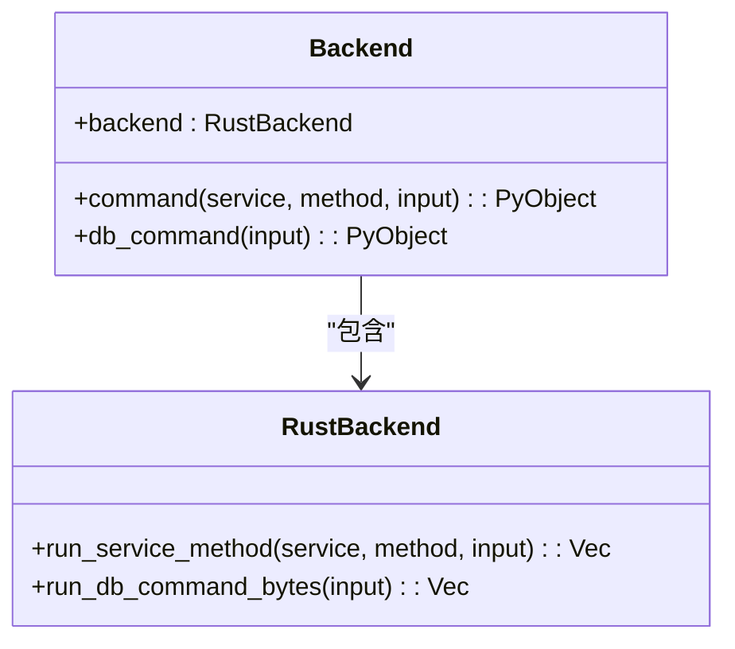
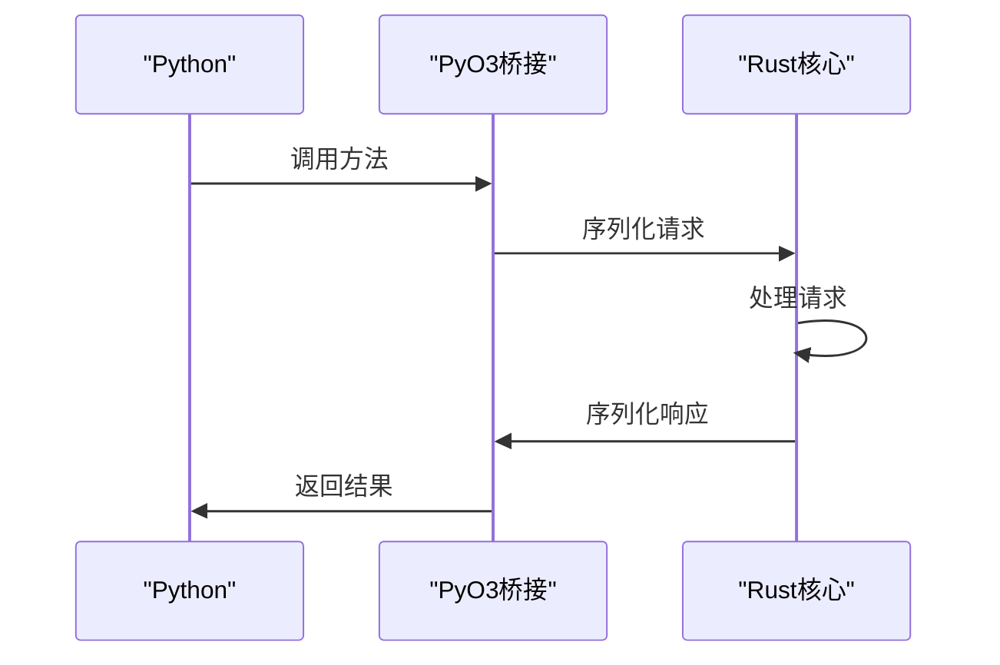
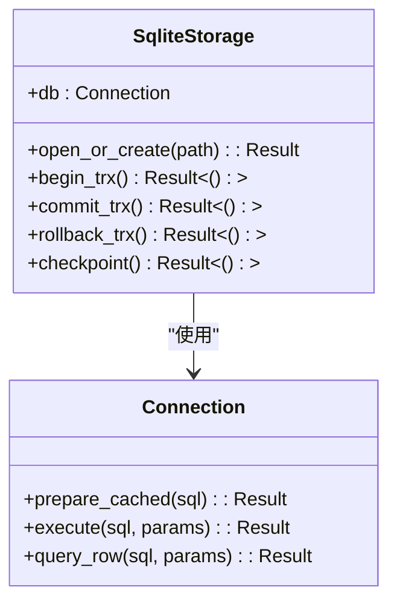
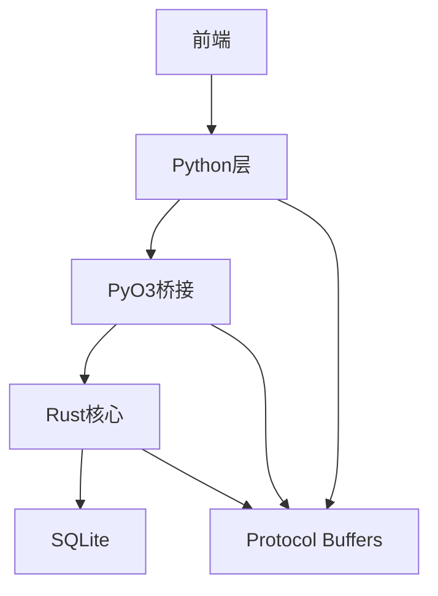

# API集成

<cite>
**本文档中引用的文件**  
- [backend.proto](file://proto/anki/backend.proto)
- [cards.proto](file://proto/anki/cards.proto)
- [lib.rs](file://rslib/src/lib.rs)
- [sqlite.rs](file://rslib/src/storage/sqlite.rs)
- [_backend.py](file://pylib/anki/_backend.py)
- [rsbackend.py](file://pylib/anki/rsbackend.py)
- [build.rs](file://pylib/rsbridge/build.rs)
- [lib.rs](file://pylib/rsbridge/lib.rs)
</cite>

## 目录
1. [简介](#简介)
2. [项目结构](#项目结构)
3. [核心组件](#核心组件)
4. [架构概述](#架构概述)
5. [详细组件分析](#详细组件分析)
6. [依赖分析](#依赖分析)
7. [性能考虑](#性能考虑)
8. [故障排除指南](#故障排除指南)
9. [结论](#结论)

## 简介
Anki是一个采用多层架构的间隔重复闪卡程序，其核心功能通过Rust实现，并通过Python和TypeScript进行封装和扩展。本项目通过Protocol Buffers定义接口，实现跨语言通信，同时利用SQLite进行数据持久化。系统架构分为Web前端、PyQt GUI、Python库和Rust核心层，各层通过明确定义的接口进行交互。

## 项目结构
Anki项目采用模块化设计，主要分为以下几个部分：proto目录包含Protocol Buffers定义，rslib是Rust核心实现，pylib提供Python接口，qt包含PyQt GUI组件，ts存放TypeScript前端代码。这种分层结构使得各组件职责清晰，便于维护和扩展。

**图示来源**  
- [CLAUDE.md](file://CLAUDE.md#L2-L12)

## 核心组件
Anki的核心组件包括Rust后端服务、Python桥接层和Protocol Buffers通信协议。Rust后端提供高性能的数据处理能力，Python桥接层通过PyO3实现Python与Rust的互操作，Protocol Buffers则作为跨语言通信的标准格式。这种设计既保证了性能，又提供了良好的语言互操作性。

**节来源**  
- [lib.rs](file://rslib/src/lib.rs#L0-L58)
- [_backend.py](file://pylib/anki/_backend.py#L0-L263)

## 架构概述
Anki采用分层架构设计，前端通过Python与Rust核心层通信，所有跨语言调用都通过Protocol Buffers进行序列化。Rust核心层负责业务逻辑处理和数据存储，通过SQLite实现数据持久化。这种架构设计实现了关注点分离，使得系统既具有高性能又易于维护。

**图示来源**  
- [CLAUDE.md](file://CLAUDE.md#L43-L50)
- [architecture.md](file://docs/architecture.md#L33-L46)

## 详细组件分析

### Python-Rust互操作机制
Anki使用PyO3库实现Python与Rust的互操作。PyO3提供了高效的Python扩展机制，允许Rust代码直接暴露给Python调用。在构建过程中，build.rs脚本会根据目标平台配置适当的链接参数，确保Python解释器能够正确加载Rust扩展模块。

**图示来源**  
- [lib.rs](file://pylib/rsbridge/lib.rs#L0-L92)
- [build.rs](file://pylib/rsbridge/build.rs#L0-L33)

### Protocol Buffers通信协议
Anki使用Protocol Buffers作为跨语言通信的标准格式。所有后端方法和数据结构都通过.proto文件定义，然后生成对应语言的绑定代码。这种设计确保了类型安全和向后兼容性，同时提供了高效的序列化性能。

**图示来源**  
- [backend.proto](file://proto/anki/backend.proto#L0-L62)
- [cards.proto](file://proto/anki/cards.proto#L0-L80)

### SQLite数据持久化
Anki使用SQLite作为数据持久化方案，通过rusqlite库提供Rust绑定。数据库连接被封装在SqliteStorage结构中，提供事务管理、查询优化和并发控制等功能。系统还定义了多个自定义SQL函数，用于支持复杂的查询需求。

**图示来源**  
- [sqlite.rs](file://rslib/src/storage/sqlite.rs#L0-L704)

## 依赖分析
Anki项目的依赖关系清晰，各组件之间的耦合度适中。Rust核心层通过明确的接口与Python层通信，避免了直接依赖。Protocol Buffers作为接口定义语言，有效地解耦了不同语言实现。SQLite作为嵌入式数据库，与业务逻辑分离，便于测试和维护。

**图示来源**  
- [Cargo.toml](file://Cargo.toml)
- [pyproject.toml](file://pyproject.toml)

## 性能考虑
Anki在性能方面做了多项优化。首先，通过Rust实现核心逻辑，确保了计算密集型操作的高性能。其次，使用Protocol Buffers进行序列化，相比JSON等格式具有更高的效率。再者，SQLite配置了WAL模式和适当的缓存大小，优化了数据库性能。最后，PyO3桥接层允许在GIL之外执行Rust代码，避免了Python的全局解释器锁限制。

## 故障排除指南
常见集成问题包括Python-Rust桥接失败、Protocol Buffers版本不匹配和数据库访问冲突。解决方案包括确保构建环境一致、验证Protocol Buffers定义的兼容性，以及正确管理数据库事务。对于性能问题，建议启用SQL跟踪以识别慢查询，并考虑调整SQLite的配置参数。

**节来源**  
- [sqlite.rs](file://rslib/src/storage/sqlite.rs#L0-L704)
- [_backend.py](file://pylib/anki/_backend.py#L0-L263)

## 结论
Anki的API集成设计体现了现代软件工程的最佳实践。通过分层架构、明确的接口定义和合适的工具选择，系统在性能、可维护性和可扩展性之间取得了良好平衡。Python-Rust互操作、Protocol Buffers通信和SQLite持久化的组合，为构建高性能、跨平台的应用程序提供了可靠的基础。