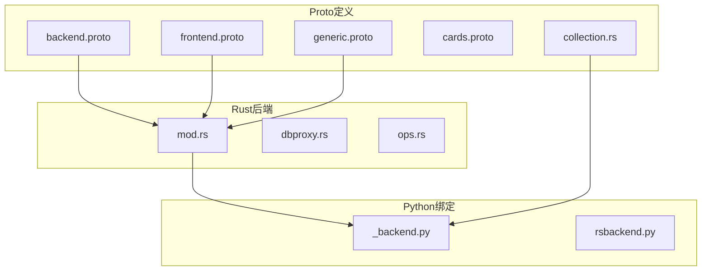
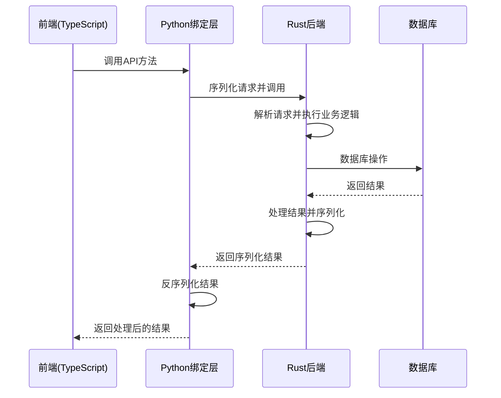
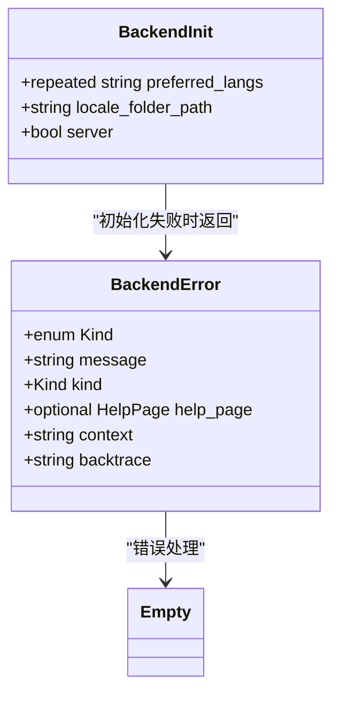
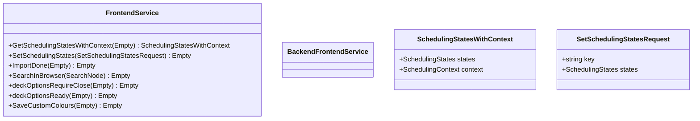
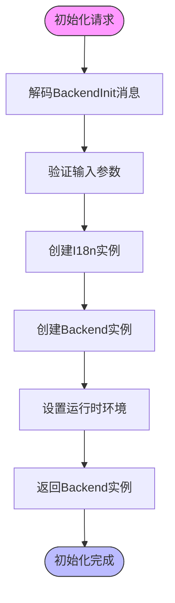
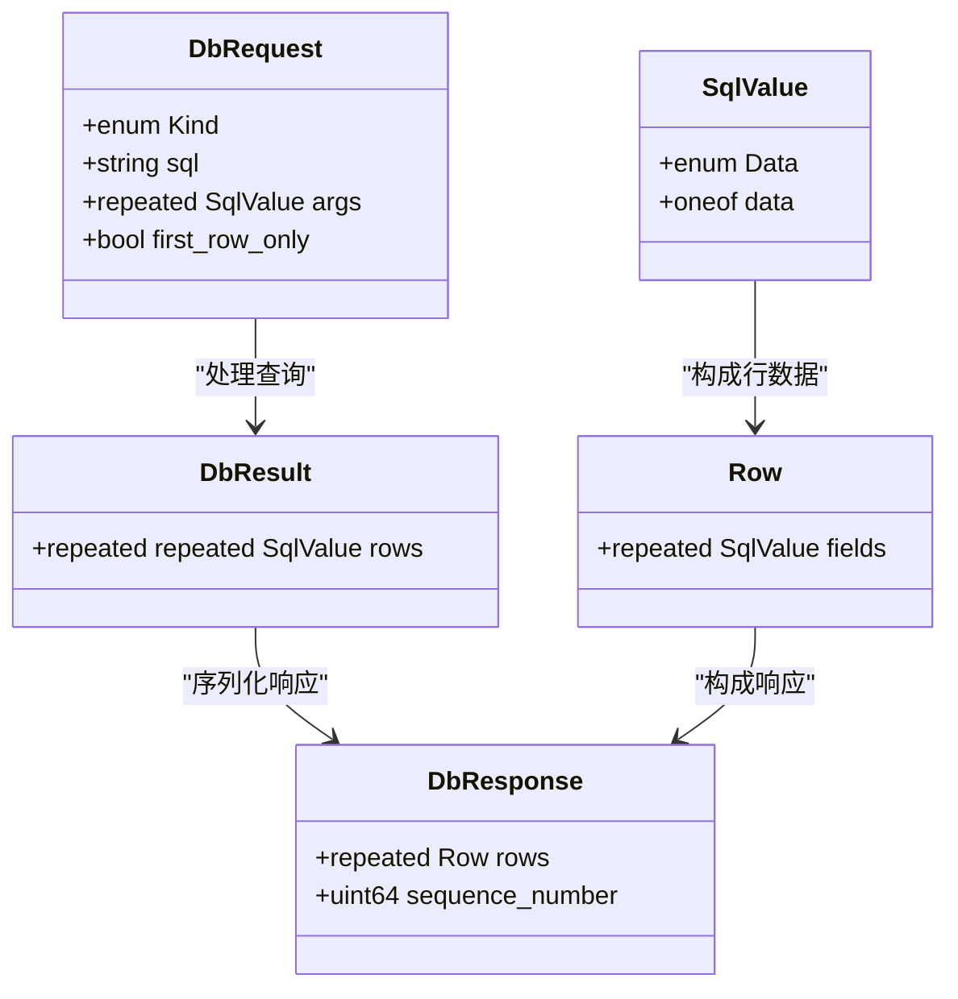
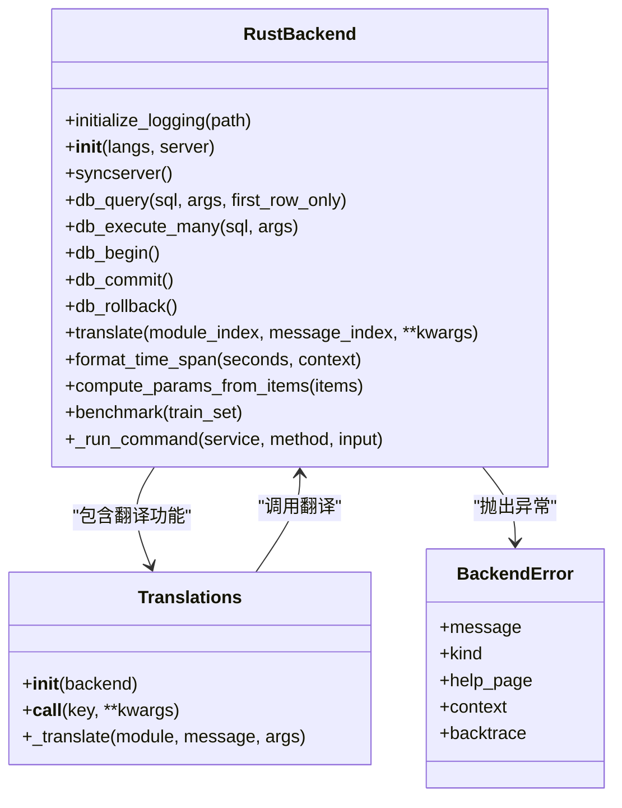
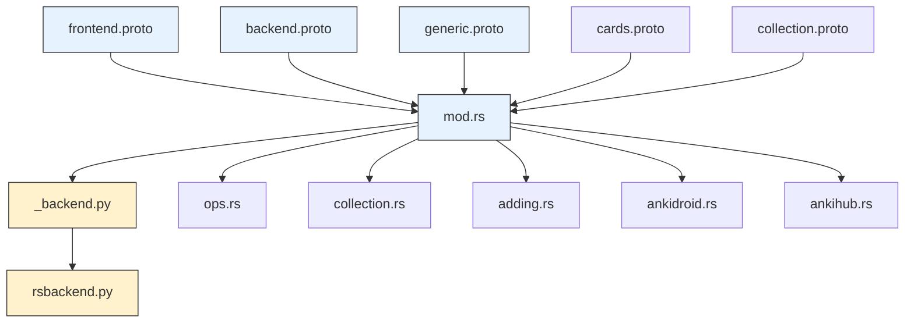

# Protocol Buffers通信

<cite>
**本文档引用的文件**   
- [backend.proto](file://proto/anki/backend.proto)
- [frontend.proto](file://proto/anki/frontend.proto)
- [generic.proto](file://proto/anki/generic.proto)
- [mod.rs](file://rslib/src/backend/mod.rs)
- [dbproxy.rs](file://rslib/src/backend/dbproxy.rs)
- [_backend.py](file://pylib/anki/_backend.py)
- [ops.rs](file://rslib/src/backend/ops.rs)
- [collection.rs](file://rslib/src/backend/collection.rs)
- [adding.rs](file://rslib/src/backend/adding.rs)
- [ankidroid.rs](file://rslib/src/backend/ankidroid.rs)
- [ankihub.rs](file://rslib/src/backend/ankihub.rs)
</cite>

## 目录
1. [引言](#引言)
2. [项目结构](#项目结构)
3. [核心组件](#核心组件)
4. [架构概述](#架构概述)
5. [详细组件分析](#详细组件分析)
6. [依赖分析](#依赖分析)
7. [性能考虑](#性能考虑)
8. [故障排除指南](#故障排除指南)
9. [结论](#结论)

## 引言
本文档详细阐述了Anki项目中基于Protocol Buffers的通信机制。该系统通过定义.proto文件来实现前后端之间的高效通信，支持Rust和Python等多种语言的代码生成。文档将全面解释消息类型、服务接口和字段规则的定义方式，描述从.proto定义生成代码的过程，以及如何在前后端之间进行序列化和反序列化。

## 项目结构
Anki项目的Protocol Buffers通信机制主要分布在proto和rslib两个目录中。proto目录包含所有.proto定义文件，而rslib目录包含Rust后端实现。

**图示来源**
- [backend.proto](file://proto/anki/backend.proto#L1-L62)
- [frontend.proto](file://proto/anki/frontend.proto#L1-L45)
- [mod.rs](file://rslib/src/backend/mod.rs#L1-L195)
- [_backend.py](file://pylib/anki/_backend.py#L1-L263)

**本节来源**
- [proto](file://proto)
- [rslib](file://rslib)

## 核心组件
Protocol Buffers通信系统的核心组件包括.proto文件定义、Rust后端服务实现和Python绑定层。系统通过BackendInit消息初始化，使用BackendError消息处理各种错误情况，包括输入验证、数据库操作、网络通信等异常。

**本节来源**
- [backend.proto](file://proto/anki/backend.proto#L1-L62)
- [mod.rs](file://rslib/src/backend/mod.rs#L1-L195)
- [_backend.py](file://pylib/anki/_backend.py#L1-L263)

## 架构概述
Anki的Protocol Buffers通信架构采用分层设计，前端通过Python绑定层与Rust后端通信，Rust后端处理具体业务逻辑并返回序列化结果。

**图示来源**
- [mod.rs](file://rslib/src/backend/mod.rs#L1-L195)
- [_backend.py](file://pylib/anki/_backend.py#L1-L263)
- [dbproxy.rs](file://rslib/src/backend/dbproxy.rs#L1-L244)

## 详细组件分析

### .proto文件定义分析
.proto文件定义了通信协议的数据结构和服务接口，采用Protocol Buffers语法规范。

#### 消息类型定义

**图示来源**
- [backend.proto](file://proto/anki/backend.proto#L1-L62)
- [generic.proto](file://proto/anki/generic.proto#L1-L38)

#### 服务接口定义

**图示来源**
- [frontend.proto](file://proto/anki/frontend.proto#L1-L45)

### Rust后端实现分析
Rust后端通过mod.rs文件组织各个功能模块，实现.proto文件中定义的服务接口。

#### 后端初始化流程

**图示来源**
- [mod.rs](file://rslib/src/backend/mod.rs#L1-L195)

#### 数据库代理实现

**图示来源**
- [dbproxy.rs](file://rslib/src/backend/dbproxy.rs#L1-L244)

### Python绑定层分析
Python绑定层作为Rust后端与前端之间的桥梁，提供易于使用的API接口。

#### Python绑定类结构

**图示来源**
- [_backend.py](file://pylib/anki/_backend.py#L1-L263)

**本节来源**
- [backend.proto](file://proto/anki/backend.proto#L1-L62)
- [frontend.proto](file://proto/anki/frontend.proto#L1-L45)
- [generic.proto](file://proto/anki/generic.proto#L1-L38)
- [mod.rs](file://rslib/src/backend/mod.rs#L1-L195)
- [dbproxy.rs](file://rslib/src/backend/dbproxy.rs#L1-L244)
- [_backend.py](file://pylib/anki/_backend.py#L1-L263)

## 依赖分析
Protocol Buffers通信系统涉及多个组件之间的依赖关系，包括.proto文件、Rust实现和Python绑定。

**图示来源**
- [proto](file://proto)
- [rslib](file://rslib)
- [pylib](file://pylib)

**本节来源**
- [proto](file://proto)
- [rslib](file://rslib)
- [pylib](file://pylib)

## 性能考虑
Protocol Buffers通信系统在设计时考虑了多个性能因素，包括序列化效率、内存使用和线程安全。

### 序列化性能优化
系统采用二进制序列化格式，相比JSON等文本格式具有更高的效率。Rust后端直接处理字节数组，避免了中间字符串转换的开销。

### 内存管理
通过Arc（原子引用计数）和Mutex等智能指针和同步原语，系统实现了高效的内存共享和线程安全访问。Backend结构体使用Arc包装，允许多个线程安全地共享同一个实例。

### 异步处理
系统使用Tokio运行时处理异步操作，如网络请求和文件I/O，避免阻塞主线程。对于需要长时间运行的操作，如备份和媒体同步，系统使用独立的线程执行。

**本节来源**
- [mod.rs](file://rslib/src/backend/mod.rs#L1-L195)
- [collection.rs](file://rslib/src/backend/collection.rs#L1-L119)

## 故障排除指南
当Protocol Buffers通信出现问题时，可以按照以下步骤进行排查。

### 错误类型分析
系统定义了多种错误类型，每种类型对应特定的错误场景：

**图示来源**
- [backend.proto](file://proto/anki/backend.proto#L1-L62)

### 调试方法
1. 检查RUST_BACKTRACE环境变量是否设置，以获取详细的错误堆栈信息
2. 查看日志文件中的错误消息和上下文信息
3. 使用调试工具检查序列化/反序列化过程中的数据完整性
4. 验证.proto文件与生成代码的一致性

**本节来源**
- [backend.proto](file://proto/anki/backend.proto#L1-L62)
- [_backend.py](file://pylib/anki/_backend.py#L1-L263)

## 结论
Anki的Protocol Buffers通信机制通过清晰的分层设计和高效的序列化协议，实现了前后端之间的可靠通信。系统采用.proto文件定义接口，生成多语言绑定代码，确保了接口的一致性和可维护性。Rust后端提供了高性能的业务逻辑处理，Python绑定层则为前端提供了易用的API接口。整个系统在性能、可靠性和可扩展性方面都表现出色，为Anki应用的稳定运行提供了坚实的基础。