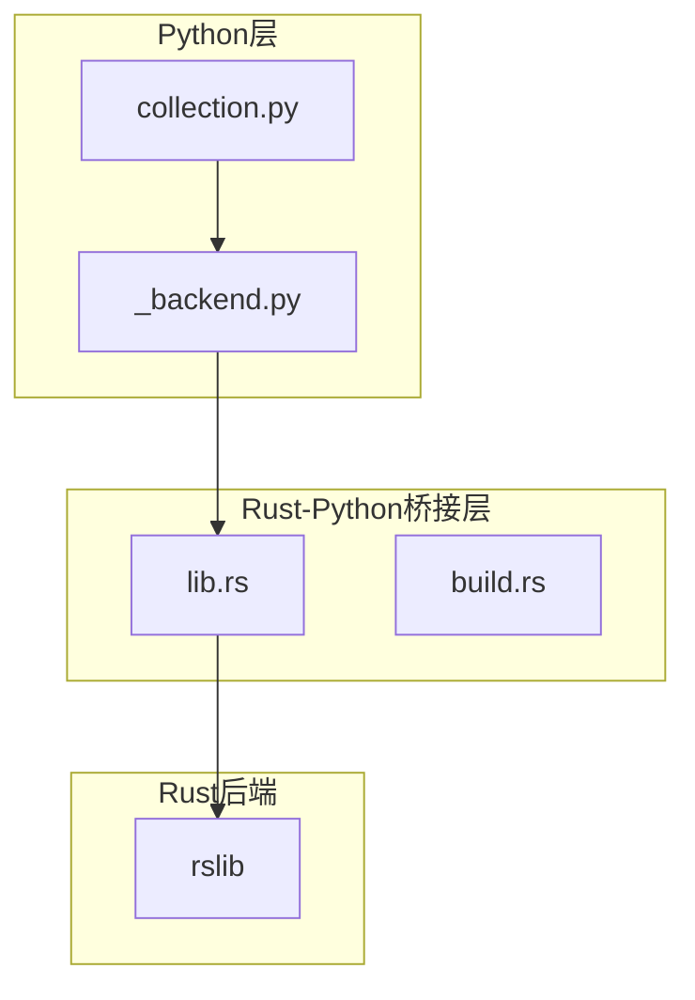
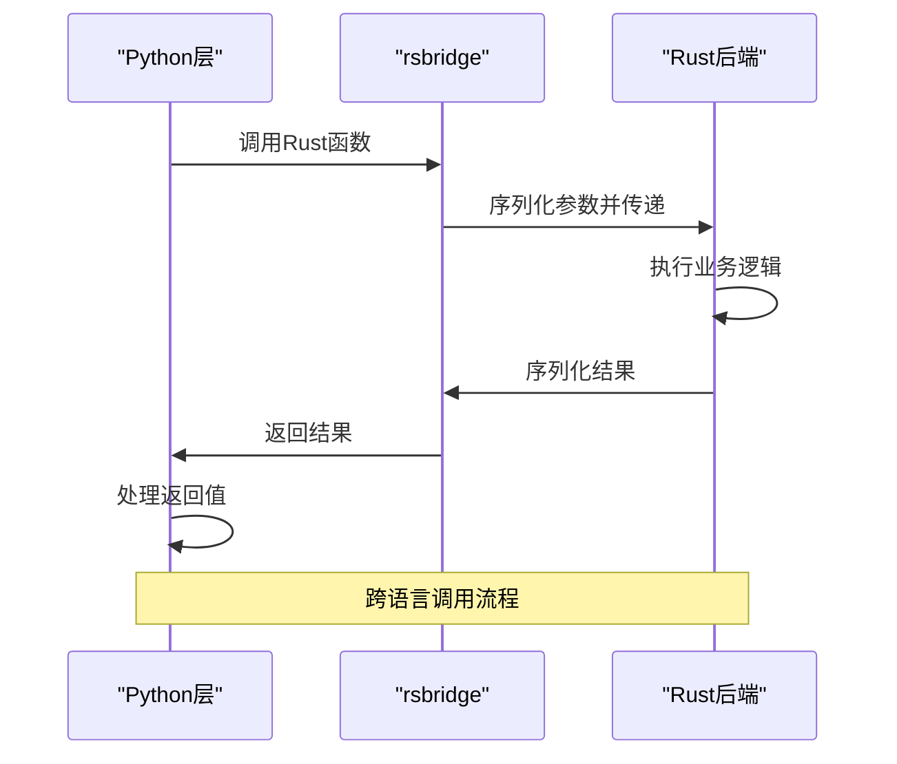
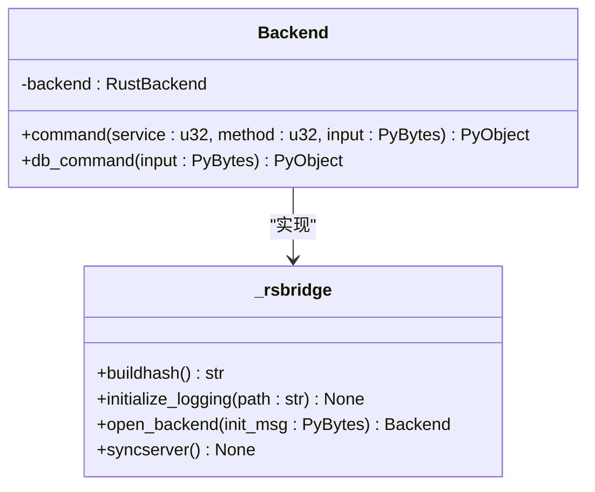
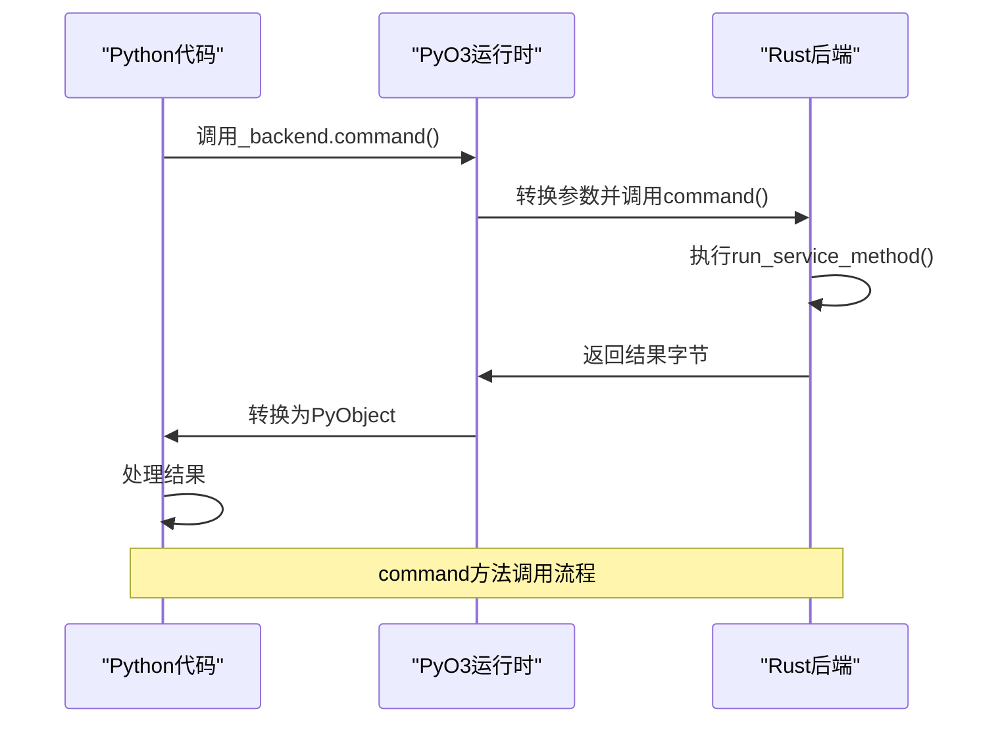
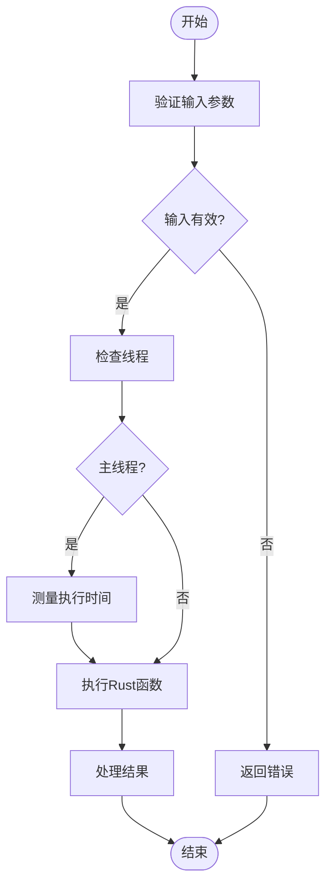
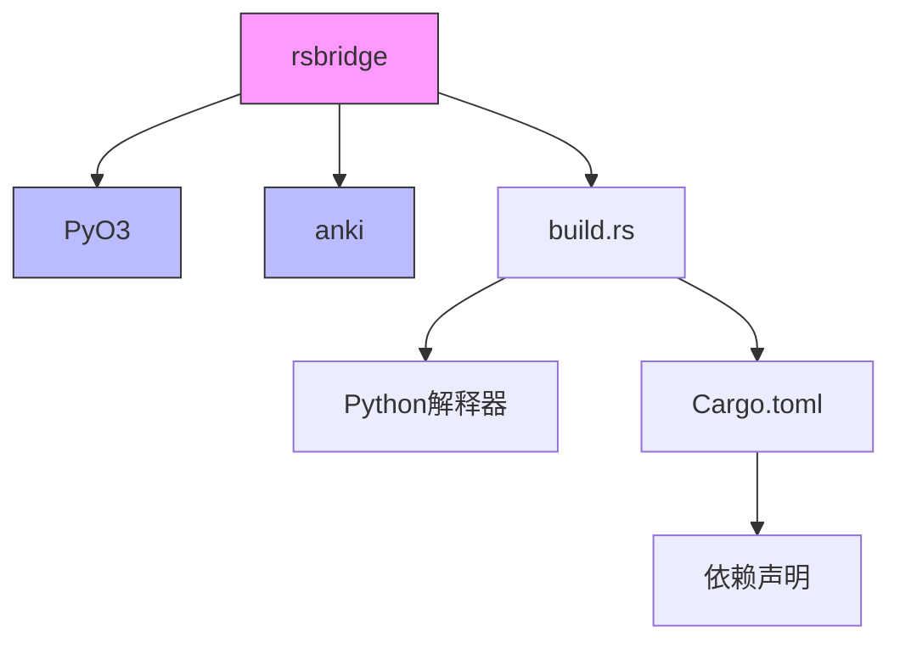

# Python-Rust集成

<cite>
**本文档中引用的文件**   
- [lib.rs](file://pylib/rsbridge/lib.rs)
- [Cargo.toml](file://pylib/rsbridge/Cargo.toml)
- [build.rs](file://pylib/rsbridge/build.rs)
- [_backend.py](file://pylib/anki/_backend.py)
- [collection.py](file://pylib/anki/collection.py)
- [rsbridge](file://pylib/rsbridge)
</cite>

## 目录
1. [简介](#简介)
2. [项目结构](#项目结构)
3. [核心组件](#核心组件)
4. [架构概述](#架构概述)
5. [详细组件分析](#详细组件分析)
6. [依赖分析](#依赖分析)
7. [性能考虑](#性能考虑)
8. [故障排除指南](#故障排除指南)
9. [结论](#结论)

## 简介
本文档详细介绍了Anki项目中Python与Rust的集成机制，重点阐述了通过PyO3实现的互操作性。文档涵盖了Rust核心功能如何暴露给Python层，包括数据类型转换规则、内存管理策略和错误处理模式。详细描述了PyO3宏的使用方法，如#[pyfunction]、#[pymethods]等，以及如何定义Python可调用的对象。提供了性能优化建议，包括减少跨语言调用开销、批量操作和异步处理。包含实际代码示例，展示如何在Python中调用Rust函数以及处理返回结果。解释了类型转换过程中的注意事项，特别是复杂数据结构的序列化和反序列化。为开发者提供了调试跨语言调用问题的工具和技巧。

## 项目结构
Anki项目的Python-Rust集成主要通过rsbridge模块实现，该模块位于pylib/rsbridge目录中。rsbridge是一个Rust库，使用PyO3创建Python绑定，允许Python代码调用Rust后端功能。集成架构采用分层设计，Python层通过_backend.py模块访问Rust功能，而Rust层在rslib中实现核心逻辑。

**Diagram sources**
- [lib.rs](file://pylib/rsbridge/lib.rs)
- [_backend.py](file://pylib/anki/_backend.py)
- [collection.py](file://pylib/anki/collection.py)

**Section sources**
- [lib.rs](file://pylib/rsbridge/lib.rs)
- [_backend.py](file://pylib/anki/_backend.py)
- [collection.py](file://pylib/anki/collection.py)

## 核心组件
Python-Rust集成的核心组件包括rsbridge模块、RustBackend类和Backend结构体。rsbridge模块使用PyO3将Rust函数暴露给Python，RustBackend类作为Python端的主要接口，Backend结构体封装了Rust后端实例。集成机制通过Protocol Buffers进行数据序列化，使用JSON进行数据库命令传输，以优化性能。

**Section sources**
- [lib.rs](file://pylib/rsbridge/lib.rs)
- [_backend.py](file://pylib/anki/_backend.py)

## 架构概述
Anki的Python-Rust集成采用桥接模式，通过rsbridge模块实现双向通信。Python代码调用Rust函数时，参数通过Protocol Buffers序列化为字节流，传递给Rust层处理，结果再序列化返回Python层。对于数据库操作，采用JSON格式以避免Protocol Buffers编解码的性能开销。错误处理通过自定义异常机制实现，确保跨语言调用的异常能够正确传递和处理。

**Diagram sources**
- [lib.rs](file://pylib/rsbridge/lib.rs)
- [_backend.py](file://pylib/anki/_backend.py)

## 详细组件分析

### rsbridge模块分析
rsbridge模块是Python-Rust集成的核心，使用PyO3创建Python可调用的Rust函数和类。模块通过#[pymodule]宏定义Python模块，使用#[pyfunction]宏暴露Rust函数，通过#[pymethods]宏为Rust结构体实现Python方法。

#### 对于对象导向组件：

**Diagram sources**
- [lib.rs](file://pylib/rsbridge/lib.rs)

#### 对于API/服务组件：

**Diagram sources**
- [lib.rs](file://pylib/rsbridge/lib.rs)
- [_backend.py](file://pylib/anki/_backend.py)

#### 对于复杂逻辑组件：

**Diagram sources**
- [lib.rs](file://pylib/rsbridge/lib.rs)
- [_backend.py](file://pylib/anki/_backend.py)

**Section sources**
- [lib.rs](file://pylib/rsbridge/lib.rs)
- [_backend.py](file://pylib/anki/_backend.py)

### PyO3宏使用分析
PyO3宏在rsbridge模块中扮演关键角色，用于定义Python可调用的Rust代码。#[pyfunction]宏用于暴露独立的Rust函数，#[pymethods]宏用于为Rust结构体实现Python方法，#[pymodule]宏用于定义整个Python模块。

**Section sources**
- [lib.rs](file://pylib/rsbridge/lib.rs)

## 依赖分析
Python-Rust集成的依赖关系清晰明确，主要依赖PyO3 crate进行Python绑定，anki crate提供核心功能实现。构建系统通过build.rs脚本处理平台特定的链接需求，确保在不同操作系统上正确链接Python库。

**Diagram sources**
- [Cargo.toml](file://pylib/rsbridge/Cargo.toml)
- [build.rs](file://pylib/rsbridge/build.rs)
- [lib.rs](file://pylib/rsbridge/lib.rs)

**Section sources**
- [Cargo.toml](file://pylib/rsbridge/Cargo.toml)
- [build.rs](file://pylib/rsbridge/build.rs)

## 性能考虑
Python-Rust集成在设计时充分考虑了性能因素。对于常规后端调用，使用Protocol Buffers进行高效序列化；对于数据库操作，采用JSON格式以避免编解码开销。通过py.allow_threads()机制，允许Rust代码在执行长时间操作时释放Python GIL，避免阻塞主线程。系统还包含性能监控，当主线程被阻塞超过200ms时会输出警告。

**Section sources**
- [lib.rs](file://pylib/rsbridge/lib.rs)
- [_backend.py](file://pylib/anki/_backend.py)

## 故障排除指南
调试Python-Rust集成问题时，应首先检查构建哈希是否匹配，确保rsbridge和anki版本一致。对于跨语言调用问题，可以启用日志记录功能进行跟踪。错误处理机制将Rust端的错误转换为Python异常，便于在Python层进行处理。当遇到性能问题时，应检查是否正确释放了GIL，避免主线程被长时间阻塞。

**Section sources**
- [lib.rs](file://pylib/rsbridge/lib.rs)
- [_backend.py](file://pylib/anki/_backend.py)

## 结论
Anki的Python-Rust集成通过rsbridge模块实现了高效、安全的跨语言互操作。该设计充分利用了PyO3的优势，将Rust的性能和内存安全特性与Python的灵活性和生态系统相结合。集成架构清晰，性能优化得当，错误处理完善，为大型应用的混合语言开发提供了优秀范例。未来可以进一步优化序列化机制，探索更高效的跨语言数据传递方式。