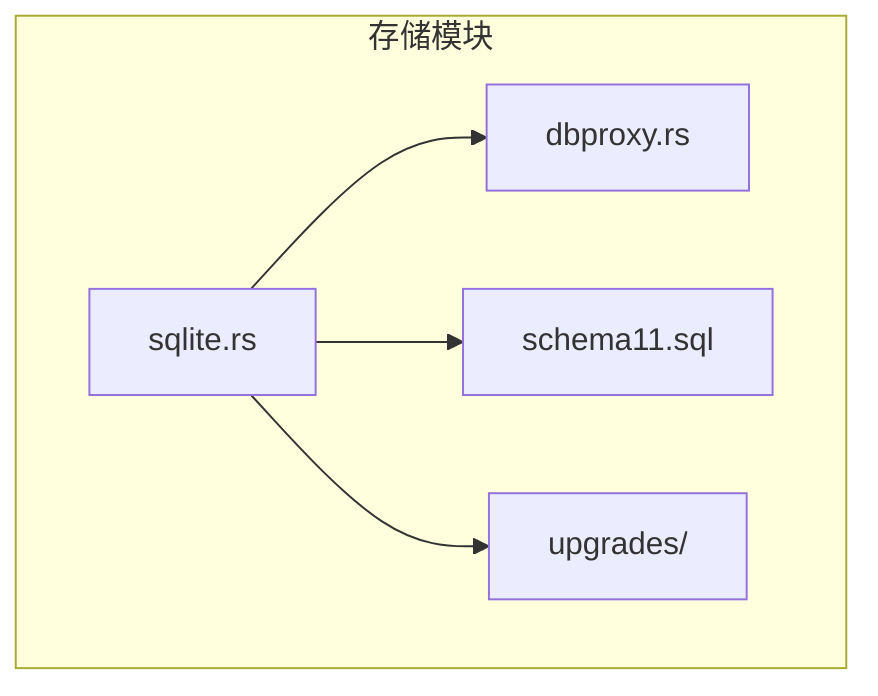
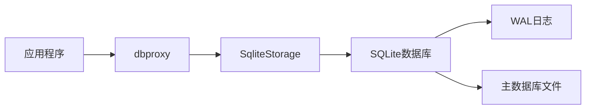
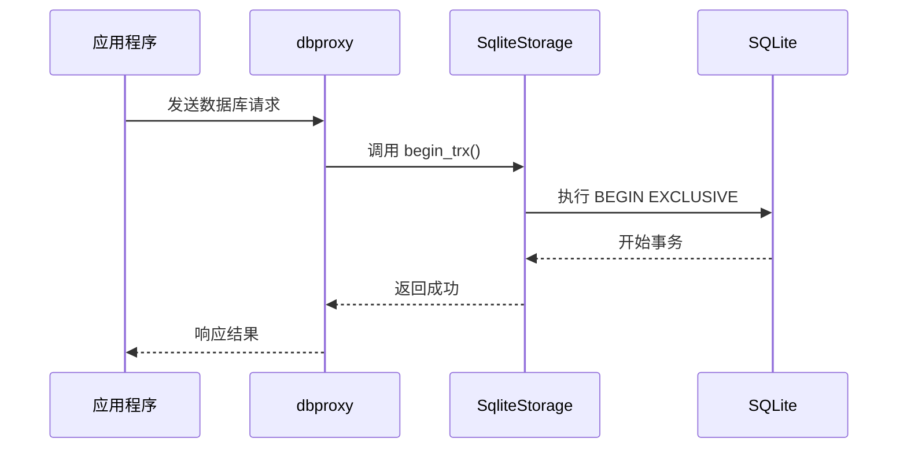
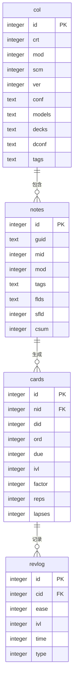
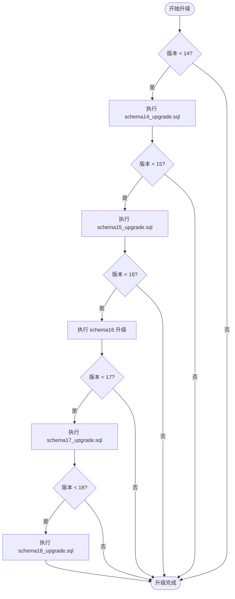
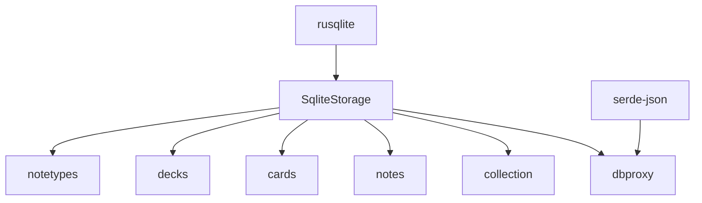

# 数据库集成

<cite>
**本文档中引用的文件**  
- [sqlite.rs](file://rslib/src/storage/sqlite.rs)
- [dbproxy.rs](file://rslib/src/backend/dbproxy.rs)
- [schema11.sql](file://rslib/src/storage/schema11.sql)
- [mod.rs](file://rslib/src/storage/upgrades/mod.rs)
- [schema14_upgrade.sql](file://rslib/src/storage/upgrades/schema14_upgrade.sql)
- [schema15_upgrade.sql](file://rslib/src/storage/upgrades/schema15_upgrade.sql)
- [schema17_upgrade.sql](file://rslib/src/storage/upgrades/schema17_upgrade.sql)
- [schema18_upgrade.sql](file://rslib/src/storage/upgrades/schema18_upgrade.sql)
</cite>

## 目录
1. [简介](#简介)
2. [项目结构](#项目结构)
3. [核心组件](#核心组件)
4. [架构概述](#架构概述)
5. [详细组件分析](#详细组件分析)
6. [依赖分析](#依赖分析)
7. [性能考虑](#性能考虑)
8. [故障排除指南](#故障排除指南)
9. [结论](#结论)

## 简介
Anki 使用 Rust 核心通过 rusqlite 库与 SQLite 数据库进行交互，实现持久化存储。该系统设计用于高效管理卡片、笔记、牌组等数据，并确保数据完整性与一致性。数据库集成机制涵盖了连接管理、事务处理、查询执行、模式设计、迁移策略以及性能优化等多个方面。

## 项目结构
Anki 的数据库相关代码主要位于 `rslib/src/storage` 目录下，包含多个模块用于处理不同类型的数据库操作。核心的 SQLite 存储功能由 `sqlite.rs` 文件实现，而数据库代理和命令处理则在 `dbproxy.rs` 中定义。此外，数据库模式的升级脚本存放在 `upgrades` 目录中。

**图示来源**  
- [sqlite.rs](file://rslib/src/storage/sqlite.rs)
- [dbproxy.rs](file://rslib/src/backend/dbproxy.rs)
- [schema11.sql](file://rslib/src/storage/schema11.sql)
- [mod.rs](file://rslib/src/storage/upgrades/mod.rs)

**本节来源**  
- [sqlite.rs](file://rslib/src/storage/sqlite.rs#L52-L90)
- [dbproxy.rs](file://rslib/src/backend/dbproxy.rs#L1-L244)

## 核心组件
Rust 核心通过 `SqliteStorage` 结构体管理与 SQLite 数据库的连接。该结构体封装了数据库连接对象，并提供了事务管理、查询执行、模式升级等关键功能。`dbproxy.rs` 文件中的 `db_command_bytes_inner` 函数负责解析来自前端的数据库请求并执行相应的操作。

**本节来源**  
- [sqlite.rs](file://rslib/src/storage/sqlite.rs#L52-L90)
- [dbproxy.rs](file://rslib/src/backend/dbproxy.rs#L121-L166)

## 架构概述
Anki 的数据库架构基于 SQLite，采用 WAL（Write-Ahead Logging）模式以提高并发性能。数据库初始化时会设置 exclusive 锁定模式、4096 字节的页面大小以及 -40960 的缓存大小。此外，系统还注册了多个自定义 SQL 函数，如正则表达式匹配、字段索引提取等，以增强查询能力。

**图示来源**  
- [sqlite.rs](file://rslib/src/storage/sqlite.rs#L52-L90)
- [dbproxy.rs](file://rslib/src/backend/dbproxy.rs#L1-L244)

## 详细组件分析

### 连接与事务管理
`SqliteStorage` 提供了标准的事务控制方法，包括 `begin_trx`、`commit_trx` 和 `rollback_trx`。这些方法使用 `BEGIN EXCLUSIVE` 语句来确保事务的独占性。此外，系统还实现了基于保存点的事务机制（`begin_rust_trx`），用于支持长时间运行的撤销操作。

**图示来源**  
- [sqlite.rs](file://rslib/src/storage/sqlite.rs#L585-L627)
- [dbproxy.rs](file://rslib/src/backend/dbproxy.rs#L121-L166)

**本节来源**  
- [sqlite.rs](file://rslib/src/storage/sqlite.rs#L585-L627)
- [dbproxy.rs](file://rslib/src/backend/dbproxy.rs#L121-L166)

### 数据库模式设计
Anki 的数据库模式包含多个核心表：`col`（集合元数据）、`notes`（笔记）、`cards`（卡片）、`revlog`（复习日志）和 `graves`（墓碑记录）。从 schema11 到 schema18 的升级过程中，系统逐步引入了更复杂的结构，如 `notetypes`、`decks`、`templates` 等表，并使用 `WITHOUT ROWID` 优化存储效率。

**图示来源**  
- [schema11.sql](file://rslib/src/storage/schema11.sql)
- [schema15_upgrade.sql](file://rslib/src/storage/upgrades/schema15_upgrade.sql)

**本节来源**  
- [schema11.sql](file://rslib/src/storage/schema11.sql)
- [schema15_upgrade.sql](file://rslib/src/storage/upgrades/schema15_upgrade.sql)

### 查询执行与优化
系统通过 `db_query` 和 `db_query_row` 函数执行 SQL 查询，并利用 rusqlite 的预编译语句缓存机制提升性能。对于批量操作，`db_execute_many` 支持一次执行多条带有不同参数的 SQL 语句。此外，数据库连接设置了 50 个预编译语句的缓存容量，以减少重复解析开销。

**本节来源**  
- [dbproxy.rs](file://rslib/src/backend/dbproxy.rs#L217-L243)
- [sqlite.rs](file://rslib/src/storage/sqlite.rs#L52-L90)

### 数据完整性与并发控制
Anki 使用 exclusive 锁定模式和 WAL 日志机制来保证数据一致性。在多用户或并发访问场景下，系统通过事务隔离和保存点机制防止数据冲突。同时，`integrity_check` 和 `quick_check` 等 PRAGMA 命令可用于检测数据库是否损坏。

**本节来源**  
- [sqlite.rs](file://rslib/src/storage/sqlite.rs#L484-L508)
- [sqlite.rs](file://rslib/src/storage/sqlite.rs#L52-L90)

### 迁移策略
数据库模式的升级由 `upgrade_to_latest_schema` 方法驱动，根据当前版本号依次应用 `schema14_upgrade.sql`、`schema15_upgrade.sql` 等脚本。降级操作则通过 `downgrade_to_schema_11` 实现，确保用户可以在必要时回退到旧版本。所有模式变更都在事务中执行，以保障原子性和安全性。

**图示来源**  
- [mod.rs](file://rslib/src/storage/upgrades/mod.rs)
- [schema14_upgrade.sql](file://rslib/src/storage/upgrades/schema14_upgrade.sql)
- [schema15_upgrade.sql](file://rslib/src/storage/upgrades/schema15_upgrade.sql)
- [schema17_upgrade.sql](file://rslib/src/storage/upgrades/schema17_upgrade.sql)
- [schema18_upgrade.sql](file://rslib/src/storage/upgrades/schema18_upgrade.sql)

**本节来源**  
- [mod.rs](file://rslib/src/storage/upgrades/mod.rs)
- [schema14_upgrade.sql](file://rslib/src/storage/upgrades/schema14_upgrade.sql)
- [schema15_upgrade.sql](file://rslib/src/storage/upgrades/schema15_upgrade.sql)
- [schema17_upgrade.sql](file://rslib/src/storage/upgrades/schema17_upgrade.sql)
- [schema18_upgrade.sql](file://rslib/src/storage/upgrades/schema18_upgrade.sql)

## 依赖分析
Anki 的数据库模块依赖于 rusqlite 库进行底层 SQLite 操作，同时使用 serde-json 进行请求和响应的序列化。`SqliteStorage` 是核心组件，被 `dbproxy`、`collection`、`notes`、`cards` 等多个模块所依赖。模式升级脚本之间存在版本依赖关系，必须按顺序执行。

**图示来源**  
- [sqlite.rs](file://rslib/src/storage/sqlite.rs)
- [dbproxy.rs](file://rslib/src/backend/dbproxy.rs)

**本节来源**  
- [sqlite.rs](file://rslib/src/storage/sqlite.rs)
- [dbproxy.rs](file://rslib/src/backend/dbproxy.rs)

## 性能考虑
为了优化数据库性能，Anki 采取了多项措施：使用 WAL 模式提高并发读写能力；设置较大的缓存大小减少磁盘 I/O；利用预编译语句缓存避免重复解析；通过 `VACUUM; REINDEX; ANALYZE` 命令定期优化数据库结构。此外，自定义 SQL 函数的使用也减少了应用层的数据处理负担。

## 故障排除指南
常见的数据库问题包括文件损坏、版本不兼容和性能瓶颈。对于损坏的数据库，可尝试使用 `PRAGMA integrity_check` 进行诊断，并通过备份恢复数据。若遇到版本错误（如 FileTooOld 或 FileTooNew），应确保使用正确版本的 Anki 打开数据库。性能问题通常可通过执行 `optimize()` 方法解决，该方法会触发 VACUUM 和 REINDEX 操作。

**本节来源**  
- [sqlite.rs](file://rslib/src/storage/sqlite.rs#L484-L508)
- [sqlite.rs](file://rslib/src/storage/sqlite.rs#L700-L704)

## 结论
Anki 的数据库集成机制设计精良，充分利用了 SQLite 的特性来实现高效、可靠的数据持久化。通过合理的模式设计、事务管理、迁移策略和性能优化，系统能够在保证数据完整性的同时提供良好的用户体验。未来可进一步完善撤销机制，减少对长事务的依赖，从而提升整体性能和稳定性。