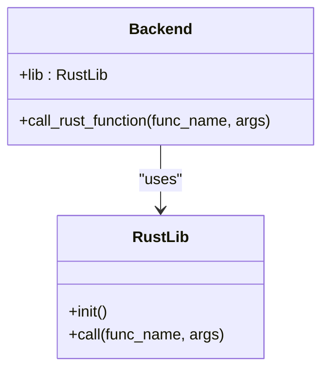
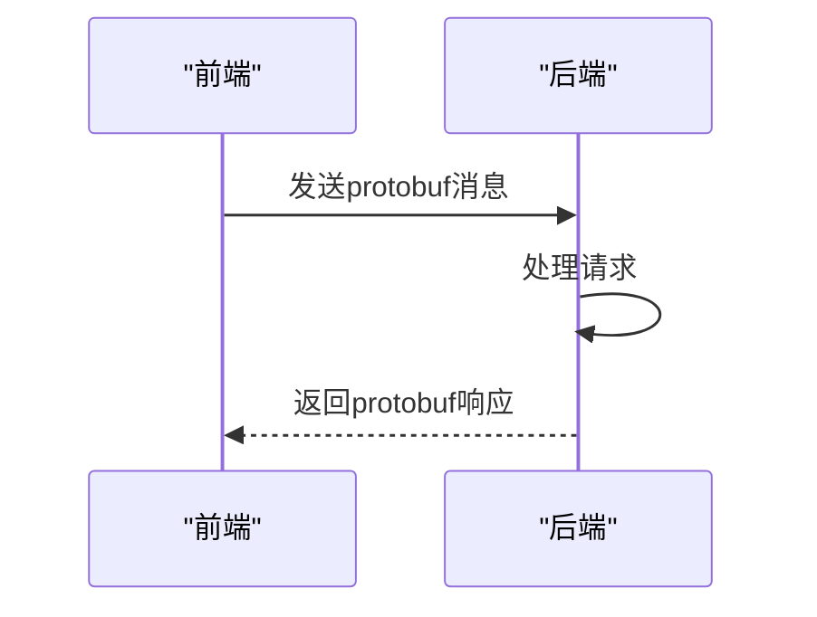
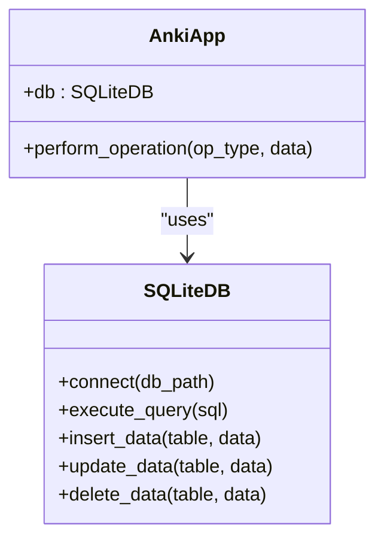
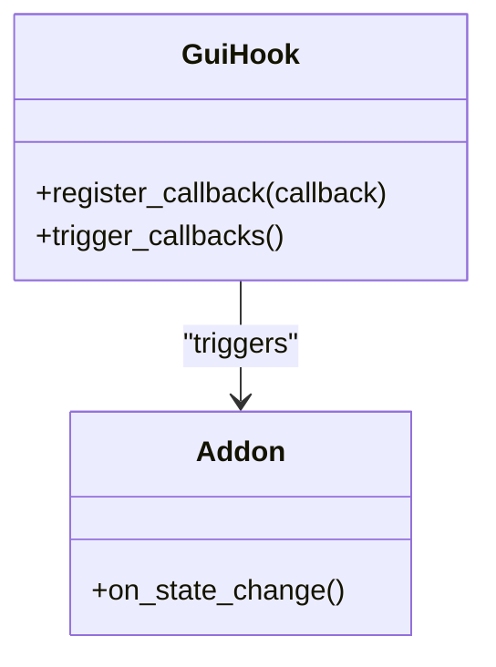
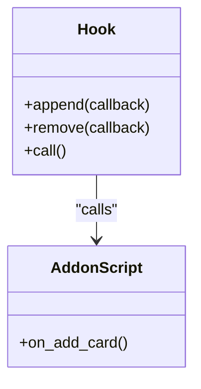
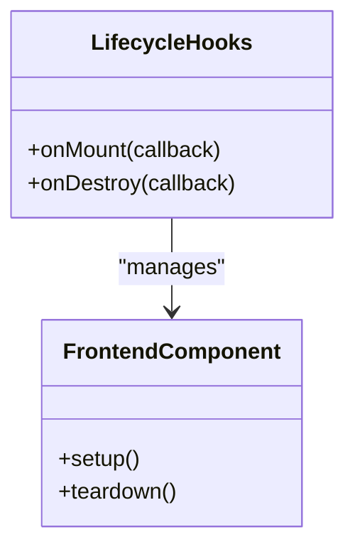

# 扩展与集成

<cite>
**本文档中引用的文件**
- [addons.py](file://qt/aqt/addons.py)
- [_backend.py](file://pylib/anki/_backend.py)
- [backend.proto](file://proto/anki/backend.proto)
- [lib.rs](file://rslib/src/lib.rs)
- [gui_hooks.py](file://qt/aqt/gui_hooks.py)
- [hooks.py](file://pylib/anki/hooks.py)
- [runtime-require.ts](file://ts/lib/tslib/runtime-require.ts)
- [lifecycle-hooks.ts](file://ts/lib/sveltelib/lifecycle-hooks.ts)
- [sqlite.rs](file://rslib/src/storage/sqlite.rs)
- [main.py](file://qt/aqt/main.py)
</cite>

## 目录
1. [简介](#简介)
2. [插件系统设计](#插件系统设计)
3. [API集成点](#api集成点)
4. [第三方服务集成](#第三方服务集成)
5. [扩展开发基础](#扩展开发基础)
6. [高级集成技巧](#高级集成技巧)
7. [结论](#结论)

## 简介
Anki是一款功能强大的间隔重复记忆软件，其扩展性和集成能力是其核心优势之一。本文档详细介绍了Anki的扩展与集成机制，包括Qt插件、Python脚本扩展、前端组件扩展以及各种API集成点。通过深入分析代码库中的实现细节，为开发者提供全面的指导，无论是初学者还是经验丰富的开发者都能从中受益。

## 插件系统设计

Anki的插件系统设计旨在提供灵活且强大的扩展能力。插件可以通过Python脚本、Qt界面组件和前端JavaScript代码进行扩展。插件的安装和管理通过`addons.py`文件中的`AddonsDialog`类实现，支持从本地文件或在线资源安装插件。插件的生命周期管理确保了插件的稳定性和安全性。

**Section sources**
- [addons.py](file://qt/aqt/addons.py#L489-L531)

## API集成点

### Python-Rust通过PyO3集成
Anki使用PyO3库实现Python和Rust之间的高效集成。`_backend.py`文件中的`Backend`类通过`lib.rs`中的Rust代码提供底层功能。这种集成方式使得Python可以调用高性能的Rust代码，同时保持了Python的易用性。

**Diagram sources**
- [_backend.py](file://pylib/anki/_backend.py)
- [lib.rs](file://rslib/src/lib.rs)

### 前后端通过Protocol Buffers集成
Anki使用Protocol Buffers（protobuf）实现前后端之间的通信。`backend.proto`文件定义了前后端通信的接口和数据结构。前端通过发送protobuf消息与后端交互，后端处理请求并返回结果。这种方式确保了数据传输的高效性和一致性。

**Diagram sources**
- [backend.proto](file://proto/anki/backend.proto)

### 数据库通过SQLite集成
Anki使用SQLite作为其数据库存储。`sqlite.rs`文件中的代码实现了与SQLite数据库的交互，包括查询、插入、更新和删除操作。通过自定义SQL函数，Anki能够高效地处理复杂的查询需求。

**Diagram sources**
- [sqlite.rs](file://rslib/src/storage/sqlite.rs)

## 第三方服务集成

Anki支持与第三方服务的集成，如AnkiWeb、AnkiHub等。这些服务通过特定的API接口与Anki进行通信。例如，`ankihub.py`文件中的代码实现了与AnkiHub服务的交互，允许用户同步和分享他们的学习资料。

**Section sources**
- [ankihub.py](file://qt/aqt/ankihub.py)

## 扩展开发基础

### Qt插件机制
Anki的Qt插件机制允许开发者通过Python脚本扩展Qt界面。`gui_hooks.py`文件中定义了多个钩子点，开发者可以通过注册回调函数来修改或增强Anki的界面行为。例如，`state_shortcuts_will_change`钩子允许开发者在状态切换时修改快捷键。

**Diagram sources**
- [gui_hooks.py](file://qt/aqt/gui_hooks.py)

### Python脚本扩展
Anki的Python脚本扩展允许开发者通过编写Python脚本来实现自定义功能。`hooks.py`文件中定义了多个钩子点，开发者可以通过注册回调函数来响应特定事件。例如，`add_card`钩子允许开发者在添加卡片时执行自定义逻辑。

**Diagram sources**
- [hooks.py](file://pylib/anki/hooks.py)

### 前端组件扩展
Anki的前端组件扩展允许开发者通过JavaScript和TypeScript代码扩展前端功能。`runtime-require.ts`文件中定义了`registerPackage`函数，允许开发者注册新的前端包。`lifecycle-hooks.ts`文件中定义了生命周期钩子，允许开发者在组件挂载和销毁时执行自定义逻辑。

**Diagram sources**
- [runtime-require.ts](file://ts/lib/tslib/runtime-require.ts)
- [lifecycle-hooks.ts](file://ts/lib/sveltelib/lifecycle-hooks.ts)

## 高级集成技巧

### 自定义SQL函数
Anki允许开发者通过自定义SQL函数来扩展数据库查询能力。`sqlite.rs`文件中的`add_extract_fsrs_variable`函数展示了如何添加自定义SQL函数。这种技术可以用于实现复杂的查询逻辑，提高查询效率。

**Section sources**
- [sqlite.rs](file://rslib/src/storage/sqlite.rs#L260-L309)

### 快捷键管理
Anki的快捷键管理机制允许开发者动态修改快捷键。`main.py`文件中的`_normalize_shortcuts`函数展示了如何去除重复的快捷键，并确保最后一个快捷键生效。这种机制使得插件可以覆盖标准快捷键，提供更灵活的用户体验。

**Section sources**
- [main.py](file://qt/aqt/main.py#L1186-L1216)

## 结论
Anki的扩展与集成机制为开发者提供了丰富的工具和接口，使得Anki能够适应各种不同的使用场景。通过深入理解这些机制，开发者可以创建出功能强大且用户友好的插件，进一步提升Anki的实用性和灵活性。