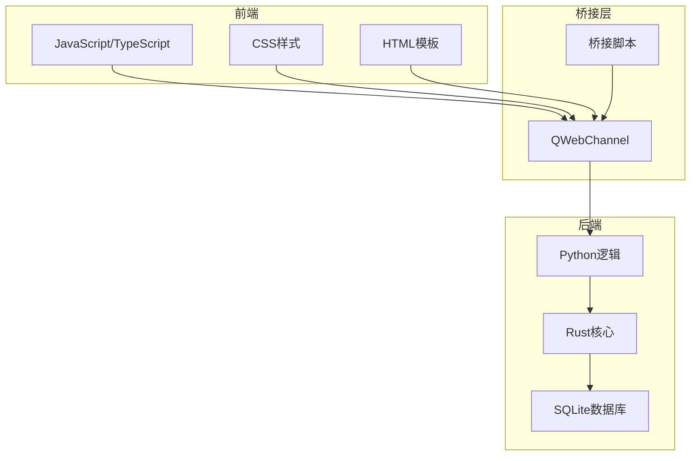
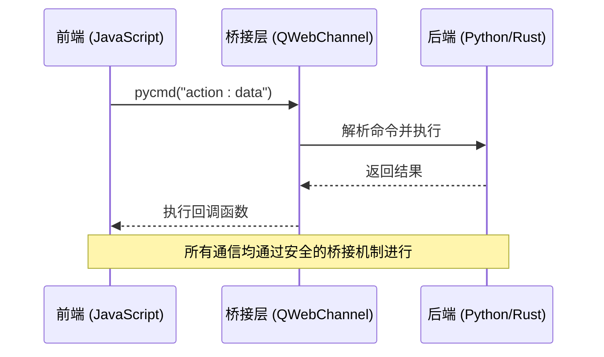
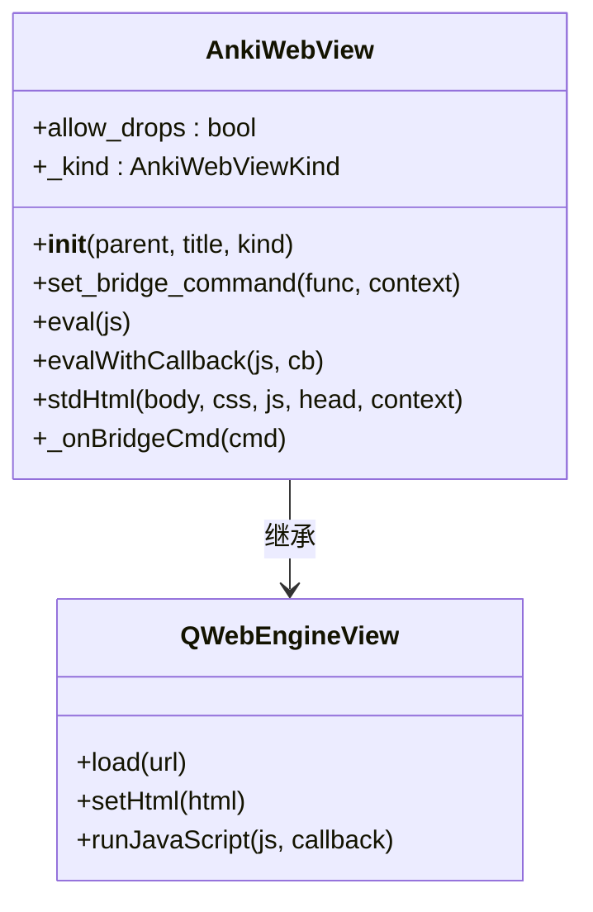
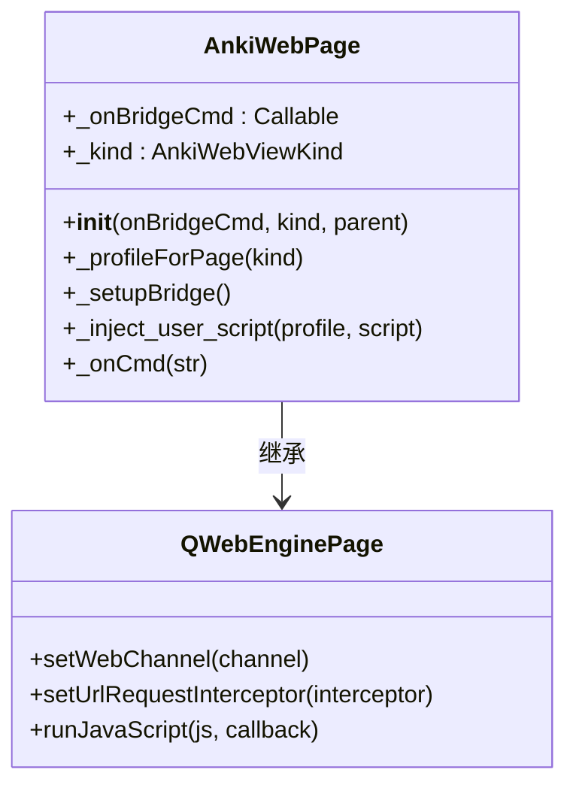
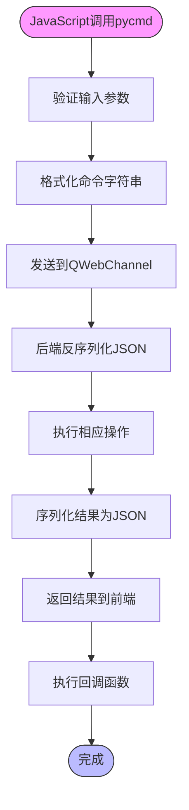
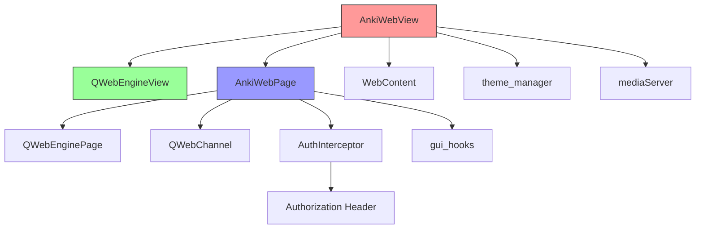
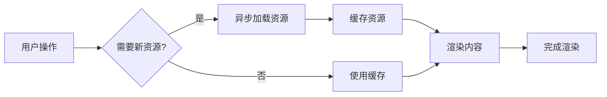
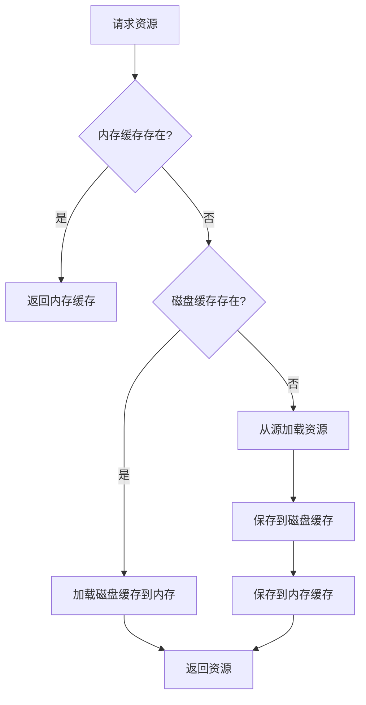
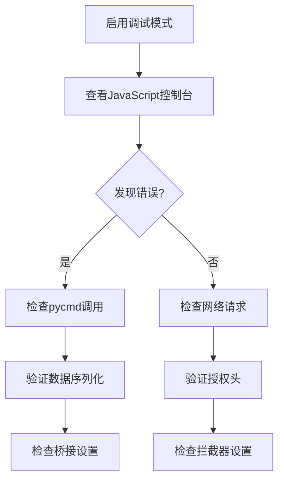

# 前端集成

<cite>
**本文档中引用的文件**  
- [webview.py](file://qt/aqt/webview.py)
- [pycmd.d.ts](file://qt/aqt/data/web/js/pycmd.d.ts)
- [AnkiWebPage](file://qt/aqt/webview.py#L115-L286)
- [AnkiWebView](file://qt/aqt/webview.py#L355-L964)
- [AuthInterceptor](file://qt/aqt/webview.py#L63-L74)
- [pylib/rsbridge/lib.rs](file://pylib/rsbridge/lib.rs)
- [proto/README.md](file://proto/README.md)
</cite>

## 目录
1. [简介](#简介)
2. [项目结构](#项目结构)
3. [核心组件](#核心组件)
4. [架构概述](#架构概述)
5. [详细组件分析](#详细组件分析)
6. [依赖分析](#依赖分析)
7. [性能考虑](#性能考虑)
8. [故障排除指南](#故障排除指南)
9. [结论](#结论)

## 简介
本文档深入探讨Anki前端组件的集成机制，重点分析JavaScript与Python后端之间的通信协议、前端扩展点的实现方式、安全沙箱机制以及性能优化策略。文档旨在为开发者提供全面的技术指导，帮助理解Anki前端架构的核心原理和最佳实践。

## 项目结构
Anki的前端集成主要依赖于Qt WebEngine组件，通过Web技术栈实现用户界面。前端与后端通过桥接机制进行通信，使用TypeScript、JavaScript和CSS构建现代Web界面，并通过Python和Rust后端提供核心功能支持。

**图示来源**  
- [webview.py](file://qt/aqt/webview.py#L115-L286)
- [pycmd.d.ts](file://qt/aqt/data/web/js/pycmd.d.ts)

**本节来源**  
- [webview.py](file://qt/aqt/webview.py#L355-L964)

## 核心组件
Anki前端集成的核心组件包括AnkiWebView、AnkiWebPage和桥接通信机制。这些组件共同实现了前端与后端的安全、高效通信，支持自定义UI元素的注入和动态内容渲染。

**本节来源**  
- [webview.py](file://qt/aqt/webview.py#L355-L964)
- [pylib/rsbridge/lib.rs](file://pylib/rsbridge/lib.rs)

## 架构概述
Anki采用混合架构，前端使用Web技术栈，后端使用Python和Rust。前端通过QWebChannel与后端通信，使用JSON格式传递消息。这种架构既保持了Web开发的灵活性，又获得了原生应用的性能优势。

**图示来源**  
- [webview.py](file://qt/aqt/webview.py#L115-L286)
- [pycmd.d.ts](file://qt/aqt/data/web/js/pycmd.d.ts)

## 详细组件分析

### AnkiWebView 分析
AnkiWebView是Anki前端的主要容器，继承自QWebEngineView，负责管理Web内容的显示和交互。

**图示来源**  
- [webview.py](file://qt/aqt/webview.py#L355-L964)

**本节来源**  
- [webview.py](file://qt/aqt/webview.py#L355-L964)

### AnkiWebPage 分析
AnkiWebPage是AnkiWebView的页面管理器，负责设置桥接通道、注入脚本和处理安全策略。

**图示来源**  
- [webview.py](file://qt/aqt/webview.py#L115-L286)

**本节来源**  
- [webview.py](file://qt/aqt/webview.py#L115-L286)

### 通信机制分析
Anki前端与后端的通信基于消息传递协议，使用pycmd函数作为主要通信接口。

**图示来源**  
- [pycmd.d.ts](file://qt/aqt/data/web/js/pycmd.d.ts)
- [webview.py](file://qt/aqt/webview.py#L782-L805)

**本节来源**  
- [pycmd.d.ts](file://qt/aqt/data/web/js/pycmd.d.ts)
- [webview.py](file://qt/aqt/webview.py#L782-L805)

## 依赖分析
Anki前端集成依赖于多个关键组件和库，形成了复杂的依赖网络。

**图示来源**  
- [webview.py](file://qt/aqt/webview.py#L355-L964)
- [webview.py](file://qt/aqt/webview.py#L115-L286)

**本节来源**  
- [webview.py](file://qt/aqt/webview.py#L355-L964)
- [webview.py](file://qt/aqt/webview.py#L115-L286)

## 性能考虑
Anki前端集成了多种性能优化策略，确保应用的响应速度和用户体验。

### 懒加载策略
Anki采用懒加载机制，只在需要时加载资源，减少初始加载时间。

### 资源缓存策略
Anki实现了多层缓存机制，提高资源访问速度。

**本节来源**  
- [webview.py](file://qt/aqt/webview.py#L503-L522)
- [webview.py](file://qt/aqt/webview.py#L751-L766)

## 故障排除指南
本节提供Anki前端集成常见问题的解决方案。

### 调试工具使用
Anki提供了多种调试工具，帮助开发者诊断问题。

**本节来源**  
- [webview.py](file://qt/aqt/webview.py#L273-L274)
- [webview.py](file://qt/aqt/webview.py#L782-L805)

## 结论
Anki的前端集成设计精巧，通过Web技术栈与原生应用的结合，实现了功能丰富且性能优越的用户界面。其通信机制安全可靠，扩展点设计灵活，为开发者提供了强大的定制能力。通过理解本文档所述的架构和实现细节，开发者可以更好地利用Anki平台进行二次开发和功能扩展。