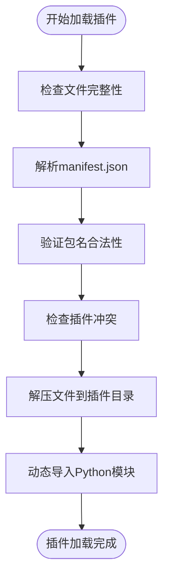
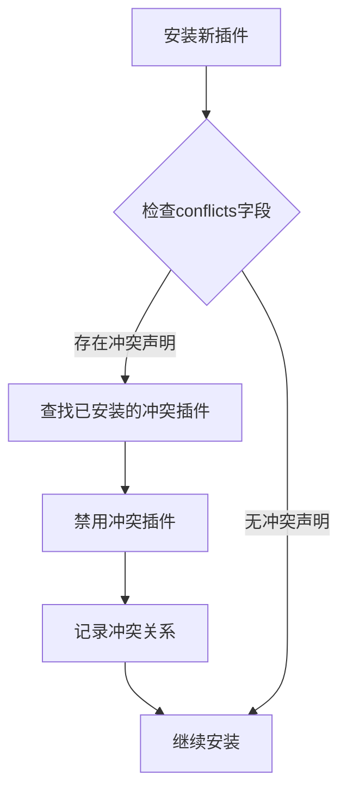
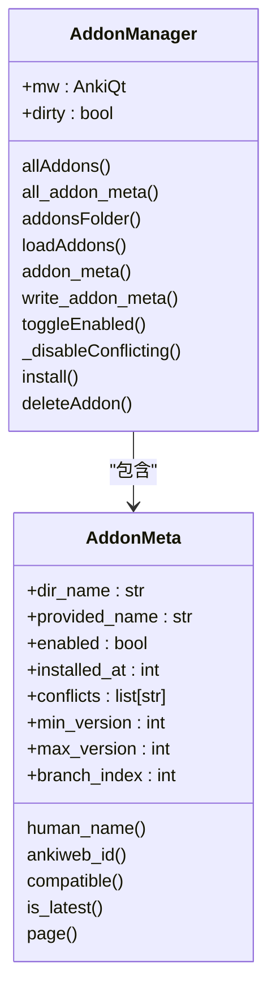
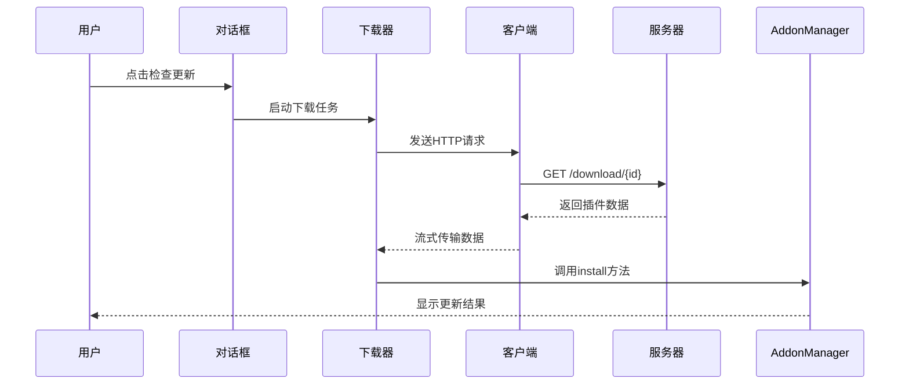
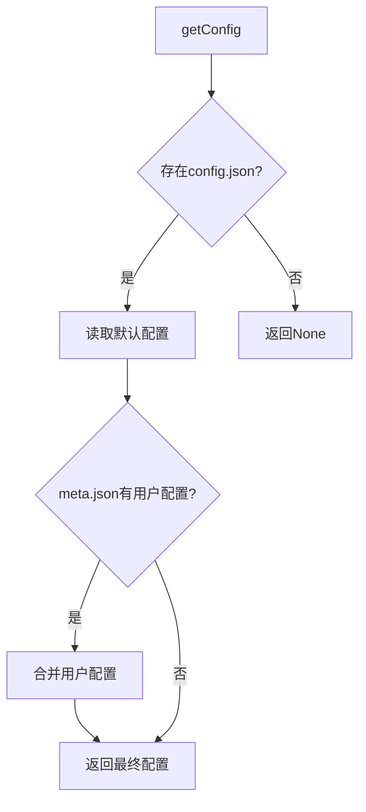
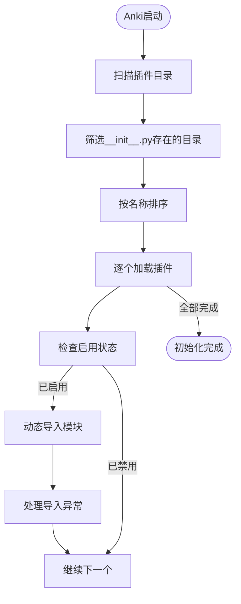
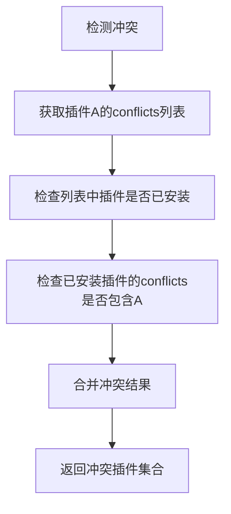

# 插件管理

<cite>
**本文档中引用的文件**  
- [addons.py](file://qt/aqt/addons.py)
- [addonconf.py](file://qt/aqt/forms/addonconf.py)
- [addons.py](file://qt/aqt/forms/addons.py)
</cite>

## 目录
1. [简介](#简介)
2. [插件加载机制](#插件加载机制)
3. [启用/禁用状态管理](#启用禁用状态管理)
4. [更新与卸载实现](#更新与卸载实现)
5. [配置界面设计与实现](#配置界面设计与实现)
6. [生命周期管理最佳实践](#生命周期管理最佳实践)
7. [冲突检测与解决策略](#冲突检测与解决策略)
8. [性能监控与资源限制](#性能监控与资源限制)
9. [结论](#结论)

## 简介
Anki插件管理系统提供了一套完整的插件管理解决方案，支持插件的安装、启用、配置、更新和卸载功能。系统通过AddonManager类实现核心管理逻辑，配合AddonsDialog等UI组件提供用户友好的操作界面。插件以.ankiaddon格式分发，包含代码、配置和元数据文件。

**Section sources**
- [addons.py](file://qt/aqt/addons.py#L1-L100)

## 插件加载机制

### 插件包解析流程
插件加载始于用户通过界面或拖拽方式导入.ankiaddon文件。系统使用ZipFile类解析压缩包内容，验证其完整性。核心解析流程包括：
1. 检查manifest.json文件是否存在且格式正确
2. 验证包名合法性，防止路径遍历攻击
3. 提取插件元数据信息用于后续处理

**Diagram sources**
- [addons.py](file://qt/aqt/addons.py#L500-L600)

### 元数据读取
系统从manifest.json文件读取插件元数据，包括：
- package: 插件包名
- name: 显示名称
- min_point_version: 最低兼容版本
- max_point_version: 最高兼容版本
- conflicts: 冲突插件列表
- homepage: 主页链接

元数据验证使用jsonschema库确保数据结构正确性。

**Section sources**
- [addons.py](file://qt/aqt/addons.py#L150-L200)

### 依赖检查流程
依赖检查主要通过冲突检测机制实现。当安装新插件时，系统会：
1. 检查新插件声明的冲突列表
2. 查找已安装插件中是否存在冲突项
3. 自动禁用冲突插件并提示用户
4. 记录冲突关系以便后续管理

**Diagram sources**
- [addons.py](file://qt/aqt/addons.py#L700-L750)

## 启用/禁用状态管理

### 状态切换机制
插件启用/禁用状态通过meta.json文件中的"disabled"字段管理。状态切换流程：
1. 用户点击启用/禁用按钮
2. 系统更新meta.json中的disabled字段
3. 标记需要重启以应用更改
4. 重新加载插件列表显示

**Diagram sources**
- [addons.py](file://qt/aqt/addons.py#L250-L300)

### 状态持久化
插件状态信息持久化存储在meta.json文件中，包含：
- 启用状态
- 安装时间戳
- 版本兼容性信息
- 更新启用状态

状态变更后立即写入文件系统确保数据一致性。

**Section sources**
- [addons.py](file://qt/aqt/addons.py#L350-L400)

## 更新与卸载实现

### 更新流程
插件更新通过AnkiWeb服务实现，流程如下：
1. 向服务器查询插件最新版本信息
2. 比较本地安装时间和服务器更新时间
3. 下载新版本插件包
4. 执行安装流程替换旧版本

**Diagram sources**
- [addons.py](file://qt/aqt/addons.py#L1200-L1300)

### 卸载流程
插件卸载通过send_to_trash函数实现安全删除：
1. 获取插件目录路径
2. 将整个插件目录移至系统回收站
3. 从内存中清除插件引用
4. 重新加载插件列表

卸载前会检查插件是否启用，启用状态的插件需要重启才能完全移除。

**Section sources**
- [addons.py](file://qt/aqt/addons.py#L650-L680)

## 配置界面设计与实现

### 配置数据存储
插件配置采用分层存储机制：
- 默认配置：config.json文件
- 用户配置：meta.json中的config字段
- 运行时配置：内存中的配置对象

系统优先使用用户配置，未设置时回退到默认配置。

**Diagram sources**
- [addons.py](file://qt/aqt/addons.py#L800-L850)

### 配置同步机制
配置同步通过writeConfig方法实现：
1. 用户修改配置并确认
2. 验证新配置符合schema定义
3. 更新meta.json中的config字段
4. 调用配置更新回调函数
5. 持久化到磁盘

支持JSON Schema验证确保配置数据的正确性。

**Section sources**
- [addons.py](file://qt/aqt/addons.py#L850-L900)

## 生命周期管理最佳实践

### 初始化流程
插件初始化在Anki启动时执行：
1. 扫描插件目录
2. 加载所有启用的插件
3. 动态导入Python模块
4. 处理初始化异常
5. 显示加载失败提示

**Diagram sources**
- [addons.py](file://qt/aqt/addons.py#L200-L250)

### 运行时管理
运行时管理包括：
- 配置变更监听
- 日志记录
- Web资源导出
- 用户文件备份

系统提供钩子机制让插件参与关键事件。

**Section sources**
- [addons.py](file://qt/aqt/addons.py#L900-L950)

### 清理过程
插件清理主要在卸载时执行：
1. 移除配置回调
2. 清除Web导出
3. 删除日志记录器
4. 释放资源引用

确保插件完全移除不影响系统稳定性。

## 冲突检测与解决策略

### 冲突检测机制
冲突检测基于manifest.json中的conflicts字段：
- 双向冲突检查：既检查新插件对现有插件的冲突，也检查现有插件对新插件的冲突
- 实时检测：安装、启用操作时都会进行冲突检查
- 可视化提示：在插件列表中显示冲突状态

**Diagram sources**
- [addons.py](file://qt/aqt/addons.py#L700-L750)

### 解决策略
冲突解决采用自动禁用策略：
1. 发现冲突时自动禁用冲突插件
2. 记录冲突关系供用户参考
3. 提供手动调整选项
4. 重启后生效确保稳定性

**Section sources**
- [addons.py](file://qt/aqt/addons.py#L750-L800)

## 性能监控与资源限制

### 性能监控
系统提供基础性能监控：
- 插件加载时间统计
- 配置操作响应时间
- 下载进度反馈
- 异常日志记录

通过进度条和状态提示让用户了解操作进度。

**Section sources**
- [addons.py](file://qt/aqt/addons.py#L1250-L1270)

### 资源限制
资源限制主要体现在：
- 内存使用：插件代码加载到Python解释器
- 磁盘空间：插件文件存储
- 网络带宽：更新下载
- CPU占用：插件运行时执行

系统通过沙箱机制限制插件权限，防止资源滥用。

## 结论
Anki插件管理系统设计完善，提供了从安装到卸载的完整生命周期管理。系统采用模块化设计，分离核心逻辑与UI界面，支持灵活扩展。通过元数据验证、冲突检测、配置管理等机制确保插件系统的稳定性和安全性。建议插件开发者遵循系统规范，合理使用API，为用户提供高质量的扩展功能。