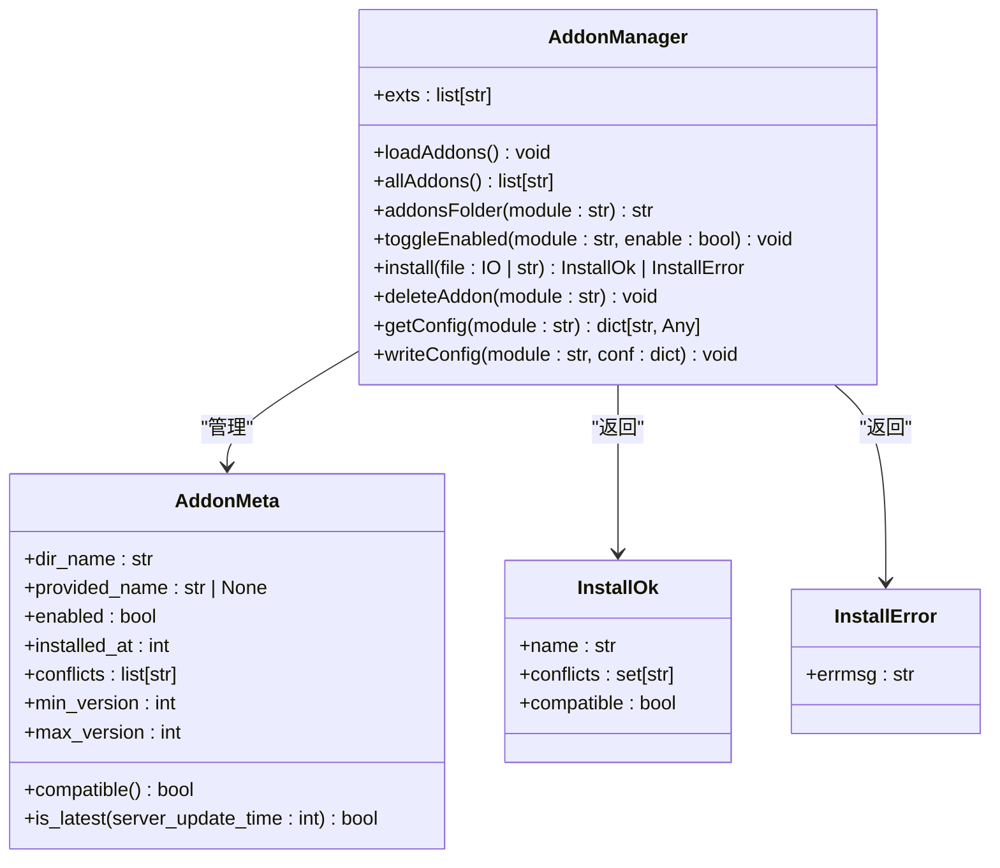
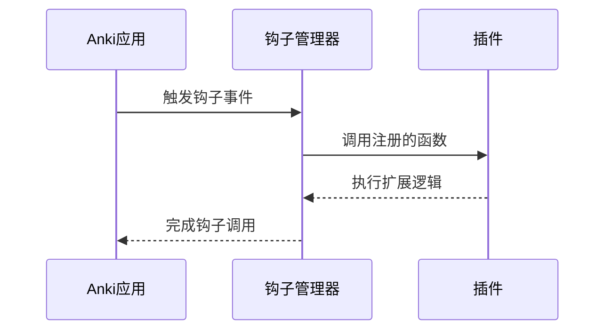
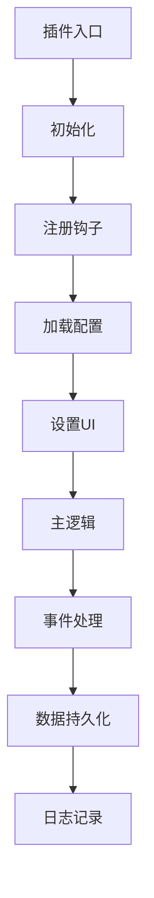

# 插件系统

<cite>
**本文档中引用的文件**  
- [hooks.py](file://pylib/anki/hooks.py)
- [gui_hooks.py](file://qt/aqt/gui_hooks.py)
- [addons.py](file://qt/aqt/addons.py)
</cite>

## 目录
1. [简介](#简介)
2. [Qt插件机制实现原理](#qt插件机制实现原理)
3. [Python脚本扩展开发模式](#python脚本扩展开发模式)
4. [前端组件扩展集成方式](#前端组件扩展集成方式)
5. [插件开发示例](#插件开发示例)
6. [复杂插件架构设计](#复杂插件架构设计)
7. [插件调试技巧](#插件调试技巧)
8. [版本兼容性处理](#版本兼容性处理)
9. [安全注意事项](#安全注意事项)

## 简介
Anki提供了一套完整的插件系统，允许用户通过Python脚本和前端技术扩展其功能。该系统基于Qt框架构建，支持钩子函数（hooks）机制、配置管理、日志记录和Web导出等功能。插件可以修改Anki的用户界面、添加新功能或集成外部服务。

**Section sources**
- [addons.py](file://qt/aqt/addons.py#L0-L1789)

## Qt插件机制实现原理
Anki的插件管理由`AddonManager`类实现，负责插件的加载、注册和管理。插件以`.ankiaddon`或`.zip`格式分发，包含`__init__.py`作为入口点。系统在启动时扫描插件目录，通过`__import__`动态导入已启用的插件。

插件元数据存储在`meta.json`文件中，包含名称、版本、兼容性信息等。`AddonManager`使用`addonMeta`和`writeAddonMeta`方法读写这些数据。插件的启用状态通过`toggleEnabled`方法控制，并在下次启动时生效。

插件冲突通过`conflicts`字段声明，安装时会自动禁用冲突的插件。`AddonMeta`类提供`compatible`方法检查插件与当前Anki版本的兼容性。



**Diagram sources**
- [addons.py](file://qt/aqt/addons.py#L179-L796)

**Section sources**
- [addons.py](file://qt/aqt/addons.py#L179-L796)

## Python脚本扩展开发模式
Anki提供两种扩展机制：钩子（hooks）和过滤器（filters）。钩子是不返回值的函数，用于在特定事件发生时执行代码；过滤器返回其第一个参数，可选择性地修改它。

Python钩子定义在`pylib/anki/hooks.py`中，通过`addHook`和`remHook`进行注册和注销。GUI相关的钩子在`qt/aqt/gui_hooks.py`中定义，源自`../tools/genhooks_gui.py`生成的代码。



**Diagram sources**
- [hooks.py](file://pylib/anki/hooks.py#L0-L93)
- [gui_hooks.py](file://qt/aqt/gui_hooks.py#L0-L11)

**Section sources**
- [hooks.py](file://pylib/anki/hooks.py#L0-L93)
- [gui_hooks.py](file://qt/aqt/gui_hooks.py#L0-L11)

## 前端组件扩展集成方式
前端扩展通过JavaScript与Python后端通信。插件可以使用`setWebExports`方法导出Web资源，模式匹配允许访问特定文件。`webview_did_receive_js_message`钩子可用于处理JavaScript发送的消息。

Anki使用Qt的Web引擎显示前端内容，插件可以通过`card_review_webview_did_init`等钩子在Web视图初始化时注入自定义JavaScript。通信通常通过桥接命令实现，后端可以调用前端方法，前端也可以通过消息机制与后端交互。

**Section sources**
- [addons.py](file://qt/aqt/addons.py#L700-L720)

## 插件开发示例
### 简单插件示例
创建一个基本插件需要以下步骤：
1. 创建插件目录（如`myaddon`）
2. 添加`__init__.py`文件
3. 在`__init__.py`中注册钩子函数

```python
# __init__.py
from aqt import mw
from aqt.utils import showInfo
from aqt.qt import *

def my_function():
    showInfo("Hello from my addon!")

# 添加菜单项
action = QAction("My Addon", mw)
qconnect(action.triggered, my_function)
mw.form.menuTools.addAction(action)
```

### 配置管理示例
插件可以定义默认配置和配置模式：

```python
# config.json
{
    "my_setting": true,
    "another_option": "default"
}

# config.schema.json
{
    "type": "object",
    "properties": {
        "my_setting": {"type": "boolean", "title": "Enable feature"},
        "another_option": {"type": "string", "title": "Option value"}
    }
}
```

**Section sources**
- [addons.py](file://qt/aqt/addons.py#L500-L550)

## 复杂插件架构设计
高级插件应遵循模块化设计原则：
- 将功能分解为独立模块
- 使用配置文件管理设置
- 实现错误处理和日志记录
- 提供用户友好的配置界面

插件可以通过`setConfigAction`和`setConfigUpdatedAction`定义配置按钮和更新回调。日志记录使用`get_logger`方法获取专用日志器，支持调试级别控制。



**Diagram sources**
- [addons.py](file://qt/aqt/addons.py#L550-L600)

**Section sources**
- [addons.py](file://qt/aqt/addons.py#L550-L600)

## 插件调试技巧
使用以下方法进行插件调试：
1. 启用调试日志：`toggle_debug_logging(module, True)`
2. 使用Anki内置的调试控制台
3. 在代码中添加`print`语句或`showInfo`调用
4. 检查`meta.json`中的错误信息
5. 使用`try-except`捕获异常并显示详细错误

调试信息存储在插件日志目录中，可通过`logs_folder`方法获取路径。建议在开发期间保持详细的日志记录，发布时关闭调试输出。

**Section sources**
- [addons.py](file://qt/aqt/addons.py#L700-L720)

## 版本兼容性处理
插件兼容性通过`min_point_version`和`max_point_version`字段控制。负的`max_point_version`表示插件不支持更高版本。`AddonMeta.compatible`方法检查当前Anki版本是否在支持范围内。

更新检查通过`check_for_updates`函数实现，从AnkiWeb获取最新信息。插件可以使用`update_supported_versions`同步支持的版本范围。建议插件作者定期测试新版本的Anki并更新兼容性声明。

**Section sources**
- [addons.py](file://qt/aqt/addons.py#L400-L450)

## 安全注意事项
开发插件时应注意以下安全事项：
- 验证所有用户输入
- 避免执行不受信任的代码
- 正确处理异常，防止应用崩溃
- 不要存储敏感信息在明文配置中
- 使用安全的网络通信
- 遵循最小权限原则

插件应在`manifest.json`中声明所有依赖和权限。避免使用`monkey patching`，因为它可能导致不稳定和安全漏洞。建议使用官方API和钩子机制进行扩展。

**Section sources**
- [addons.py](file://qt/aqt/addons.py#L0-L100)