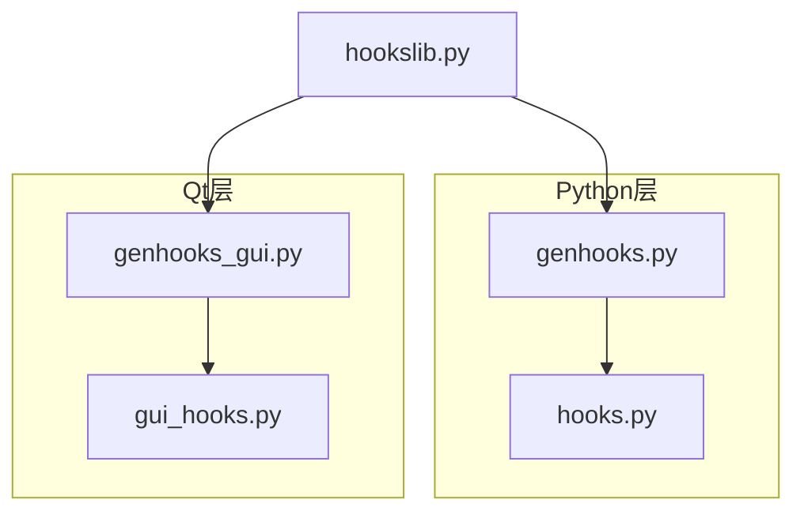
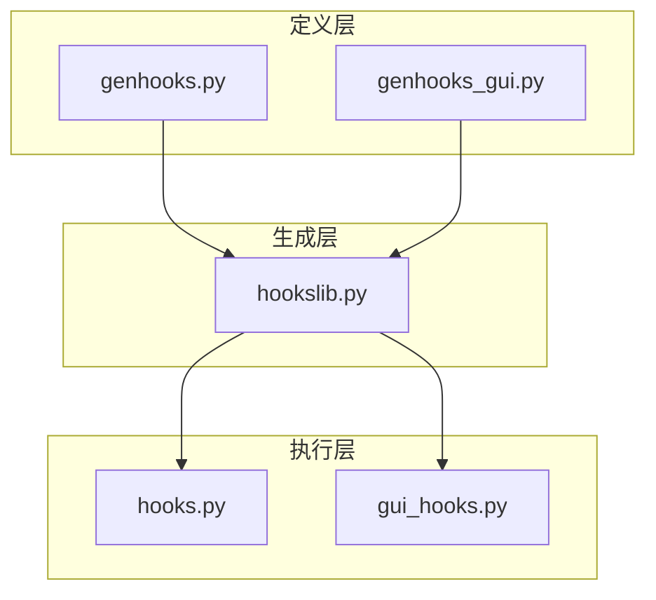
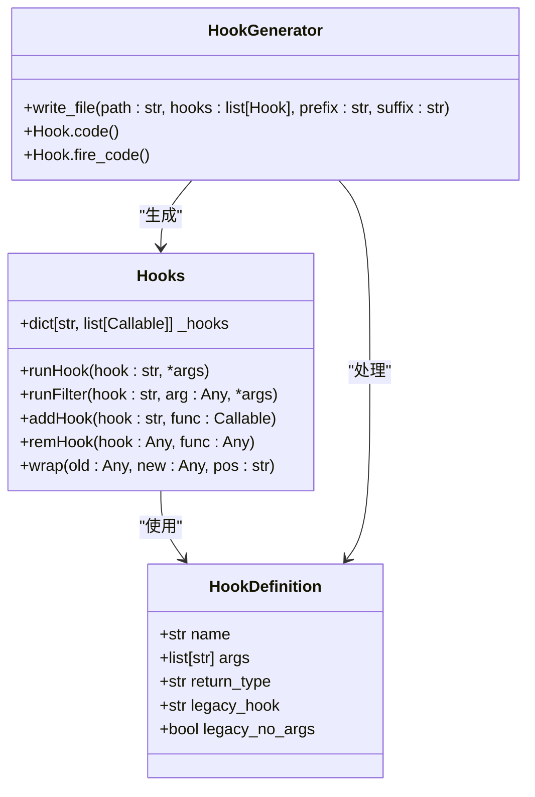
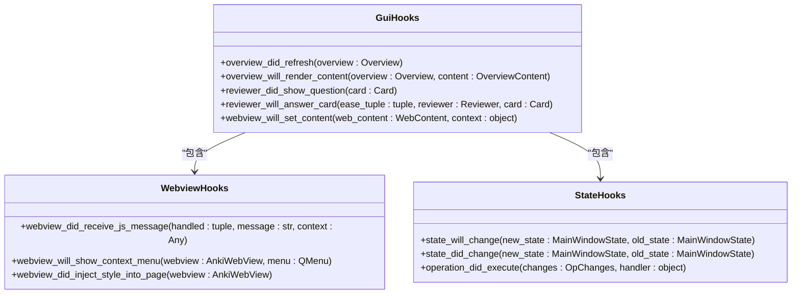
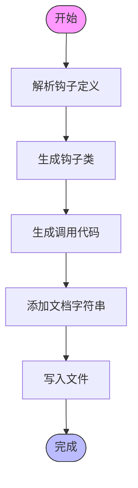
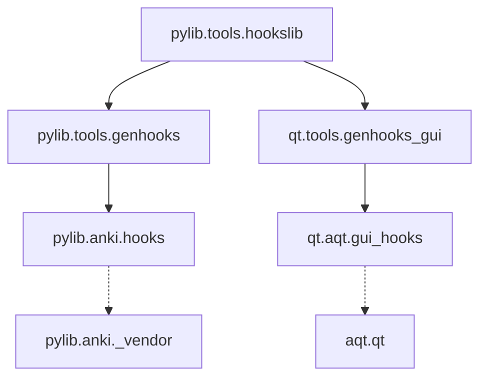

# 钩子系统

<cite>
**本文档中引用的文件**  
- [hooks.py](file://pylib/anki/hooks.py)
- [gui_hooks.py](file://qt/aqt/gui_hooks.py)
- [genhooks.py](file://pylib/tools/genhooks.py)
- [genhooks_gui.py](file://qt/tools/genhooks_gui.py)
- [hookslib.py](file://pylib/tools/hookslib.py)
</cite>

## 目录
1. [简介](#简介)
2. [项目结构](#项目结构)
3. [核心组件](#核心组件)
4. [架构概述](#架构概述)
5. [详细组件分析](#详细组件分析)
6. [依赖分析](#依赖分析)
7. [性能考虑](#性能考虑)
8. [故障排除指南](#故障排除指南)
9. [结论](#结论)

## 简介
Anki的钩子系统为插件开发者提供了强大的扩展能力，允许在关键操作点注入自定义逻辑。该系统分为Python层和Qt层，分别处理核心业务逻辑和用户界面交互。Python层的钩子主要负责数据处理、卡片渲染和集合操作，而Qt层的钩子则专注于界面构建、事件响应和用户交互。钩子系统支持同步和异步调用，确保在不同场景下都能正确执行。开发者可以通过注册和注销钩子函数来控制扩展行为，同时系统提供了完善的错误处理机制来保证异常安全。钩子链的执行顺序和优先级管理机制确保了多个插件之间的协调运行。本文档全面解析Anki钩子系统的实现细节，为开发者提供最佳实践指导。

## 项目结构
Anki的钩子系统分布在多个目录中，主要分为Python核心层和Qt界面层。Python层的钩子定义在`pylib/anki/hooks.py`中，而Qt层的钩子则位于`qt/aqt/gui_hooks.py`。钩子的生成工具位于`pylib/tools/genhooks.py`和`qt/tools/genhooks_gui.py`，这些工具根据定义自动生成钩子代码。`hookslib.py`提供了钩子生成的通用逻辑。整个系统通过模块化设计实现了清晰的职责分离，便于维护和扩展。

**图示来源**
- [hooks.py](file://pylib/anki/hooks.py)
- [gui_hooks.py](file://qt/aqt/gui_hooks.py)
- [genhooks.py](file://pylib/tools/genhooks.py)
- [genhooks_gui.py](file://qt/tools/genhooks_gui.py)

**节来源**
- [hooks.py](file://pylib/anki/hooks.py)
- [gui_hooks.py](file://qt/aqt/gui_hooks.py)

## 核心组件
Anki钩子系统的核心组件包括钩子注册、执行和管理机制。系统通过`addHook`和`remHook`函数实现钩子的注册和注销，`runHook`和`runFilter`函数负责钩子的执行。Python层的钩子主要处理数据操作和业务逻辑，如卡片渲染、笔记添加等。Qt层的钩子则关注用户界面的构建和交互，如审查界面、浏览器界面等。钩子系统还支持过滤器模式，允许修改传递的数据。整个系统设计注重异常安全，确保在钩子函数出错时不会影响主程序的稳定性。

**节来源**
- [hooks.py](file://pylib/anki/hooks.py#L53-L65)
- [gui_hooks.py](file://qt/aqt/gui_hooks.py)

## 架构概述
Anki钩子系统的架构分为三层：定义层、生成层和执行层。定义层在`genhooks.py`和`genhooks_gui.py`中声明钩子的名称、参数和返回类型。生成层使用`hookslib.py`中的工具将定义转换为可执行的Python代码。执行层在`hooks.py`和`gui_hooks.py`中实现钩子的实际调用逻辑。这种分层设计使得钩子系统既灵活又易于维护。Python层和Qt层的钩子通过独立的模块实现关注点分离，同时保持一致的编程接口。

**图示来源**
- [genhooks.py](file://pylib/tools/genhooks.py)
- [genhooks_gui.py](file://qt/tools/genhooks_gui.py)
- [hookslib.py](file://pylib/tools/hookslib.py)

## 详细组件分析
### Python层钩子分析
Python层的钩子系统提供了丰富的扩展点，涵盖了从数据处理到业务逻辑的各个方面。系统通过`_hooks`字典存储注册的钩子函数，`runHook`函数遍历执行所有注册的函数。`runFilter`函数则允许修改传递的数据。钩子系统支持异常处理，当钩子函数出错时会自动从执行列表中移除。`wrap`函数提供了更高级的函数包装能力，支持在原函数前后插入自定义逻辑。

**图示来源**
- [hooks.py](file://pylib/anki/hooks.py#L29-L92)
- [genhooks.py](file://pylib/tools/genhooks.py)

**节来源**
- [hooks.py](file://pylib/anki/hooks.py#L29-L92)
- [genhooks.py](file://pylib/tools/genhooks.py)

### Qt层钩子分析
Qt层的钩子系统专注于用户界面的扩展，提供了丰富的UI相关钩子。这些钩子允许插件开发者修改界面布局、添加自定义控件、处理用户事件等。系统通过`_aqt.hooks`模块导入生成的钩子定义，保持与Python层一致的设计模式。Qt层钩子特别关注审查界面、浏览器界面和主窗口状态的变化，为界面定制提供了强大的支持。

**图示来源**
- [gui_hooks.py](file://qt/aqt/gui_hooks.py)
- [genhooks_gui.py](file://qt/tools/genhooks_gui.py)

**节来源**
- [gui_hooks.py](file://qt/aqt/gui_hooks.py)
- [genhooks_gui.py](file://qt/tools/genhooks_gui.py)

### 钩子生成机制分析
钩子生成机制是Anki扩展系统的核心，它通过代码生成技术实现了类型安全的钩子系统。`hookslib.py`中的`Hook`类定义了钩子的元数据，`write_file`函数负责将钩子定义转换为实际的Python代码。生成的代码包括钩子类的定义、调用逻辑和文档字符串。这种设计确保了钩子API的一致性和可维护性，同时提供了良好的IDE支持。

**图示来源**
- [hookslib.py](file://pylib/tools/hookslib.py)
- [genhooks.py](file://pylib/tools/genhooks.py)

**节来源**
- [hookslib.py](file://pylib/tools/hookslib.py)
- [genhooks.py](file://pylib/tools/genhooks.py)

## 依赖分析
Anki钩子系统的依赖关系清晰明确，各组件之间耦合度低。Python层和Qt层的钩子系统相互独立，通过各自的生成工具创建。`hookslib.py`作为共享的生成逻辑，被两个生成工具所依赖。运行时，`hooks.py`和`gui_hooks.py`分别加载各自的钩子定义，不产生跨层依赖。这种设计使得系统易于维护和扩展，同时也降低了不同层之间相互影响的风险。

**图示来源**
- [hooks.py](file://pylib/anki/hooks.py)
- [gui_hooks.py](file://qt/aqt/gui_hooks.py)
- [genhooks.py](file://pylib/tools/genhooks.py)
- [genhooks_gui.py](file://qt/tools/genhooks_gui.py)

**节来源**
- [hooks.py](file://pylib/anki/hooks.py)
- [gui_hooks.py](file://qt/aqt/gui_hooks.py)

## 性能考虑
Anki钩子系统的性能设计注重效率和响应性。钩子调用采用简单的循环遍历方式，避免了复杂的调度开销。系统在钩子执行时捕获异常，防止个别插件的错误影响整体性能。对于频繁调用的钩子，建议插件开发者优化其实现，避免阻塞主线程。异步钩子的使用可以进一步提高响应性，特别是在处理耗时操作时。钩子链的长度应保持适度，过多的钩子注册可能影响性能。

## 故障排除指南
钩子系统的故障排除主要关注注册、执行和异常处理三个方面。确保钩子函数正确注册，使用`addHook`函数并验证回调函数的签名。在执行时，注意参数类型和数量的匹配。异常处理是关键，钩子函数应尽量避免抛出未处理的异常，否则会导致该钩子被自动移除。调试时可以使用Anki的调试控制台来测试钩子逻辑。版本兼容性也需要考虑，避免使用已弃用的钩子名称。

**节来源**
- [hooks.py](file://pylib/anki/hooks.py#L29-L65)
- [gui_hooks.py](file://qt/aqt/gui_hooks.py)

## 结论
Anki的钩子系统为插件开发提供了强大而灵活的扩展机制。通过Python层和Qt层的分离设计，系统既支持核心功能的定制，又允许用户界面的深度修改。代码生成技术确保了类型安全和API一致性。钩子注册、执行和管理机制设计完善，支持同步和异步调用模式。开发者应遵循最佳实践，合理使用钩子系统，避免性能瓶颈和兼容性问题。随着Anki的持续发展，钩子系统将继续演进，为社区提供更多创新的可能性。