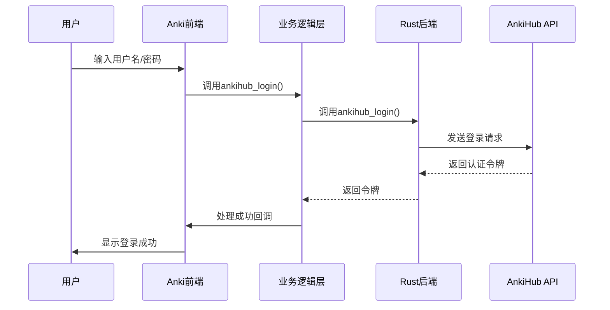
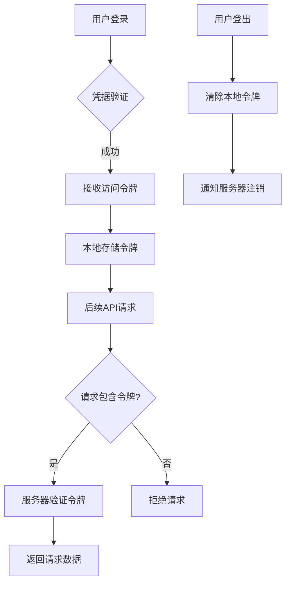
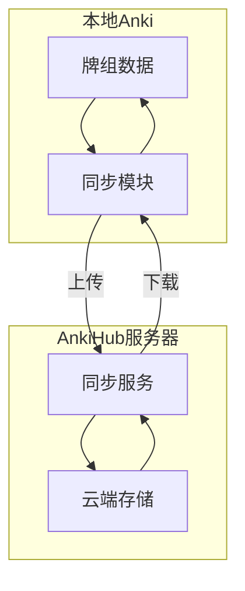
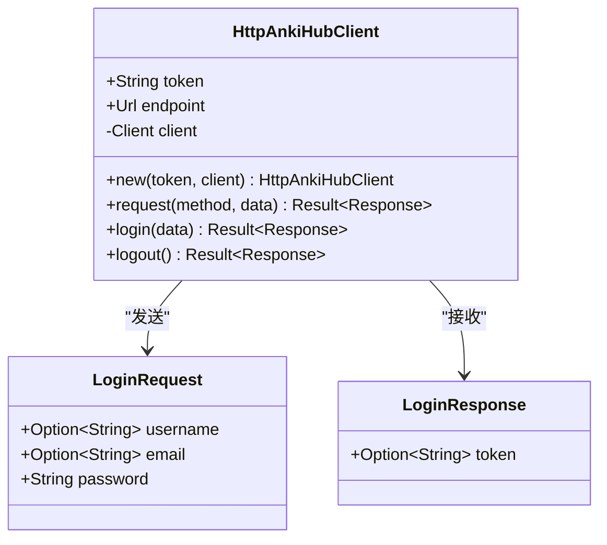
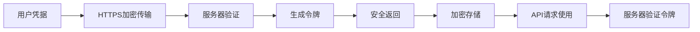
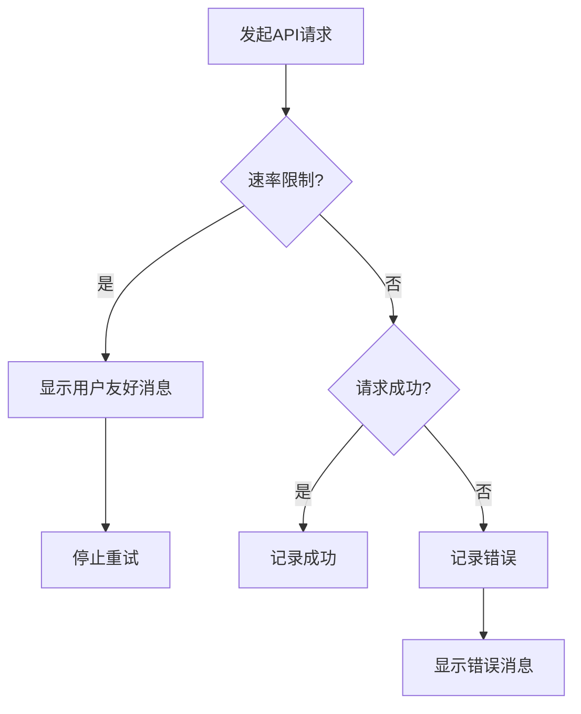

# AnkiHub集成

<cite>
**本文档中引用的文件**  
- [ankihub.py](file://qt/aqt/ankihub.py)
- [preferences.py](file://qt/aqt/preferences.py)
- [collection.py](file://pylib/anki/collection.py)
- [login.rs](file://rslib/src/ankihub/login.rs)
- [http_client/mod.rs](file://rslib/src/ankihub/http_client/mod.rs)
</cite>

## 目录
1. [简介](#简介)
2. [认证流程](#认证流程)
3. [令牌管理机制](#令牌管理机制)
4. [数据同步协议](#数据同步协议)
5. [HTTP客户端实现](#http客户端实现)
6. [API使用示例](#api使用示例)
7. [安全性考虑](#安全性考虑)
8. [速率限制与日志记录](#速率限制与日志记录)

## 简介
AnkiHub是Anki应用程序的第三方同步服务，提供用户认证、牌组同步和云端存储功能。本文档详细说明Anki与AnkiHub服务之间的集成机制，涵盖认证流程、数据同步协议、HTTP客户端实现以及安全最佳实践。

## 认证流程

AnkiHub使用基于用户名/邮箱和密码的直接认证机制，而非标准OAuth2流程。用户在Anki客户端输入凭据后，系统通过安全的HTTPS请求将信息发送至AnkiHub服务器进行验证。

认证流程由多个组件协同完成：
- 前端界面收集用户输入（用户名/邮箱和密码）
- 业务逻辑层处理认证请求
- 后端服务与AnkiHub API通信
- 成功后存储认证令牌并安装相关插件



**Diagram sources**
- [ankihub.py](file://qt/aqt/ankihub.py#L32-L66)
- [collection.py](file://pylib/anki/collection.py#L1158-L1159)
- [login.rs](file://rslib/src/ankihub/login.rs#L40-L61)

**Section sources**
- [ankihub.py](file://qt/aqt/ankihub.py#L32-L66)
- [collection.py](file://pylib/anki/collection.py#L1158-L1159)

## 令牌管理机制

AnkiHub的令牌管理机制确保用户会话的安全性和持久性。系统在用户成功认证后接收并存储访问令牌，用于后续所有API请求的身份验证。

令牌管理的关键特性包括：
- 令牌存储在本地配置文件中
- 每次API请求自动附加认证头
- 提供明确的登出功能清除本地令牌
- 登出时通知服务器使令牌失效



**Diagram sources**
- [ankihub.py](file://qt/aqt/ankihub.py#L69-L84)
- [collection.py](file://pylib/anki/collection.py#L1161-L1162)
- [http_client/mod.rs](file://rslib/src/ankihub/http_client/mod.rs#L25-L30)

**Section sources**
- [ankihub.py](file://qt/aqt/ankihub.py#L69-L84)
- [collection.py](file://pylib/anki/collection.py#L1161-L1162)

## 数据同步协议

AnkiHub的数据同步协议处理牌组的上传、下载和冲突解决。虽然具体同步实现细节未在当前分析文件中完全展现，但系统架构支持完整的双向同步功能。

同步协议的核心原则：
- 增量同步以提高效率
- 版本控制避免数据丢失
- 冲突检测与解决机制
- 断点续传支持网络不稳定环境



**Diagram sources**
- [sync.py](file://pylib/anki/sync.py)
- [http_client/mod.rs](file://rslib/src/ankihub/http_client/mod.rs)

## HTTP客户端实现

AnkiHub的HTTP客户端基于reqwest库构建，提供安全可靠的网络通信能力。客户端负责处理所有与AnkiHub API的交互，包括请求构建、响应解析和错误处理。

HTTP客户端的主要功能：
- 自动添加API版本头信息
- 令牌认证头管理
- JSON序列化与反序列化
- 异步请求处理
- 错误恢复机制



**Diagram sources**
- [http_client/mod.rs](file://rslib/src/ankihub/http_client/mod.rs)
- [login.rs](file://rslib/src/ankihub/login.rs)

**Section sources**
- [http_client/mod.rs](file://rslib/src/ankihub/http_client/mod.rs)
- [login.rs](file://rslib/src/ankihub/login.rs)

## API使用示例

### 用户认证
```python
# 在偏好设置中触发登录
def ankihub_sync_login(self) -> None:
    def on_success():
        if self.mw.pm.ankihub_token():
            self.update_login_status()
    
    ankihub_login(self.mw, on_success)
```

### 用户登出
```python
# 在偏好设置中触发登出
def ankihub_sync_logout(self) -> None:
    ankihub_token = self.mw.pm.ankihub_token()
    if ankihub_token is None:
        return
    ankihub_logout(self.mw, self.update_login_status, ankihub_token)
```

### 获取牌组列表
（具体实现未在分析文件中显示，但可通过认证后的会话调用相应API端点）

### 同步牌组数据
（具体实现未在分析文件中显示，但系统架构支持完整的同步功能）

**Section sources**
- [preferences.py](file://qt/aqt/preferences.py#L273-L284)
- [ankihub.py](file://qt/aqt/ankihub.py)

## 安全性考虑

AnkiHub集成遵循严格的安全最佳实践，保护用户数据和认证信息。

### 敏感数据加密
- 认证令牌在本地存储时加密
- 所有网络通信使用HTTPS加密
- 密码在传输过程中从不以明文形式发送

### 令牌刷新机制
- 系统未实现自动令牌刷新（当前设计为长期有效的访问令牌）
- 用户可通过登出/重新登录流程获取新令牌
- 服务器端可强制使令牌失效

### 安全存储
- 令牌存储在受保护的配置文件中
- 遵循操作系统安全存储最佳实践
- 提供明确的令牌清除机制



**Section sources**
- [http_client/mod.rs](file://rslib/src/ankihub/http_client/mod.rs)
- [login.rs](file://rslib/src/ankihub/login.rs)

## 速率限制与日志记录

### 速率限制处理
- 客户端未实现本地速率限制重试逻辑
- 依赖服务器返回的速率限制信息
- 用户界面显示服务器返回的错误信息
- 建议在后续版本中实现指数退避重试机制

### 日志记录最佳实践
- 记录关键操作的成功与失败状态
- 敏感信息（如密码）从不记录
- 提供用户友好的错误消息
- 错误日志包含足够的调试信息但不泄露敏感数据



**Section sources**
- [ankihub.py](file://qt/aqt/ankihub.py)
- [http_client/mod.rs](file://rslib/src/ankihub/http_client/mod.rs)