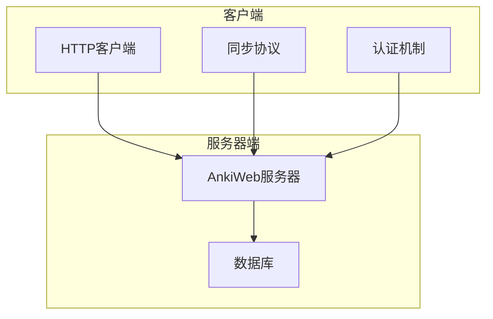
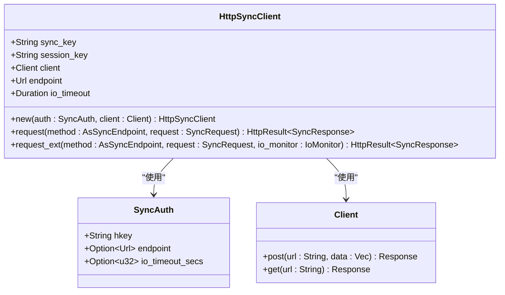
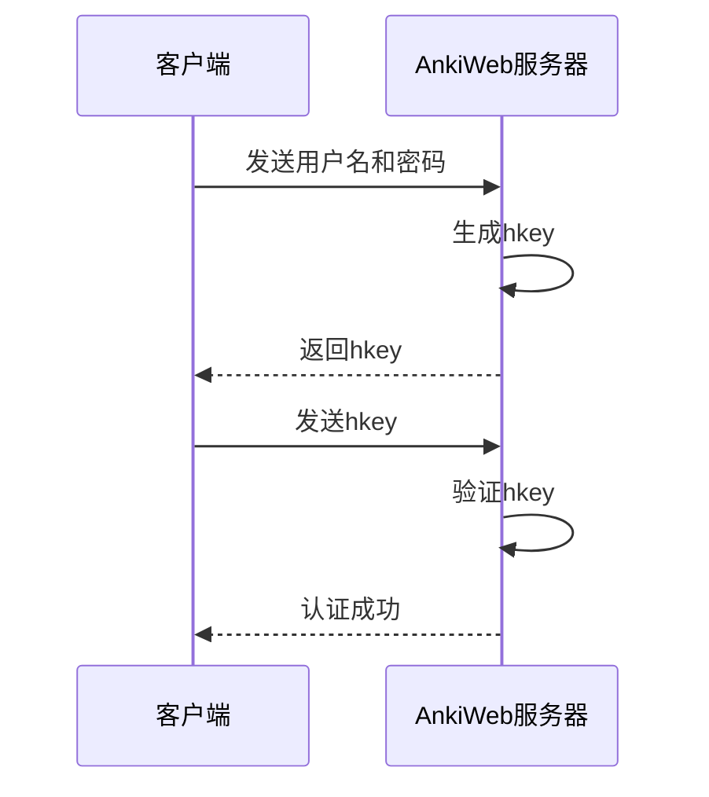
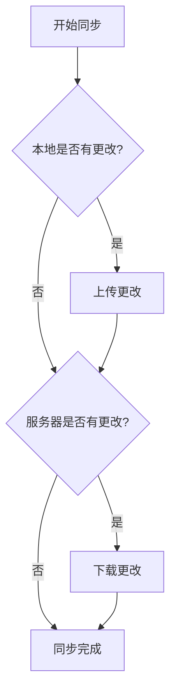
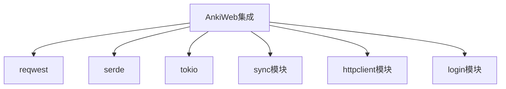

# AnkiWeb集成

<cite>
**本文档中引用的文件**   
- [httpclient.py](file://pylib/anki/httpclient.py)
- [sync.py](file://pylib/anki/sync.py)
- [ankiweb.proto](file://proto/anki/ankiweb.proto)
- [http_client/mod.rs](file://rslib/src/sync/http_client/mod.rs)
- [http_server/mod.rs](file://rslib/src/sync/http_server/mod.rs)
- [login.rs](file://rslib/src/sync/login.rs)
- [collection/start.rs](file://rslib/src/sync/collection/start.rs)
- [collection/chunks.rs](file://rslib/src/sync/collection/chunks.rs)
- [collection/normal.rs](file://rslib/src/sync/collection/normal.rs)
- [collection/status.rs](file://rslib/src/sync/collection/status.rs)
</cite>

## 目录
1. [简介](#简介)
2. [项目结构](#项目结构)
3. [核心组件](#核心组件)
4. [架构概述](#架构概述)
5. [详细组件分析](#详细组件分析)
6. [依赖分析](#依赖分析)
7. [性能考虑](#性能考虑)
8. [故障排除指南](#故障排除指南)
9. [结论](#结论)

## 简介
本文档深入解释了AnkiWeb服务的集成机制，重点涵盖认证、同步协议、HTTP客户端设计等核心功能。文档详细描述了会话管理、密码哈希、安全令牌验证等安全机制，以及完整同步和增量同步的实现细节。同时，文档还说明了HTTP客户端的设计原则，包括连接池管理、超时处理和网络异常恢复策略，并提供实际代码示例展示如何初始化同步会话、上传更改和下载更新。最后，文档包含安全性最佳实践和性能优化建议。

## 项目结构
Anki项目采用模块化设计，主要分为Python和Rust两个部分。Python部分主要负责前端逻辑和用户界面，而Rust部分则负责核心数据处理和网络通信。项目结构清晰，各模块职责分明，便于维护和扩展。

**Section sources**
- [httpclient.py](file://pylib/anki/httpclient.py#L0-L90)
- [sync.py](file://pylib/anki/sync.py#L0-L20)

## 核心组件
AnkiWeb集成的核心组件包括HTTP客户端、同步协议和认证机制。HTTP客户端负责与AnkiWeb服务器进行通信，同步协议定义了数据同步的流程和格式，认证机制则确保了用户数据的安全性。

**Section sources**
- [httpclient.py](file://pylib/anki/httpclient.py#L0-L90)
- [sync.py](file://pylib/anki/sync.py#L0-L20)

## 架构概述
AnkiWeb集成的架构分为客户端和服务器端两部分。客户端通过HTTP客户端与服务器端进行通信，服务器端则负责处理客户端的请求并返回相应的数据。整个架构采用RESTful API设计，确保了系统的可扩展性和可维护性。

**Diagram sources **
- [httpclient.py](file://pylib/anki/httpclient.py#L0-L90)
- [sync.py](file://pylib/anki/sync.py#L0-L20)

## 详细组件分析

### HTTP客户端分析
HTTP客户端是AnkiWeb集成的核心组件之一，负责与AnkiWeb服务器进行通信。客户端采用Rust语言编写，利用reqwest库实现HTTP请求，支持流式传输和进度回调。

#### HTTP客户端类图

**Diagram sources **
- [http_client/mod.rs](file://rslib/src/sync/http_client/mod.rs#L0-L113)

### 认证机制分析
AnkiWeb的认证机制采用基于主机密钥（hkey）的方式，通过用户名和密码生成哈希值作为认证凭证。服务器端通过验证客户端提供的hkey来确认用户身份。

#### 认证流程序列图

**Diagram sources **
- [http_server/mod.rs](file://rslib/src/sync/http_server/mod.rs#L0-L279)
- [login.rs](file://rslib/src/sync/login.rs#L0-L61)

### 同步协议分析
AnkiWeb的同步协议采用增量同步的方式，通过比较客户端和服务器端的USN（更新序列号）来确定需要同步的数据。协议支持完整同步和增量同步两种模式。

#### 同步协议流程图

**Diagram sources **
- [collection/start.rs](file://rslib/src/sync/collection/start.rs#L0-L185)
- [collection/chunks.rs](file://rslib/src/sync/collection/chunks.rs#L0-L432)

## 依赖分析
AnkiWeb集成依赖于多个外部库和内部模块。外部依赖包括reqwest（HTTP客户端库）、serde（序列化库）和tokio（异步运行时）。内部依赖包括sync模块、httpclient模块和login模块。

**Diagram sources **
- [Cargo.toml](file://Cargo.toml#L1-L30)

## 性能考虑
在设计AnkiWeb集成时，需要考虑以下几个性能因素：
1. **连接池管理**：通过复用HTTP连接减少连接建立的开销。
2. **超时处理**：设置合理的超时时间，避免长时间等待。
3. **数据压缩**：对传输的数据进行压缩，减少网络带宽消耗。
4. **增量同步**：只同步有更改的数据，减少数据传输量。

## 故障排除指南
在使用AnkiWeb集成时，可能会遇到以下常见问题：
1. **认证失败**：检查用户名和密码是否正确，确保网络连接正常。
2. **同步超时**：检查网络连接，尝试重新同步。
3. **数据不一致**：执行完整同步，确保客户端和服务器端数据一致。

**Section sources**
- [httpclient.py](file://pylib/anki/httpclient.py#L45-L89)
- [error/network.rs](file://rslib/src/error/network.rs#L211-L231)

## 结论
AnkiWeb集成通过HTTP客户端、同步协议和认证机制实现了客户端与服务器端的数据同步。系统设计合理，性能优越，安全性高，能够满足用户的需求。通过本文档的指导，开发者可以更好地理解和使用AnkiWeb集成，提高开发效率。