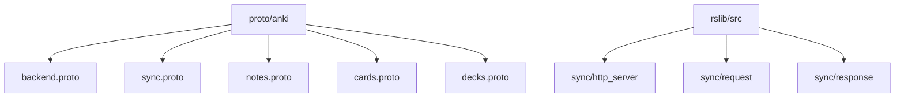
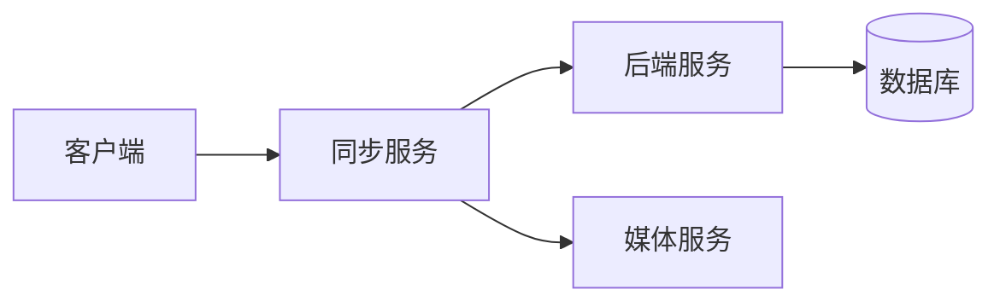
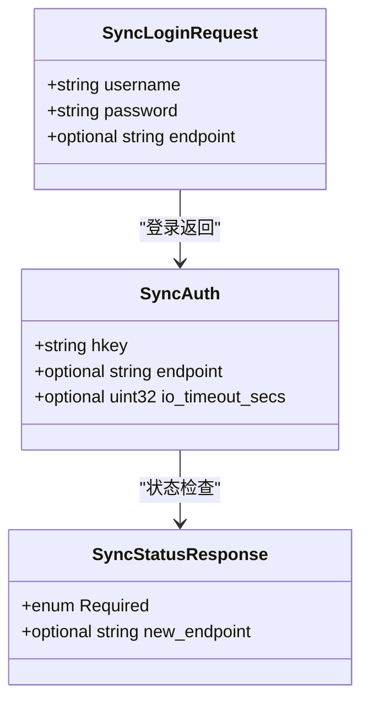
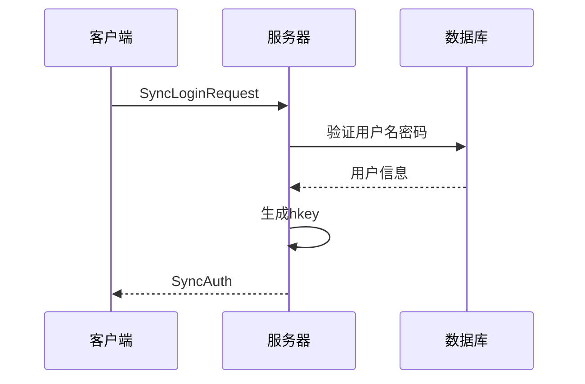
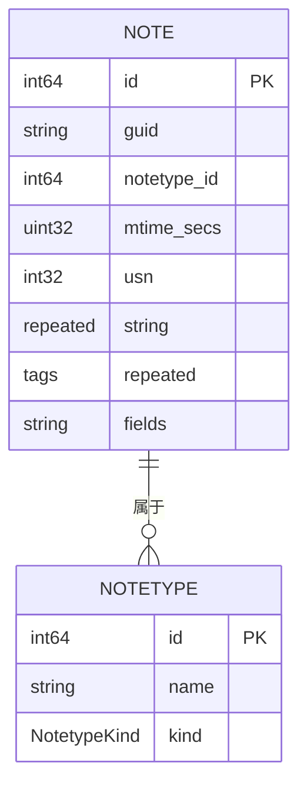
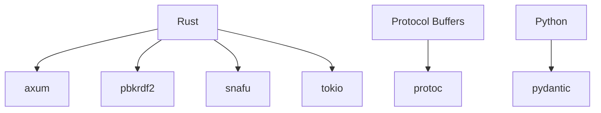

# 第三方服务开发指南

<cite>
**本文档中引用的文件**  
- [backend.proto](file://proto/anki/backend.proto)
- [generic.proto](file://proto/anki/generic.proto)
- [sync.proto](file://proto/anki/sync.proto)
- [notes.proto](file://proto/anki/notes.proto)
- [cards.proto](file://proto/anki/cards.proto)
- [decks.proto](file://proto/anki/decks.proto)
- [http_server/mod.rs](file://rslib/src/sync/http_server/mod.rs)
- [request/mod.rs](file://rslib/src/sync/request/mod.rs)
- [response.rs](file://rslib/src/sync/response.rs)
</cite>

## 目录
1. [简介](#简介)
2. [项目结构](#项目结构)
3. [核心组件](#核心组件)
4. [架构概述](#架构概述)
5. [详细组件分析](#详细组件分析)
6. [依赖分析](#依赖分析)
7. [性能考虑](#性能考虑)
8. [故障排除指南](#故障排除指南)
9. [结论](#结论)

## 简介
本文档旨在为开发与Anki兼容的第三方服务提供全面指导。文档详细说明了如何基于Anki的协议缓冲区定义构建外部服务，涵盖服务端点设计、认证机制、数据序列化、性能优化和安全性等方面。

## 项目结构
Anki项目采用模块化结构，主要包含协议定义、后端逻辑和同步服务等核心组件。协议缓冲区定义位于`proto/anki`目录下，为服务间通信提供标准化的数据格式。

**图示来源**  
- [backend.proto](file://proto/anki/backend.proto)
- [sync.proto](file://proto/anki/sync.proto)
- [notes.proto](file://proto/anki/notes.proto)

**本节来源**  
- [proto/anki/backend.proto](file://proto/anki/backend.proto)
- [proto/anki/sync.proto](file://proto/anki/sync.proto)

## 核心组件
Anki的核心组件包括协议缓冲区定义、同步服务和数据模型。这些组件共同构成了Anki服务的基础架构，确保数据的一致性和服务的可靠性。

**本节来源**  
- [backend.proto](file://proto/anki/backend.proto)
- [sync.proto](file://proto/anki/sync.proto)
- [notes.proto](file://proto/anki/notes.proto)

## 架构概述
Anki的架构基于微服务设计，通过协议缓冲区实现服务间通信。同步服务作为核心组件，负责处理客户端与服务器之间的数据同步。

**图示来源**  
- [http_server/mod.rs](file://rslib/src/sync/http_server/mod.rs)
- [sync.proto](file://proto/anki/sync.proto)

## 详细组件分析

### 同步服务分析
同步服务是Anki架构中的关键组件，负责处理客户端的同步请求。服务通过HTTP接口接收请求，并根据协议缓冲区定义进行数据处理。

#### 服务端点设计

**图示来源**  
- [sync.proto](file://proto/anki/sync.proto)
- [request/mod.rs](file://rslib/src/sync/request/mod.rs)

#### 认证机制

**图示来源**  
- [http_server/mod.rs](file://rslib/src/sync/http_server/mod.rs)
- [sync.proto](file://proto/anki/sync.proto)

**本节来源**  
- [http_server/mod.rs](file://rslib/src/sync/http_server/mod.rs)
- [request/mod.rs](file://rslib/src/sync/request/mod.rs)
- [response.rs](file://rslib/src/sync/response.rs)

### 数据模型分析
Anki的数据模型基于协议缓冲区定义，确保数据结构的一致性和可扩展性。

#### 笔记数据模型

**图示来源**  
- [notes.proto](file://proto/anki/notes.proto)
- [decks.proto](file://proto/anki/decks.proto)

**本节来源**  
- [notes.proto](file://proto/anki/notes.proto)
- [cards.proto](file://proto/anki/cards.proto)
- [decks.proto](file://proto/anki/decks.proto)

## 依赖分析
Anki项目依赖于多个外部库和工具，包括协议缓冲区编译器、Rust后端框架和同步服务组件。

**图示来源**  
- [Cargo.toml](file://Cargo.toml)
- [pyproject.toml](file://pyproject.toml)

**本节来源**  
- [Cargo.toml](file://Cargo.toml)
- [pyproject.toml](file://pyproject.toml)

## 性能考虑
在开发第三方服务时，需要考虑性能优化策略，包括请求批处理、数据压缩和连接池管理。

## 故障排除指南
当遇到同步问题时，可以检查以下常见问题：
- 认证信息是否正确
- 网络连接是否稳定
- 协议版本是否兼容

**本节来源**  
- [backend.proto](file://proto/anki/backend.proto)
- [sync.proto](file://proto/anki/sync.proto)

## 结论
本文档提供了开发Anki兼容第三方服务的全面指南。通过遵循文档中的规范和最佳实践，开发者可以构建高效、可靠的外部服务。