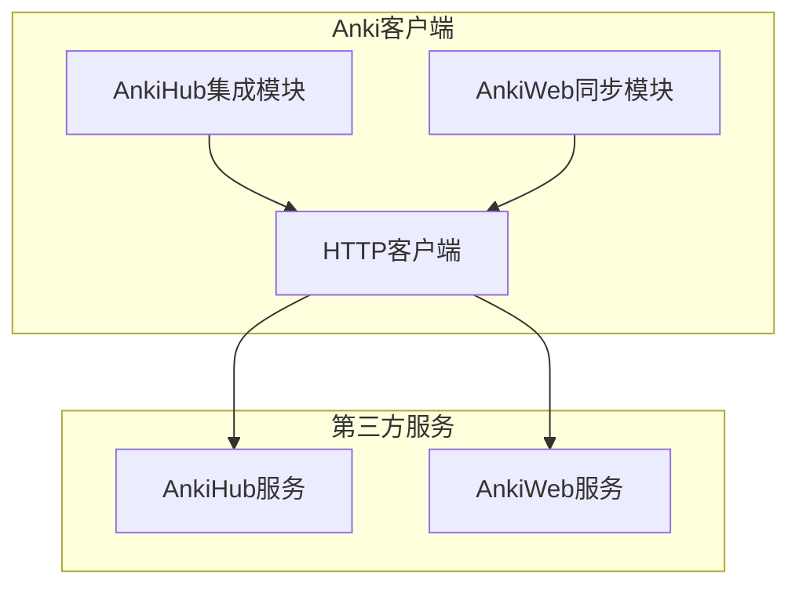
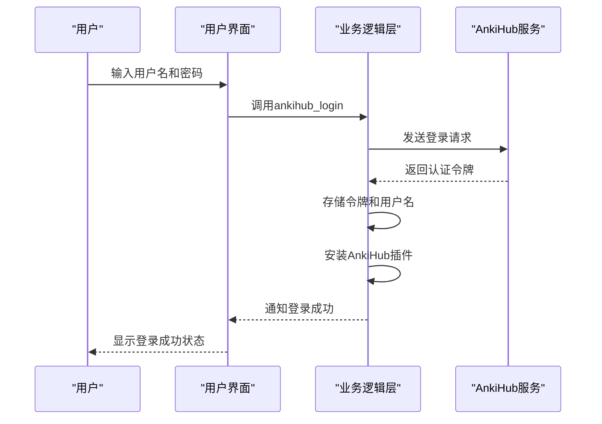
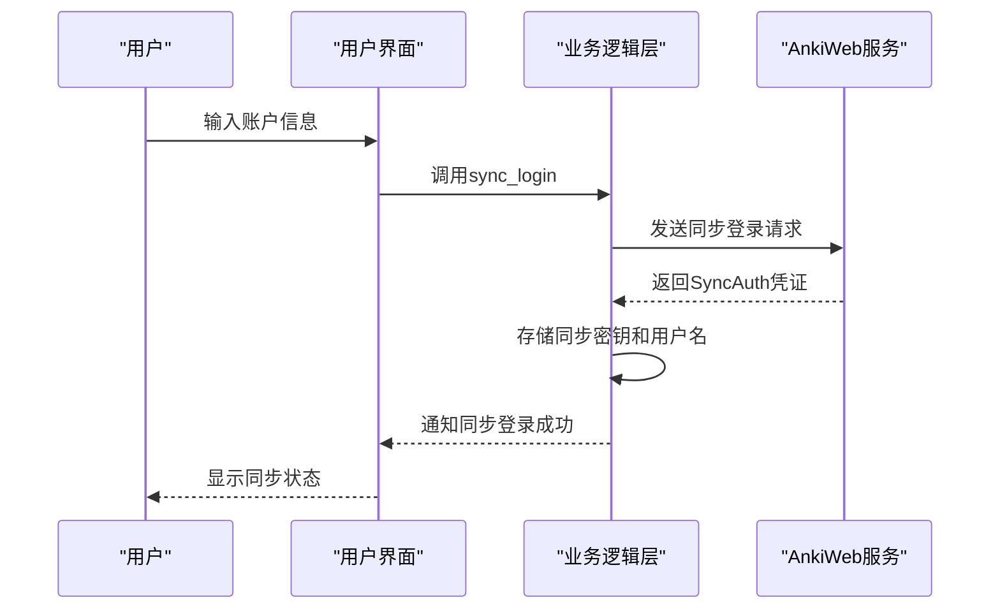
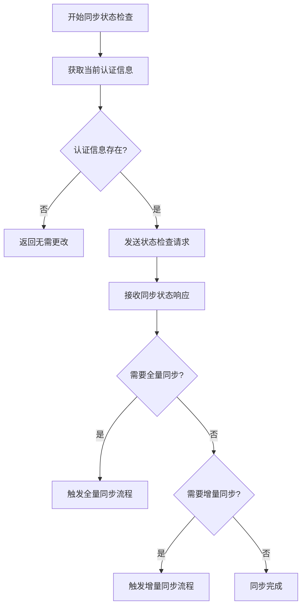
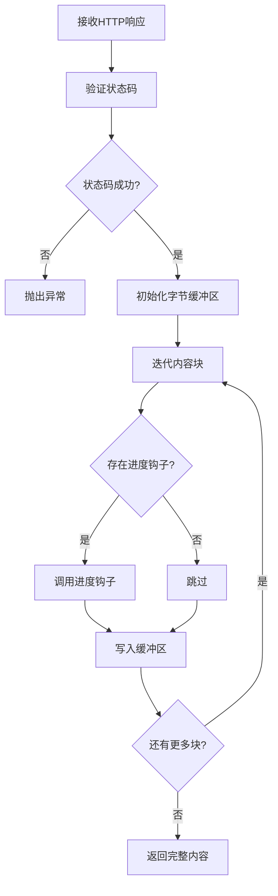
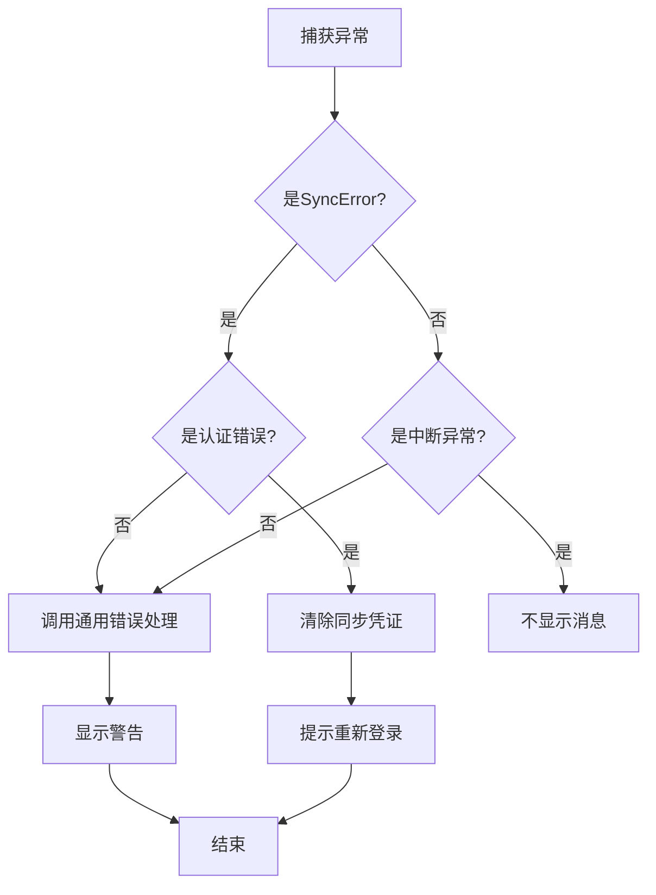
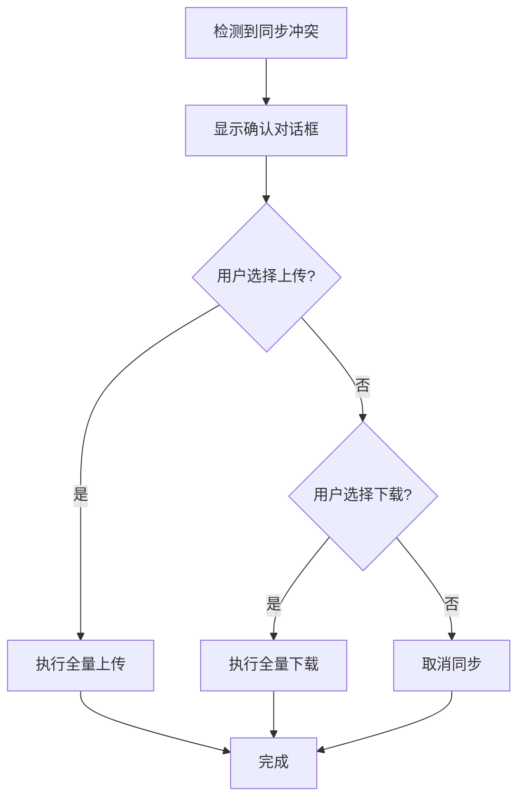
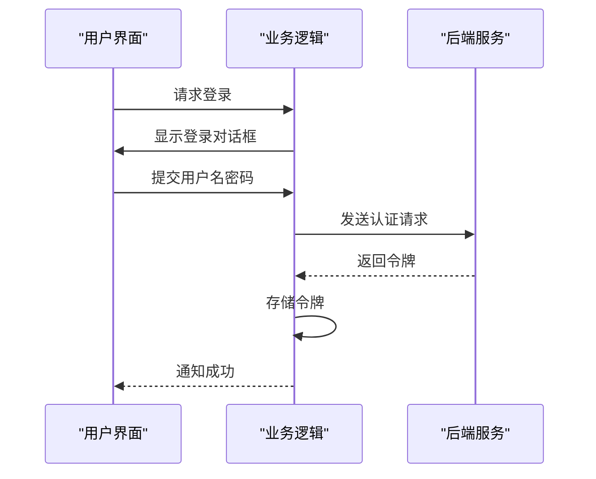
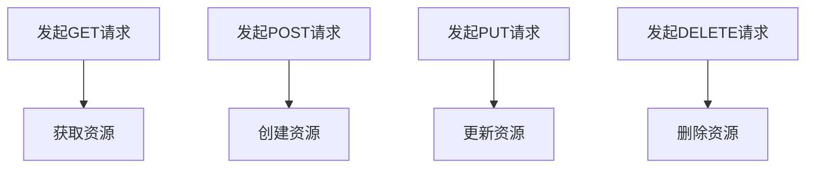
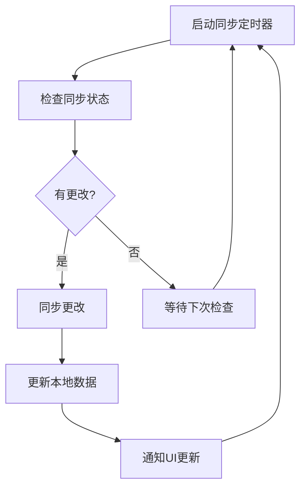

# 第三方服务集成

<cite>
**本文档中引用的文件**  
- [ankihub.py](file://qt/aqt/ankihub.py)
- [sync.py](file://qt/aqt/sync.py)
- [httpclient.py](file://pylib/anki/httpclient.py)
- [ankihub.proto](file://proto/anki/ankihub.proto)
- [ankiweb.proto](file://proto/anki/ankiweb.proto)
- [collection.py](file://pylib/anki/collection.py)
- [profiles.py](file://qt/aqt/profiles.py)
- [preferences.py](file://qt/aqt/preferences.py)
</cite>

## 目录
1. [简介](#简介)
2. [AnkiHub与AnkiWeb服务集成机制](#ankihub与ankiweb服务集成机制)
3. [认证流程](#认证流程)
4. [数据同步协议](#数据同步协议)
5. [HTTP客户端实现细节](#http客户端实现细节)
6. [错误恢复策略](#错误恢复策略)
7. [第三方服务开发指南](#第三方服务开发指南)
8. [代码示例](#代码示例)
9. [安全性考虑](#安全性考虑)
10. [速率限制处理](#速率限制处理)
11. [日志记录最佳实践](#日志记录最佳实践)

## 简介
Anki支持与AnkiHub和AnkiWeb等第三方服务的集成，提供数据同步、插件管理和用户认证等功能。这些服务通过定义良好的API接口和协议实现与Anki客户端的交互，确保数据一致性、安全性和用户体验。

**Section sources**
- [ankihub.py](file://qt/aqt/ankihub.py#L1-L155)
- [sync.py](file://qt/aqt/sync.py#L1-L402)

## AnkiHub与AnkiWeb服务集成机制
Anki通过独立的服务接口与AnkiHub和AnkiWeb进行通信。AnkiHub主要用于插件分发和社区内容共享，而AnkiWeb提供核心的账户管理和数据同步功能。两者均采用基于Protobuf的gRPC服务定义，确保接口的类型安全和高效序列化。



**Diagram sources**
- [ankihub.proto](file://proto/anki/ankihub.proto#L1-L30)
- [ankiweb.proto](file://proto/anki/ankiweb.proto#L1-L49)

**Section sources**
- [ankihub.proto](file://proto/anki/ankihub.proto#L1-L30)
- [ankiweb.proto](file://proto/anki/ankiweb.proto#L1-L49)

## 认证流程
Anki的认证流程采用基于令牌的机制，用户通过用户名和密码登录后获取访问令牌。该令牌在后续请求中作为身份凭证使用，并存储在用户配置文件中进行持久化。

### AnkiHub认证流程
AnkiHub的认证通过`ankihub_login`函数实现，该函数处理用户凭证输入、网络请求和令牌存储。认证成功后，系统会自动安装AnkiHub插件以启用完整功能。



**Diagram sources**
- [ankihub.py](file://qt/aqt/ankihub.py#L32-L66)
- [collection.py](file://pylib/anki/collection.py#L1158-L1159)

**Section sources**
- [ankihub.py](file://qt/aqt/ankihub.py#L32-L66)
- [collection.py](file://pylib/anki/collection.py#L1158-L1159)

### AnkiWeb认证流程
AnkiWeb的认证流程与AnkiHub类似，但使用不同的API端点和响应结构。认证信息通过`SyncAuth`消息进行交换，包含主机密钥和用户名等凭证数据。



**Diagram sources**
- [sync.py](file://qt/aqt/sync.py#L350-L398)
- [collection.py](file://pylib/anki/collection.py#L1158-L1159)

**Section sources**
- [sync.py](file://qt/aqt/sync.py#L350-L398)

## 数据同步协议
Anki的数据同步协议设计用于高效地在客户端和服务器之间传输增量更改。协议支持全量同步和增量同步两种模式，根据客户端和服务器的状态差异自动选择合适的同步策略。

### 同步状态检查
在执行同步之前，客户端会先检查同步状态，确定需要执行的操作类型。状态检查结果包含是否需要上传、下载或进行全量同步等信息。



**Diagram sources**
- [sync.py](file://qt/aqt/sync.py#L15-L32)
- [sync.py](file://qt/aqt/sync.py#L140-L150)

**Section sources**
- [sync.py](file://qt/aqt/sync.py#L15-L32)

## HTTP客户端实现细节
Anki的HTTP客户端封装了底层的网络请求处理，提供进度跟踪、超时控制和错误处理等高级功能。客户端基于Python的requests库构建，同时添加了对上传/下载进度回调的支持。

### 请求处理
HTTP客户端支持GET和POST请求，自动添加用户代理头信息，并配置合理的超时时间。所有请求都启用流式传输，以支持大文件的分块处理。

```mermaid
classDiagram
class HttpClient {
+bool verify
+int timeout
+ProgressCallback | null progress_hook
+__init__(progress_hook)
+__enter__()
+__exit__(*args)
+close()
+post(url, data, headers) Response
+get(url, headers) Response
+stream_content(resp) bytes
+_agent_name() string
}
class ProgressCallback {
<<function>>
(upload_bytes, download_bytes)
}
HttpClient --> ProgressCallback : "使用"
```

**Diagram sources**
- [httpclient.py](file://pylib/anki/httpclient.py#L1-L90)

**Section sources**
- [httpclient.py](file://pylib/anki/httpclient.py#L1-L90)

### 响应解析
响应解析过程包括状态码验证、内容流式读取和进度更新。客户端使用缓冲区逐块读取响应内容，同时调用进度钩子函数通知调用方传输进度。



**Diagram sources**
- [httpclient.py](file://pylib/anki/httpclient.py#L70-L80)

**Section sources**
- [httpclient.py](file://pylib/anki/httpclient.py#L70-L80)

## 错误恢复策略
Anki实现了多层次的错误恢复机制，包括网络异常重试、同步冲突解决和用户交互式恢复。这些策略确保在各种故障场景下都能提供良好的用户体验。

### 网络异常处理
当网络请求失败时，系统会根据错误类型采取相应的恢复措施。对于认证错误，系统会清除存储的凭证并提示用户重新登录；对于其他错误，则显示警告信息。



**Diagram sources**
- [sync.py](file://qt/aqt/sync.py#L45-L55)

**Section sources**
- [sync.py](file://qt/aqt/sync.py#L45-L55)

### 同步冲突解决
当检测到同步冲突时，系统会提示用户选择上传本地数据、下载服务器数据或取消操作。这种交互式解决方式避免了数据丢失的风险。



**Diagram sources**
- [sync.py](file://qt/aqt/sync.py#L175-L195)

**Section sources**
- [sync.py](file://qt/aqt/sync.py#L175-L195)

## 第三方服务开发指南
为确保第三方服务与Anki的兼容性，开发者应遵循以下指南：

1. **API设计**：使用Protobuf定义服务接口，确保类型安全和跨平台兼容性
2. **认证机制**：实现基于令牌的认证，支持安全的凭证存储和刷新
3. **数据格式**：使用标准的数据交换格式，如JSON或Protobuf二进制格式
4. **错误处理**：定义清晰的错误代码和消息，便于客户端进行针对性处理
5. **版本控制**：支持API版本管理，确保向后兼容性

**Section sources**
- [ankihub.proto](file://proto/anki/ankihub.proto#L1-L30)
- [ankiweb.proto](file://proto/anki/ankiweb.proto#L1-L49)

## 代码示例
以下代码示例展示了如何实现Anki服务集成的关键功能。

### OAuth认证
Anki使用自定义的认证流程，虽然不是标准的OAuth，但概念相似。以下示例展示了如何实现登录功能：



**Diagram sources**
- [ankihub.py](file://qt/aqt/ankihub.py#L32-L66)

**Section sources**
- [ankihub.py](file://qt/aqt/ankihub.py#L32-L66)

### RESTful API调用
Anki的API调用遵循RESTful原则，使用HTTP方法对应不同的操作类型：



**Diagram sources**
- [httpclient.py](file://pylib/anki/httpclient.py#L75-L85)

**Section sources**
- [httpclient.py](file://pylib/anki/httpclient.py#L75-L85)

### 实时数据同步
实时数据同步通过轮询机制实现，定期检查服务器状态并下载增量更改：



**Diagram sources**
- [sync.py](file://qt/aqt/sync.py#L100-L110)

**Section sources**
- [sync.py](file://qt/aqt/sync.py#L100-L110)

## 安全性考虑
Anki在服务集成中实施了多项安全措施：

1. **传输安全**：默认启用SSL验证，确保数据传输的机密性和完整性
2. **凭证存储**：认证令牌安全地存储在用户配置文件中，避免明文存储
3. **输入验证**：对所有用户输入进行验证，防止注入攻击
4. **权限控制**：不同服务具有不同的访问权限，遵循最小权限原则

**Section sources**
- [httpclient.py](file://pylib/anki/httpclient.py#L15-L20)
- [profiles.py](file://qt/aqt/profiles.py#L739-L746)

## 速率限制处理
Anki客户端通过以下方式处理服务端的速率限制：

1. **退避算法**：在遇到速率限制时，使用指数退避策略重试请求
2. **批量处理**：将多个操作合并为单个请求，减少API调用次数
3. **缓存机制**：对频繁访问的数据进行本地缓存，降低服务器负载
4. **用户通知**：当达到速率限制时，向用户显示友好的提示信息

**Section sources**
- [sync.py](file://qt/aqt/sync.py#L100-L110)

## 日志记录最佳实践
Anki的日志记录遵循以下最佳实践：

1. **结构化日志**：使用结构化的日志格式，便于分析和查询
2. **分级记录**：根据事件的重要性使用不同的日志级别
3. **敏感信息保护**：避免在日志中记录敏感信息，如密码和令牌
4. **上下文信息**：在日志中包含足够的上下文信息，便于问题排查

**Section sources**
- [sync.py](file://qt/aqt/sync.py#L50-L55)