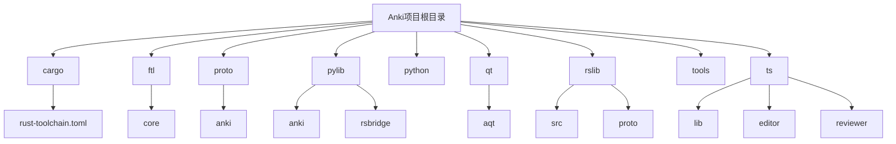
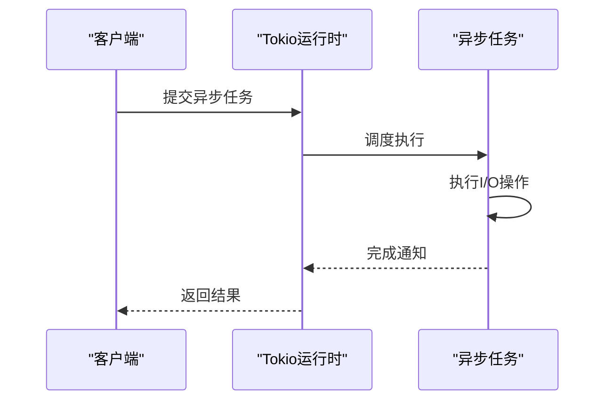

# 技术栈与依赖

<cite>
**本文档中引用的文件**  
- [Cargo.toml](file://Cargo.toml)
- [pyproject.toml](file://pyproject.toml)
- [package.json](file://package.json)
- [rslib/Cargo.toml](file://rslib/Cargo.toml)
- [pylib/rsbridge/build.rs](file://pylib/rsbridge/build.rs)
- [qt/tools/build_ui.py](file://qt/tools/build_ui.py)
- [ts/lib/sveltelib/export-runtime.ts](file://ts/lib/sveltelib/export-runtime.ts)
- [proto/anki/backend.proto](file://proto/anki/backend.proto)
</cite>

## 目录
1. [引言](#引言)
2. [项目结构](#项目结构)
3. [核心编程语言](#核心编程语言)
4. [关键框架与库依赖](#关键框架与库依赖)
5. [版本管理与工具链配置](#版本管理与工具链配置)
6. [技术选型背景](#技术选型背景)
7. [构建环境设置](#构建环境设置)
8. [结论](#结论)

## 引言
Anki 是一个跨平台的记忆卡片应用，其技术栈融合了多种编程语言和现代开发工具。本文档详细说明了 Anki 项目使用的主要编程语言（Rust、Python、TypeScript、C++）及其在架构中的角色。同时记录了关键框架和库依赖，包括 Rust 的 tokio 异步运行时、PyO3 Python-Rust 互操作、Qt6 GUI 框架、Svelte 前端框架和 Protocol Buffers 序列化。此外还解释了版本管理策略和工具链配置，为初学者提供技术选型的背景知识，同时为经验丰富的开发者提供依赖版本兼容性和集成细节。

## 项目结构
Anki 项目的目录结构清晰地反映了其多语言、模块化的架构设计。主要组件分布在不同的目录中，每个目录专注于特定的功能或技术栈。



**Diagram sources**
- [Cargo.toml](file://Cargo.toml)
- [pyproject.toml](file://pyproject.toml)
- [package.json](file://package.json)

**Section sources**
- [Cargo.toml](file://Cargo.toml)
- [pyproject.toml](file://pyproject.toml)
- [package.json](file://package.json)

## 核心编程语言

### Rust
Rust 是 Anki 后端逻辑的核心语言，负责处理数据存储、同步、调度等关键功能。Rust 的内存安全性和高性能使其成为实现复杂业务逻辑的理想选择。`rslib` 目录包含了主要的 Rust 代码，通过 `Cargo.toml` 文件管理依赖。

**Section sources**
- [rslib/Cargo.toml](file://rslib/Cargo.toml)
- [Cargo.toml](file://Cargo.toml)

### Python
Python 主要用于 GUI 层和脚本工具，通过 Qt6 框架构建用户界面。`pylib` 目录包含 Python 代码，其中 `rsbridge` 模块实现了 Python 与 Rust 的互操作。Python 还用于构建脚本和测试工具。

**Section sources**
- [pylib/rsbridge/build.rs](file://pylib/rsbridge/build.rs)
- [pyproject.toml](file://pyproject.toml)

### TypeScript
TypeScript 用于前端开发，特别是在 Svelte 框架中构建现代化的 Web 界面。`ts` 目录包含了所有 TypeScript 代码，通过 Vite 构建工具进行编译和打包。TypeScript 提供了静态类型检查，增强了代码的可维护性。

**Section sources**
- [package.json](file://package.json)
- [ts/lib/sveltelib/export-runtime.ts](file://ts/lib/sveltelib/export-runtime.ts)

### C++
C++ 在 Anki 中主要用于与 Qt 框架的底层交互，特别是在处理图形界面和系统级操作时。虽然大部分 GUI 代码使用 Python 编写，但底层的 Qt 实现依赖于 C++。

## 关键框架与库依赖

### tokio 异步运行时
Rust 的 tokio 库作为异步运行时，支持非阻塞 I/O 操作，这对于处理网络请求和文件操作至关重要。tokio 提供了轻量级的并发模型，使得 Anki 能够高效地处理多个并发任务。



**Diagram sources**
- [Cargo.toml](file://Cargo.toml)
- [rslib/Cargo.toml](file://rslib/Cargo.toml)

**Section sources**
- [Cargo.toml](file://Cargo.toml)
- [rslib/Cargo.toml](file://rslib/Cargo.toml)

### PyO3 Python-Rust 互操作
PyO3 是一个 Rust 库，用于创建原生 Python 扩展。Anki 使用 PyO3 实现 Python 和 Rust 之间的无缝互操作，允许 Python 代码调用 Rust 函数，从而充分利用 Rust 的性能优势。

**Section sources**
- [pylib/rsbridge/build.rs](file://pylib/rsbridge/build.rs)

### Qt6 GUI 框架
Qt6 是 Anki 的图形用户界面框架，提供了跨平台的 GUI 开发能力。Python 通过 PyQt6 绑定与 Qt6 交互，实现了丰富的用户界面功能。`qt/tools/build_ui.py` 文件中的代码展示了如何为 Qt6 进行特定的代码修复。

```python
def with_fixes_for_qt6(code: str) -> str:
    code = code.replace(
        "from PyQt6 import QtCore, QtGui, QtWidgets",
        "from PyQt6 import QtCore, QtGui, QtWidgets\nfrom aqt.utils import tr\n",
    )
    # ... 其他修复
    return "\n".join(outlines)
```

**Section sources**
- [qt/tools/build_ui.py](file://qt/tools/build_ui.py)

### Svelte 前端框架
Svelte 是一个现代化的前端框架，用于构建响应式的 Web 界面。Anki 使用 Svelte 构建其 Web 组件，通过 `ts/lib/sveltelib/export-runtime.ts` 文件暴露 Svelte 运行时，以便插件可以使用相同的运行时。

**Section sources**
- [ts/lib/sveltelib/export-runtime.ts](file://ts/lib/sveltelib/export-runtime.ts)

### Protocol Buffers 序列化
Protocol Buffers（Protobuf）是 Anki 中用于数据序列化和通信的格式。`proto/anki` 目录包含了所有 Protobuf 定义文件，用于在不同组件之间传递结构化数据。Protobuf 提供了高效的二进制序列化，减少了网络传输和存储开销。

**Section sources**
- [proto/anki/backend.proto](file://proto/anki/backend.proto)

## 版本管理与工具链配置

### Cargo.toml 配置
Rust 的依赖管理通过 `Cargo.toml` 文件实现，定义了项目依赖、版本约束和构建配置。Anki 使用工作区（workspace）来管理多个相关的 Rust 包，确保依赖的一致性。

**Section sources**
- [Cargo.toml](file://Cargo.toml)
- [rslib/Cargo.toml](file://rslib/Cargo.toml)

### pyproject.toml 配置
Python 项目的依赖管理使用 `pyproject.toml` 文件，遵循现代 Python 打包标准。该文件定义了项目元数据、依赖项和构建系统配置。

**Section sources**
- [pyproject.toml](file://pyproject.toml)

### package.json 配置
前端项目的依赖管理通过 `package.json` 文件实现，使用 Yarn 作为包管理器。该文件定义了开发和生产依赖，以及构建脚本。

**Section sources**
- [package.json](file://package.json)

## 技术选型背景
Anki 的技术选型基于性能、可维护性和跨平台兼容性的综合考虑。Rust 提供了内存安全和高性能，适合处理核心业务逻辑；Python 和 Qt6 提供了成熟的 GUI 开发能力；TypeScript 和 Svelte 提供了现代化的前端开发体验；Protocol Buffers 确保了高效的数据序列化和通信。

## 构建环境设置
Anki 的构建环境通过多种工具链配置文件进行管理，确保开发环境的一致性。开发者需要安装 Rust、Python、Node.js 等基础工具，并根据 `rust-toolchain.toml`、`pyproject.toml` 和 `package.json` 文件配置具体的依赖版本。

## 结论
Anki 的技术栈体现了现代软件开发的多语言、模块化趋势。通过合理的技术选型和依赖管理，Anki 实现了高性能、高可维护性和良好的跨平台兼容性。对于初学者，理解这些技术选型的背景有助于更好地参与项目开发；对于经验丰富的开发者，掌握依赖版本兼容性和集成细节有助于优化系统性能和稳定性。