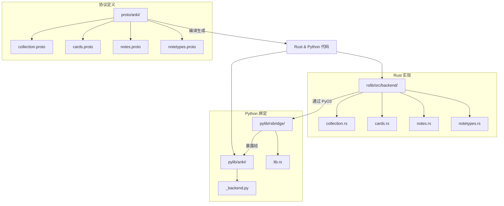
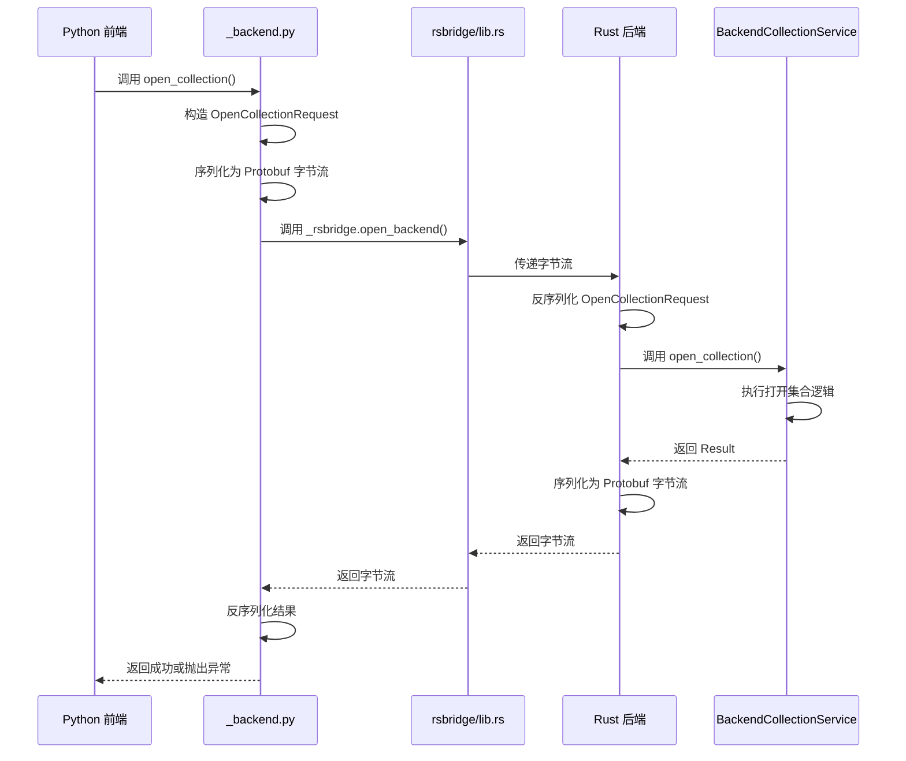
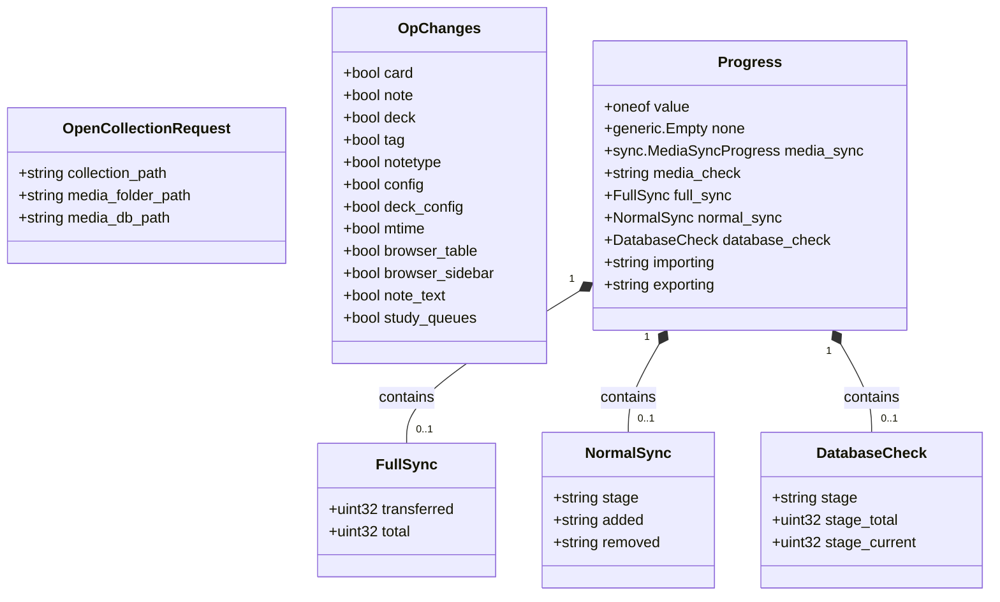
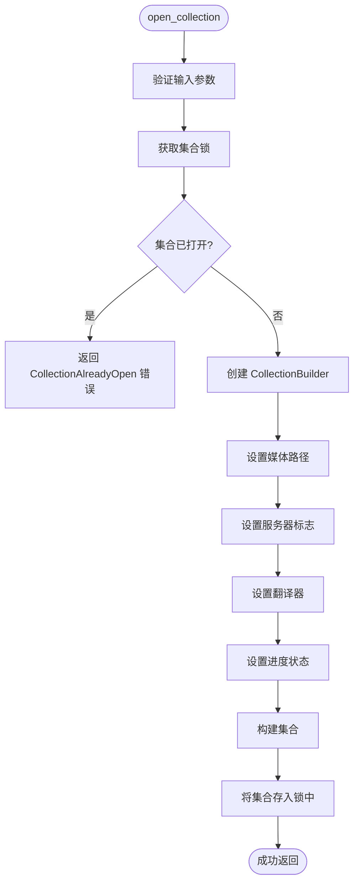
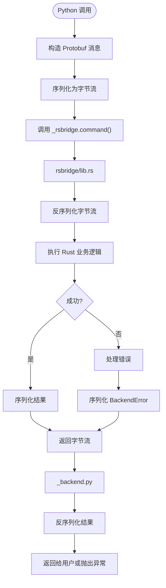
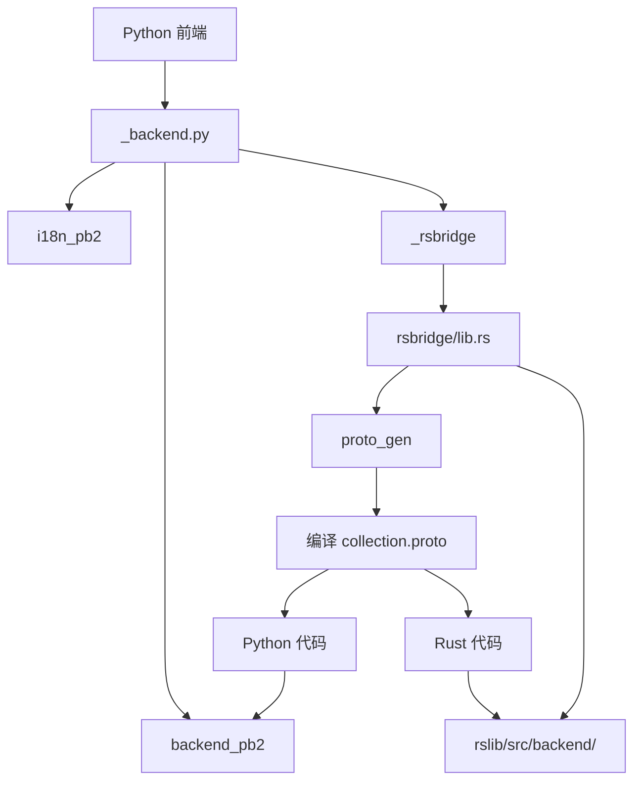

# 序列化与协议缓冲区

<cite>
**本文档引用文件**  
- [collection.proto](file://proto/anki/collection.proto)
- [cards.proto](file://proto/anki/cards.proto)
- [notes.proto](file://proto/anki/notes.proto)
- [notetypes.proto](file://proto/anki/notetypes.proto)
- [collection.rs](file://rslib/src/backend/collection.rs)
- [_backend.py](file://pylib/anki/_backend.py)
- [lib.rs](file://pylib/rsbridge/lib.rs)
- [generic_helpers.rs](file://rslib/proto/src/generic_helpers.rs)
</cite>

## 目录
1. [引言](#引言)
2. [项目结构](#项目结构)
3. [核心组件](#核心组件)
4. [架构概述](#架构概述)
5. [详细组件分析](#详细组件分析)
6. [依赖分析](#依赖分析)
7. [性能考虑](#性能考虑)
8. [故障排除指南](#故障排除指南)
9. [结论](#结论)

## 引言
Anki 使用 Protocol Buffers（Protobuf）作为其前后端之间数据交换的核心序列化机制。该系统通过定义清晰的消息结构，实现了 Rust 后端与 Python 前端之间的高效、类型安全的数据通信。本文档深入分析 Anki 的序列化架构，重点关注 `collection.proto` 等关键文件中定义的消息格式，以及 PyO3 桥接层如何实现跨语言的数据传递。

## 项目结构
Anki 的序列化机制分布在多个关键目录中。协议缓冲区定义位于 `proto/anki/` 目录下，Rust 实现位于 `rslib/src/backend/` 和 `rslib/src/` 中，而 Python 绑定和桥接代码则位于 `pylib/anki/` 和 `pylib/rsbridge/` 中。

**Diagram sources**
- [collection.proto](file://proto/anki/collection.proto)
- [collection.rs](file://rslib/src/backend/collection.rs)
- [_backend.py](file://pylib/anki/_backend.py)
- [lib.rs](file://pylib/rsbridge/lib.rs)

**Section sources**
- [collection.proto](file://proto/anki/collection.proto)
- [collection.rs](file://rslib/src/backend/collection.rs)
- [_backend.py](file://pylib/anki/_backend.py)

## 核心组件
Anki 的序列化机制由三个核心部分构成：协议缓冲区消息定义、Rust 后端服务实现和 Python 前端绑定。消息定义文件（如 `collection.proto`）是整个系统的契约，定义了所有跨语言通信的数据结构。Rust 后端将业务逻辑封装为 gRPC 服务，而 Python 层通过 `_backend.py` 中的 `RustBackend` 类与之交互。

**Section sources**
- [collection.proto](file://proto/anki/collection.proto)
- [_backend.py](file://pylib/anki/_backend.py)
- [collection.rs](file://rslib/src/backend/collection.rs)

## 架构概述
Anki 的数据流遵循清晰的分层架构。Python 前端通过 `_backend.py` 中的 `RustBackend` 类发起请求。该类将请求序列化为 Protobuf 字节流，并通过 PyO3 调用 `rsbridge` 中的原生函数。Rust 后端接收字节流，反序列化为 Protobuf 消息，执行业务逻辑，并将结果序列化后返回。整个过程确保了数据的一致性和高效性。

**Diagram sources**
- [collection.proto](file://proto/anki/collection.proto#L20-L35)
- [collection.rs](file://rslib/src/backend/collection.rs#L10-L25)
- [_backend.py](file://pylib/anki/_backend.py#L50-L65)
- [lib.rs](file://pylib/rsbridge/lib.rs)

## 详细组件分析

### 协议缓冲区消息结构分析
Anki 的 `.proto` 文件定义了丰富的消息结构。以 `collection.proto` 为例，`OpenCollectionRequest` 消息包含 `collection_path`、`media_folder_path` 和 `media_db_path` 三个字段，精确描述了打开一个集合所需的所有参数。`OpChanges` 消息则使用布尔字段来表示操作影响的范围，如 `card`、`note`、`deck` 等，为前端提供了高效的变更通知机制。

**Diagram sources**
- [collection.proto](file://proto/anki/collection.proto#L40-L165)

**Section sources**
- [collection.proto](file://proto/anki/collection.proto)

### Rust 后端服务实现分析
Rust 后端通过实现 `BackendCollectionService` trait 来提供服务。`open_collection` 方法接收一个 `OpenCollectionRequest` 消息，使用 `CollectionBuilder` 构建集合实例。该实现展示了如何将 Protobuf 消息无缝集成到 Rust 的业务逻辑中。`create_backup` 方法则演示了异步任务的处理，通过 `self.backup_task.lock()` 管理备份任务的生命周期。

**Diagram sources**
- [collection.rs](file://rslib/src/backend/collection.rs#L10-L60)

**Section sources**
- [collection.rs](file://rslib/src/backend/collection.rs)

### Python 绑定与桥接机制分析
Python 层的 `RustBackend` 类是与 Rust 交互的入口。`__init__` 方法通过 `backend_pb2.BackendInit` 消息初始化后端。`_run_command` 方法是核心，它将服务、方法和输入数据打包，通过 `_rsbridge` 调用 Rust 代码。异常处理机制将 Rust 端的 `BackendError` Protobuf 消息反序列化，并转换为相应的 Python 异常，确保了错误信息的准确传递。

**Diagram sources**
- [_backend.py](file://pylib/anki/_backend.py#L50-L120)
- [lib.rs](file://pylib/rsbridge/lib.rs)

**Section sources**
- [_backend.py](file://pylib/anki/_backend.py)

## 依赖分析
Anki 的序列化系统依赖于多个关键组件。`proto_gen` crate 负责将 `.proto` 文件编译为 Rust 和 Python 代码。`rsbridge` crate 使用 PyO3 将 Rust 函数暴露给 Python。`backend_pb2` 和 `i18n_pb2` 是 Protobuf 编译器生成的 Python 模块，提供了消息的序列化/反序列化功能。

**Diagram sources**
- [Cargo.toml](file://Cargo.toml)
- [pyproject.toml](file://pyproject.toml)
- [build.rs](file://rslib/build.rs)

**Section sources**
- [Cargo.toml](file://Cargo.toml)
- [pyproject.toml](file://pyproject.toml)

## 性能考虑
Protobuf 的二进制序列化格式比 JSON 等文本格式更紧凑，解析速度更快，这对于 Anki 处理大量卡片和笔记的场景至关重要。通过 `OpChanges` 这样的轻量级消息，前端可以高效地获取操作的影响范围，而无需传输大量数据。异步任务（如备份）通过独立的线程执行，避免阻塞主线程，保证了 UI 的响应性。

## 故障排除指南
当遇到序列化相关错误时，应首先检查 Protobuf 消息的字段是否正确填充。`backend_exception_to_pylib` 函数是调试的关键，它将底层的 `BackendError` 映射为具体的 Python 异常（如 `NotFoundError`、`InvalidInput`）。日志中打印的堆栈跟踪可以帮助定位是 Python 层、桥接层还是 Rust 层的问题。确保 `rsbridge` 的构建哈希与 `anki.buildinfo` 匹配，可以避免因版本不一致导致的运行时错误。

**Section sources**
- [_backend.py](file://pylib/anki/_backend.py#L200-L260)

## 结论
Anki 的序列化机制是一个精心设计的系统，它利用 Protocol Buffers 实现了类型安全、高效且可维护的跨语言通信。通过清晰的 `.proto` 文件定义、模块化的 Rust 服务实现以及健壮的 Python 绑定，Anki 成功地将复杂的业务逻辑与用户界面分离。这种架构不仅提高了性能，也为未来的功能扩展和维护提供了坚实的基础。开发者在添加新功能时，应遵循相同的模式：先定义 Protobuf 消息，再实现 Rust 服务，最后在 Python 层提供安全的接口。