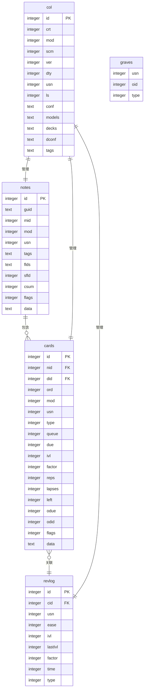

# 数据库模式设计

<cite>
**Referenced Files in This Document**   
- [schema11.sql](file://rslib/src/storage/schema11.sql)
- [sqlite.rs](file://rslib/src/storage/sqlite.rs)
- [dbcheck.rs](file://rslib/src/dbcheck.rs)
</cite>

## 目录
1. [核心表结构](#核心表结构)
2. [外键关系与索引设计](#外键关系与索引设计)
3. [数据库版本升级路径](#数据库版本升级路径)
4. [事务管理与并发控制](#事务管理与并发控制)
5. [完整性检查与修复机制](#完整性检查与修复机制)
6. [查询优化策略](#查询优化策略)

## 核心表结构

Anki的SQLite数据库模式设计围绕核心学习实体构建，主要包括collection、cards、notes、decks和revlog等表。这些表通过精心设计的字段和数据类型来支持Anki的间隔重复算法和用户数据管理。

`col`表作为集合元数据表，存储了整个Anki集合的配置信息，包括创建时间、修改时间、模式版本、同步序列号等关键属性。该表采用整数主键，确保了高效的索引查找性能。

`notes`表存储了用户创建的笔记数据，每个笔记包含唯一标识符、全局唯一标识、模型ID、修改时间戳等字段。特别值得注意的是，`flds`字段以文本形式存储所有字段内容，通过分隔符进行区分，这种设计既保证了灵活性又提高了存储效率。

`cards`表是Anki调度系统的核心，记录了每张卡片的状态信息，包括卡片ID、关联笔记ID、所属牌组ID、卡片类型、队列状态、到期时间、间隔、记忆因子等。这些字段共同支持Anki复杂的调度算法。

`revlog`表记录了所有的复习历史，包含复习ID、卡片ID、同步序列号、回答 ease 等级、间隔、上一次间隔、记忆因子、花费时间、复习类型等详细信息。这些数据为学习进度分析和算法优化提供了基础。

`graves`表用于跟踪已删除的对象，确保在同步过程中能够正确处理删除操作。

**Section sources**
- [schema11.sql](file://rslib/src/storage/schema11.sql#L1-L94)

## 外键关系与索引设计

Anki数据库的外键关系设计体现了数据完整性的重要原则。虽然在schema11.sql中没有显式定义外键约束，但通过字段命名和应用层逻辑实现了隐式的外键关系。`cards`表中的`nid`字段引用`notes`表的`id`，`did`字段引用`decks`表的相关标识，这种设计确保了卡片与笔记、牌组之间的关联一致性。

索引设计是Anki数据库性能优化的关键。系统创建了多个针对性的索引以加速常见查询：

`ix_notes_usn`、`ix_cards_usn`和`ix_revlog_usn`索引用于优化同步操作，通过USN（更新序列号）快速识别需要同步的记录。`ix_cards_nid`索引支持通过笔记ID快速查找关联的所有卡片，这对于笔记编辑和删除操作至关重要。

`ix_cards_sched`复合索引在`did`（牌组ID）、`queue`（队列）和`due`（到期时间）字段上创建，这是调度系统的核心优化。该索引使得系统能够高效地查询特定牌组中按队列和到期时间排序的卡片，支持快速获取待复习卡片列表。

`ix_revlog_cid`索引通过卡片ID快速查找复习历史，支持学习进度分析和统计功能。`ix_notes_csum`索引在`csum`字段上创建，用于确保字段内容的唯一性检查，防止重复笔记的创建。

这些索引的设计充分考虑了Anki的使用模式，平衡了查询性能和写入开销，确保了在大量数据情况下的响应速度。

**Diagram sources**
- [schema11.sql](file://rslib/src/storage/schema11.sql#L1-L94)

**Section sources**
- [schema11.sql](file://rslib/src/storage/schema11.sql#L1-L94)

## 数据库版本升级路径

Anki数据库的版本升级机制设计考虑了向后兼容性和数据迁移的可靠性。系统通过模式版本号（`scm`字段）来跟踪数据库结构的演变，确保不同版本的Anki客户端能够正确处理数据库文件。

当检测到数据库版本低于当前支持的最低版本时，系统会拒绝访问并提示用户升级。对于未来版本的数据库文件，系统同样会拒绝访问以防止数据损坏。这种严格的版本控制策略保护了用户数据的完整性。

升级过程采用渐进式迁移策略，通过一系列中间版本逐步转换数据结构。例如，从schema11到后续版本的升级涉及多个步骤：首先升级牌组配置，然后升级牌组结构，接着升级笔记类型，最后更新全局配置。每个步骤都封装在独立的事务中，确保迁移的原子性。

降级机制同样重要，允许用户在必要时回退到旧版本。`downgrade_to_schema_11`函数实现了从较新版本到schema11的完整降级过程，包括执行专门的降级SQL脚本、转换牌组配置、调整牌组结构等操作。这种双向兼容性设计为用户提供了更大的灵活性。

特别值得注意的是，某些版本（如12和13）被故意跳过，要求用户必须通过干净的关闭操作返回到schema11版本才能使用新版本的Anki。这种设计确保了数据迁移过程的可控性和可靠性。

**Section sources**
- [sqlite.rs](file://rslib/src/storage/sqlite.rs#L484-L508)
- [upgrades/mod.rs](file://rslib/src/storage/upgrades/mod.rs#L48-L92)

## 事务管理与并发控制

Anki数据库的事务管理机制设计兼顾了数据一致性和用户体验。系统采用排他性事务（`begin exclusive`）来确保写操作的原子性和隔离性，防止并发修改导致的数据损坏。

`begin_trx`、`commit_trx`和`rollback_trx`方法构成了基本的事务控制接口，支持标准的事务生命周期管理。这些方法检查自动提交状态，确保只在必要时执行提交或回滚操作，提高了事务管理的效率。

为了支持复杂的撤销功能，Anki实现了基于保存点（savepoint）的嵌套事务机制。`begin_rust_trx`、`commit_rust_trx`和`rollback_rust_trx`方法使用名为"rust"的保存点，允许在长生命周期事务中实现部分回滚。这种设计是当前Anki撤销机制的基础，尽管注释中提到未来可能会过渡到标准的提交机制。

并发控制通过SQLite的WAL（Write-Ahead Logging）模式实现，支持多个读取者和单个写入者的并发访问。`checkpoint`方法用于将WAL文件中的数据刷新到主数据库文件中，确保数据库文件的安全复制。该方法会检查活动事务状态，防止在事务进行时执行检查点操作。

这种事务管理设计确保了在复杂操作序列中的数据一致性，同时为用户提供可靠的撤销功能，是Anki数据完整性的重要保障。

**Section sources**
- [sqlite.rs](file://rslib/src/storage/sqlite.rs#L585-L627)

## 完整性检查与修复机制

Anki提供了全面的数据库完整性检查和修复机制，确保用户数据的长期可靠性。`check_database`方法是这一机制的核心，它执行一系列验证和修复操作，返回发现并修复的问题列表。

完整性检查过程首先进行快速检查，如果失败则立即报告数据库损坏。通过`quick_check_corrupt`方法执行SQLite的`integrity_check` pragma，验证数据库文件的物理完整性。随后执行优化操作，包括重新创建索引和整理数据库文件，提高查询性能。

详细的检查过程按特定顺序执行：首先检查卡片属性，然后处理孤立卡片（没有关联笔记的卡片），接着验证牌组ID的完整性，最后检查复习日志的属性。这种顺序安排确保了在处理依赖对象之前先修复基础数据。

修复机制能够自动处理多种常见问题：`fix_invalid_utf8_in_note`方法修复包含无效UTF-8编码的笔记；`delete_orphaned_cards`方法删除孤立卡片；`recover_missing_deck`方法恢复丢失的牌组。这些修复操作都封装在事务中，确保要么全部成功，要么全部回滚。

`CheckDatabaseOutput`结构体收集了各种问题的统计信息，包括无效卡片属性、缺失笔记的卡片、丢失的牌组、无效UTF-8编码的笔记等。这些信息为用户提供了数据库健康状况的全面视图。

**Section sources**
- [dbcheck.rs](file://rslib/src/dbcheck.rs#L94-L142)

## 查询优化策略

Anki的查询优化策略围绕其核心使用模式设计，重点关注调度、同步和统计分析等关键功能的性能。开发者在编写查询时应遵循以下最佳实践：

首先，充分利用现有的索引设计。对于调度查询，应使用`ix_cards_sched`复合索引，通过`did`、`queue`和`due`字段的组合条件来高效获取待复习卡片。对于同步操作，利用`usn`索引快速识别变更记录。

其次，避免全表扫描，特别是在`notes`和`cards`这样的大表上。使用适当的WHERE条件限制结果集大小，并考虑分页查询以减少内存占用。对于复杂的查询，可以考虑使用临时表或CTE（公用表表达式）来提高可读性和性能。

在执行批量操作时，应将多个SQL语句封装在单个事务中，减少事务开销。使用预编译语句（prepared statements）可以进一步提高重复查询的性能。

对于统计分析查询，可以利用`revlog`表的`ix_revlog_cid`索引快速聚合特定卡片的复习历史。结合SQLite的窗口函数和聚合函数，可以高效计算学习进度指标。

最后，定期执行数据库优化操作，包括`ANALYZE`命令更新统计信息和`VACUUM`命令整理数据库文件。这些维护操作有助于查询规划器选择最优的执行计划，保持数据库的长期性能。

**Section sources**
- [sqlite.rs](file://rslib/src/storage/sqlite.rs#L585-L627)