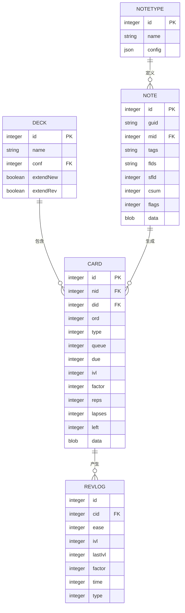

# 数据模型与数据库

<cite>
**本文档中引用的文件**  
- [collection.py](file://pylib/anki/collection.py)
- [notes.py](file://pylib/anki/notes.py)
- [cards.py](file://pylib/anki/cards.py)
- [decks.py](file://pylib/anki/decks.py)
- [db.py](file://pylib/anki/db.py)
- [models.py](file://pylib/anki/models.py)
- [revlog.py](file://rslib/src/revlog/mod.rs)
- [storage/note/mod.rs](file://rslib/src/storage/note/mod.rs)
- [storage/card/mod.rs](file://rslib/src/storage/card/mod.rs)
- [storage/deck/mod.rs](file://rslib/src/storage/deck/mod.rs)
- [storage/revlog/mod.rs](file://rslib/src/storage/revlog/mod.rs)
- [storage/sqlite.rs](file://rslib/src/storage/sqlite.rs)
- [collection_timestamps.rs](file://rslib/src/storage/collection_timestamps.rs)
</cite>

## 目录
1. [简介](#简介)
2. [核心数据结构](#核心数据结构)
3. [数据库模式设计](#数据库模式设计)
4. [实体关系图](#实体关系图)
5. [序列化机制](#序列化机制)
6. [数据验证与业务规则](#数据验证与业务规则)
7. [样本数据示例](#样本数据示例)
8. [初学者数据建模概念](#初学者数据建模概念)
9. [高级数据库优化技巧](#高级数据库优化技巧)
10. [结论](#结论)

## 简介
Anki 是一个基于间隔重复算法的记忆辅助工具，其数据模型设计旨在高效管理用户的学习内容。本文件全面介绍 Anki 的核心数据结构、数据库模式、序列化机制以及数据验证规则。文档面向两类读者：初学者将学习基本的数据建模概念，而经验丰富的开发者可获取高级数据库优化建议。所有术语均来自 Anki 代码库，确保技术准确性。

## 核心数据结构

Anki 的数据模型围绕五个核心实体构建：笔记（Note）、卡片（Card）、牌组（Deck）、复习记录（Review Log）和调度状态（Scheduling State）。这些实体共同支持 Anki 的学习调度系统。

- **笔记（Note）**：代表一条学习信息，包含多个字段（如“问题”和“答案”），并关联一个笔记类型（Note Type）。
- **卡片（Card）**：由笔记根据卡片模板生成的具体可复习项，每张卡片属于一个牌组。
- **牌组（Deck）**：用于组织卡片的容器，支持层级结构（如“语言::英语::词汇”）。
- **复习记录（Review Log）**：记录每次卡片复习的历史，包括时间戳、答案选择和间隔变化。
- **调度状态（Scheduling State）**：描述卡片在学习流程中的当前状态（新卡、学习中、已掌握等）。

这些结构通过主键（ID）进行关联，确保数据一致性与高效查询。

**本节来源**
- [notes.py](file://pylib/anki/notes.py#L1-L50)
- [cards.py](file://pylib/anki/cards.py#L1-L40)
- [decks.py](file://pylib/anki/decks.py#L1-L35)

## 数据库模式设计

Anki 使用 SQLite 作为其底层数据库，采用扁平化表结构以优化读写性能。主要数据表包括：

- `notes`：存储笔记数据，字段包括 `id`、`guid`、`mid`（笔记类型ID）、`tags`、`flds`（字段内容，以字符分隔）、`sfld`（用于排序的字段）、`csum`（内容校验和）、`flags` 和 `data`。
- `cards`：存储卡片数据，字段包括 `id`、`nid`（笔记ID）、`did`（牌组ID）、`ord`（模板序号）、`type`、`queue`、`due`、`ivl`（间隔）、`factor`、`reps`、`lapses`、`left`、`odue`、`odid`、`flags` 和 `data`。
- `revlog`：记录复习历史，字段包括 `id`（时间戳）、`cid`（卡片ID）、`ease`（难度选择）、`ivl`（复习后间隔）、`lastIvl`（前次间隔）、`factor`、`time`（耗时，毫秒）和 `type`。
- `col`：存储集合元数据，如创建时间、修改时间、配置等。
- `decks`：存储牌组信息，包括名称、配置ID（`conf`）、是否为学习牌组等。
- `models`：存储笔记类型定义，包括名称、字段结构、卡片模板等。

所有表均通过整数主键进行索引，关键字段（如 `nid`、`did`）建立索引以加速查询。

**本节来源**
- [db.py](file://pylib/anki/db.py#L100-L300)
- [storage/sqlite.rs](file://rslib/src/storage/sqlite.rs#L50-L200)
- [collection_timestamps.rs](file://rslib/src/storage/collection_timestamps.rs#L1-L20)

## 实体关系图

**图表来源**
- [storage/note/mod.rs](file://rslib/src/storage/note/mod.rs#L1-L30)
- [storage/card/mod.rs](file://rslib/src/storage/card/mod.rs#L1-L40)
- [storage/deck/mod.rs](file://rslib/src/storage/deck/mod.rs#L1-L25)
- [storage/revlog/mod.rs](file://rslib/src/storage/revlog/mod.rs#L1-L15)
- [models.py](file://pylib/anki/models.py#L20-L60)

## 序列化机制

Anki 使用 Protocol Buffers（protobuf）作为其主要序列化格式，定义在 `proto/` 目录下。核心消息类型包括：

- `Note`：对应数据库中的 `notes` 表，字段如 `note_id`、`guid`、`notetype_id`、`fields`（重复字符串）、`tags`（重复字符串）。
- `Card`：对应 `cards` 表，包含 `card_id`、`note_id`、`deck_id`、`template_idx`、`queue_state`、`due`、`interval`、`ease_factor` 等。
- `RevlogEntry`：对应 `revlog` 条目，包含 `review_time`、`card_id`、`button_chosen`、`taken_millis` 等。
- `Deck`：包含 `deck_id`、`name`、`config_id`、`is_dynamic` 等。

序列化由 Rust 后端处理，通过 `proto_gen` 模块生成的代码实现高效的二进制编码与解码。Python 前端通过 `_backend.py` 调用 Rust 接口，确保跨语言一致性。

**本节来源**
- [proto/anki/notes.proto](file://proto/anki/notes.proto#L1-L50)
- [proto/anki/cards.proto](file://proto/anki/cards.proto#L1-L45)
- [proto/anki/revlog.proto](file://proto/anki/revlog.proto#L1-L30)
- [pylib/anki/_backend.py](file://pylib/anki/_backend.py#L10-L50)

## 数据验证与业务规则

Anki 在多个层级实施数据验证：

1. **字段级验证**：在创建笔记时，检查字段数量是否与笔记类型匹配，内容是否为空（可配置）。
2. **笔记类型完整性**：确保笔记类型至少有一个字段和一个卡片模板。
3. **牌组层级约束**：牌组名称使用 `::` 分隔，系统验证路径合法性并防止循环引用。
4. **调度逻辑一致性**：卡片的 `due` 值根据 `queue` 状态解释（新卡为序号，学习卡为时间戳，复习卡为天数）。
5. **唯一性约束**：`notes` 表的 `guid` 字段确保跨设备同步时的唯一性。

业务规则由 Rust 后端服务（如 `notes::service.rs`、`decks::service.rs`）强制执行，确保操作的原子性与数据完整性。

**本节来源**
- [notes/service.rs](file://rslib/src/notes/service.rs#L50-L100)
- [decks/service.rs](file://rslib/src/decks/service.rs#L40-L90)
- [models.py](file://pylib/anki/models.py#L100-L150)

## 样本数据示例

以下为 `notes` 表中的一条记录示例：
- `id`: 1678901234567
- `guid`: "a1b2c3d4"
- `mid`: 1567890123
- `tags`: "vocabulary::advanced"
- `flds`: "ubiquitous\x1fsomething present everywhere\x1f"
- `sfld`: 0
- `csum`: 2147483647

对应的 `cards` 表记录：
- `id`: 1678901234568
- `nid`: 1678901234567
- `did`: 1456789012
- `ord`: 0
- `type`: 2 (复习卡)
- `queue`: 0
- `due`: 1678901234
- `ivl`: 30
- `factor`: 2500

`revlog` 记录：
- `id`: 1678901234569
- `cid`: 1678901234568
- `ease`: 3
- `ivl`: 30
- `lastIvl`: 15
- `factor`: 2500
- `time`: 45000
- `type`: 1 (复习)

**本节来源**
- [db.py](file://pylib/anki/db.py#L300-L350)
- [revlog/mod.rs](file://rslib/src/revlog/mod.rs#L20-L40)

## 初学者数据建模概念

对于初学者，理解 Anki 数据模型的关键在于掌握“一对多”关系：

- **一个笔记类型（Note Type）对应多个笔记（Notes）**：例如，“基础词汇”类型可创建“apple”、“banana”等多条笔记。
- **一个笔记（Note）生成多张卡片（Cards）**：若笔记类型有两个模板（正面→背面，背面→正面），则每条笔记生成两张卡片。
- **一个牌组（Deck）包含多张卡片（Cards）**：用户可将所有“动词”卡片放入“英语::动词”牌组。

这种设计实现了内容与表现的分离：笔记存储原始信息，卡片模板定义如何展示，牌组负责组织复习。复习记录则独立记录学习行为，不干扰原始内容。

**本节来源**
- [models.py](file://pylib/anki/models.py#L1-L20)
- [cards.py](file://pylib/anki/cards.py#L1-L20)

## 高级数据库优化技巧

针对高级用户，Anki 的数据库优化策略包括：

1. **批量操作**：使用事务（Transaction）批量插入/更新笔记或卡片，减少 I/O 开销。
2. **索引优化**：在 `cards` 表的 `did` 和 `queue` 字段上维护索引，加速牌组和队列查询。
3. **数据分片**：大型集合可通过 `col` 表的 `crt`（创建时间）字段进行时间分片备份。
4. **查询优化**：利用 `note_cards_order.sql` 等预定义 SQL 片段，避免复杂 JOIN。
5. **缓存策略**：前端缓存牌组树和笔记类型，减少数据库访问频率。
6. **校验和验证**：定期运行 `dbcheck` 模块验证 `csum` 字段，确保数据完整性。

Rust 后端通过 `storage::sqlite.rs` 提供了高效的数据库访问抽象，支持预编译语句和连接池。

**本节来源**
- [storage/sqlite.rs](file://rslib/src/storage/sqlite.rs#L200-L400)
- [dbcheck.rs](file://rslib/src/dbcheck.rs#L1-L50)
- [search/service.rs](file://rslib/src/search/service.rs#L30-L80)

## 结论

Anki 的数据模型是一个精心设计的系统，平衡了灵活性与性能。通过清晰的实体划分、基于 SQLite 的持久化存储和 Protocol Buffers 的序列化，Anki 能够高效管理从简单到复杂的学习内容。对于开发者而言，理解其数据结构和验证规则是进行扩展或集成的基础。未来的工作可进一步探索查询性能分析和大规模数据迁移策略。