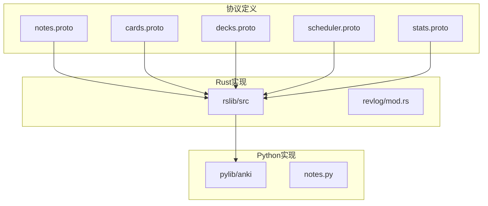
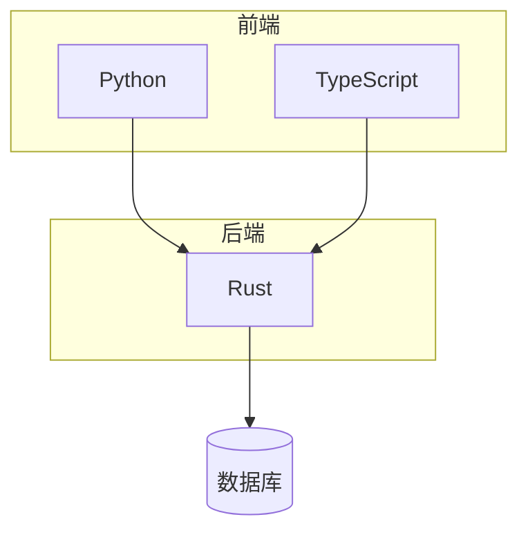
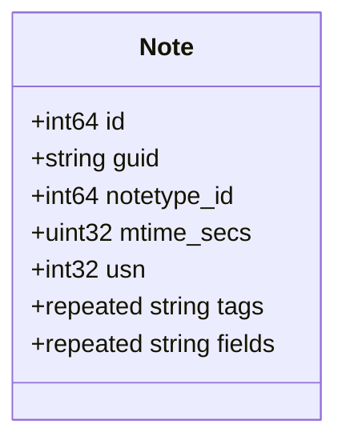
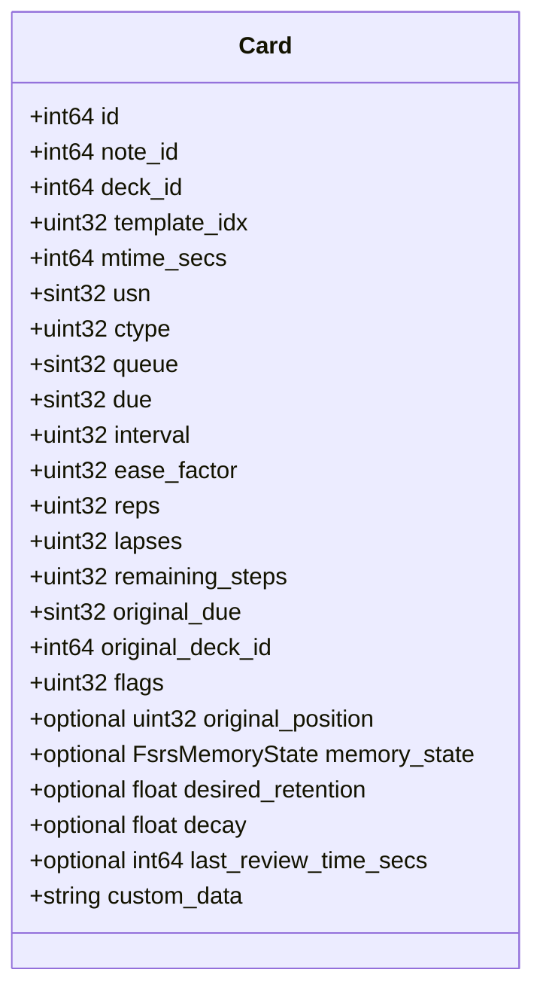
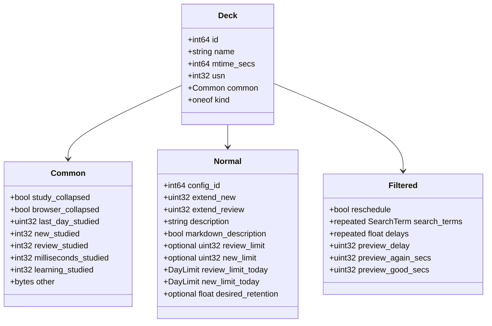
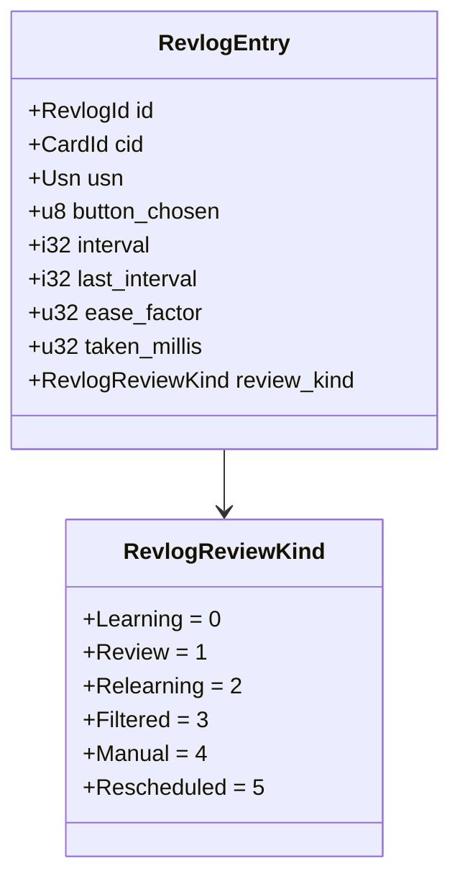
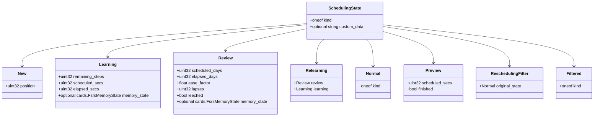

# 核心数据结构

<cite>
**本文档中引用的文件**  
- [notes.proto](file://proto/anki/notes.proto)
- [cards.proto](file://proto/anki/cards.proto)
- [decks.proto](file://proto/anki/decks.proto)
- [scheduler.proto](file://proto/anki/scheduler.proto)
- [stats.proto](file://proto/anki/stats.proto)
- [revlog.rs](file://rslib/src/revlog/mod.rs)
- [notes.py](file://pylib/anki/notes.py)
</cite>

## 目录
1. [简介](#简介)
2. [项目结构](#项目结构)
3. [核心组件](#核心组件)
4. [架构概述](#架构概述)
5. [详细组件分析](#详细组件分析)
6. [依赖分析](#依赖分析)
7. [性能考虑](#性能考虑)
8. [故障排除指南](#故障排除指南)
9. [结论](#结论)
10. [附录](#附录)（如有必要）

## 简介
本文档详细介绍了Anki的核心数据结构，包括笔记（Note）、卡片（Card）、牌组（Deck）、复习记录（ReviewLog）和调度状态（SchedulerState）。文档解释了每个字段的数据类型、业务含义和约束条件，并结合代码库中的实际定义，展示了Rust、Python和Protocol Buffers中的结构映射。通过实体关系图说明数据之间的关联方式（如一对多、多对一），为初学者提供对象建模的基本理解，为高级开发者提供性能优化建议。

## 项目结构
Anki的项目结构清晰地分为多个模块，包括Rust后端、Python前端、协议缓冲区定义和TypeScript界面。核心数据结构主要在`proto/anki`目录中定义，而实现逻辑分布在`rslib`和`pylib`中。



**图示来源**
- [notes.proto](file://proto/anki/notes.proto#L1-L122)
- [cards.proto](file://proto/anki/cards.proto#L1-L80)
- [decks.proto](file://proto/anki/decks.proto#L1-L225)
- [scheduler.proto](file://proto/anki/scheduler.proto#L1-L482)
- [stats.proto](file://proto/anki/stats.proto#L1-L242)
- [revlog.rs](file://rslib/src/revlog/mod.rs#L1-L172)
- [notes.py](file://pylib/anki/notes.py#L1-L207)

**本节来源**
- [notes.proto](file://proto/anki/notes.proto#L1-L122)
- [cards.proto](file://proto/anki/cards.proto#L1-L80)
- [decks.proto](file://proto/anki/decks.proto#L1-L225)
- [scheduler.proto](file://proto/anki/scheduler.proto#L1-L482)
- [stats.proto](file://proto/anki/stats.proto#L1-L242)
- [revlog.rs](file://rslib/src/revlog/mod.rs#L1-L172)
- [notes.py](file://pylib/anki/notes.py#L1-L207)

## 核心组件
Anki的核心组件包括笔记、卡片、牌组、复习记录和调度状态。这些组件通过协议缓冲区定义，并在Rust和Python中实现。

**本节来源**
- [notes.proto](file://proto/anki/notes.proto#L1-L122)
- [cards.proto](file://proto/anki/cards.proto#L1-L80)
- [decks.proto](file://proto/anki/decks.proto#L1-L225)
- [scheduler.proto](file://proto/anki/scheduler.proto#L1-L482)
- [stats.proto](file://proto/anki/stats.proto#L1-L242)
- [revlog.rs](file://rslib/src/revlog/mod.rs#L1-L172)
- [notes.py](file://pylib/anki/notes.py#L1-L207)

## 架构概述
Anki的架构分为前端和后端，前端使用Python和TypeScript实现，后端使用Rust实现。核心数据结构通过协议缓冲区定义，确保前后端的一致性。



**图示来源**
- [notes.proto](file://proto/anki/notes.proto#L1-L122)
- [cards.proto](file://proto/anki/cards.proto#L1-L80)
- [decks.proto](file://proto/anki/decks.proto#L1-L225)
- [scheduler.proto](file://proto/anki/scheduler.proto#L1-L482)
- [stats.proto](file://proto/anki/stats.proto#L1-L242)
- [revlog.rs](file://rslib/src/revlog/mod.rs#L1-L172)
- [notes.py](file://pylib/anki/notes.py#L1-L207)

## 详细组件分析
### 笔记（Note）分析
笔记是Anki中的基本单位，包含字段、标签和笔记类型ID。



**图示来源**
- [notes.proto](file://proto/anki/notes.proto#L1-L122)
- [notes.py](file://pylib/anki/notes.py#L1-L207)

**本节来源**
- [notes.proto](file://proto/anki/notes.proto#L1-L122)
- [notes.py](file://pylib/anki/notes.py#L1-L207)

### 卡片（Card）分析
卡片是笔记的实例，包含复习状态和调度信息。



**图示来源**
- [cards.proto](file://proto/anki/cards.proto#L1-L80)

**本节来源**
- [cards.proto](file://proto/anki/cards.proto#L1-L80)

### 牌组（Deck）分析
牌组是卡片的容器，包含学习和复习的统计信息。



**图示来源**
- [decks.proto](file://proto/anki/decks.proto#L1-L225)

**本节来源**
- [decks.proto](file://proto/anki/decks.proto#L1-L225)

### 复习记录（ReviewLog）分析
复习记录是卡片复习的历史记录，包含复习时间和评分。



**图示来源**
- [revlog.rs](file://rslib/src/revlog/mod.rs#L1-L172)

**本节来源**
- [revlog.rs](file://rslib/src/revlog/mod.rs#L1-L172)

### 调度状态（SchedulerState）分析
调度状态是卡片的当前复习状态，包含学习、复习和重新学习的状态。



**图示来源**
- [scheduler.proto](file://proto/anki/scheduler.proto#L1-L482)

**本节来源**
- [scheduler.proto](file://proto/anki/scheduler.proto#L1-L482)

## 依赖分析
Anki的核心组件之间存在复杂的依赖关系，通过实体关系图可以清晰地展示这些关系。

```mermaid
erDiagram
NOTE {
int64 id PK
string guid
int64 notetype_id FK
uint32 mtime_secs
int32 usn
repeated string tags
repeated string fields
}
CARD {
int64 id PK
int64 note_id FK
int64 deck_id FK
uint32 template_idx
int64 mtime_secs
sint32 usn
uint32 ctype
sint32 queue
sint32 due
uint32 interval
uint32 ease_factor
uint32 reps
uint32 lapses
uint32 remaining_steps
sint32 original_due
int64 original_deck_id
uint32 flags
optional uint32 original_position
optional FsrsMemoryState memory_state
optional float desired_retention
optional float decay
optional int64 last_review_time_secs
string custom_data
}
DECK {
int64 id PK
string name
int64 mtime_secs
int32 usn
Common common
oneof kind
}
REVLOG {
RevlogId id PK
CardId cid FK
Usn usn
u8 button_chosen
i32 interval
i32 last_interval
u32 ease_factor
u32 taken_millis
RevlogReviewKind review_kind
}
SCHEDULERSTATE {
oneof kind
optional string custom_data
}
NOTE ||--o{ CARD : "包含"
CARD ||--o{ REVLOG : "记录"
DECK ||--o{ CARD : "包含"
CARD }|--|| SCHEDULERSTATE : "具有"
```

**图示来源**
- [notes.proto](file://proto/anki/notes.proto#L1-L122)
- [cards.proto](file://proto/anki/cards.proto#L1-L80)
- [decks.proto](file://proto/anki/decks.proto#L1-L225)
- [scheduler.proto](file://proto/anki/scheduler.proto#L1-L482)
- [stats.proto](file://proto/anki/stats.proto#L1-L242)
- [revlog.rs](file://rslib/src/revlog/mod.rs#L1-L172)
- [notes.py](file://pylib/anki/notes.py#L1-L207)

**本节来源**
- [notes.proto](file://proto/anki/notes.proto#L1-L122)
- [cards.proto](file://proto/anki/cards.proto#L1