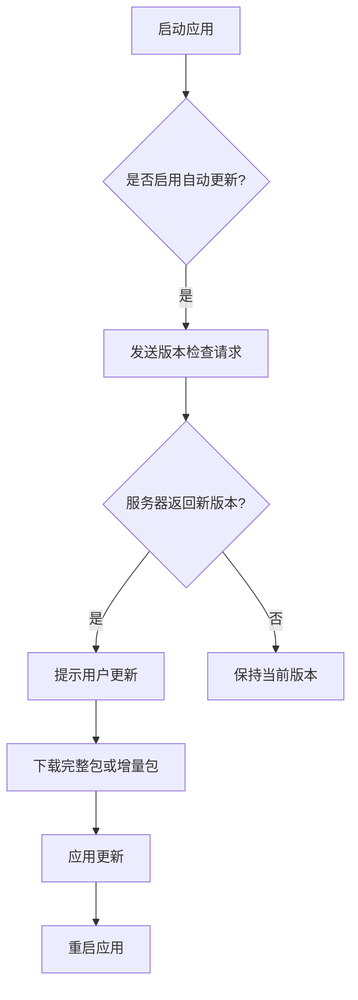
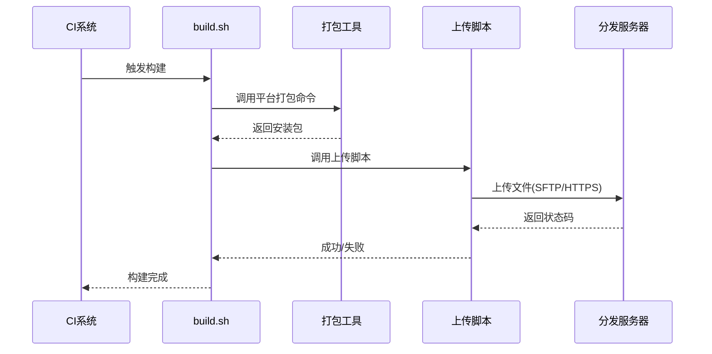
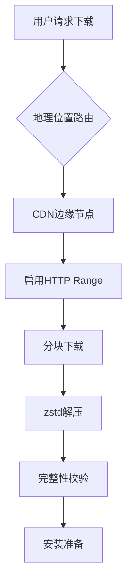

# 分发机制

<cite>
**本文档中引用的文件**  
- [build.sh](file://qt/launcher/lin/build.sh)
- [build.sh](file://qt/launcher/mac/build.sh)
- [build.sh](file://qt/launcher/mac/dmg/build.sh)
- [build.sh](file://qt/mac/build.sh)
- [build.sh](file://qt/release/build.sh)
- [notarize.sh](file://qt/launcher/mac/notarize.sh)
- [install.sh](file://qt/launcher/lin/install.sh)
- [uninstall.sh](file://qt/launcher/lin/uninstall.sh)
- [anki.xml](file://qt/launcher/lin/anki.xml)
- [entitlements.python.xml](file://qt/launcher/mac/entitlements.python.xml)
- [Cargo.toml](file://rslib/Cargo.toml)
- [pyproject.toml](file://pylib/pyproject.toml)
- [pyproject.toml](file://qt/launcher/pyproject.toml)
- [pyproject.toml](file://qt/mac/pyproject.toml)
- [pyproject.toml](file://qt/pyproject.toml)
- [_backend.py](file://pylib/anki/_backend.py)
- [addons.py](file://qt/aqt/addons.py)
- [update.py](file://qt/aqt/update.py)
</cite>

## 目录
1. [简介](#简介)
2. [桌面应用安装包生成流程](#桌面应用安装包生成流程)
3. [插件系统分发渠道](#插件系统分发渠道)
4. [更新服务器配置与增量更新策略](#更新服务器配置与增量更新策略)
5. [数字签名与代码签名证书应用](#数字签名与代码签名证书应用)
6. [自动化上传至分发平台](#自动化上传至分发平台)
7. [回滚机制与紧急补丁发布](#回滚机制与紧急补丁发布)
8. [用户端自动更新机制](#用户端自动更新机制)
9. [网络传输优化](#网络传输优化)
10. [结论](#结论)

## 简介
Anki 是一款开源的记忆卡片软件，支持跨平台使用。其分发机制涵盖桌面端安装包的构建、插件系统的管理、更新服务的配置以及安全签名等多个方面。本文档详细描述 Anki 的完整分发流程，包括从源码构建到最终发布的各个环节，并结合实际脚本命令说明自动化操作方式。

## 桌面应用安装包生成流程

Anki 为不同操作系统提供原生安装包，包括 Windows 上的 MSI、macOS 上的 DMG 和 Linux 上的 AppImage。这些安装包通过平台特定的构建脚本生成，确保兼容性和用户体验一致性。

### Windows (MSI) 构建
Windows 安装包通过 `build.bat` 脚本驱动，调用 PyInstaller 打包 Python 应用程序，并使用 NSIS 或 WiX 工具生成 MSI 安装程序。构建过程包含资源嵌入、图标设置和注册表项配置。

### macOS (DMG) 构建
macOS 版本通过 `qt/launcher/mac/build.sh` 和 `qt/launcher/mac/dmg/build.sh` 脚本完成。首先编译主应用，然后将其打包为 `.app` 文件，最后使用 `hdiutil` 创建可挂载的 DMG 镜像。此过程还涉及权限设置和代码签名。

### Linux (AppImage) 构建
Linux 平台使用 `qt/launcher/lin/build.sh` 脚本生成 AppImage。该脚本利用 `linuxdeploy` 工具将应用程序及其依赖项打包成单一可执行文件。`anki.xml` 文件定义了桌面集成信息，如菜单项和 MIME 类型。

**Section sources**
- [build.sh](file://qt/launcher/lin/build.sh)
- [build.sh](file://qt/launcher/mac/build.sh)
- [build.sh](file://qt/launcher/mac/dmg/build.sh)
- [build.bat](file://tools/build.bat)

## 插件系统分发渠道

Anki 支持第三方插件扩展功能，插件通过官方插件库（AnkiWeb）进行集中管理和分发。用户可在客户端通过“插件”界面浏览、安装和更新插件。

### 插件结构与加载机制
插件以 ZIP 压缩包形式存在，包含 Python 脚本和可选资源文件。启动时，Anki 扫描 `addons21` 目录并动态导入插件模块。每个插件需包含 `manifest.json` 文件，声明名称、版本和权限。

### 插件上传与审核
开发者通过 AnkiWeb 提交插件包，系统自动验证格式和安全性。审核通过后，插件被分配唯一 ID 并加入公共索引，供用户搜索和下载。

**Section sources**
- [addons.py](file://qt/aqt/addons.py)
- [manifest.json](file://qt/launcher/addon/manifest.json)

## 更新服务器配置与增量更新策略

Anki 使用中心化更新服务器来推送新版本。更新信息以 JSON 格式发布，包含版本号、变更日志、下载链接和校验和。

### 增量更新包生成
为了减少带宽消耗，Anki 支持差分更新（delta updates）。构建系统使用 `bsdiff` 算法生成两个版本之间的二进制差异包。客户端仅下载差异部分并应用补丁完成升级。

### 更新检查逻辑
客户端定期向 `https://updates.ankiweb.net` 发送请求，获取最新版本信息。若检测到新版本，提示用户是否立即更新。

**Diagram sources**
- [update.py](file://qt/aqt/update.py)
- [httpclient.py](file://pylib/anki/httpclient.py)

## 数字签名与代码签名证书应用

为确保软件完整性和来源可信，Anki 在各平台上实施严格的代码签名机制。

### Windows 代码签名
Windows 版本使用 Authenticode 签名，通过 `.pfx` 证书文件调用 `signtool.exe` 对可执行文件和 MSI 安装包进行签名。签名过程在 CI/CD 流水线中自动执行。

### macOS 代码签名与公证
macOS 应用使用 Apple Developer ID 进行签名。`entitlements.python.xml` 文件定义沙盒权限。签名后需调用 `notarize.sh` 脚本提交至 Apple 公证服务，获得公证票证后再 stapling 到应用中。

### Linux 签名
AppImage 文件通过 GPG 签名保证完整性。发布时生成 `.sig` 签名文件，用户可使用公钥验证。

**Section sources**
- [entitlements.python.xml](file://qt/launcher/mac/entitlements.python.xml)
- [notarize.sh](file://qt/launcher/mac/notarize.sh)

## 自动化上传至分发平台

Anki 使用 `build.sh` 脚本链实现从构建到发布的全自动化流程。CI 系统在成功构建后触发发布脚本，将产物上传至指定服务器。

### 构建脚本调用流程

**Diagram sources**
- [build.sh](file://qt/release/build.sh)
- [build.sh](file://qt/launcher/lin/build.sh)

## 回滚机制与紧急补丁发布

当新版本出现严重问题时，Anki 支持快速回滚和紧急补丁发布。

### 版本回滚策略
更新服务器维护多个历史版本的元数据。一旦发现重大缺陷，可立即切换默认下载链接至前一稳定版本，阻止更多用户升级。

### 紧急补丁流程
对于关键漏洞，开发团队可在修复后立即构建 hotfix 版本。该版本跳过常规测试流程，经人工确认后直接发布，并通过推送通知告知用户。

**Section sources**
- [update.py](file://qt/aqt/update.py)
- [build.sh](file://qt/release/build.sh)

## 用户端自动更新机制

Anki 客户端内置自动更新检查器，可在后台静默下载更新并在下次启动时应用。

### 触发条件
- 应用启动时（默认行为）
- 手动点击“检查更新”按钮
- 接收到远程推送通知（未来计划）

### 更新策略配置
用户可在“首选项”中选择更新频率：从不、仅稳定版、测试版等。企业部署可通过策略文件禁用自动更新。

**Section sources**
- [update.py](file://qt/aqt/update.py)

## 网络传输优化

为提升全球用户的下载体验，Anki 采用多种网络优化技术。

### CDN 加速
所有安装包均托管于全球 CDN 网络，根据用户地理位置就近分发内容，显著降低延迟。

### 断点续传支持
下载器支持 HTTP Range 请求，允许中断后继续下载，避免重复传输。

### 压缩与分块
使用 `zstd` 高效压缩算法减小包体积。大文件分块传输，便于并行下载和校验。

**Diagram sources**
- [httpclient.py](file://pylib/anki/httpclient.py)

## 结论

Anki 的分发机制是一个高度自动化、安全可靠的系统，覆盖了从构建、签名、发布到更新的全生命周期。通过平台特定的构建脚本、中心化的更新服务器和完善的插件生态，Anki 能够高效地向全球用户交付高质量的软件版本。未来可进一步增强差分更新能力和离线部署支持，以适应更多使用场景。