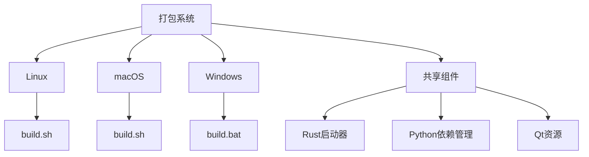
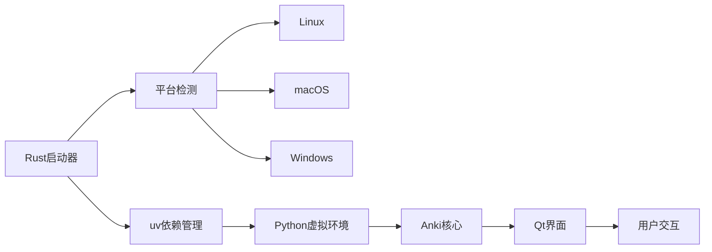
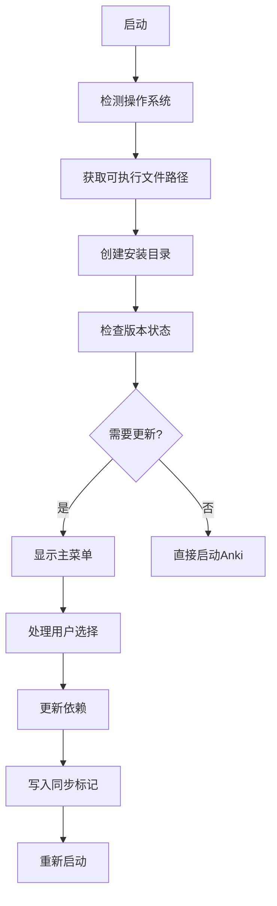
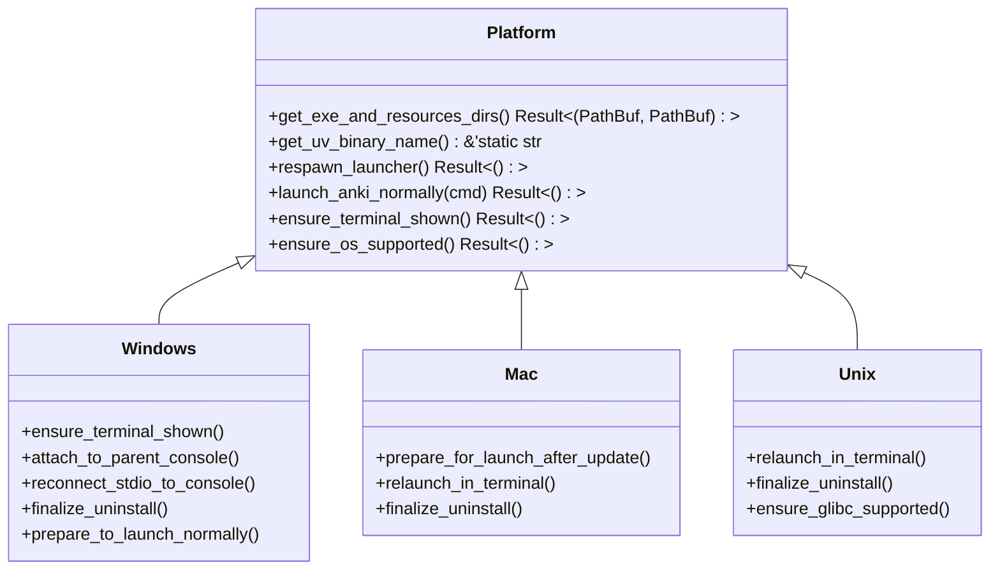
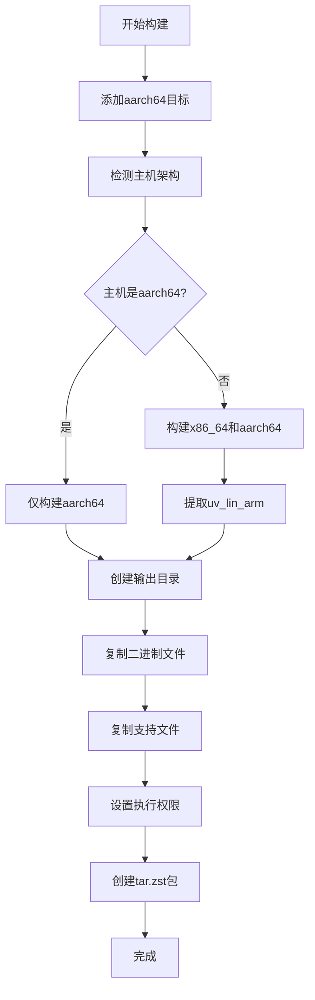
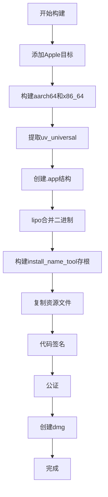
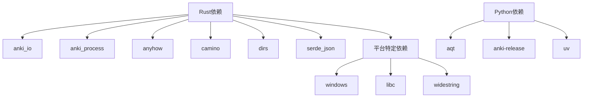

# 打包流程

<cite>
**本文档中引用的文件**
- [build.sh](file://qt/launcher/lin/build.sh)
- [build.sh](file://qt/launcher/mac/build.sh)
- [build.bat](file://qt/launcher/win/build.bat)
- [build.sh](file://qt/release/build.sh)
- [main.rs](file://qt/launcher/src/main.rs)
- [platform/mod.rs](file://qt/launcher/src/platform/mod.rs)
- [Cargo.toml](file://qt/launcher/Cargo.toml)
- [pyproject.toml](file://qt/launcher/pyproject.toml)
- [versions.py](file://qt/launcher/versions.py)
- [build.rs](file://qt/launcher/build.rs)
</cite>

## 目录
1. [简介](#简介)
2. [项目结构](#项目结构)
3. [核心组件](#核心组件)
4. [架构概述](#架构概述)
5. [详细组件分析](#详细组件分析)
6. [依赖分析](#依赖分析)
7. [性能考虑](#性能考虑)
8. [故障排除指南](#故障排除指南)
9. [结论](#结论)

## 简介
Anki的打包流程是一个复杂的跨平台构建系统，结合了Rust、Python和Qt技术栈。该系统旨在为Windows、macOS和Linux平台生成独立的可执行文件，同时处理各种依赖关系和平台特定的要求。打包系统利用Rust构建高性能的启动器，并通过uv工具管理Python依赖，实现了高效的版本控制和更新机制。

## 项目结构
Anki的打包流程主要集中在`qt/launcher`目录下，包含针对不同操作系统的构建脚本和平台特定的代码。系统采用分层架构，将Rust编写的启动器与Python实现的核心功能分离，同时通过Qt提供图形用户界面。

**图示来源**
- [qt/launcher/lin/build.sh](file://qt/launcher/lin/build.sh)
- [qt/launcher/mac/build.sh](file://qt/launcher/mac/build.sh)
- [qt/launcher/win/build.bat](file://qt/launcher/win/build.bat)

**本节来源**
- [qt/launcher](file://qt/launcher)

## 核心组件
打包系统的核心组件包括Rust启动器、uv依赖管理器和平台特定的构建脚本。Rust启动器负责初始化环境、管理Python虚拟环境并启动Anki主程序。uv工具用于同步Python依赖，支持从PyPI安装特定版本的Anki组件。

**本节来源**
- [main.rs](file://qt/launcher/src/main.rs)
- [pyproject.toml](file://qt/launcher/pyproject.toml)

## 架构概述
Anki的打包架构采用混合技术栈，结合了Rust的系统级性能优势和Python的开发效率。Rust启动器作为入口点，负责处理平台特定的初始化任务，然后委托给Python实现的核心功能。

**图示来源**
- [main.rs](file://qt/launcher/src/main.rs)
- [platform/mod.rs](file://qt/launcher/src/platform/mod.rs)

## 详细组件分析

### Rust启动器分析
Rust启动器是Anki打包系统的核心，负责跨平台的初始化和环境管理。

#### 启动器主逻辑

**图示来源**
- [main.rs](file://qt/launcher/src/main.rs#L1-L200)

#### 平台特定实现

**图示来源**
- [platform/mod.rs](file://qt/launcher/src/platform/mod.rs)
- [platform/windows.rs](file://qt/launcher/src/platform/windows.rs)
- [platform/mac.rs](file://qt/launcher/src/platform/mac.rs)
- [platform/unix.rs](file://qt/launcher/src/platform/unix.rs)

**本节来源**
- [main.rs](file://qt/launcher/src/main.rs)
- [platform/mod.rs](file://qt/launcher/src/platform/mod.rs)

### 构建脚本分析
构建脚本负责编译Rust代码、打包资源文件并生成最终的可分发包。

#### Linux构建流程

**图示来源**
- [qt/launcher/lin/build.sh](file://qt/launcher/lin/build.sh)

#### macOS构建流程

**图示来源**
- [qt/launcher/mac/build.sh](file://qt/launcher/mac/build.sh)

**本节来源**
- [qt/launcher/lin/build.sh](file://qt/launcher/lin/build.sh)
- [qt/launcher/mac/build.sh](file://qt/launcher/mac/build.sh)
- [qt/launcher/win/build.bat](file://qt/launcher/win/build.bat)

## 依赖分析
Anki的依赖管理系统采用分层策略，结合了Rust和Python的依赖管理工具。

**图示来源**
- [Cargo.toml](file://qt/launcher/Cargo.toml)
- [pyproject.toml](file://qt/launcher/pyproject.toml)

**本节来源**
- [Cargo.toml](file://qt/launcher/Cargo.toml)
- [pyproject.toml](file://qt/launcher/pyproject.toml)

## 性能考虑
打包系统在设计时考虑了多个性能因素，包括启动时间、磁盘使用和网络效率。通过使用uv工具的缓存机制和增量更新策略，系统能够快速响应版本更新请求。Rust启动器的静态链接减少了运行时依赖，提高了启动速度。

## 故障排除指南
常见的构建问题包括依赖版本冲突、平台特定错误和签名问题。对于Linux系统，glibc版本过低可能导致兼容性问题。macOS构建需要有效的开发者证书进行代码签名和公证。Windows构建可能遇到控制台重定向问题，需要正确处理ANSI控制台。

**本节来源**
- [platform/windows.rs](file://qt/launcher/src/platform/windows.rs)
- [platform/mac.rs](file://qt/launcher/src/platform/mac.rs)
- [platform/unix.rs](file://qt/launcher/src/platform/unix.rs)

## 结论
Anki的打包流程展示了现代跨平台应用程序开发的复杂性。通过结合Rust、Python和Qt技术，系统实现了高性能、可维护和用户友好的部署体验。未来的发展方向可能包括进一步优化启动时间、增强安全性措施和简化构建过程。