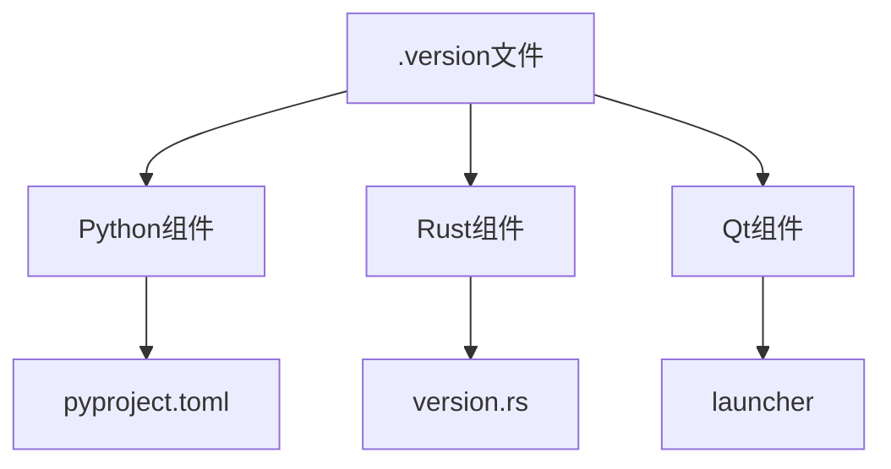
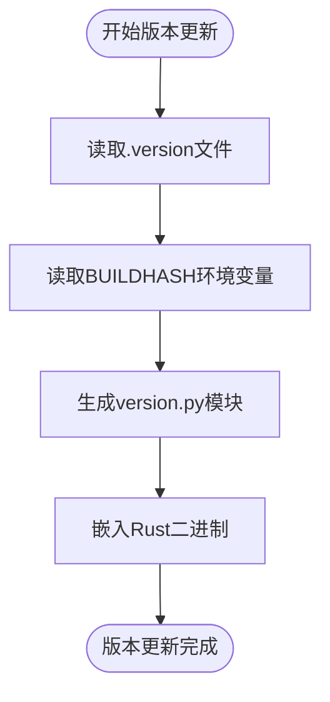
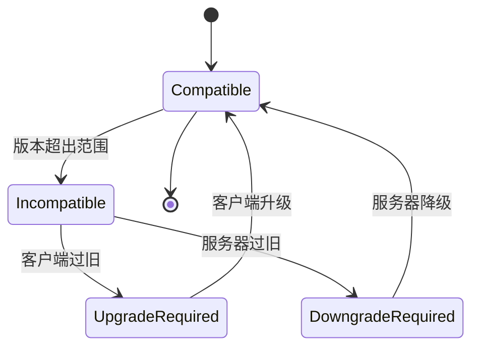

# 版本管理

<cite>
**本文档中引用的文件**  
- [version.py](file://python/version.py)
- [version.rs](file://rslib/src/version.rs)
- [pyproject.toml](file://pylib/pyproject.toml)
- [sync/version.rs](file://rslib/src/sync/version.rs)
- [genbuildinfo.py](file://pylib/tools/genbuildinfo.py)
</cite>

## 目录
1. [语义化版本控制规则](#语义化版本控制规则)
2. [跨语言版本同步机制](#跨语言版本同步机制)
3. [版本标签与分支管理](#版本标签与分支管理)
4. [自动化版本更新脚本](#自动化版本更新脚本)
5. [版本兼容性与降级策略](#版本兼容性与降级策略)

## 语义化版本控制规则

Anki项目采用语义化版本控制（SemVer）规范，版本号格式为MAJOR.MINOR.PATCH。主版本号（MAJOR）在进行不兼容的API修改时递增，次版本号（MINOR）在以向后兼容的方式添加功能时递增，补丁版本号（PATCH）在进行向后兼容的问题修复时递增。版本控制系统通过根目录下的.version文件统一管理版本号，该文件包含当前发布的版本字符串。

**Section sources**
- [version.py](file://python/version.py#L1-L10)
- [version.rs](file://rslib/src/version.rs#L1-L37)

## 跨语言版本同步机制

Anki的Python、Rust和Qt组件通过集中式版本管理实现版本同步。Python组件通过`hatch`构建系统从`python/version.py`文件读取版本信息，该文件从项目根目录的.version文件中获取版本号。Rust组件通过`include_str!`宏直接包含.version文件内容，确保编译时版本信息的一致性。Qt组件通过构建脚本继承Python包的版本配置，形成统一的版本视图。

**Diagram sources**
- [version.py](file://python/version.py#L1-L10)
- [version.rs](file://rslib/src/version.rs#L1-L37)
- [pyproject.toml](file://pylib/pyproject.toml#L1-L30)

**Section sources**
- [pyproject.toml](file://pylib/pyproject.toml#L1-L30)
- [version.rs](file://rslib/src/version.rs#L1-L37)

## 版本标签与分支管理

版本标签的创建遵循严格的发布流程，通过Git标签标记发布版本。主要分支包括main分支用于日常开发，release分支用于版本稳定，hotfix分支用于紧急修复。版本标签格式为vMAJOR.MINOR.PATCH，与.version文件中的版本号保持一致。发布前需要通过CI/CD流水线验证所有组件的版本一致性。

**Section sources**
- [version.py](file://python/version.py#L1-L10)
- [version.rs](file://rslib/src/version.rs#L1-L37)

## 自动化版本更新脚本

版本更新通过`genbuildinfo.py`脚本自动化实现，该脚本读取.version文件和BUILDHASH环境变量，生成包含版本号和构建哈希的Python模块。构建系统在打包时自动执行此脚本，确保分发包包含准确的版本信息。Rust组件通过构建脚本（build.rs）在编译时嵌入版本信息，Python组件通过hatch插件动态读取版本文件。

**Diagram sources**
- [genbuildinfo.py](file://pylib/tools/genbuildinfo.py#L1-L18)
- [version.rs](file://rslib/src/version.rs#L1-L37)

**Section sources**
- [genbuildinfo.py](file://pylib/tools/genbuildinfo.py#L1-L18)
- [pyproject.toml](file://pylib/pyproject.toml#L1-L30)

## 版本兼容性与降级策略

Anki通过同步协议版本（SYNC_VERSION）管理客户端与服务器的兼容性。Rust后端定义了从SYNC_VERSION_08_SESSIONKEY到SYNC_VERSION_11_DIRECT_POST的协议版本范围，客户端必须在此范围内才能建立连接。当客户端版本过旧时，服务器会返回相应的错误信息提示升级。系统支持版本降级，但需要确保数据库模式兼容性，通过SchemaVersion机制验证数据结构的兼容性。

**Diagram sources**
- [sync/version.rs](file://rslib/src/sync/version.rs#L1-L79)
- [version.rs](file://rslib/src/version.rs#L1-L37)

**Section sources**
- [sync/version.rs](file://rslib/src/sync/version.rs#L1-L79)
- [version.rs](file://rslib/src/version.rs#L1-L37)