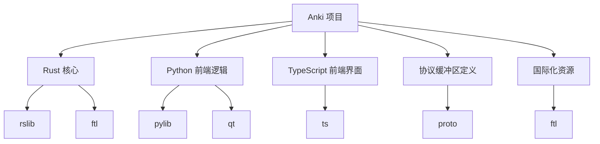
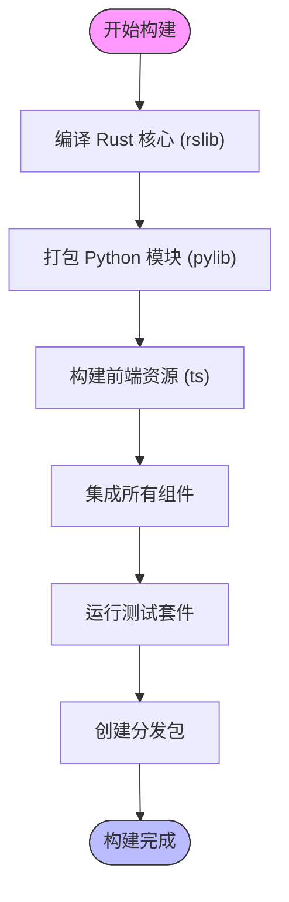
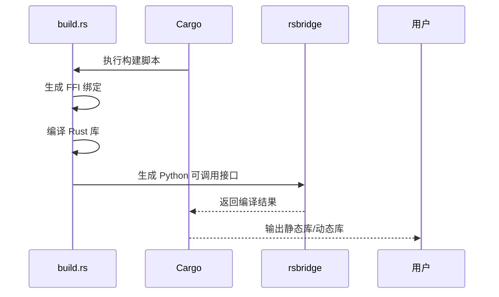
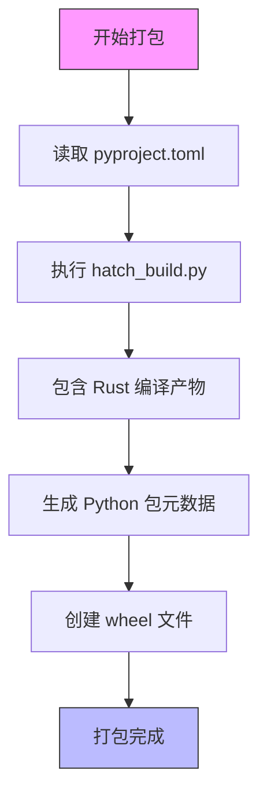
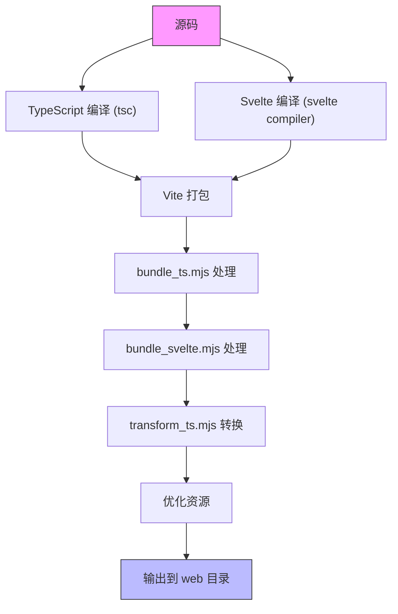
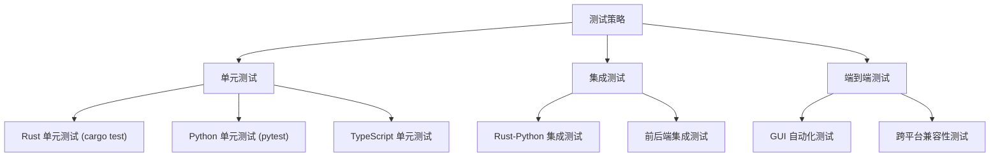
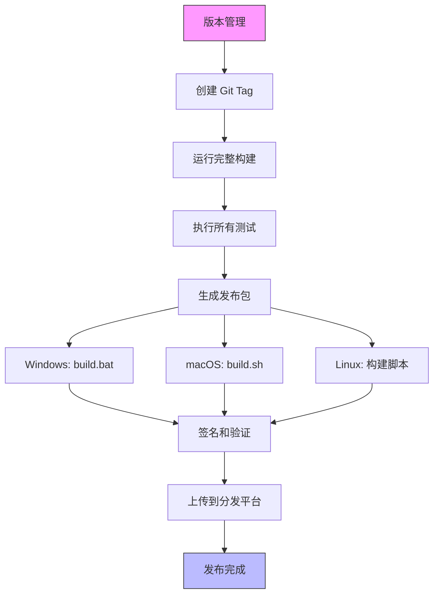
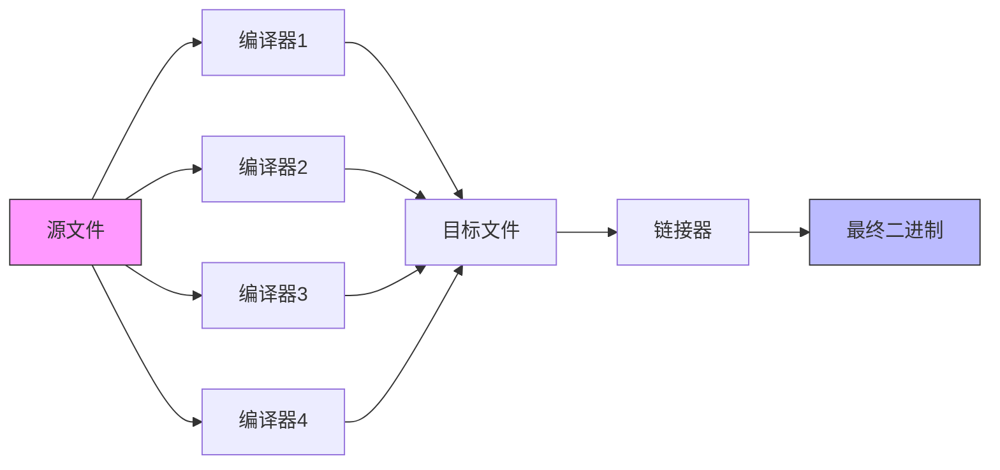

# 构建与部署

<cite>
**本文档中引用的文件**  
- [Cargo.toml](file://Cargo.toml)
- [pyproject.toml](file://pyproject.toml)
- [package.json](file://package.json)
- [build.rs](file://rslib/build.rs)
- [hatch_build.py](file://pylib/hatch_build.py)
- [run.py](file://tools/run.py)
- [vite.config.ts](file://ts/vite.config.ts)
- [bundle_ts.mjs](file://ts/bundle_ts.mjs)
- [bundle_svelte.mjs](file://ts/bundle_svelte.mjs)
- [transform_ts.mjs](file://ts/transform_ts.mjs)
- [bench.sh](file://rslib/bench.sh)
- [build.bat](file://tools/build.bat)
- [ninja.bat](file://tools/ninja.bat)
- [runanki.py](file://qt/runanki.py)
- [rsbridge/Cargo.toml](file://pylib/rsbridge/Cargo.toml)
- [launcher/Cargo.toml](file://qt/launcher/Cargo.toml)
</cite>

## 目录
1. [简介](#简介)
2. [项目结构](#项目结构)
3. [核心构建流程](#核心构建流程)
4. [Rust核心编译](#rust核心编译)
5. [Python包打包](#python包打包)
6. [前端资源构建](#前端资源构建)
7. [测试策略](#测试策略)
8. [发布流程](#发布流程)
9. [构建环境设置指南](#构建环境设置指南)
10. [高级构建优化技巧](#高级构建优化技巧)
11. [结论](#结论)

## 简介
Anki 是一个跨平台的记忆卡片应用，其构建系统融合了 Rust、Python 和现代前端技术栈。本文件详细说明 Anki 的构建与部署流程，涵盖从源码编译到最终发布的完整生命周期。文档面向不同层次的开发者，既为初学者提供环境搭建指导，也为高级用户提供性能优化建议。

## 项目结构
Anki 项目采用多语言混合架构，主要分为以下几个核心模块：



**Diagram sources**
- [Cargo.toml](file://Cargo.toml)
- [pyproject.toml](file://pyproject.toml)
- [package.json](file://package.json)

**Section sources**
- [Cargo.toml](file://Cargo.toml)
- [pyproject.toml](file://pyproject.toml)
- [package.json](file://package.json)

## 核心构建流程
Anki 的构建流程是一个多阶段的协同过程，涉及三种主要技术栈的集成。



**Diagram sources**
- [rslib/build.rs](file://rslib/build.rs)
- [pylib/hatch_build.py](file://pylib/hatch_build.py)
- [ts/vite.config.ts](file://ts/vite.config.ts)

**Section sources**
- [rslib/build.rs](file://rslib/build.rs)
- [pylib/hatch_build.py](file://pylib/hatch_build.py)
- [ts/vite.config.ts](file://ts/vite.config.ts)

## Rust核心编译
Rust 核心是 Anki 的性能关键部分，位于 `rslib` 目录中，使用 Cargo 进行管理。

### 编译机制
Rust 核心通过 `build.rs` 构建脚本进行编译，该脚本负责生成必要的绑定和配置。



**Diagram sources**
- [rslib/build.rs](file://rslib/build.rs)
- [pylib/rsbridge/build.rs](file://pylib/rsbridge/build.rs)
- [rslib/Cargo.toml](file://rslib/Cargo.toml)

**Section sources**
- [rslib/build.rs](file://rslib/build.rs)
- [rslib/Cargo.toml](file://rslib/Cargo.toml)

## Python包打包
Python 层负责应用程序的主要逻辑和 Qt 界面集成，使用 Hatch 进行打包。

### 打包流程
Python 模块的打包由 `hatch_build.py` 脚本控制，确保正确包含 Rust 编译产物。



**Diagram sources**
- [pylib/hatch_build.py](file://pylib/hatch_build.py)
- [pylib/pyproject.toml](file://pylib/pyproject.toml)
- [qt/hatch_build.py](file://qt/hatch_build.py)

**Section sources**
- [pylib/hatch_build.py](file://pylib/hatch_build.py)
- [pylib/pyproject.toml](file://pylib/pyproject.toml)

## 前端资源构建
前端界面使用现代 JavaScript 工具链构建，主要涉及 TypeScript 和 Svelte 组件。

### 构建管道
前端资源通过 Vite 和自定义脚本进行构建和打包。



**Diagram sources**
- [ts/vite.config.ts](file://ts/vite.config.ts)
- [ts/bundle_ts.mjs](file://ts/bundle_ts.mjs)
- [ts/bundle_svelte.mjs](file://ts/bundle_svelte.mjs)
- [ts/transform_ts.mjs](file://ts/transform_ts.mjs)

**Section sources**
- [ts/vite.config.ts](file://ts/vite.config.ts)
- [ts/bundle_ts.mjs](file://ts/bundle_ts.mjs)

## 测试策略
Anki 采用多层次的测试策略，确保代码质量和功能稳定性。

### 测试层次


**Diagram sources**
- [rslib/Cargo.toml](file://rslib/Cargo.toml)
- [pylib/tests](file://pylib/tests)
- [qt/tests](file://qt/tests)

**Section sources**
- [rslib/Cargo.toml](file://rslib/Cargo.toml)
- [pylib/tests](file://pylib/tests)

## 发布流程
Anki 的发布流程涉及版本管理、打包和分发机制。

### 发布步骤


**Diagram sources**
- [tools/build.bat](file://tools/build.bat)
- [qt/launcher/win/build.bat](file://qt/launcher/win/build.bat)
- [qt/mac/build.sh](file://qt/mac/build.sh)

**Section sources**
- [tools/build.bat](file://tools/build.bat)
- [qt/launcher/win/build.bat](file://qt/launcher/win/build.bat)

## 构建环境设置指南
为初学者提供的构建环境设置步骤。

### 基础环境要求
- Rust 工具链 (通过 rust-toolchain.toml 管理)
- Python 3.8+
- Node.js 16+
- Yarn 包管理器
- Qt 开发库

### 设置步骤
1. 克隆仓库
2. 安装 Rust 工具链
3. 安装 Python 依赖
4. 安装 Node.js 依赖
5. 配置环境变量

```bash
# 示例：设置构建环境
git clone https://github.com/ankitects/anki.git
cd anki
rustup override set stable
pip install -r requirements.txt
yarn install
```

**Section sources**
- [rust-toolchain.toml](file://rust-toolchain.toml)
- [package.json](file://package.json)
- [pyproject.toml](file://pyproject.toml)

## 高级构建优化技巧
为经验丰富的开发者提供的构建优化建议。

### 并行构建
利用 Ninja 构建系统实现并行编译：



### 缓存策略
- 使用 sccache 加速 Rust 编译
- 启用 pip 缓存
- 配置 yarn 缓存
- 利用构建脚本的增量编译功能

**Section sources**
- [tools/ninja.bat](file://tools/ninja.bat)
- [rslib/bench.sh](file://rslib/bench.sh)
- [tools/run.py](file://tools/run.py)

## 结论
Anki 的构建与部署系统是一个复杂的多语言集成