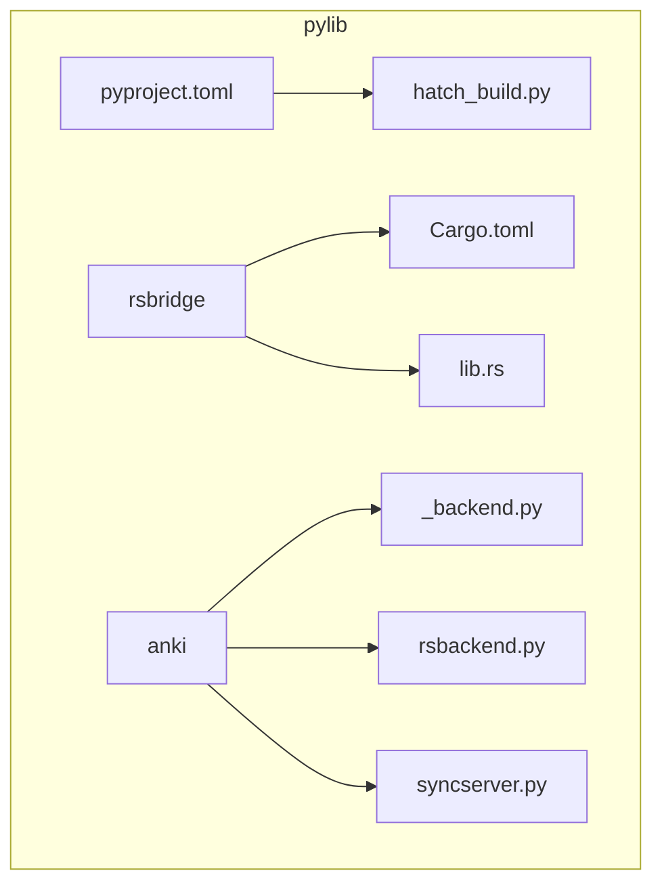
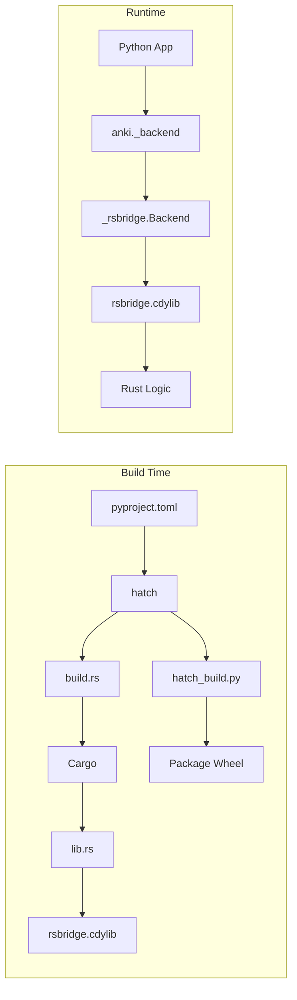
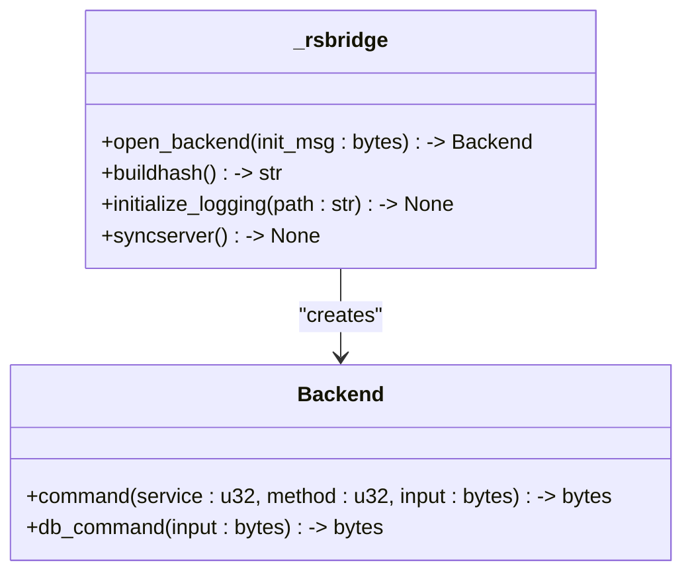
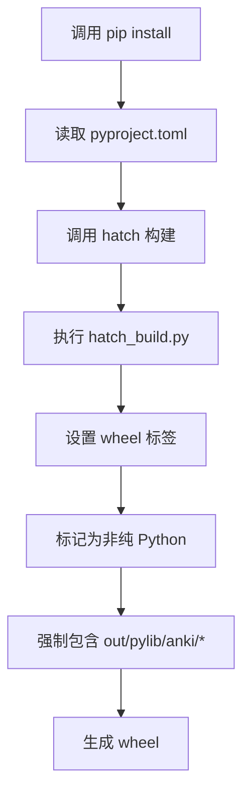
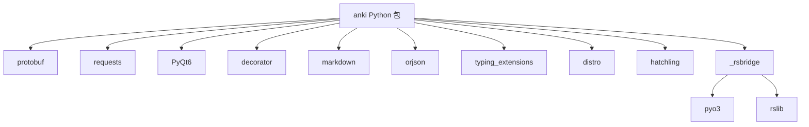

# Python构建流程

<cite>
**本文档中引用的文件**  
- [pyproject.toml](file://pylib/pyproject.toml)
- [Cargo.toml](file://pylib/rsbridge/Cargo.toml)
- [lib.rs](file://pylib/rsbridge/lib.rs)
- [hatch_build.py](file://pylib/hatch_build.py)
- [_backend.py](file://pylib/anki/_backend.py)
- [rsbackend.py](file://pylib/anki/rsbackend.py)
- [syncserver.py](file://pylib/anki/syncserver.py)
- [errors.py](file://pylib/anki/errors.py)
</cite>

## 目录
1. [简介](#简介)
2. [项目结构](#项目结构)
3. [核心组件](#核心组件)
4. [架构概述](#架构概述)
5. [详细组件分析](#详细组件分析)
6. [依赖分析](#依赖分析)
7. [性能考虑](#性能考虑)
8. [故障排除指南](#故障排除指南)
9. [结论](#结论)

## 简介
Anki 是一个采用 Rust 和 Python 混合架构的现代化应用程序。其核心逻辑由 Rust 实现，通过 PyO3 绑定暴露给 Python 层。本项目采用 hatch 构建系统，结合自定义构建钩子，实现 Rust 扩展与 Python 模块的无缝集成。Python 层作为主要接口，负责与 PyQt6 等 GUI 框架交互，并通过 rsbridge 模块调用底层的 Rust 功能。这种设计兼顾了性能与开发效率，同时利用 protobuf 实现高效的数据序列化。

## 项目结构
Anki 的 Python 构建体系围绕 `pylib` 目录构建，该目录包含 Python 模块、Rust 绑定和构建配置。`rsbridge` 子目录是 Rust 到 Python 的桥梁，而 `hatch_build.py` 则是自定义构建逻辑的核心。

**图源**  
- [pyproject.toml](file://pylib/pyproject.toml)
- [hatch_build.py](file://pylib/hatch_build.py)
- [Cargo.toml](file://pylib/rsbridge/Cargo.toml)

**本节来源**  
- [pyproject.toml](file://pylib/pyproject.toml)
- [hatch_build.py](file://pylib/hatch_build.py)

## 核心组件
Anki 的 Python 构建流程由几个关键组件驱动：`pyproject.toml` 定义了项目元数据和依赖，`hatch_build.py` 处理扩展模块的打包，`rsbridge` 实现了 Rust 代码的 Python 绑定。这些组件协同工作，将 Rust 编译的动态库嵌入到最终的 Python wheel 包中，使得 `import anki` 可以无缝调用高性能的 Rust 后端。

**本节来源**  
- [pyproject.toml](file://pylib/pyproject.toml)
- [hatch_build.py](file://pylib/hatch_build.py)
- [lib.rs](file://pylib/rsbridge/lib.rs)

## 架构概述
Anki 的构建架构是一个典型的 Python-Rust 互操作系统。Python 作为“胶水语言”和主要接口，通过 PyO3 生成的 `_rsbridge` 模块调用 Rust 实现的 `Backend`。数据通过 protobuf 序列化在语言边界间传递。构建系统（hatch）负责协调 Rust 的编译和 Python 包的组装。

**图源**  
- [pyproject.toml](file://pylib/pyproject.toml)
- [hatch_build.py](file://pylib/hatch_build.py)
- [lib.rs](file://pylib/rsbridge/lib.rs)

## 详细组件分析

### PyO3 在 rsbridge 中的应用
PyO3 被用于将 Rust 的后端功能暴露给 Python。`rsbridge` crate 定义了一个 `Backend` 结构体，并使用 `#[pyclass]` 和 `#[pymethods]` 宏将其暴露为 Python 类。关键的 `command` 和 `db_command` 方法允许 Python 通过字节流与 Rust 服务进行通信。

**图源**  
- [lib.rs](file://pylib/rsbridge/lib.rs)

**本节来源**  
- [lib.rs](file://pylib/rsbridge/lib.rs)
- [_backend.py](file://pylib/anki/_backend.py)

### hatch 构建系统配置
`pyproject.toml` 配置了 hatch 作为构建后端。它指定了 `hatch_build.py` 作为自定义构建钩子，该钩子负责将预编译的 `rsbridge` 扩展包含到 wheel 包中。`force_include` 机制确保了二进制文件被正确打包。

**图源**  
- [pyproject.toml](file://pylib/pyproject.toml)
- [hatch_build.py](file://pylib/hatch_build.py)

**本节来源**  
- [pyproject.toml](file://pylib/pyproject.toml)
- [hatch_build.py](file://pylib/hatch_build.py)

### Python 依赖管理
`pyproject.toml` 中的 `dependencies` 字段列出了所有 Python 依赖。关键依赖包括 `PyQt6`（用于 GUI）、`protobuf`（用于序列化，版本限制在 6.0 到 8.0 之间）和 `requests`（用于网络）。平台特定的依赖（如 `distro`）通过环境标记进行条件安装。

**本节来源**  
- [pyproject.toml](file://pylib/pyproject.toml)

### Python 包本地开发安装
对于本地开发，推荐使用可编辑安装。首先确保 Rust 工具链和 Python 环境已配置，然后运行 `pip install -e pylib`。这将安装 Python 包并链接到本地的 `rsbridge` 扩展，允许在修改 Rust 代码后通过重新编译 `rsbridge` 来立即测试更改。

**本节来源**  
- [pyproject.toml](file://pylib/pyproject.toml)
- [hatch_build.py](file://pylib/hatch_build.py)

## 依赖分析
Anki 的 Python 层依赖于多个关键组件。`rsbridge` 依赖于主 `anki` workspace 和 `pyo3`。Python 层则依赖于 `protobuf`、`requests` 和 `PyQt6`。`hatchling` 是构建时依赖。

**图源**  
- [pyproject.toml](file://pylib/pyproject.toml)
- [Cargo.toml](file://pylib/rsbridge/Cargo.toml)

**本节来源**  
- [pyproject.toml](file://pylib/pyproject.toml)
- [Cargo.toml](file://pylib/rsbridge/Cargo.toml)

## 性能考虑
使用 Rust 实现核心逻辑显著提升了性能，尤其是在数据库操作和算法计算方面。`db_command` 方法使用 JSON 而非 protobuf 进行序列化，以避免 Python 端 protobuf 编解码的性能瓶颈。`_run_command` 方法会监控主线程阻塞时间，超过 200ms 会打印警告，有助于识别性能热点。

**本节来源**  
- [_backend.py](file://pylib/anki/_backend.py)

## 故障排除指南
常见问题包括 Python 版本不兼容（需 Python 3.9+）、Rust 扩展编译失败和动态链接库加载错误。编译失败通常源于缺失的 Rust 工具链或不兼容的编译器版本。动态链接库错误可能由 `hatch_build.py` 未能正确包含文件或 Python 架构（32/64位）与编译的库不匹配引起。确保 `ANKI_WHEEL_TAG` 环境变量正确设置，并检查 `out/pylib/anki` 目录是否存在。

**本节来源**  
- [hatch_build.py](file://pylib/hatch_build.py)
- [_backend.py](file://pylib/anki/_backend.py)
- [errors.py](file://pylib/anki/errors.py)

## 结论
Anki 的 Python 构建流程是一个精心设计的混合系统，成功地将 Rust 的性能优势与 Python 的生态系统和开发便捷性结合起来。通过 PyO3 和 hatch，它实现了高效的跨语言调用和可靠的包分发。理解这一流程对于贡献代码或进行深度定制至关重要。未来的工作可能包括进一步优化构建时间、探索更高效的序列化方案，以及简化开发环境的搭建过程。