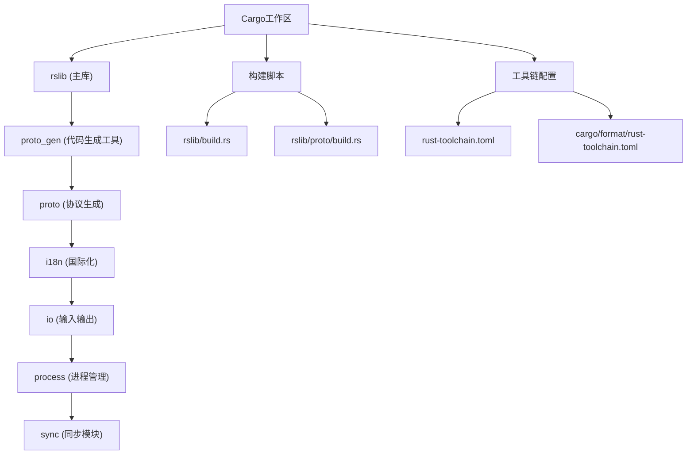
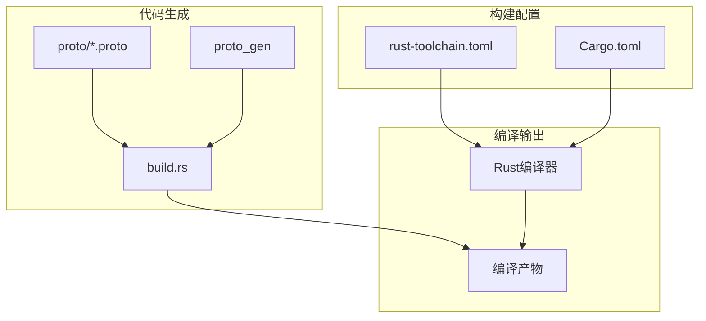
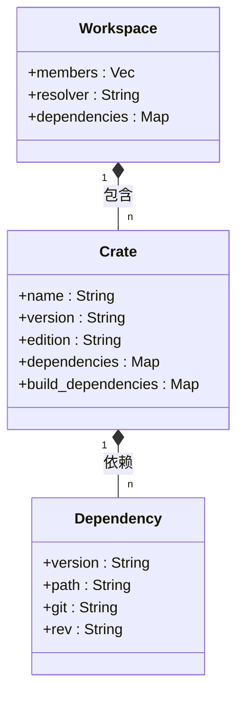
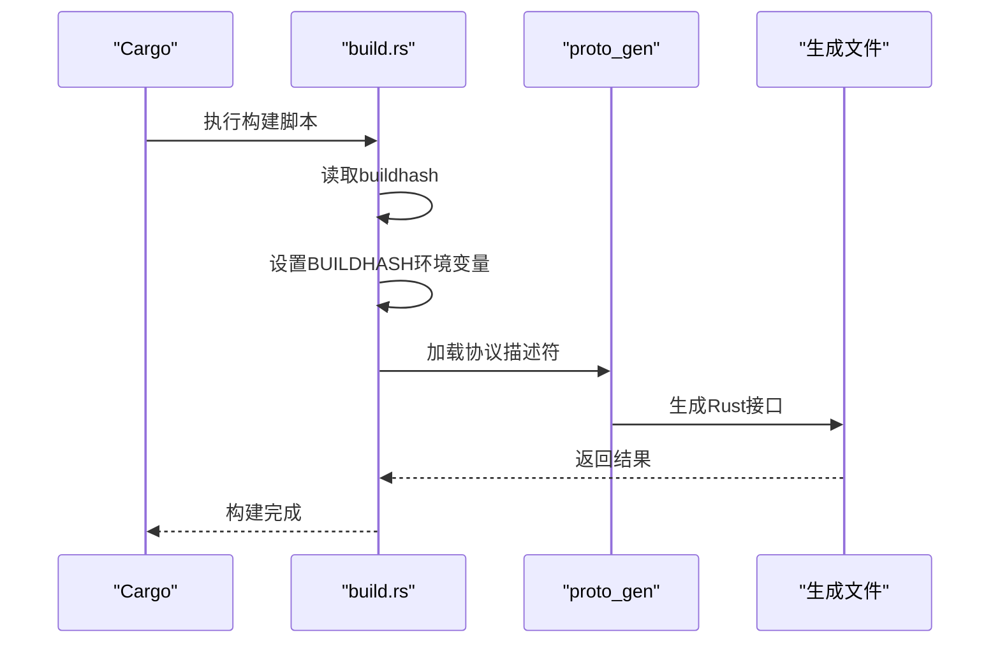
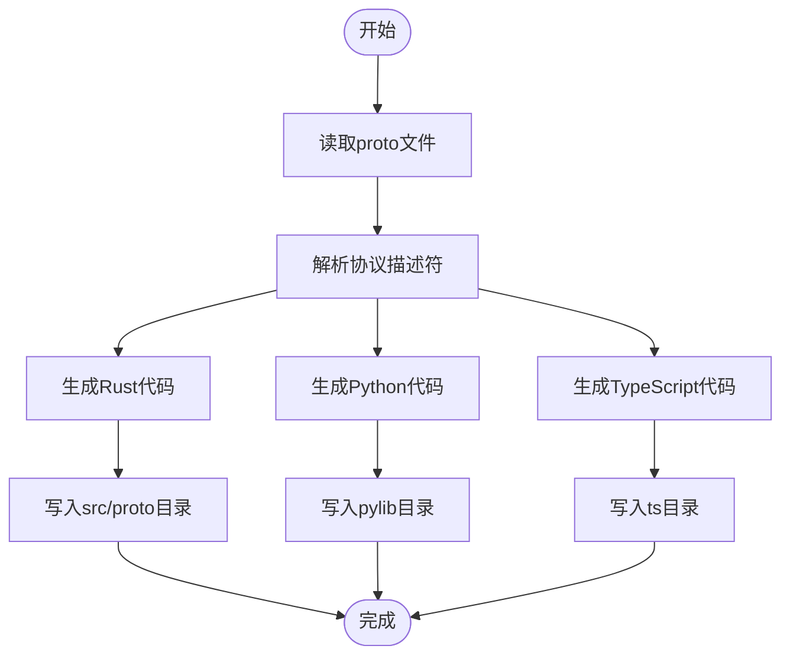
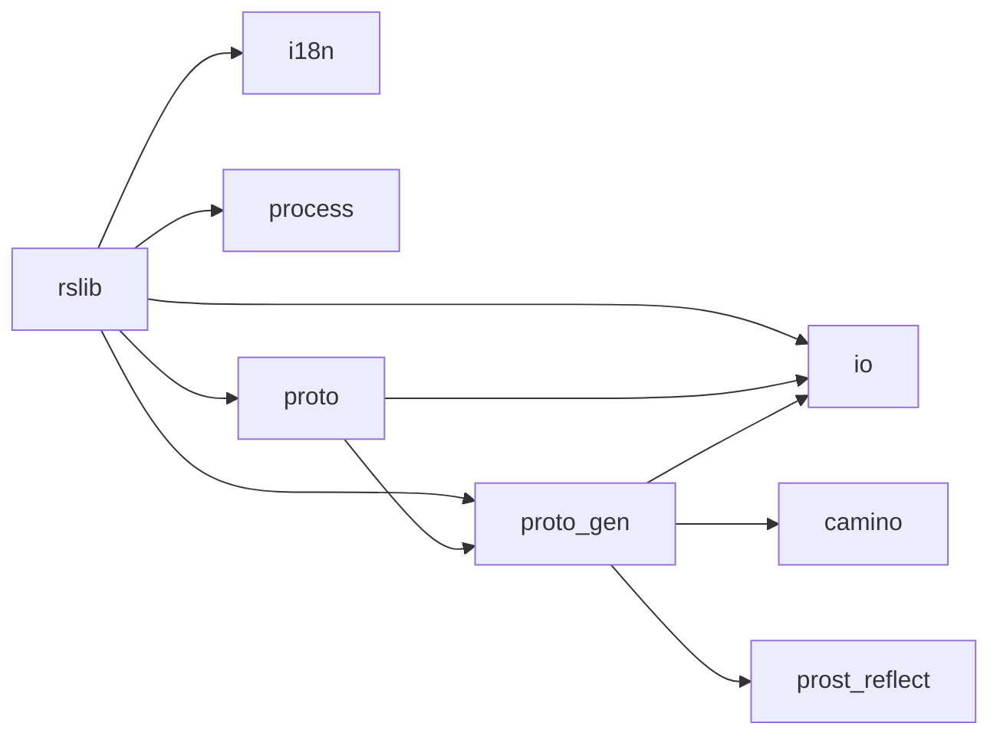
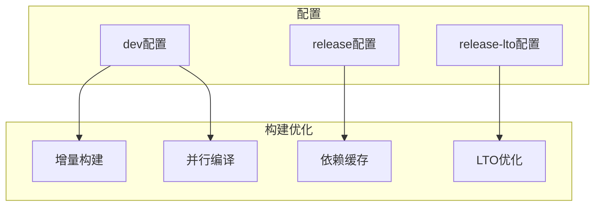
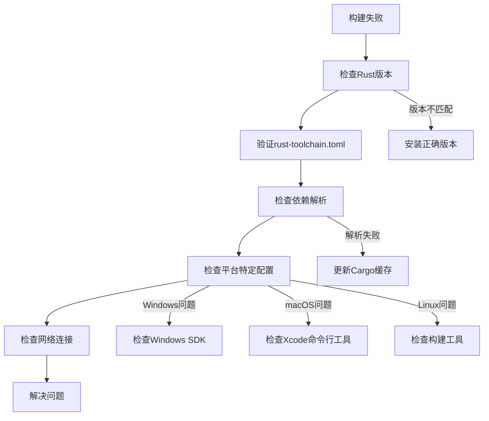

# Rust构建流程

<cite>
**本文档中引用的文件**  
- [rslib/Cargo.toml](file://rslib/Cargo.toml)
- [Cargo.toml](file://Cargo.toml)
- [rust-toolchain.toml](file://rust-toolchain.toml)
- [cargo/format/rust-toolchain.toml](file://cargo/format/rust-toolchain.toml)
- [rslib/build.rs](file://rslib/build.rs)
- [rslib/proto/build.rs](file://rslib/proto/build.rs)
- [rslib/proto_gen/src/lib.rs](file://rslib/proto_gen/src/lib.rs)
- [rslib/proto_gen/Cargo.toml](file://rslib/proto_gen/Cargo.toml)
</cite>

## 目录
1. [简介](#简介)
2. [项目结构](#项目结构)
3. [核心组件](#核心组件)
4. [架构概述](#架构概述)
5. [详细组件分析](#详细组件分析)
6. [依赖分析](#依赖分析)
7. [性能考虑](#性能考虑)
8. [故障排除指南](#故障排除指南)
9. [结论](#结论)

## 简介
本文档详细介绍了Anki Rust核心库的构建流程，涵盖Cargo工作区配置、代码生成机制、编译器版本管理、跨平台构建配置以及构建优化策略。文档旨在为初学者提供从零开始编译Rust核心的逐步指南，同时为经验丰富的开发者提供性能调优建议。

## 项目结构
Anki项目采用多crate工作区结构，核心Rust代码位于`rslib`目录中，包含多个子crate，如`proto_gen`、`i18n`等。工作区通过`Cargo.toml`文件定义成员crate，并使用workspace依赖统一管理版本。

**Diagram sources**
- [Cargo.toml](file://Cargo.toml#L1-L176)
- [rslib/Cargo.toml](file://rslib/Cargo.toml#L1-L112)

**Section sources**
- [Cargo.toml](file://Cargo.toml#L1-L176)
- [rslib/Cargo.toml](file://rslib/Cargo.toml#L1-L112)

## 核心组件
Anki的Rust核心库由多个crate组成，其中`rslib`是主库，依赖于`proto_gen`、`i18n`等辅助crate。`proto_gen`负责生成协议缓冲区代码，`i18n`处理国际化字符串。

**Section sources**
- [rslib/Cargo.toml](file://rslib/Cargo.toml#L1-L112)
- [rslib/proto_gen/Cargo.toml](file://rslib/proto_gen/Cargo.toml#L1-L21)

## 架构概述
Anki的构建系统采用分层架构，顶层是Cargo工作区管理多个crate，中间层是代码生成系统，底层是Rust编译器和工具链。

**Diagram sources**
- [rust-toolchain.toml](file://rust-toolchain.toml#L1-L4)
- [rslib/build.rs](file://rslib/build.rs#L1-L22)
- [rslib/proto/build.rs](file://rslib/proto/build.rs#L1-L21)

## 详细组件分析

### Cargo工作区配置分析
Anki使用Cargo工作区统一管理多个crate，通过workspace依赖确保版本一致性。

**Diagram sources**
- [Cargo.toml](file://Cargo.toml#L1-L176)
- [rslib/Cargo.toml](file://rslib/Cargo.toml#L1-L112)

**Section sources**
- [Cargo.toml](file://Cargo.toml#L1-L176)
- [rslib/Cargo.toml](file://rslib/Cargo.toml#L1-L112)

### 构建脚本作用分析
`build.rs`构建脚本在编译前执行，负责代码生成和环境变量设置。

**Diagram sources**
- [rslib/build.rs](file://rslib/build.rs#L1-L22)
- [rslib/proto_gen/src/lib.rs](file://rslib/proto_gen/src/lib.rs#L1-L284)

**Section sources**
- [rslib/build.rs](file://rslib/build.rs#L1-L22)
- [rslib/proto_gen/src/lib.rs](file://rslib/proto_gen/src/lib.rs#L1-L284)

### 代码生成过程分析
`proto_gen` crate负责从.proto文件生成Rust、Python和TypeScript代码。

**Diagram sources**
- [rslib/proto/build.rs](file://rslib/proto/build.rs#L1-L21)
- [rslib/proto_gen/src/lib.rs](file://rslib/proto_gen/src/lib.rs#L1-L284)

**Section sources**
- [rslib/proto/build.rs](file://rslib/proto/build.rs#L1-L21)
- [rslib/proto_gen/src/lib.rs](file://rslib/proto_gen/src/lib.rs#L1-L284)

## 依赖分析
Anki项目通过Cargo工作区依赖系统管理crate间的依赖关系，确保版本一致性和构建效率。

**Diagram sources**
- [Cargo.toml](file://Cargo.toml#L1-L176)
- [rslib/Cargo.toml](file://rslib/Cargo.toml#L1-L112)
- [rslib/proto_gen/Cargo.toml](file://rslib/proto_gen/Cargo.toml#L1-L21)

**Section sources**
- [Cargo.toml](file://Cargo.toml#L1-L176)
- [rslib/Cargo.toml](file://rslib/Cargo.toml#L1-L112)
- [rslib/proto_gen/Cargo.toml](file://rslib/proto_gen/Cargo.toml#L1-L21)

## 性能考虑
为提高构建性能，Anki采用多种优化策略，包括增量构建、并行编译和依赖缓存。

**Diagram sources**
- [Cargo.toml](file://Cargo.toml#L1-L176)
- [rslib/Cargo.toml](file://rslib/Cargo.toml#L1-L112)

**Section sources**
- [Cargo.toml](file://Cargo.toml#L1-L176)
- [rslib/Cargo.toml](file://rslib/Cargo.toml#L1-L112)

## 故障排除指南
常见构建问题包括依赖解析失败、编译器版本不匹配和平台特定问题。

**Section sources**
- [rust-toolchain.toml](file://rust-toolchain.toml#L1-L4)
- [cargo/format/rust-toolchain.toml](file://cargo/format/rust-toolchain.toml#L1-L5)
- [Cargo.toml](file://Cargo.toml#L1-L176)

## 结论
Anki的Rust构建系统采用现代化的Cargo工作区架构，通过代码生成和自动化构建脚本实现高效的开发流程。系统支持跨平台构建和多种性能优化策略，为开发者提供了稳定可靠的构建环境。