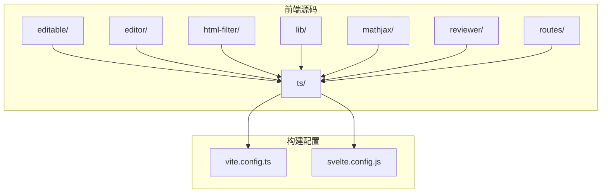
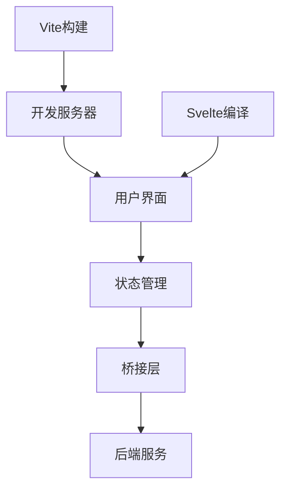
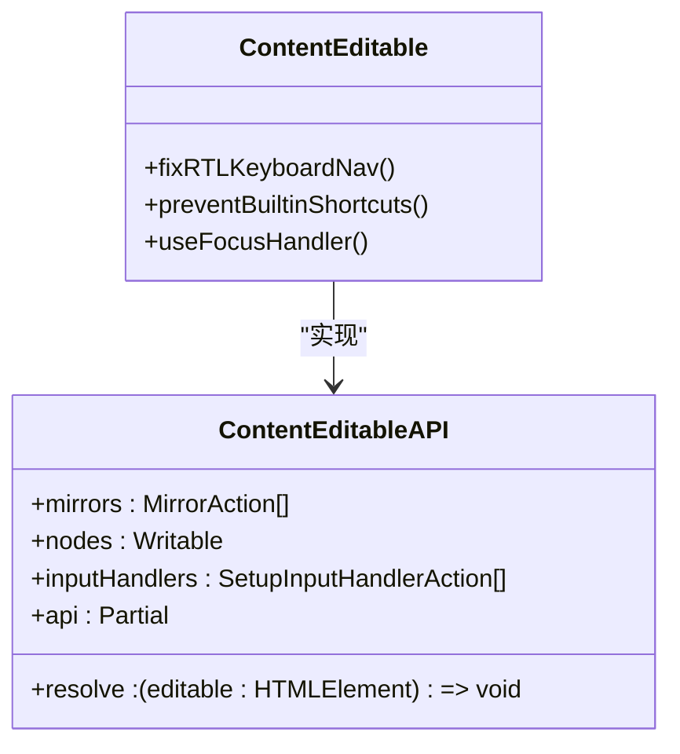
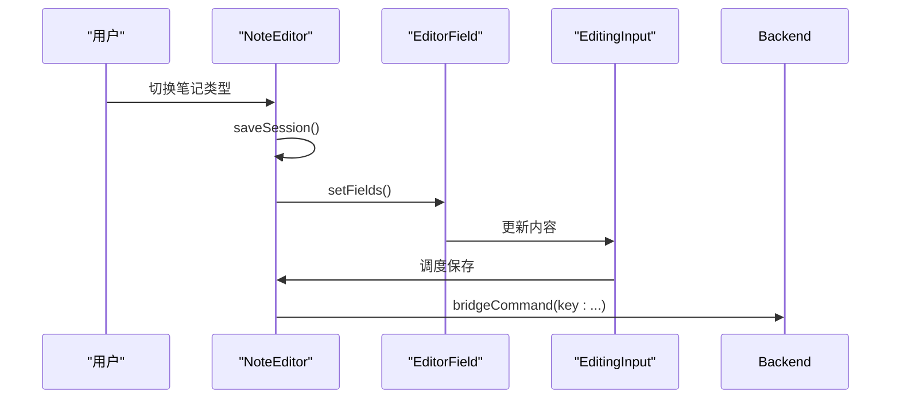
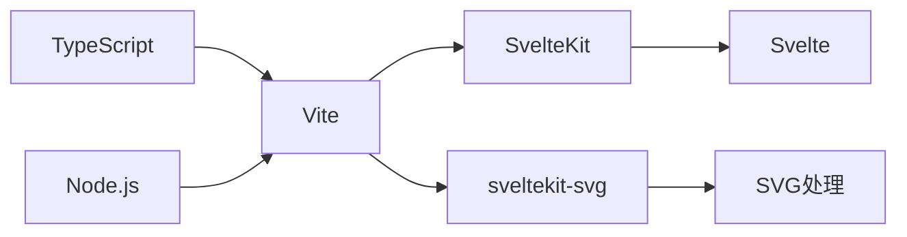

# 前端构建流程

<cite>
**本文档中引用的文件**  
- [vite.config.ts](file://ts/vite.config.ts)
- [svelte.config.js](file://ts/svelte.config.js)
- [ContentEditable.svelte](file://ts/editable/ContentEditable.svelte)
- [NoteEditor.svelte](file://ts/editor/NoteEditor.svelte)
- [EditorField.svelte](file://ts/editor/EditorField.svelte)
- [EditingArea.svelte](file://ts/editor/EditingArea.svelte)
</cite>

## 目录
1. [简介](#简介)
2. [项目结构](#项目结构)
3. [核心组件](#核心组件)
4. [架构概述](#架构概述)
5. [详细组件分析](#详细组件分析)
6. [依赖分析](#依赖分析)
7. [性能考虑](#性能考虑)
8. [故障排除指南](#故障排除指南)
9. [结论](#结论)

## 简介
本文档详细介绍了Anki前端TypeScript组件的构建流程。重点阐述了Vite配置在vite.config.ts中的实现，包括构建模式、开发服务器配置和生产优化选项。同时描述了Svelte组件的编译流程、前端资源打包过程以及开发工作流指南，为初学者和经验丰富的开发者提供完整的环境搭建步骤和性能优化建议。

## 项目结构
Anki前端代码位于`ts/`目录下，采用SvelteKit框架构建。主要包含可编辑组件、编辑器组件、HTML过滤器、通用库、数学公式支持、审阅器以及路由组件等模块。构建配置由vite.config.ts和svelte.config.js共同定义，实现了开发服务器代理、目标浏览器兼容性配置和静态适配器部署等功能。

**图示来源**  
- [vite.config.ts](file://ts/vite.config.ts)
- [svelte.config.js](file://ts/svelte.config.js)

**本节来源**  
- [ts/vite.config.ts](file://ts/vite.config.ts)
- [ts/svelte.config.js](file://ts/svelte.config.js)

## 核心组件
Anki前端的核心组件包括可编辑内容区域、笔记编辑器、字段编辑区域等。这些组件基于Svelte框架构建，利用响应式编程模型实现高效的DOM更新。组件间通过上下文API进行通信，确保了复杂编辑界面的状态一致性。

**本节来源**  
- [ContentEditable.svelte](file://ts/editable/ContentEditable.svelte)
- [NoteEditor.svelte](file://ts/editor/NoteEditor.svelte)
- [EditorField.svelte](file://ts/editor/EditorField.svelte)

## 架构概述
Anki前端采用SvelteKit框架，结合Vite构建工具，实现了现代化的前端开发体验。架构分为三层：UI组件层、状态管理层和桥接层。UI组件使用Svelte语法构建，状态通过Svelte的响应式存储管理，与后端的通信通过bridgeCommand函数实现。

**图示来源**  
- [vite.config.ts](file://ts/vite.config.ts)
- [NoteEditor.svelte](file://ts/editor/NoteEditor.svelte)

## 详细组件分析

### 可编辑组件分析
可编辑组件实现了内容可编辑区域的封装，支持富文本和纯文本输入模式。组件通过Svelte的动作（action）机制实现焦点管理、键盘导航修复和输入处理。

**图示来源**  
- [ContentEditable.svelte](file://ts/editable/ContentEditable.svelte)

### 笔记编辑器分析
笔记编辑器是Anki中最复杂的前端组件之一，负责管理多个字段的编辑状态、标签编辑、数学公式插入和图片遮罩等功能。组件采用模块化设计，通过插槽（slot）机制组合不同的功能模块。

**图示来源**  
- [NoteEditor.svelte](file://ts/editor/NoteEditor.svelte)
- [EditorField.svelte](file://ts/editor/EditorField.svelte)
- [EditingArea.svelte](file://ts/editor/EditingArea.svelte)

**本节来源**  
- [NoteEditor.svelte](file://ts/editor/NoteEditor.svelte)
- [EditorField.svelte](file://ts/editor/EditorField.svelte)
- [EditingArea.svelte](file://ts/editor/EditingArea.svelte)

## 依赖分析
Anki前端构建依赖于多个关键工具和库。Vite作为构建工具提供开发服务器和生产构建功能，SvelteKit提供应用框架，@poppanator/sveltekit-svg用于SVG支持。这些依赖在vite.config.ts中通过插件系统集成。

**图示来源**  
- [vite.config.ts](file://ts/vite.config.ts)

**本节来源**  
- [vite.config.ts](file://ts/vite.config.ts)

## 性能考虑
Anki前端在性能方面进行了多项优化。Vite配置中禁用了压缩大小报告以提升构建速度，目标浏览器设置为兼容Qt 5.14所需的最低版本。代码中使用ChangeTimer实现输入内容的防抖保存，避免频繁的后端通信。

## 故障排除指南
常见构建问题包括模块解析失败、类型检查错误和生产环境样式丢失。解决方案包括检查vite.config.ts中的fs.allow配置、确保svelte.config.js中的别名正确设置，以及验证CSS预处理变量的导入路径。

**本节来源**  
- [vite.config.ts](file://ts/vite.config.ts)
- [svelte.config.js](file://ts/svelte.config.js)

## 结论
Anki前端构建流程采用了现代化的工具链和架构设计，通过Vite和SvelteKit的组合实现了高效的开发体验和优化的生产输出。组件设计遵循模块化原则，状态管理清晰，为复杂的应用界面提供了坚实的基础。