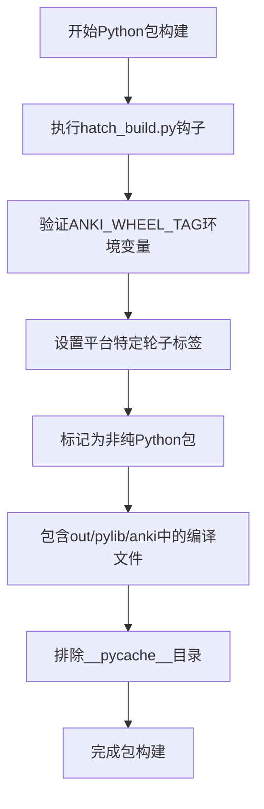
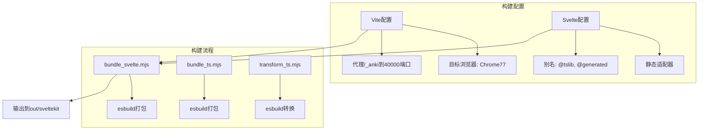
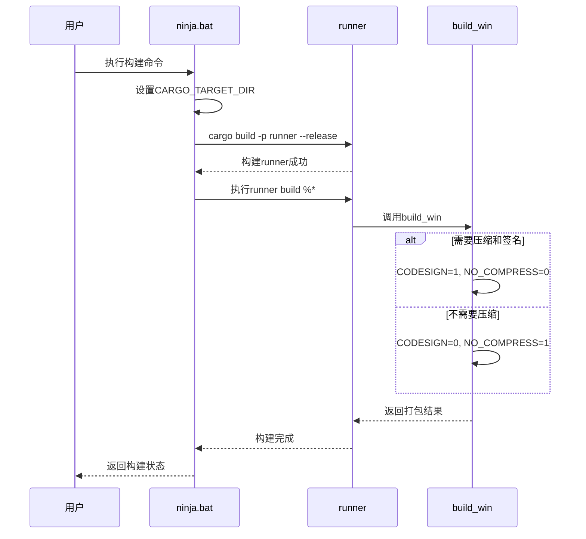

# 构建流程

<cite>
**本文档中引用的文件**  
- [rslib/Cargo.toml](file://rslib/Cargo.toml)
- [pylib/rsbridge/Cargo.toml](file://pylib/rsbridge/Cargo.toml)
- [pylib/rsbridge/build.rs](file://pylib/rsbridge/build.rs)
- [pylib/hatch_build.py](file://pylib/hatch_build.py)
- [ts/vite.config.ts](file://ts/vite.config.ts)
- [ts/svelte.config.js](file://ts/svelte.config.js)
- [ts/bundle_svelte.mjs](file://ts/bundle_svelte.mjs)
- [ts/bundle_ts.mjs](file://ts/bundle_ts.mjs)
- [ts/transform_ts.mjs](file://ts/transform_ts.mjs)
- [tools/ninja.bat](file://tools/ninja.bat)
</cite>

## 目录
1. [简介](#简介)
2. [Rust核心库构建流程](#rust核心库构建流程)
3. [Python包打包流程](#python包打包流程)
4. [前端TypeScript组件构建流程](#前端typescript组件构建流程)
5. [构建脚本示例](#构建脚本示例)
6. [常见构建错误及解决方案](#常见构建错误及解决方案)
7. [初学者逐步构建指南](#初学者逐步构建指南)
8. [构建性能优化建议](#构建性能优化建议)

## 简介
Anki项目采用多语言混合架构，其构建流程涉及Rust、Python和TypeScript三种主要技术栈。本文档详细说明各组件的构建机制，包括Cargo配置、PyO3桥接编译、Vite配置和Svelte组件打包等关键环节，为开发者提供完整的构建知识体系。

## Rust核心库构建流程

Anki的Rust核心库位于`rslib/`目录，通过Cargo进行依赖管理和编译。`Cargo.toml`文件定义了项目元数据、功能特性及依赖项，其中大部分依赖通过工作区配置统一管理。构建系统利用`build.rs`脚本在编译前生成Rust接口代码，读取协议缓冲区描述符并生成相应的绑定代码。

构建过程中，系统会检查`../out/buildhash`文件以确定是否需要重新编译，并将构建哈希值注入环境变量供后续使用。项目支持`rustls`和`native-tls`两种TLS后端特性，可根据目标平台选择合适的网络库实现。

**本节来源**  
- [rslib/Cargo.toml](file://rslib/Cargo.toml#L1-L112)
- [rslib/build.rs](file://rslib/build.rs#L1-L22)

## Python包打包流程

Python包的构建通过`hatch_build.py`中的自定义构建钩子实现。该钩子负责将编译好的Rust桥接库集成到Python包中，并设置平台特定的轮子标签。构建过程首先验证`ANKI_WHEEL_TAG`环境变量，然后标记包为非纯Python包，因为其包含编译的扩展模块。

PyO3桥接库位于`pylib/rsbridge/`，其`Cargo.toml`配置为生成CDylib类型的库，以便Python可以动态链接。`build.rs`脚本针对不同操作系统进行特殊处理：在macOS上设置动态查找链接参数，在Windows上定位`python3.lib`的搜索路径。

**图表来源**  
- [pylib/hatch_build.py](file://pylib/hatch_build.py#L1-L50)
- [pylib/rsbridge/Cargo.toml](file://pylib/rsbridge/Cargo.toml#L1-L23)
- [pylib/rsbridge/build.rs](file://pylib/rsbridge/build.rs#L1-L33)

## 前端TypeScript组件构建流程

前端构建系统基于Vite和SvelteKit，配置文件包括`vite.config.ts`和`svelte.config.js`。Vite配置设置了针对Qt 5.14兼容性的目标浏览器版本（Chrome 77），并配置了代理服务器将`/_anki`请求转发到本地开发服务器。

Svelte配置使用`@sveltejs/adapter-static`适配器，输出到`../out/sveltekit`目录。构建过程通过`bundle_svelte.mjs`和`bundle_ts.mjs`脚本执行，使用esbuild进行高效打包。Svelte组件的CSS预处理通过`svelte-preprocess`插件完成，支持全局样式注入。

**图表来源**  
- [ts/vite.config.ts](file://ts/vite.config.ts#L1-L60)
- [ts/svelte.config.js](file://ts/svelte.config.js#L1-L39)
- [ts/bundle_svelte.mjs](file://ts/bundle_svelte.mjs#L1-L42)
- [ts/bundle_ts.mjs](file://ts/bundle_ts.mjs#L1-L19)

## 构建脚本示例

主构建脚本`tools/ninja.bat`设置Rust构建输出目录为`../out/rust`，然后调用`runner`工具执行具体构建任务。该脚本确保构建环境变量不会泄露到子进程中，保持构建过程的纯净性。

Windows平台的打包脚本`qt/launcher/win/build.bat`根据`NOCOMP`环境变量决定是否进行代码签名和压缩，然后调用`build_win`二进制进行实际打包操作。

**图表来源**  
- [tools/ninja.bat](file://tools/ninja.bat#L1-L5)
- [qt/launcher/win/build.bat](file://qt/launcher/win/build.bat#L1-L10)

## 常见构建错误及解决方案

### Rust构建错误
- **链接错误**：在macOS上确保设置了正确的链接参数（`-undefined dynamic_lookup`）
- **依赖版本冲突**：使用工作区统一管理依赖版本
- **协议缓冲区生成失败**：检查`../out/buildhash`和描述符文件是否存在

### Python打包错误
- **找不到python3.lib**：在Windows上确保Python环境变量正确配置
- **轮子标签错误**：设置`ANKI_WHEEL_TAG`环境变量
- **文件包含错误**：验证`out/pylib/anki`目录是否存在且包含必要文件

### 前端构建错误
- **esbuild转换失败**：检查Node.js版本和依赖安装
- **Svelte预处理错误**：验证`svelte-preprocess`配置正确性
- **Vite代理失败**：确认后端服务在40000端口运行

**本节来源**  
- [pylib/rsbridge/build.rs](file://pylib/rsbridge/build.rs#L1-L33)
- [pylib/hatch_build.py](file://pylib/hatch_build.py#L1-L50)
- [ts/vite.config.ts](file://ts/vite.config.ts#L1-L60)

## 初学者逐步构建指南

1. **环境准备**：安装Rust、Python、Node.js和yarn
2. **初始化构建**：运行`yarn`安装前端依赖
3. **构建Rust库**：执行`cargo build -p anki`编译核心库
4. **构建桥接层**：编译`rsbridge`生成Python可调用的动态库
5. **打包Python模块**：使用`hatch_build.py`生成包含编译库的wheel包
6. **构建前端**：运行`node ts/bundle_svelte.mjs`打包Svelte组件
7. **完整构建**：使用`tools/ninja.bat`执行全流程构建

**本节来源**  
- [tools/ninja.bat](file://tools/ninja.bat#L1-L5)
- [pylib/hatch_build.py](file://pylib/hatch_build.py#L1-L50)
- [ts/bundle_svelte.mjs](file://ts/bundle_svelte.mjs#L1-L42)

## 构建性能优化建议

1. **增量构建**：利用Cargo的增量编译特性，避免全量重新编译
2. **并行构建**：在`Cargo.toml`中启用并行编译选项
3. **缓存优化**：配置适当的构建缓存策略，避免重复工作
4. **依赖精简**：定期审查依赖树，移除不必要的依赖项
5. **构建分层**：将构建过程分解为独立阶段，便于并行执行
6. **资源预加载**：在Vite配置中优化资源预加载策略
7. **代码分割**：合理组织前端代码，实现按需加载

**本节来源**  
- [rslib/Cargo.toml](file://rslib/Cargo.toml#L1-L112)
- [ts/vite.config.ts](file://ts/vite.config.ts#L1-L60)