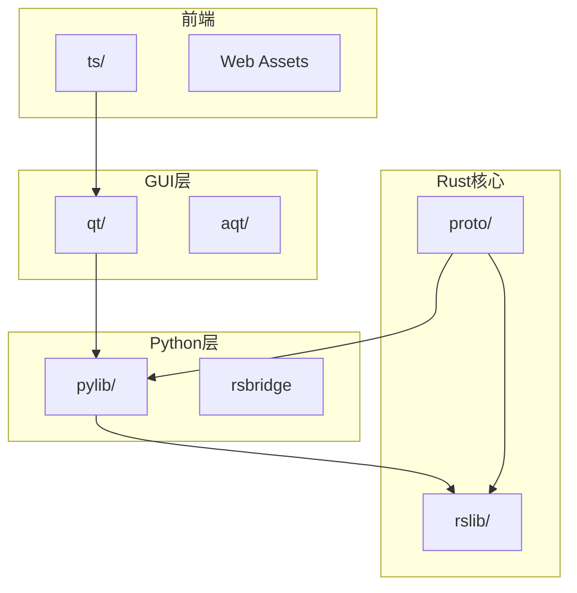
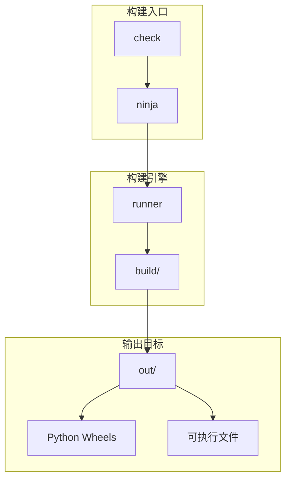
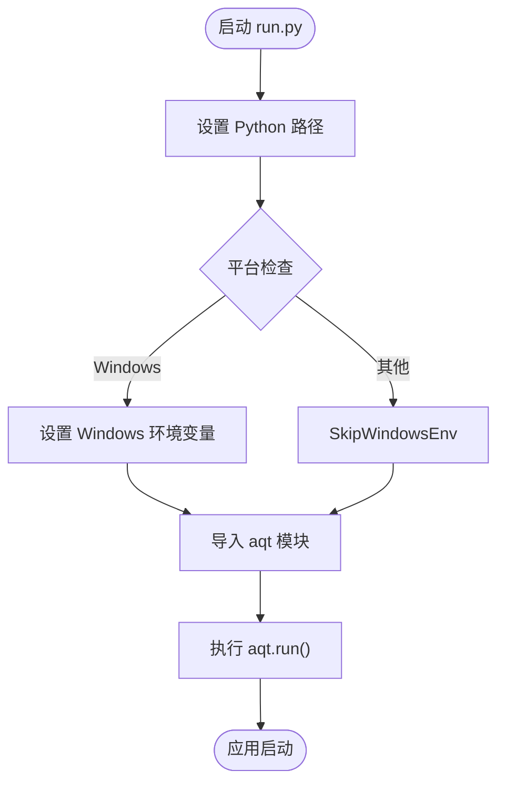
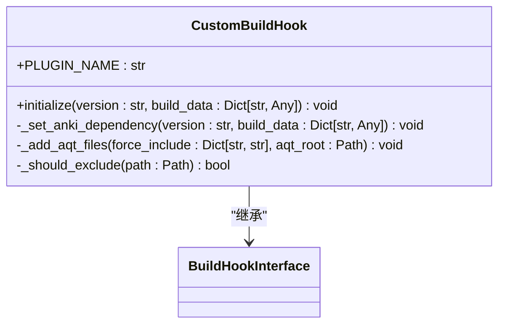
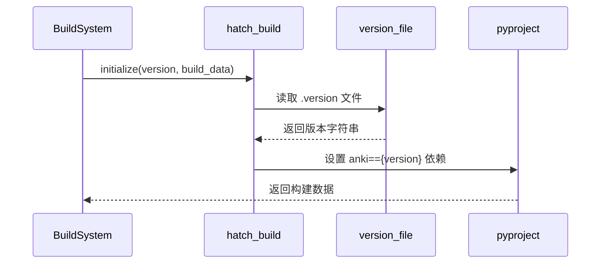

# 集成构建流程

<cite>
**本文档引用的文件**  
- [run.py](file://tools/run.py)
- [hatch_build.py](file://qt/hatch_build.py)
- [Cargo.toml](file://rslib/Cargo.toml)
- [pyproject.toml](file://pylib/pyproject.toml)
- [ninja](file://ninja)
- [check](file://check)
- [run.bat](file://run.bat)
- [CLAUDE.md](file://CLAUDE.md)
</cite>

## 目录
1. [简介](#简介)
2. [项目结构](#项目结构)
3. [核心组件](#核心组件)
4. [架构概述](#架构概述)
5. [详细组件分析](#详细组件分析)
6. [依赖分析](#依赖分析)
7. [性能考虑](#性能考虑)
8. [故障排除指南](#故障排除指南)
9. [结论](#结论)

## 简介
Anki 是一个采用多层架构的间隔重复闪卡程序，其构建系统整合了 Rust、Python 和前端技术栈。本项目通过统一的构建流程协调各组件的编译与打包，支持跨平台开发和部署。主构建入口 `tools/run.py` 负责初始化应用程序环境并启动 GUI 界面，而底层构建工具链则确保代码的一致性和可维护性。

## 项目结构
Anki 项目采用模块化设计，将不同技术栈的代码分离到独立目录中，同时通过构建系统实现无缝集成。这种结构既保证了开发的灵活性，又确保了最终产品的稳定性。



**图示来源**  
- [CLAUDE.md](file://CLAUDE.md#L0-L41)

**章节来源**  
- [CLAUDE.md](file://CLAUDE.md#L0-L41)

## 核心组件
`tools/run.py` 作为主要的运行入口，负责设置 Python 模块路径并初始化 Anki 应用程序。该脚本通过扩展系统路径来加载必要的库，并根据平台配置环境变量，最终调用 `aqt.run()` 启动主应用程序。构建过程由 `ninja` 驱动，通过 `runner` 二进制文件协调各个构建步骤。

**章节来源**  
- [run.py](file://tools/run.py#L0-L14)
- [ninja](file://ninja#L0-L18)

## 架构概述
Anki 的构建架构采用分层设计，从源码到可执行文件的转换过程经过多个阶段。顶层的 `check` 脚本调用 `ninja format` 和 `ninja check` 来执行代码格式化和完整性检查。`ninja` 脚本负责设置构建环境变量并调用底层的 `runner` 工具，后者使用 Rust 编写的构建系统来管理具体的构建任务。



**图示来源**  
- [check](file://check#L0-L3)
- [ninja](file://ninja#L0-L18)

## 详细组件分析

### 构建入口分析
`tools/run.py` 脚本是开发模式下启动 Anki 的主要方式。它首先扩展 Python 路径以包含必要的库目录，然后根据操作系统设置特定的环境变量。在 Windows 平台上，它会将音频提取目录添加到系统 PATH 中，确保音频功能正常工作。



**图示来源**  
- [run.py](file://tools/run.py#L0-L14)

**章节来源**  
- [run.py](file://tools/run.py#L0-L14)

### 打包系统分析
Anki 使用 Hatch 构建系统来生成 Python 轮子包。`hatch_build.py` 脚本定义了自定义构建钩子，负责将生成的文件复制到分发包中，并处理版本依赖关系。该脚本会读取 `.version` 文件中的实际版本号，并将其作为精确依赖添加到包中。



**图示来源**  
- [hatch_build.py](file://qt/hatch_build.py#L0-L77)

**章节来源**  
- [hatch_build.py](file://qt/hatch_build.py#L0-L77)

### 版本管理系统分析
Anki 的版本管理通过多个文件协同工作。`pyproject.toml` 配置文件指定版本信息来自 `../python/version.py`，而 `hatch_build.py` 脚本在构建时读取 `.version` 文件获取实际版本号。这种设计允许在开发和发布版本之间灵活切换。



**图示来源**  
- [hatch_build.py](file://qt/hatch_build.py#L39-L77)
- [pyproject.toml](file://pylib/pyproject.toml#L0-L30)

**章节来源**  
- [hatch_build.py](file://qt/hatch_build.py#L0-L77)
- [pyproject.toml](file://pylib/pyproject.toml#L0-L30)

## 依赖分析
Anki 的依赖关系通过多种机制进行管理。Rust 依赖在 `Cargo.toml` 文件中声明，Python 依赖在 `pyproject.toml` 中定义，而构建工具链的依赖则由 `ninja` 和 `runner` 管理。这种分层依赖管理确保了各组件之间的解耦和独立更新。

```mermaid
dependencyDiagram
runpy[tools/run.py] --> aqt[qt/aqt]
aqt --> pylib[pylib/anki]
pylib --> rsbridge[pylib/rsbridge]
rsbridge --> rslib[rslib]
rslib --> proto[proto/]
qt --> ts[ts/]
build --> ninja[ninja]
ninja --> runner[runner]
```

**图示来源**  
- [run.py](file://tools/run.py#L0-L14)
- [Cargo.toml](file://rslib/Cargo.toml#L0-L112)
- [pyproject.toml](file://pylib/pyproject.toml#L0-L30)

**章节来源**  
- [run.py](file://tools/run.py#L0-L14)
- [Cargo.toml](file://rslib/Cargo.toml#L0-L112)
- [pyproject.toml](file://pylib/pyproject.toml#L0-L30)

## 性能考虑
Anki 的构建系统通过缓存和增量构建优化性能。`CARGO_TARGET_DIR` 环境变量设置为 `out/rust` 目录，避免重复编译 Rust 代码。Python 字节码缓存通过 `PYTHONPYCACHEPREFIX` 环境变量集中管理，减少磁盘碎片。开发模式下启用的 `ANKIDEV` 环境变量会增加日志级别，有助于性能分析。

## 故障排除指南
当构建过程出现问题时，应首先检查环境变量设置是否正确。常见的问题包括 `PYENV` 未定义、`CARGO_TARGET_DIR` 路径错误或缺少必要的构建工具。对于 Windows 平台，需要确保 `run.bat` 脚本正确设置了所有环境变量。如果遇到依赖冲突，可以尝试清理 `out/` 目录后重新构建。

**章节来源**  
- [run.bat](file://run.bat#L0-L15)
- [ninja](file://ninja#L0-L18)

## 结论
Anki 的集成构建流程展示了现代多语言项目的复杂性与优雅性。通过精心设计的构建系统，项目成功地将 Rust、Python 和前端技术栈整合在一起，提供了高效的开发体验和稳定的发布流程。理解这一构建架构对于贡献代码或定制 Anki 功能至关重要。