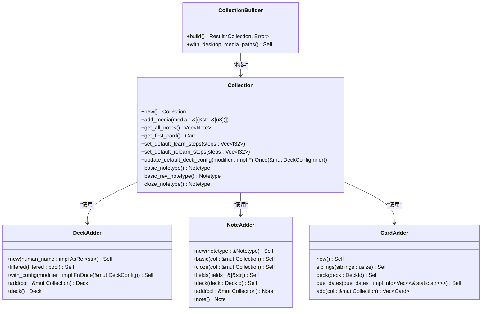
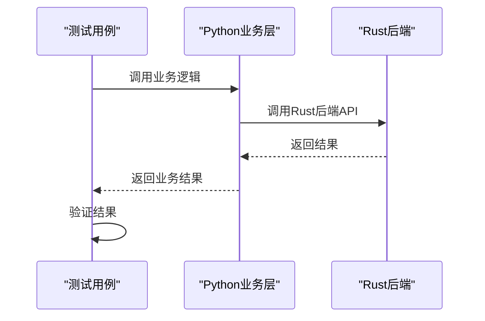
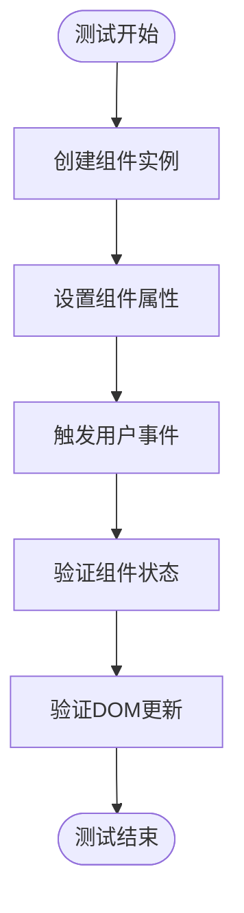

# 单元测试

<cite>
**本文档中引用的文件**  
- [tests.rs](file://rslib/src/tests.rs)
- [test_schedv3.py](file://pylib/tests/test_schedv3.py)
- [test_collection.py](file://pylib/tests/test_collection.py)
- [test_cards.py](file://pylib/tests/test_cards.py)
- [test_decks.py](file://pylib/tests/test_decks.py)
- [test_find.py](file://pylib/tests/test_find.py)
- [test_exporting.py](file://pylib/tests/test_exporting.py)
- [test_importing.py](file://pylib/tests/test_importing.py)
- [test_latex.py](file://pylib/tests/test_latex.py)
- [test_media.py](file://pylib/tests/test_media.py)
- [test_models.py](file://pylib/tests/test_models.py)
</cite>

## 目录
1. [引言](#引言)
2. [Rust核心模块单元测试](#rust核心模块单元测试)
3. [Python业务层单元测试](#python业务层单元测试)
4. [TypeScript前端组件单元测试](#typescript前端组件单元测试)
5. [测试用例编写实践](#测试用例编写实践)
6. [测试隔离原则](#测试隔离原则)
7. [结论](#结论)

## 引言
Anki作为一个跨平台的记忆卡片应用，其代码库涵盖了Rust、Python和TypeScript三种主要技术栈。为了确保系统的稳定性和可靠性，Anki建立了一套完整的单元测试体系。本文档将深入分析Anki在不同技术栈中的单元测试实现，重点关注Rust核心模块的调度算法、数据存储和同步逻辑测试，Python业务层的测试策略，以及TypeScript前端组件的测试方法。通过详细解析测试代码和策略，为开发者提供编写高质量测试用例的指导。

## Rust核心模块单元测试

Anki的Rust核心模块使用Rust原生的测试框架进行单元测试，主要集中在调度算法、数据存储和同步逻辑等关键功能上。测试文件位于`rslib/src/`目录下，通过`#[cfg(test)]`属性标记测试模块。

在`rslib/src/tests.rs`文件中，定义了多个测试辅助函数和结构体，如`open_test_collection`用于创建测试集合，`NoteAdder`和`CardAdder`用于添加笔记和卡片。这些辅助工具简化了测试数据的准备过程，使得测试用例更加清晰和可维护。

调度算法的测试主要验证新卡片、学习卡片和复习卡片的处理逻辑。测试用例通过模拟用户回答卡片的不同结果（如再次、困难、良好、简单）来验证调度器的行为是否符合预期。例如，当用户将一张新卡片标记为"再次"时，该卡片应进入学习队列，并在指定的延迟后再次出现。

数据存储的测试重点关注数据库操作的正确性和一致性。测试用例验证了笔记、卡片、牌组等实体的增删改查操作，以及这些操作对数据库状态的影响。同步逻辑的测试则模拟了客户端与服务器之间的数据同步过程，确保在各种网络条件下数据能够正确同步。

**图源**  
- [tests.rs](file://rslib/src/tests.rs#L0-L265)

**本节来源**  
- [tests.rs](file://rslib/src/tests.rs#L0-L265)

## Python业务层单元测试

Python业务层的单元测试策略主要集中在`pylib/tests/`目录下的测试文件中。这些测试通过模拟Rust后端来测试业务逻辑的封装，确保Python层的业务逻辑正确无误。

在`test_schedv3.py`文件中，测试用例验证了调度算法的各种边界情况和异常处理。例如，`test_newLimits`测试验证了当牌组的新卡片限制发生变化时，调度器是否能正确计算新卡片的数量。`test_learn`测试则验证了学习卡片的处理逻辑，包括学习步骤的延迟、卡片的升级条件等。

`test_collection.py`文件中的测试用例主要验证集合（Collection）的基本操作，如创建、打开、添加和删除笔记等。`test_noteAddDelete`测试验证了添加笔记的完整流程，包括笔记字段的校验、卡片的生成等。`test_fieldChecksum`测试则验证了字段校验和的计算是否正确，这对于检测笔记内容的变化至关重要。

**图源**  
- [test_schedv3.py](file://pylib/tests/test_schedv3.py#L0-L799)
- [test_collection.py](file://pylib/tests/test_collection.py#L0-L175)

**本节来源**  
- [test_schedv3.py](file://pylib/tests/test_schedv3.py#L0-L799)
- [test_collection.py](file://pylib/tests/test_collection.py#L0-L175)

## TypeScript前端组件单元测试

TypeScript前端组件的单元测试主要集中在`ts/`目录下的测试文件中。这些测试主要验证Svelte组件的状态和交互行为，确保用户界面的正确性和响应性。

在`ts/lib/domlib/surround/test-utils.ts`文件中，定义了用于测试DOM操作的辅助函数。这些函数简化了DOM元素的创建和操作，使得测试用例能够专注于验证组件的行为。

前端组件的测试主要关注以下几个方面：组件的初始状态是否正确、用户交互是否能正确更新组件状态、组件的生命周期方法是否按预期执行。例如，一个卡片组件的测试可能会验证当用户点击"再次"按钮时，组件的状态是否更新为"再次"，以及是否触发了相应的事件。

**图源**  
- [test-utils.ts](file://ts/lib/domlib/surround/test-utils.ts)

**本节来源**  
- [test-utils.ts](file://ts/lib/domlib/surround/test-utils.ts)

## 测试用例编写实践

编写有效的测试用例是确保软件质量的关键。Anki的测试用例编写实践体现了以下几个重要原则：

1. **测试数据准备**：使用辅助函数和结构体来简化测试数据的准备。例如，`NoteAdder`和`DeckAdder`结构体提供了一种流畅的API来创建测试数据，使得测试用例更加清晰和可读。

2. **断言验证**：使用明确的断言来验证测试结果。Anki的测试用例通常使用`assert`语句来验证期望的结果，如`assert col.sched.newCount == 1`验证新卡片数量是否正确。

3. **异常处理**：测试用例需要覆盖各种异常情况，确保系统在异常条件下也能正确处理。例如，`test_fieldChecksum`测试验证了当笔记字段为空时，校验和的计算是否正确。

4. **边界条件**：测试用例需要覆盖各种边界条件，如空集合、单个元素、最大值、最小值等。例如，`test_newLimits`测试验证了当牌组的新卡片限制为0时，调度器的行为是否正确。

5. **可重复性**：测试用例需要确保可重复性，即在相同的输入条件下，测试结果应该是一致的。Anki的测试用例通过使用固定的测试数据和时间戳来确保测试的可重复性。

**本节来源**  
- [tests.rs](file://rslib/src/tests.rs#L0-L265)
- [test_schedv3.py](file://pylib/tests/test_schedv3.py#L0-L799)
- [test_collection.py](file://pylib/tests/test_collection.py#L0-L175)

## 测试隔离原则

测试隔离原则是确保测试可靠性和可维护性的关键。Anki在各技术栈中都严格遵循了测试隔离原则，具体体现在以下几个方面：

1. **独立的测试环境**：每个测试用例都在独立的测试环境中运行，避免测试之间的相互影响。例如，`open_test_collection`函数为每个测试用例创建一个独立的测试集合，确保测试数据的隔离。

2. **模拟外部依赖**：对于外部依赖，如数据库、网络服务等，使用模拟对象来替代真实的依赖。这不仅提高了测试的执行速度，还确保了测试的可重复性。

3. **清理测试数据**：在测试结束后，及时清理测试数据，避免对后续测试造成影响。Anki的测试框架在测试结束后会自动清理测试集合和临时文件。

4. **避免共享状态**：测试用例之间不应共享状态，每个测试用例都应从一个干净的状态开始。这确保了测试的独立性和可重复性。

**本节来源**  
- [tests.rs](file://rslib/src/tests.rs#L0-L265)
- [test_schedv3.py](file://pylib/tests/test_schedv3.py#L0-L799)
- [test_collection.py](file://pylib/tests/test_collection.py#L0-L175)

## 结论
Anki的单元测试体系展示了如何在多技术栈项目中建立高质量的测试实践。通过深入分析Rust核心模块、Python业务层和TypeScript前端组件的测试实现，我们可以看到Anki在测试数据准备、断言验证、异常处理、边界条件覆盖和测试隔离等方面都遵循了最佳实践。这些实践不仅确保了Anki的稳定性和可靠性，也为其他类似项目提供了有价值的参考。