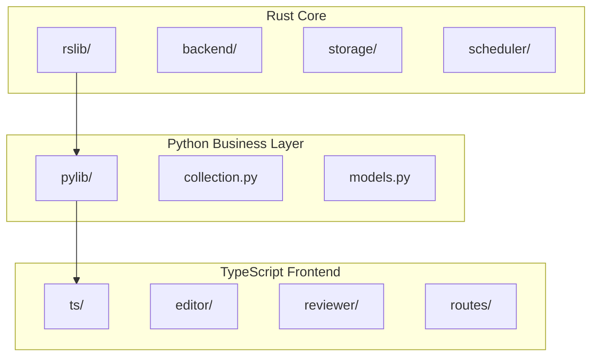
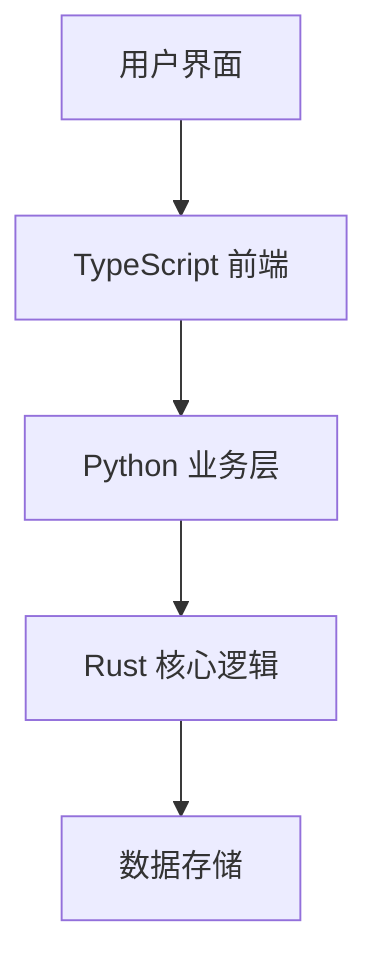
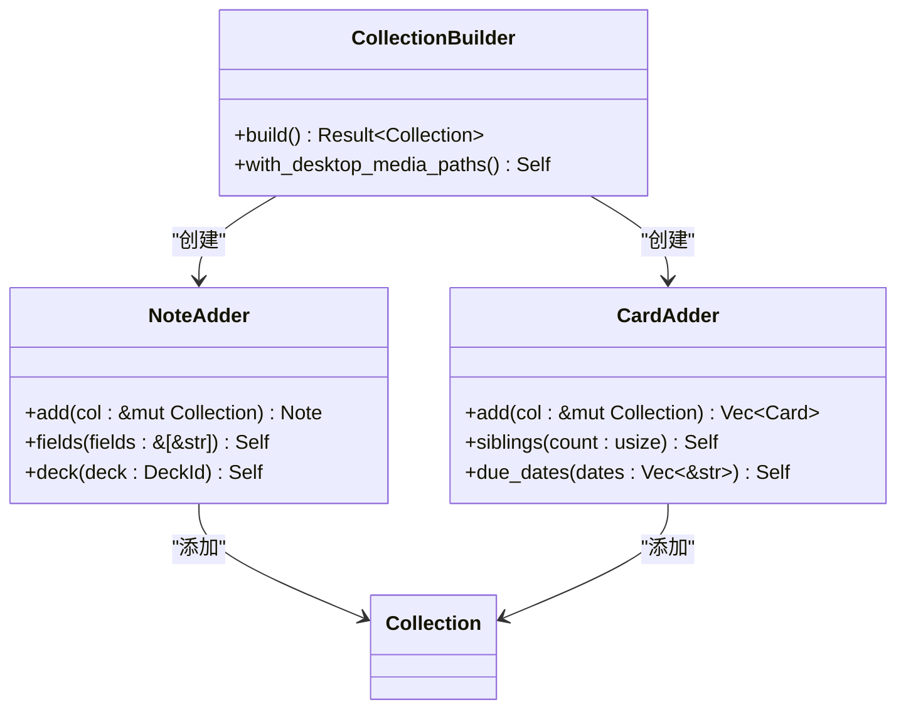
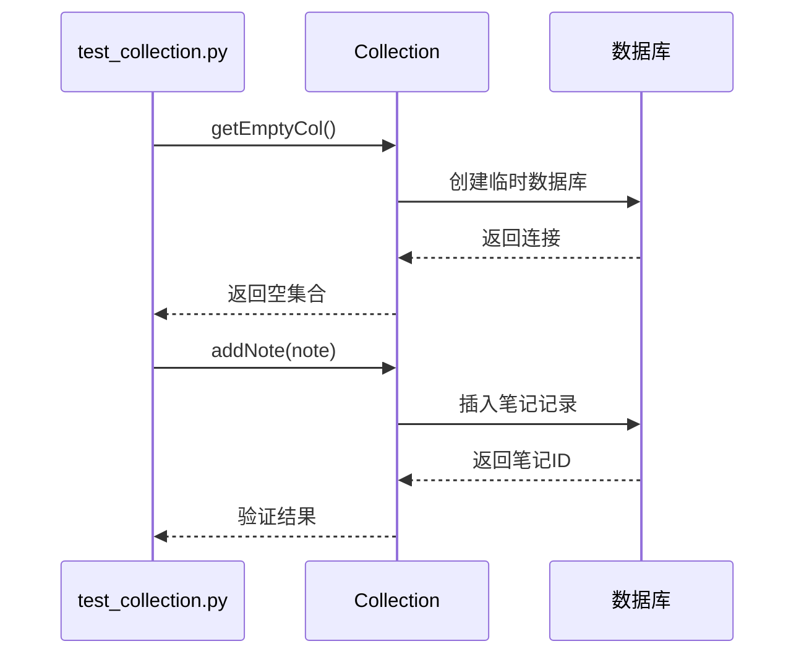
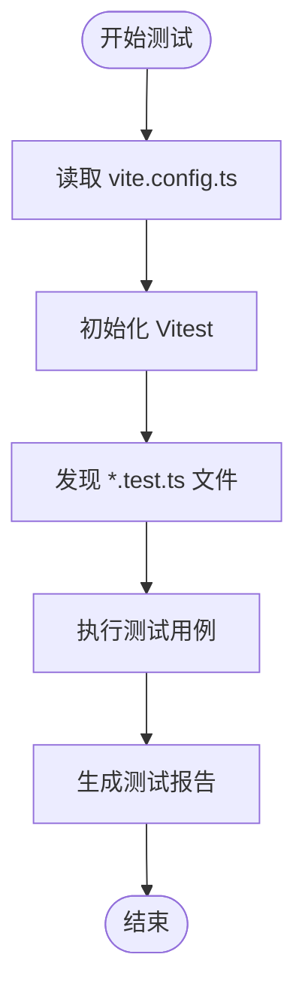
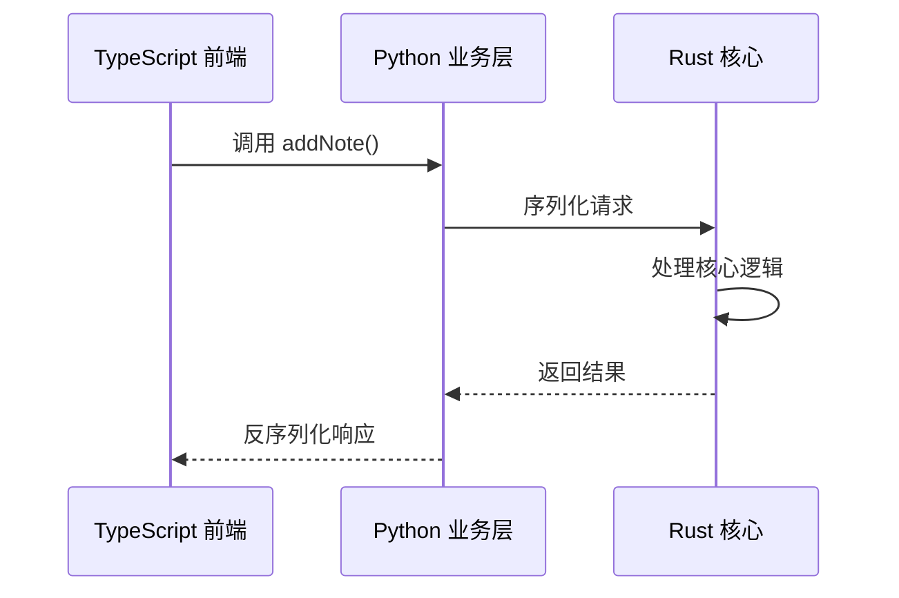
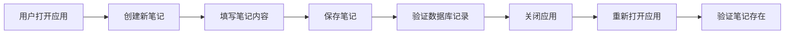
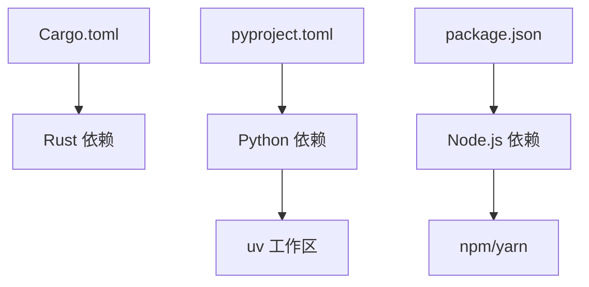

# 测试策略

<cite>
**本文档中引用的文件**  
- [test_collection.py](file://pylib/tests/test_collection.py)
- [backend.rs](file://rslib/src/backend/mod.rs)
- [tests.rs](file://rslib/src/tests.rs)
- [aqt.py](file://qt/aqt/__init__.py)
- [index.ts](file://ts/editor/index.ts)
- [Cargo.toml](file://rslib/Cargo.toml)
- [pyproject.toml](file://pyproject.toml)
- [vite.config.ts](file://ts/vite.config.ts)
</cite>

## 目录
1. [简介](#简介)
2. [项目结构](#项目结构)
3. [核心组件](#核心组件)
4. [架构概述](#架构概述)
5. [详细组件分析](#详细组件分析)
6. [依赖分析](#依赖分析)
7. [性能考虑](#性能考虑)
8. [故障排除指南](#故障排除指南)
9. [结论](#结论)
10. [附录](#附录)（如有必要）

## 简介
Anki 是一个开源的记忆卡片应用程序，采用多语言技术栈构建，包括 Rust、Python 和 TypeScript。其测试策略覆盖了从核心逻辑到用户界面的各个层面。本文档详细说明了 Anki 的单元测试、集成测试和端到端测试的实现方式，以及测试覆盖率分析和持续集成配置。

## 项目结构
Anki 的项目结构清晰地划分了不同技术栈的代码模块。Rust 代码位于 `rslib` 目录下，负责核心逻辑处理；Python 代码位于 `pylib` 目录下，处理业务逻辑；TypeScript 代码位于 `ts` 目录下，负责前端组件开发。测试代码分别位于各模块的 `tests` 子目录中。

**图示来源**  
- [rslib](file://rslib/Cargo.toml)
- [pylib](file://pyproject.toml)
- [ts](file://ts/vite.config.ts)

**本节来源**  
- [rslib](file://rslib/Cargo.toml)
- [pylib](file://pyproject.toml)
- [ts](file://ts/vite.config.ts)

## 核心组件
Anki 的核心组件包括 Rust 后端、Python 业务层和 TypeScript 前端。Rust 后端负责数据存储、同步和调度等核心功能；Python 业务层作为中间层，协调前后端交互；TypeScript 前端负责用户界面渲染和交互。

**本节来源**  
- [backend.rs](file://rslib/src/backend/mod.rs)
- [aqt.py](file://qt/aqt/__init__.py)
- [index.ts](file://ts/editor/index.ts)

## 架构概述
Anki 采用分层架构，将核心逻辑、业务逻辑和用户界面分离。Rust 层提供高性能的核心功能，Python 层提供灵活的业务逻辑处理，TypeScript 层提供现代化的用户界面。

**图示来源**  
- [backend.rs](file://rslib/src/backend/mod.rs)
- [aqt.py](file://qt/aqt/__init__.py)
- [index.ts](file://ts/editor/index.ts)

## 详细组件分析

### 单元测试分析
Anki 的单元测试覆盖了各个技术栈的核心功能。

#### Rust 核心逻辑测试
Rust 测试位于 `rslib/src/tests.rs`，使用标准的 Rust 测试框架。测试用例通过 `#[cfg(test)]` 属性标记，确保只在测试环境下编译。

**图示来源**  
- [tests.rs](file://rslib/src/tests.rs)

#### Python 业务层测试
Python 测试位于 `pylib/tests/` 目录下，使用 pytest 框架。测试用例通过 `test_` 前缀命名，便于自动发现。

**图示来源**  
- [test_collection.py](file://pylib/tests/test_collection.py)

#### TypeScript 前端组件测试
TypeScript 测试配置在 `vite.config.ts` 中，使用 Vitest 框架。测试文件以 `.test.ts` 结尾，便于识别。

**图示来源**  
- [vite.config.ts](file://ts/vite.config.ts)

**本节来源**  
- [tests.rs](file://rslib/src/tests.rs)
- [test_collection.py](file://pylib/tests/test_collection.py)
- [vite.config.ts](file://ts/vite.config.ts)

### 集成测试分析
Anki 的集成测试主要关注跨层组件的交互，特别是 Python 业务层与 Rust 核心逻辑之间的通信。

**图示来源**  
- [backend.rs](file://rslib/src/backend/mod.rs)
- [aqt.py](file://qt/aqt/__init__.py)

### 端到端测试分析
端到端测试验证完整的用户工作流，从界面操作到数据持久化。

**本节来源**  
- [aqt.py](file://qt/aqt/__init__.py)

## 依赖分析
Anki 的依赖管理通过多种工具实现，Rust 使用 Cargo，Python 使用 uv，TypeScript 使用 npm。

**图示来源**  
- [Cargo.toml](file://rslib/Cargo.toml)
- [pyproject.toml](file://pyproject.toml)

**本节来源**  
- [Cargo.toml](file://rslib/Cargo.toml)
- [pyproject.toml](file://pyproject.toml)

## 性能考虑
Anki 的测试策略充分考虑了性能因素，通过并行测试执行和资源管理优化测试效率。

## 故障排除指南
当测试失败时，应首先检查相关组件的依赖关系和配置。对于跨语言调用问题，需要验证序列化和反序列化过程的正确性。

**本节来源**  
- [backend.rs](file://rslib/src/backend/mod.rs)
- [test_collection.py](file://pylib/tests/test_collection.py)

## 结论
Anki 的测试策略全面覆盖了从单元测试到端到端测试的各个层面，确保了代码质量和系统稳定性。通过多语言测试框架的协同工作，Anki 能够在不同技术栈之间保持一致的测试标准。

## 附录
### 测试覆盖率分析
Anki 使用多种工具进行测试覆盖率分析，包括 Rust 的 cargo-llvm-cov、Python 的 coverage.py 和 TypeScript 的 vitest coverage。

### 持续集成配置
持续集成配置定义在项目根目录的构建脚本中，确保每次提交都经过完整的测试流程。