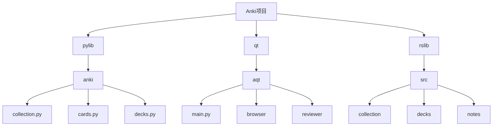
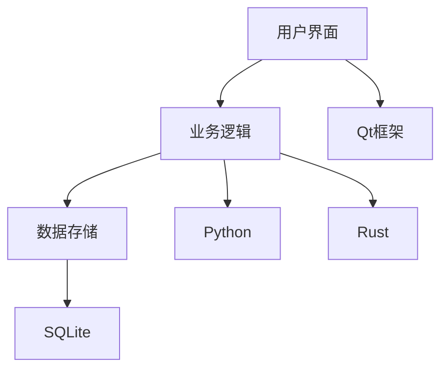
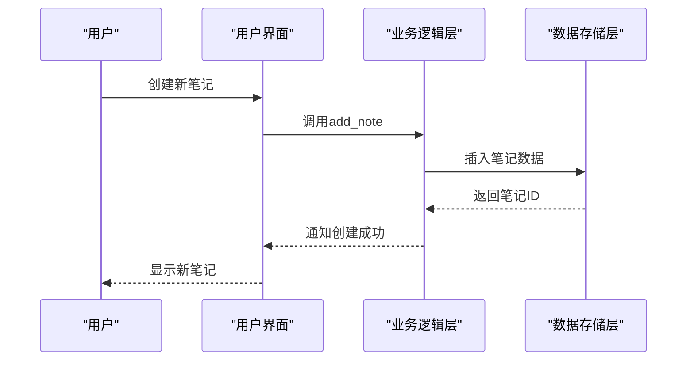
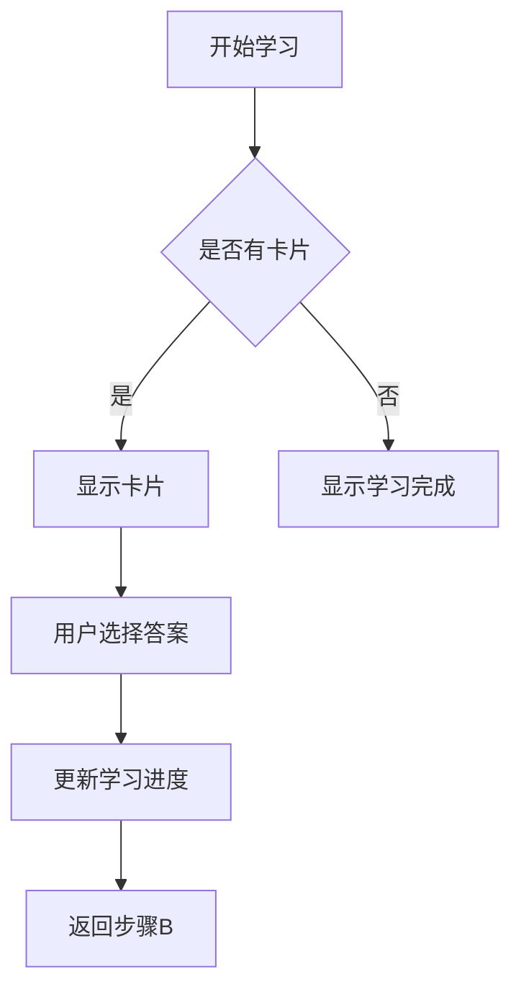
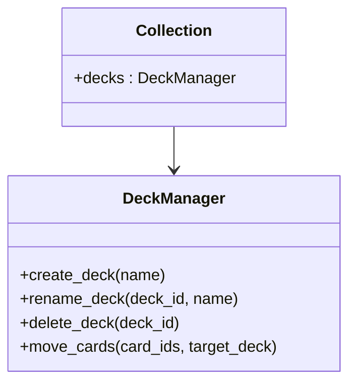
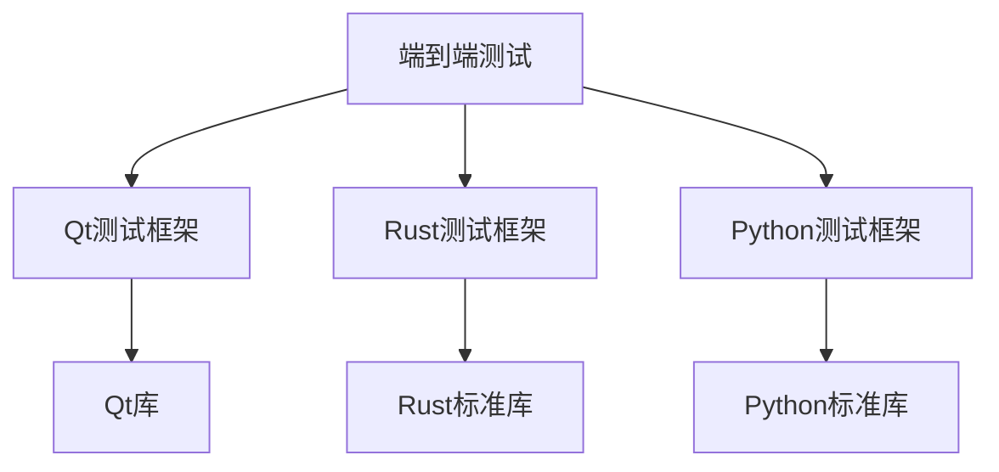

# 端到端测试

<cite>
**本文档中引用的文件**  
- [main.py](file://qt/aqt/main.py)
- [collection.py](file://pylib/anki/collection.py)
- [tests.rs](file://rslib/src/tests.rs)
- [test_collection.py](file://pylib/tests/test_collection.py)
- [test_addons.py](file://qt/tests/test_addons.py)
</cite>

## 目录
1. [引言](#引言)
2. [项目结构](#项目结构)
3. [核心组件](#核心组件)
4. [架构概述](#架构概述)
5. [详细组件分析](#详细组件分析)
6. [依赖分析](#依赖分析)
7. [性能考虑](#性能考虑)
8. [故障排除指南](#故障排除指南)
9. [结论](#结论)
10. [附录](#附录)（如有必要）

## 引言
本文档全面介绍了Anki应用程序的端到端测试实现。重点描述了使用Qt测试框架进行用户界面自动化测试的方法，包括创建笔记、学习卡片和管理牌组等用户操作的模拟。文档详细说明了如何验证从数据输入、持久化存储到界面更新的完整工作流。同时探讨了跨平台端到端测试的挑战和解决方案，确保在不同操作系统上的一致性。提供了测试覆盖率分析方法，确保关键用户场景得到充分测试，并为开发者提供了编写端到端测试的指南。

## 项目结构
Anki项目的目录结构清晰地划分了不同功能模块。核心功能实现在`pylib`目录中，包括卡片、牌组、笔记等核心数据结构和业务逻辑。Qt用户界面实现位于`qt/aqt`目录中，包含主窗口、浏览器、审查器等UI组件。Rust后端逻辑位于`rslib`目录中，提供高性能的核心功能实现。测试代码分布在`pylib/tests`和`qt/tests`目录中，分别包含Python和Qt相关的测试用例。

**Diagram sources**
- [main.py](file://qt/aqt/main.py#L0-L20)
- [collection.py](file://pylib/anki/collection.py#L10-L30)

**Section sources**
- [main.py](file://qt/aqt/main.py#L1-L50)
- [collection.py](file://pylib/anki/collection.py#L1-L50)

## 核心组件
Anki的端到端测试主要围绕核心组件展开，包括笔记管理、卡片学习和牌组管理。`Collection`类是核心数据管理组件，负责持久化存储和数据访问。`AnkiQt`类是主应用程序窗口，管理UI状态和用户交互。测试框架通过模拟用户操作来验证这些组件的正确性和稳定性。

**Section sources**
- [collection.py](file://pylib/anki/collection.py#L133-L160)
- [main.py](file://qt/aqt/main.py#L179-L1882)

## 架构概述
Anki采用分层架构设计，将UI层、业务逻辑层和数据存储层分离。UI层使用Qt框架实现跨平台用户界面。业务逻辑层由Python和Rust混合实现，Python负责高层逻辑，Rust负责性能关键路径。数据存储层使用SQLite数据库持久化数据。测试框架通过UI自动化测试验证各层之间的集成和交互。

**Diagram sources**
- [main.py](file://qt/aqt/main.py#L179-L1882)
- [collection.py](file://pylib/anki/collection.py#L133-L160)

## 详细组件分析

### 笔记管理组件分析
笔记管理是Anki的核心功能之一。测试需要验证从创建笔记、编辑内容到保存持久化的完整流程。`Collection`类提供了`add_note`和`update_note`等方法来管理笔记生命周期。

**Diagram sources**
- [collection.py](file://pylib/anki/collection.py#L133-L160)
- [main.py](file://qt/aqt/main.py#L179-L1882)

**Section sources**
- [collection.py](file://pylib/anki/collection.py#L133-L160)
- [test_collection.py](file://pylib/tests/test_collection.py#L0-L175)

### 卡片学习组件分析
卡片学习功能涉及复杂的调度算法和用户交互。测试需要验证卡片显示、答案选择和学习进度更新的正确性。`AnkiQt`类中的`reviewer`组件负责管理学习流程。

**Diagram sources**
- [main.py](file://qt/aqt/main.py#L179-L1882)
- [collection.py](file://pylib/anki/collection.py#L133-L160)

**Section sources**
- [main.py](file://qt/aqt/main.py#L179-L1882)
- [test_collection.py](file://pylib/tests/test_collection.py#L0-L175)

### 牌组管理组件分析
牌组管理功能允许用户组织和管理学习内容。测试需要验证牌组创建、编辑和删除操作的正确性，以及牌组间卡片移动的完整性。

**Diagram sources**
- [collection.py](file://pylib/anki/collection.py#L133-L160)
- [test_collection.py](file://pylib/tests/test_collection.py#L0-L175)

**Section sources**
- [collection.py](file://pylib/anki/collection.py#L133-L160)
- [test_collection.py](file://pylib/tests/test_collection.py#L0-L175)

## 依赖分析
Anki的测试框架依赖于多个外部库和工具。Qt测试框架用于UI自动化，Rust测试框架用于后端逻辑验证。测试代码与生产代码紧密耦合，需要确保测试的稳定性和可维护性。

**Diagram sources**
- [tests.rs](file://rslib/src/tests.rs#L0-L265)
- [test_addons.py](file://qt/tests/test_addons.py#L0-L77)

**Section sources**
- [tests.rs](file://rslib/src/tests.rs#L0-L265)
- [test_addons.py](file://qt/tests/test_addons.py#L0-L77)

## 性能考虑
端到端测试需要考虑性能影响。测试应该在合理的时间内完成，避免过度消耗系统资源。建议使用测试数据隔离和并行测试执行来提高测试效率。

## 故障排除指南
当端到端测试失败时，应首先检查测试环境配置是否正确。查看日志输出以确定失败的具体原因。对于UI测试，检查元素定位是否准确。对于数据验证，确认测试数据与预期结果的一致性。

**Section sources**
- [test_collection.py](file://pylib/tests/test_collection.py#L0-L175)
- [test_addons.py](file://qt/tests/test_addons.py#L0-L77)

## 结论
Anki的端到端测试框架为确保应用程序质量和稳定性提供了重要保障。通过全面的测试覆盖和自动化执行，可以有效发现和预防潜在问题。建议持续改进测试策略，增加测试覆盖率，提高测试效率，以支持Anki的持续发展和创新。