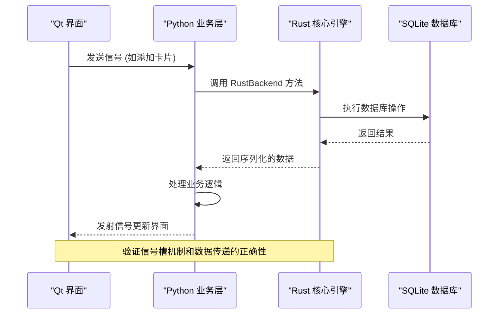
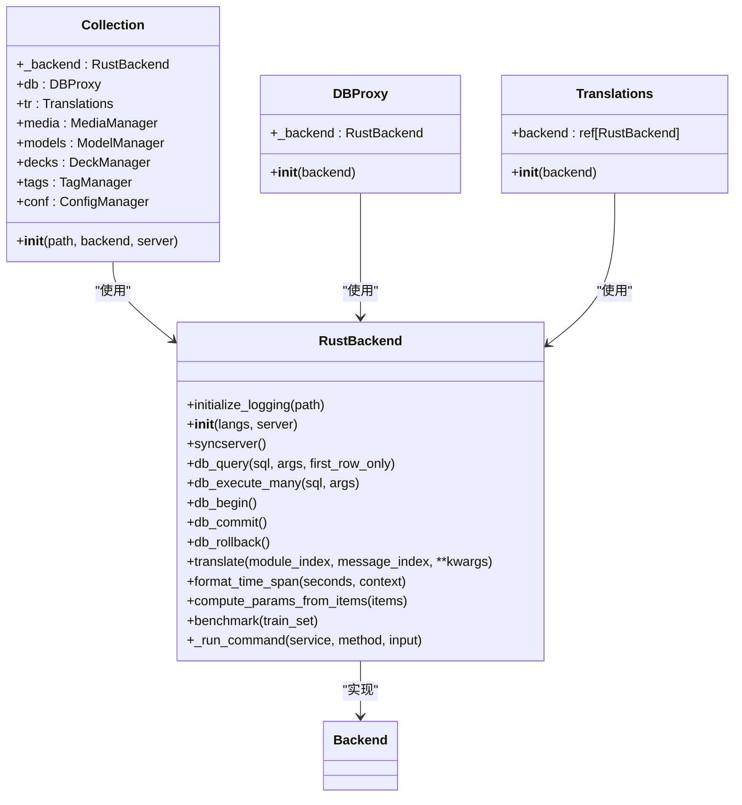
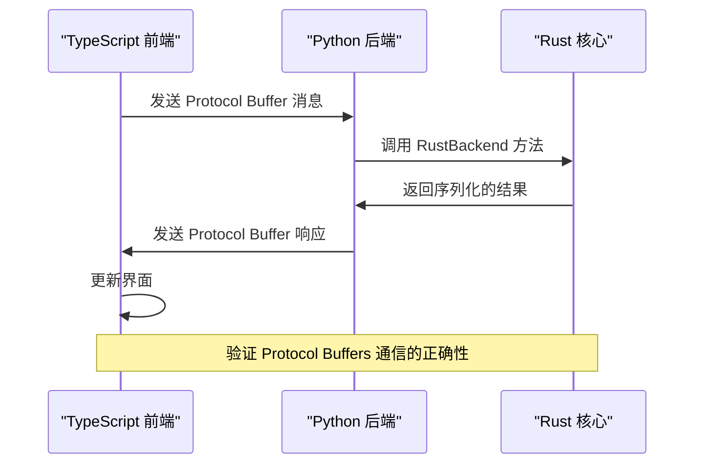
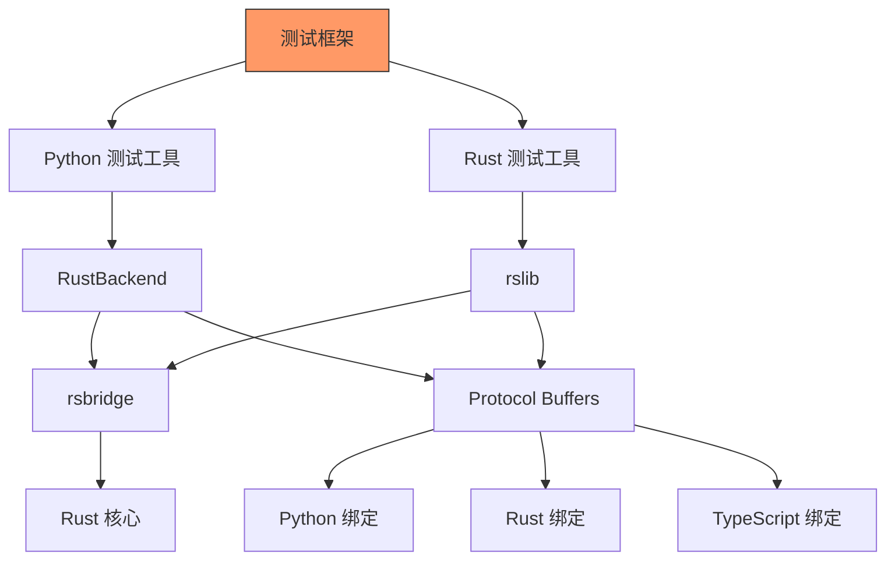

# 集成测试

<cite>
**本文档中引用的文件**  
- [RustBackend](file://pylib/anki/_backend.py#L55-L170)
- [collection.py](file://pylib/anki/collection.py#L141-L160)
- [dbproxy.py](file://pylib/anki/dbproxy.py#L27-L28)
- [progress.py](file://qt/aqt/progress.py#L21-L30)
- [BackendError](file://pylib/anki/errors.py#L27-L44)
- [BackendIOError](file://pylib/anki/errors.py#L73-L74)
- [Backend](file://pylib/anki/_rsbridge.pyi#L2-L5)
- [BackendCard](file://pylib/anki/cards.py#L34-L34)
- [Translations](file://pylib/anki/_backend.py#L174-L175)
- [proto](file://proto/anki/backend.proto)
- [rsbridge](file://pylib/rsbridge/lib.rs)
- [rust_interface.rs](file://rslib/rust_interface.rs)
- [build.rs](file://rslib/proto/build.rs)
- [python.rs](file://rslib/proto/python.rs)
- [typescript.rs](file://rslib/proto/typescript.rs)
</cite>

## 目录
1. [简介](#简介)
2. [项目结构](#项目结构)
3. [核心组件](#核心组件)
4. [架构概述](#架构概述)
5. [详细组件分析](#详细组件分析)
6. [依赖分析](#依赖分析)
7. [性能考虑](#性能考虑)
8. [故障排除指南](#故障排除指南)
9. [结论](#结论)
10. [附录](#附录)（如有必要）

## 简介
Anki 是一个跨平台的记忆辅助工具，其架构采用分层设计，将核心逻辑与用户界面分离。本集成测试文档重点描述跨层组件的集成测试架构，涵盖 Python 业务层与 Rust 核心引擎之间的接口测试、Qt 界面与后端服务的集成测试、前端 TypeScript 组件与 Python 后端通过 Protocol Buffers 通信的测试方法。文档提供实际测试案例，展示如何验证从卡片创建到学习调度的完整工作流，并涵盖测试环境搭建、依赖管理、异步操作处理和错误恢复机制。

## 项目结构
Anki 项目采用模块化结构，主要分为四个部分：Rust 核心库（rslib）、Python 库（pylib）、Qt GUI（aqt）和 TypeScript 前端（ts）。这种分层架构支持跨平台功能，同时允许不同技术栈的组件协同工作。Rust 核心引擎处理数据存储、调度算法等关键逻辑，Python 层作为业务逻辑的粘合层，Qt 提供桌面应用界面，TypeScript 则用于 Web 视图和现代前端组件。

```mermaid
graph TB
subgraph "前端"
Qt[Qt GUI (aqt)]
TS[TypeScript (ts)]
end
subgraph "业务逻辑"
Python[Python 库 (pylib)]
end
subgraph "核心引擎"
Rust[Rust 核心 (rslib)]
end
subgraph "协议定义"
Proto[Protocol Buffers (proto)]
end
Qt --> Python
TS --> Python
Python --> Rust
Proto --> Python
Proto --> Rust
Proto --> TS
```

**图示来源**
- [pylib](file://pylib)
- [rslib](file://rslib)
- [qt](file://qt)
- [ts](file://ts)
- [proto](file://proto)

**本节来源**
- [architecture.md](file://docs/architecture.md#L4-L32)

## 核心组件
Anki 的核心组件包括 RustBackend、Collection、DBProxy 和 ProgressManager。RustBackend 是 Python 与 Rust 核心之间的桥梁，通过 Protocol Buffers 进行通信。Collection 类封装了对 Anki 数据库的高级操作，DBProxy 提供数据库查询接口，ProgressManager 处理长时间运行操作的进度显示。这些组件共同构成了 Anki 的集成测试基础。

**本节来源**
- [RustBackend](file://pylib/anki/_backend.py#L55-L170)
- [collection.py](file://pylib/anki/collection.py#L141-L160)
- [dbproxy.py](file://pylib/anki/dbproxy.py#L27-L28)
- [progress.py](file://qt/aqt/progress.py#L21-L30)

## 架构概述
Anki 的集成测试架构围绕跨层通信构建，重点测试 Python 业务层与 Rust 核心引擎之间的接口。测试框架需要验证 Qt 界面与后端服务的信号槽机制和数据传递正确性，以及前端 TypeScript 组件与 Python 后端通过 Protocol Buffers 的通信。整个系统通过 Protocol Buffers 定义的接口进行通信，确保类型安全和跨语言兼容性。



**图示来源**
- [RustBackend](file://pylib/anki/_backend.py#L55-L170)
- [collection.py](file://pylib/anki/collection.py#L141-L160)
- [progress.py](file://qt/aqt/progress.py#L21-L30)

## 详细组件分析

### Python-Rust 接口测试
Python 与 Rust 核心引擎之间的接口是 Anki 集成测试的关键。RustBackend 类通过 _rsbridge 模块与 Rust 核心通信，所有方法调用都通过 Protocol Buffers 序列化。测试需要验证方法调用的正确性、参数序列化/反序列化、错误处理和性能。特别需要注意的是，直接访问后端方法不被推荐，应通过 Collection 类的公共方法进行。



**图示来源**
- [RustBackend](file://pylib/anki/_backend.py#L55-L170)
- [collection.py](file://pylib/anki/collection.py#L141-L160)
- [dbproxy.py](file://pylib/anki/dbproxy.py#L27-L28)
- [Translations](file://pylib/anki/_backend.py#L174-L175)

**本节来源**
- [RustBackend](file://pylib/anki/_backend.py#L55-L170)
- [collection.py](file://pylib/anki/collection.py#L141-L160)

### Qt 界面集成测试
Qt 界面与后端服务的集成测试重点关注信号槽机制和数据传递的正确性。ProgressManager 类处理长时间运行操作的进度显示，通过 QTimer 实现异步更新。测试需要验证信号的正确发射与接收、进度更新的及时性、异常处理以及界面响应性。特别需要注意主线程阻塞的检测，当操作耗时超过 200ms 时会发出警告。

```mermaid
flowchart TD
Start([界面操作开始]) --> EmitSignal["发射 Qt 信号"]
EmitSignal --> CallBackend["调用后端方法"]
CallBackend --> CheckThread["检查是否阻塞主线程"]
CheckThread --> |耗时>200ms| WarnBlocking["打印阻塞警告"]
CheckThread --> |正常| Continue["继续执行"]
CallBackend --> UpdateProgress["更新进度"]
UpdateProgress --> ShowWindow["显示进度窗口"]
ShowWindow --> WaitTimer["等待定时器"]
WaitTimer --> UpdateUI["更新用户界面"]
UpdateUI --> End([操作完成])
Note: 验证信号槽机制和数据传递的正确性
```

**图示来源**
- [progress.py](file://qt/aqt/progress.py#L21-L30)

**本节来源**
- [progress.py](file://qt/aqt/progress.py#L21-L30)

### Protocol Buffers 通信测试
前端 TypeScript 组件与 Python 后端通过 Protocol Buffers 进行通信，这是 Anki 集成测试的另一个关键点。proto 目录定义了所有跨语言接口，build.rs 脚本生成 Python、Rust 和 TypeScript 的绑定代码。测试需要验证消息的正确序列化/反序列化、类型转换的准确性、错误处理的一致性以及性能表现。



**图示来源**
- [build.rs](file://rslib/proto/build.rs)
- [python.rs](file://rslib/proto/python.rs)
- [typescript.rs](file://rslib/proto/typescript.rs)
- [backend.proto](file://proto/anki/backend.proto)

**本节来源**
- [build.rs](file://rslib/proto/build.rs)
- [python.rs](file://rslib/proto/python.rs)
- [typescript.rs](file://rslib/proto/typescript.rs)

### 复杂工作流测试
验证从卡片创建到学习调度的完整工作流是集成测试的核心目标。测试案例需要覆盖卡片创建、笔记处理、调度算法执行、学习过程和数据持久化等环节。通过模拟用户操作序列，验证整个工作流的正确性和鲁棒性，确保各组件协同工作无误。


**本节来源**
- [RustBackend](file://pylib/anki/_backend.py#L55-L170)
- [collection.py](file://pylib/anki/collection.py#L141-L160)

## 依赖分析
Anki 的集成测试依赖于多个关键组件和工具。Rust 核心引擎通过 rsbridge 模块与 Python 层通信，Protocol Buffers 定义了跨语言接口。测试框架需要处理异步操作、错误恢复和性能监控。依赖关系复杂，需要确保各组件版本兼容，特别是 Protocol Buffers 生成的绑定代码与核心库的同步。



**图示来源**
- [rsbridge](file://pylib/rsbridge/lib.rs)
- [rust_interface.rs](file://rslib/rust_interface.rs)
- [build.rs](file://rslib/proto/build.rs)

**本节来源**
- [rsbridge](file://pylib/rsbridge/lib.rs)
- [rust_interface.rs](file://rslib/rust_interface.rs)
- [build.rs](file://rslib/proto/build.rs)

## 性能考虑
集成测试需要特别关注性能问题，特别是主线程阻塞。RustBackend 的 _run_command 方法包含主线程阻塞检测，当操作耗时超过 200ms 时会打印警告。测试框架应监控各组件的响应时间，优化数据库查询，合理使用异步操作，并确保界面流畅性。性能测试应作为常规测试的一部分，防止性能退化。

## 故障排除指南
集成测试中常见的问题包括接口不匹配、序列化错误、异步操作处理不当和资源泄漏。错误处理机制通过 BackendError 和 BackendIOError 异常类实现，提供详细的错误信息和上下文。测试时应验证错误恢复机制的正确性，确保系统在异常情况下能够优雅降级并提供有用的错误信息。

**本节来源**
- [BackendError](file://pylib/anki/errors.py#L27-L44)
- [BackendIOError](file://pylib/anki/errors.py#L73-L74)

## 结论
Anki 的集成测试架构设计精良，通过分层架构和 Protocol Buffers 实现了跨语言组件的无缝集成。测试框架需要重点关注 Python-Rust 接口、Qt 信号槽机制和 Protocol Buffers 通信的正确性。通过系统化的测试案例，可以确保从卡片创建到学习调度的完整工作流稳定可靠。开发者应遵循最佳实践，编写健壮的集成测试，确保 Anki 的高质量和稳定性。

## 附录
### 测试环境搭建
1. 安装 Python 3.8+ 和 Rust 1.60+
2. 安装 Protocol Buffers 编译器
3. 安装 Node.js 和 Yarn
4. 运行 `yarn install` 安装前端依赖
5. 运行 `cargo build` 编译 Rust 核心
6. 运行 `python -m pip install -e pylib` 安装 Python 库

### 最佳实践
- 避免直接访问后端方法，使用 Collection 类的公共方法
- 测试异步操作时使用适当的等待机制
- 验证错误处理和恢复机制
- 监控性能，防止主线程阻塞
- 使用 Protocol Buffers 验证数据完整性
- 编写可维护的测试代码，遵循 DRY 原则