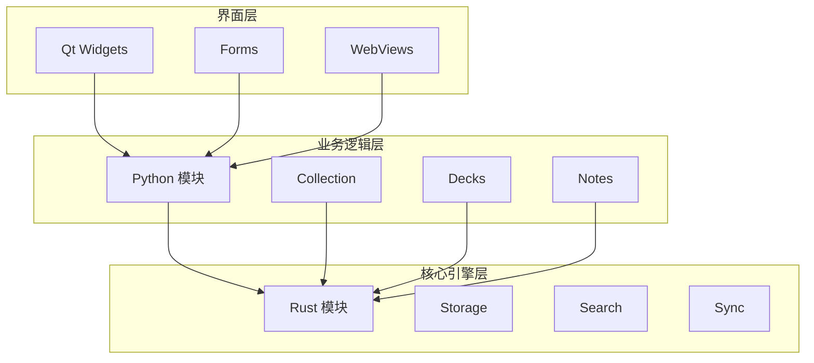
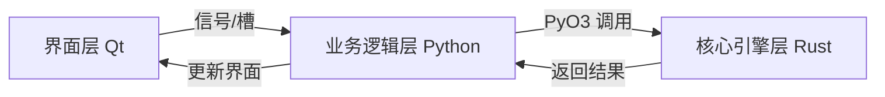
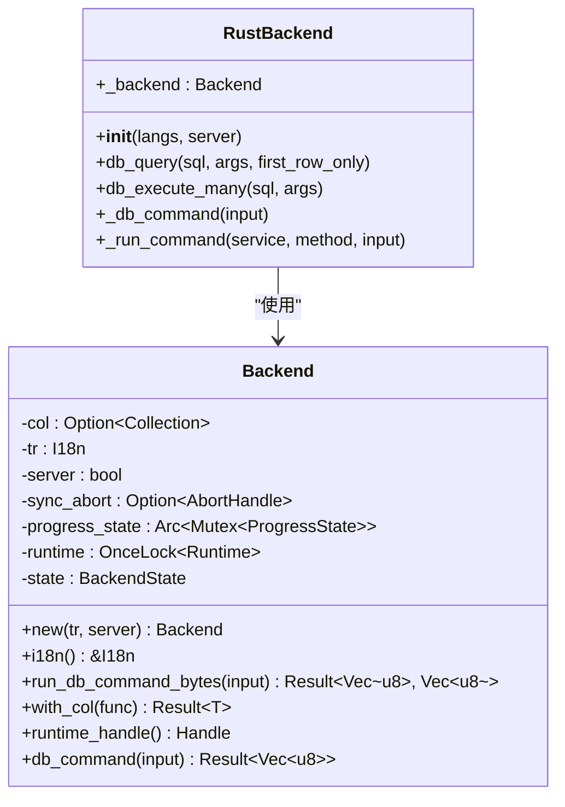
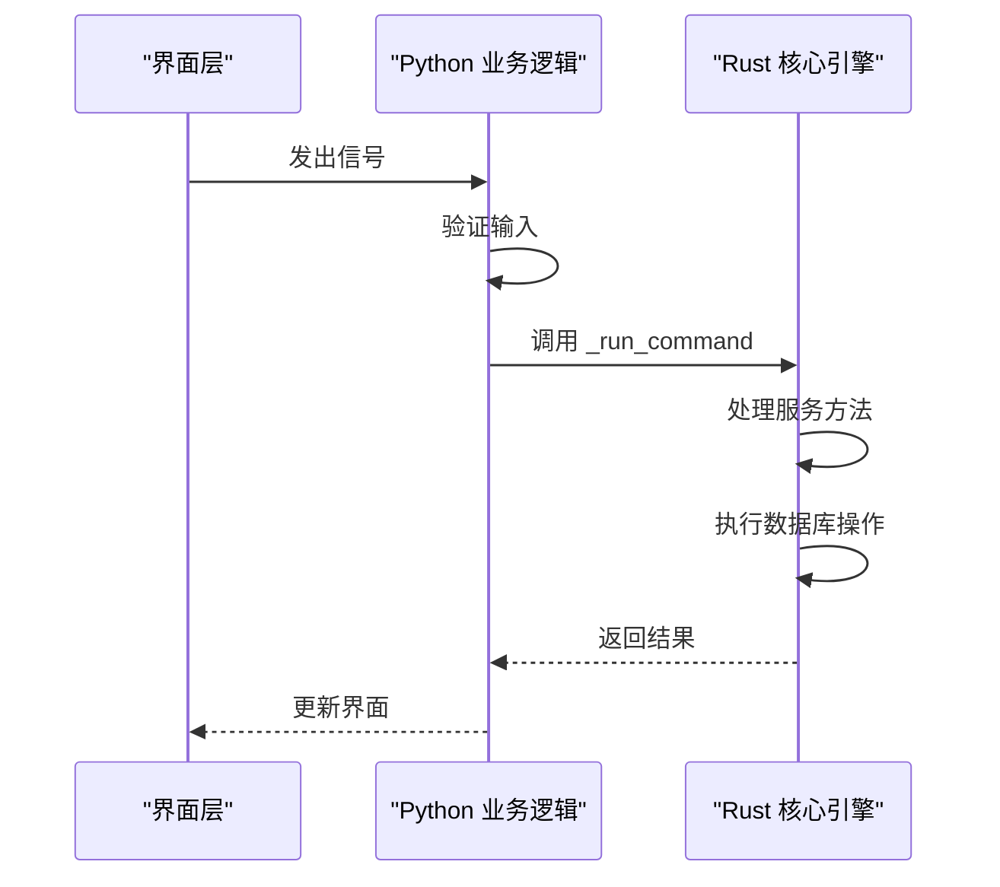
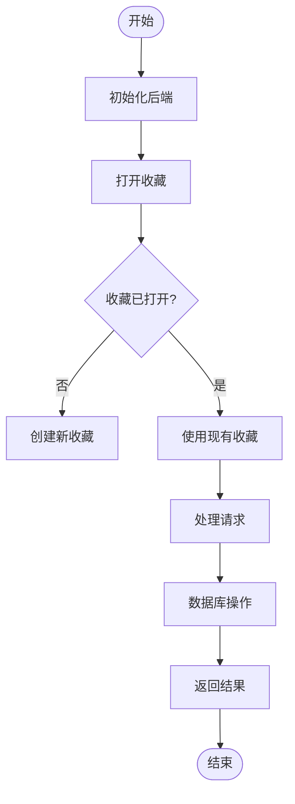
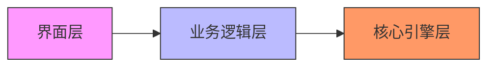

# 分层架构设计

<cite>
**本文档中引用的文件**  
- [rsbackend.py](file://pylib/anki/rsbackend.py)
- [_backend.py](file://pylib/anki/_backend.py)
- [lib.rs](file://pylib/rsbridge/lib.rs)
- [lib.rs](file://rslib/src/lib.rs)
- [mod.rs](file://rslib/src/backend/mod.rs)
- [collection.py](file://pylib/anki/collection.py)
- [dbproxy.py](file://pylib/anki/dbproxy.py)
</cite>

## 目录
1. [简介](#简介)
2. [项目结构](#项目结构)
3. [核心组件](#核心组件)
4. [架构概述](#架构概述)
5. [详细组件分析](#详细组件分析)
6. [依赖分析](#依赖分析)
7. [性能考虑](#性能考虑)
8. [故障排除指南](#故障排除指南)
9. [结论](#结论)

## 简介
Anki 采用三层架构设计，将用户界面、业务逻辑和核心引擎分离。这种设计实现了关注点分离，提高了可维护性，并允许各层使用最适合的技术栈。界面层使用 Qt 构建跨平台用户界面，业务逻辑层使用 Python 提供灵活的脚本能力，核心引擎层使用 Rust 确保高性能和内存安全。

## 项目结构
Anki 的项目结构清晰地反映了其分层架构。`qt` 目录包含 Qt 界面层代码，`pylib` 目录包含 Python 业务逻辑层代码，`rslib` 目录包含 Rust 核心引擎层代码。这种物理分离强化了逻辑分层，使开发者能够清晰地理解各层的职责和边界。

**图示来源**  
- [qt/aqt](file://qt/aqt)
- [pylib/anki](file://pylib/anki)
- [rslib/src](file://rslib/src)

**本节来源**  
- [project_structure](file://project_structure)

## 核心组件
Anki 的核心组件包括 `RustBackend` 类，它作为 Python 和 Rust 之间的桥梁，以及 `Backend` 结构体，它是 Rust 核心引擎的主要入口点。这些组件共同实现了跨语言互操作，使 Python 层能够调用 Rust 层的高性能功能。

**本节来源**  
- [rsbackend.py](file://pylib/anki/rsbackend.py#L1-L13)
- [_backend.py](file://pylib/anki/_backend.py#L1-L263)
- [lib.rs](file://rslib/src/lib.rs#L1-L59)

## 架构概述
Anki 的分层架构通过明确定义的接口实现各层之间的通信。界面层通过 Qt 信号槽机制与业务逻辑层交互，业务逻辑层通过 PyO3 绑定调用核心引擎层的 Rust 函数。这种设计确保了低耦合和高内聚，使各层可以独立开发和测试。

**图示来源**  
- [lib.rs](file://pylib/rsbridge/lib.rs#L1-L93)
- [mod.rs](file://rslib/src/backend/mod.rs#L1-L196)

## 详细组件分析

### 组件分析
Anki 的跨层通信通过精心设计的接口实现。Python 层的 `RustBackend` 类封装了对 Rust 后端的调用，提供了类型安全的 API。Rust 层通过 `init_backend` 函数初始化，并通过 `command` 和 `db_command` 方法处理来自 Python 层的请求。

#### 对于面向对象的组件：

**图示来源**  
- [_backend.py](file://pylib/anki/_backend.py#L88)
- [mod.rs](file://rslib/src/backend/mod.rs#L1-L196)

#### 对于 API/服务组件：

**图示来源**  
- [lib.rs](file://pylib/rsbridge/lib.rs#L50-L70)
- [_backend.py](file://pylib/anki/_backend.py#L200-L220)

#### 对于复杂逻辑组件：

**图示来源**  
- [mod.rs](file://rslib/src/backend/mod.rs#L150-L180)
- [collection.py](file://pylib/anki/collection.py#L147)

**本节来源**  
- [_backend.py](file://pylib/anki/_backend.py)
- [lib.rs](file://pylib/rsbridge/lib.rs)
- [mod.rs](file://rslib/src/backend/mod.rs)

## 依赖分析
Anki 各层之间的依赖关系是单向的，确保了架构的清晰性。界面层依赖业务逻辑层，业务逻辑层依赖核心引擎层，但反之则不成立。这种单向依赖防止了循环引用，使代码更易于维护和测试。

**图示来源**  
- [rsbackend.py](file://pylib/anki/rsbackend.py)
- [lib.rs](file://pylib/rsbridge/lib.rs)
- [Cargo.toml](file://Cargo.toml)

**本节来源**  
- [pyproject.toml](file://pyproject.toml)
- [Cargo.toml](file://Cargo.toml)

## 性能考虑
Anki 的分层架构在性能方面进行了精心优化。Rust 核心引擎层处理计算密集型任务和数据库操作，确保了高性能。Python 业务逻辑层通过批量操作和连接池减少跨层调用开销。Qt 界面层使用异步编程避免阻塞主线程，保持界面响应性。

## 故障排除指南
调试 Anki 的跨层问题时，应首先检查各层之间的接口。确保 Python 和 Rust 之间的数据序列化正确，验证 PyO3 绑定的完整性，并检查错误传播机制。使用日志记录可以帮助追踪请求在各层之间的流动，快速定位问题根源。

**本节来源**  
- [_backend.py](file://pylib/anki/_backend.py#L240-L260)
- [lib.rs](file://pylib/rsbridge/lib.rs#L10-L20)

## 结论
Anki 的分层架构设计成功地平衡了可维护性、性能和跨平台兼容性。通过将界面、业务逻辑和核心引擎分离，Anki 能够利用每种技术的最佳特性：Qt 的跨平台 GUI 能力、Python 的灵活性和 Rust 的性能与安全性。这种架构为未来的扩展和维护提供了坚实的基础。