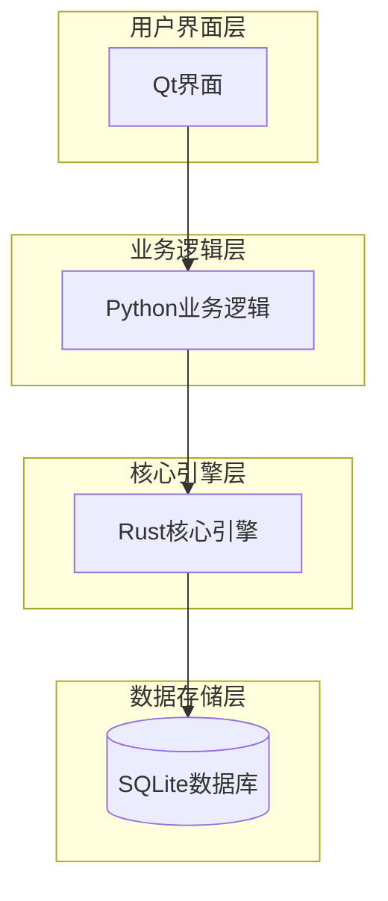
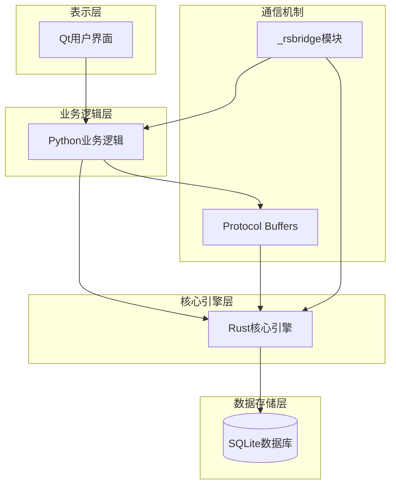
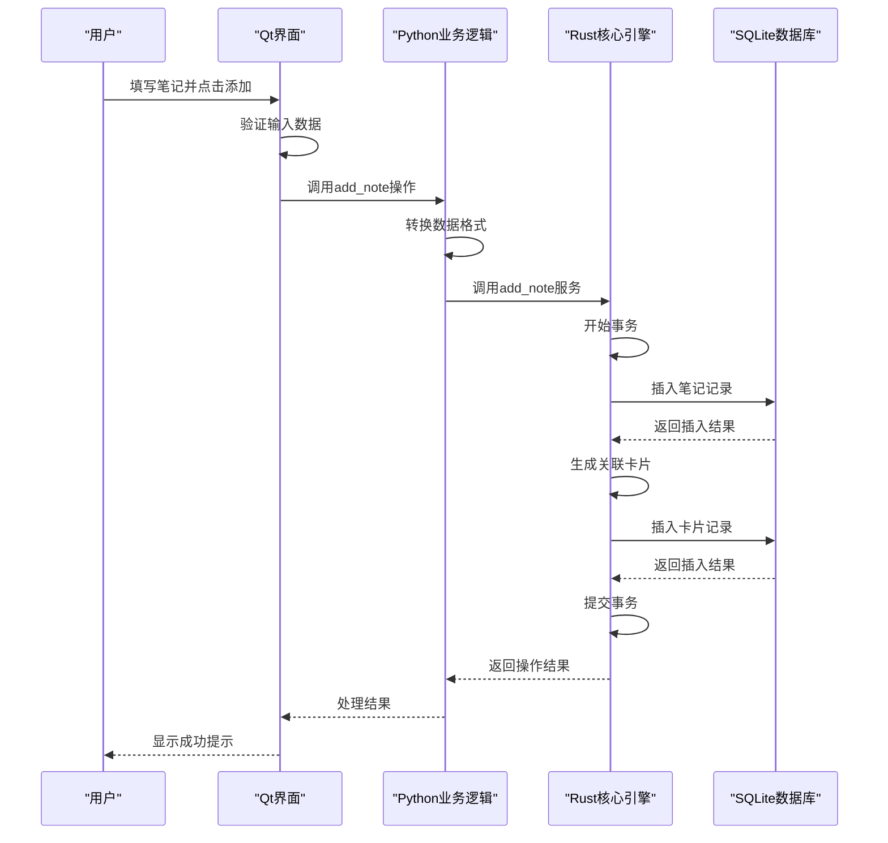
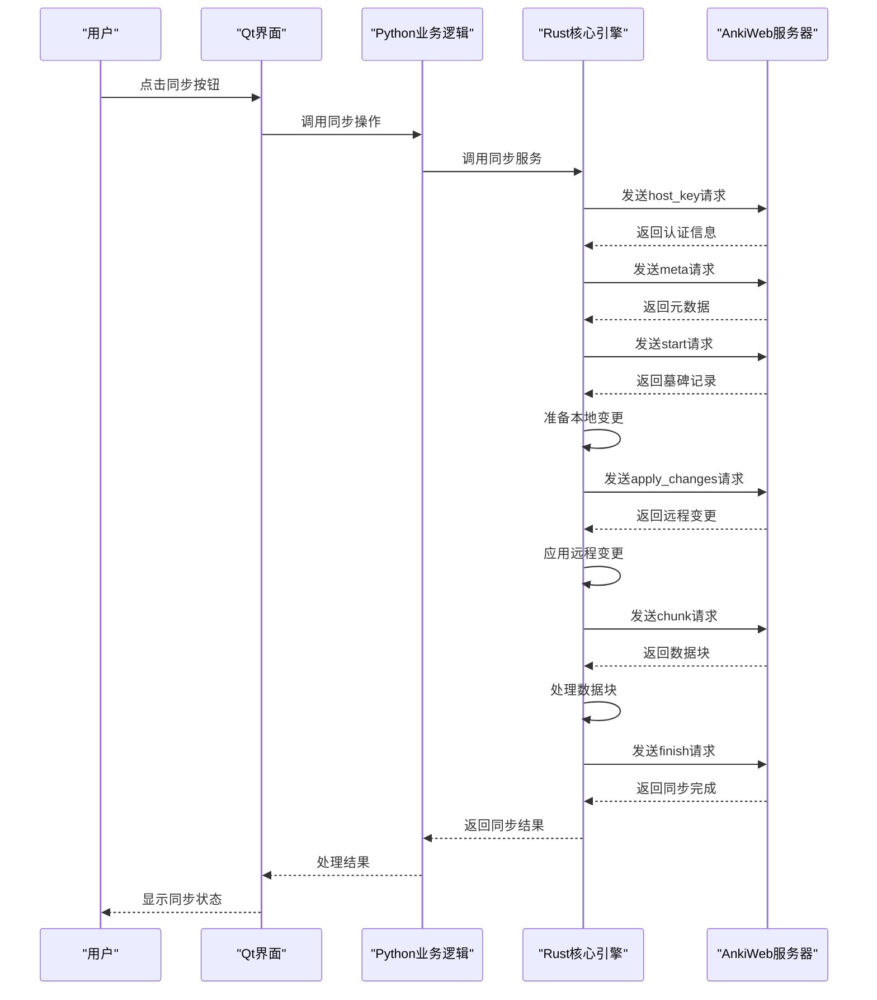

# 数据流分析

<cite>
**本文档引用的文件**
- [addcards.py](file://qt/aqt/addcards.py)
- [notes.py](file://pylib/anki/notes.py)
- [service.rs](file://rslib/src/notes/service.rs)
- [main.py](file://qt/aqt/main.py)
- [transact.rs](file://rslib/src/collection/transact.rs)
- [sync.rs](file://rslib/src/sync/collection/protocol.rs)
- [routes.rs](file://rslib/src/sync/http_server/routes.rs)
</cite>

## 目录
1. [简介](#简介)
2. [项目结构](#项目结构)
3. [核心组件](#核心组件)
4. [架构概述](#架构概述)
5. [详细组件分析](#详细组件分析)
6. [依赖分析](#依赖分析)
7. [性能考虑](#性能考虑)
8. [故障排除指南](#故障排除指南)
9. [结论](#结论)

## 简介
Anki是一款基于间隔重复算法的闪卡学习软件，其数据流设计体现了现代桌面应用的典型架构模式。本分析文档深入探讨Anki从用户界面操作到数据持久化的完整路径，重点分析Qt界面、Python业务逻辑层和Rust核心引擎之间的交互机制。系统采用分层架构，将用户界面、业务逻辑和数据存储分离，通过清晰的接口定义实现各层之间的通信。数据流始于用户在Qt界面的操作，经由Python层的业务逻辑处理，最终在Rust核心中完成数据处理并通过SQLite实现持久化。这种架构设计不仅提高了系统的可维护性和可扩展性，还通过Rust语言的安全特性保障了数据处理的可靠性。

## 项目结构
Anki项目采用模块化设计，主要分为四个核心目录：`qt`、`pylib`、`rslib`和`proto`。`qt`目录包含基于PyQt6的用户界面代码，负责处理用户交互和界面展示。`pylib`目录包含Python业务逻辑层，作为Qt界面和Rust核心之间的桥梁，处理业务规则和数据转换。`rslib`目录包含用Rust编写的高性能核心引擎，负责数据处理、算法执行和持久化操作。`proto`目录包含Protocol Buffers定义，用于跨语言数据序列化和接口定义。这种分层结构实现了关注点分离，使各层可以独立开发和优化。系统通过`_rsbridge`模块实现Python和Rust之间的高效通信，利用Protocol Buffers进行数据序列化，确保了跨语言调用的类型安全和性能。

**图示来源**
- [main.py](file://qt/aqt/main.py#L185-L227)
- [notes.py](file://pylib/anki/notes.py#L44-L82)

**本节来源**
- [main.py](file://qt/aqt/main.py#L185-L227)
- [notes.py](file://pylib/anki/notes.py#L44-L82)

## 核心组件
Anki的核心组件包括用户界面、业务逻辑、核心引擎和数据存储四个主要部分。用户界面组件基于Qt框架构建，提供丰富的交互功能，如笔记创建、卡片学习和数据同步。业务逻辑组件用Python实现，负责处理用户操作的业务规则，如验证输入数据、管理用户会话和协调跨组件操作。核心引擎组件用Rust实现，提供高性能的数据处理能力，包括笔记管理、卡片调度和同步协议处理。数据存储组件基于SQLite数据库，确保数据的持久化和一致性。这些组件通过明确定义的接口进行通信，形成清晰的数据流路径。系统还包含国际化支持、插件系统和媒体处理等辅助组件，共同构成了完整的Anki应用生态。

**本节来源**
- [addcards.py](file://qt/aqt/addcards.py#L0-L414)
- [notes.py](file://pylib/anki/notes.py#L0-L207)

## 架构概述
Anki采用分层架构设计，将系统划分为表示层、业务逻辑层、核心引擎层和数据存储层。表示层由Qt界面组成，负责用户交互和界面展示。业务逻辑层由Python代码实现，作为中间层处理业务规则和数据转换。核心引擎层由Rust代码实现，提供高性能的数据处理和算法执行。数据存储层基于SQLite数据库，负责数据的持久化和事务管理。各层之间通过明确定义的接口进行通信，确保了系统的模块化和可维护性。系统使用Protocol Buffers进行跨语言数据序列化，通过`_rsbridge`模块实现Python和Rust之间的高效调用。这种架构设计不仅提高了系统的性能和可靠性，还便于各层的独立开发和测试。

**图示来源**
- [main.py](file://qt/aqt/main.py#L185-L227)
- [service.rs](file://rslib/src/notes/service.rs#L0-L201)

## 详细组件分析

### 笔记创建流程分析
笔记创建流程始于用户在Qt界面的"添加笔记"对话框中输入内容。用户填写字段并点击"添加"按钮后，事件通过信号-槽机制传递到`AddCards`类的`add_current_note`方法。该方法首先验证输入数据的有效性，然后通过`add_note`操作将笔记数据传递到Python业务逻辑层。在Python层，`notes.py`中的`Note`类负责将用户数据转换为内部表示，并通过`_backend`接口调用Rust核心的`add_note`服务。Rust核心在`notes/service.rs`中实现`add_note`方法，该方法在事务上下文中执行笔记的持久化操作，确保数据的一致性和完整性。整个流程通过序列图清晰地展示了数据在各层间的传递过程。

**图示来源**
- [addcards.py](file://qt/aqt/addcards.py#L0-L414)
- [notes.py](file://pylib/anki/notes.py#L0-L207)
- [service.rs](file://rslib/src/notes/service.rs#L0-L201)

**本节来源**
- [addcards.py](file://qt/aqt/addcards.py#L0-L414)
- [notes.py](file://pylib/anki/notes.py#L0-L207)
- [service.rs](file://rslib/src/notes/service.rs#L0-L201)

### 数据同步流程分析
数据同步流程是Anki的核心功能之一，确保用户在不同设备间的数据一致性。同步过程始于用户在Qt界面触发同步操作，该操作通过Python业务逻辑层调用Rust核心的同步服务。Rust核心实现完整的同步协议，包括身份验证、元数据交换、变更应用和冲突解决等步骤。系统使用HTTP协议进行网络通信，通过`sync/http_server/routes.rs`定义的路由处理同步请求。同步过程采用增量同步策略，只传输发生变化的数据，提高同步效率。在同步过程中，系统维护详细的日志记录，便于故障排查和性能分析。整个同步流程通过状态机管理，确保在各种网络条件下都能正确处理同步操作。

**图示来源**
- [main.py](file://qt/aqt/main.py#L185-L227)
- [sync.rs](file://rslib/src/sync/collection/protocol.rs#L59-L91)
- [routes.rs](file://rslib/src/sync/http_server/routes.rs#L33-L56)

**本节来源**
- [main.py](file://qt/aqt/main.py#L185-L227)
- [sync.rs](file://rslib/src/sync/collection/protocol.rs#L59-L91)
- [routes.rs](file://rslib/src/sync/http_server/routes.rs#L33