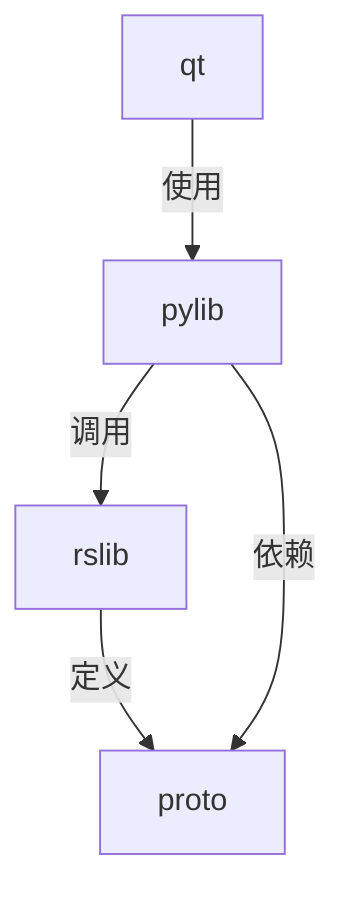
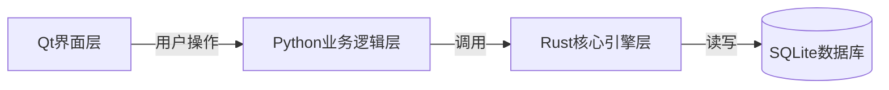
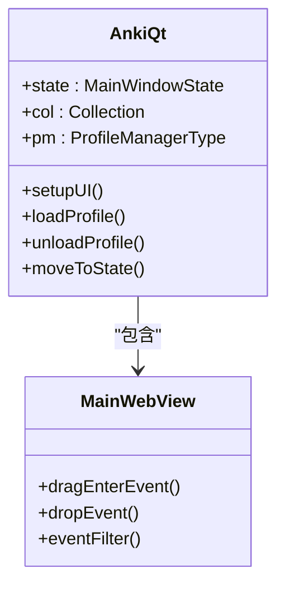
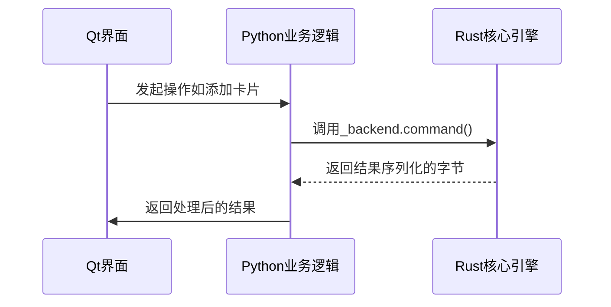
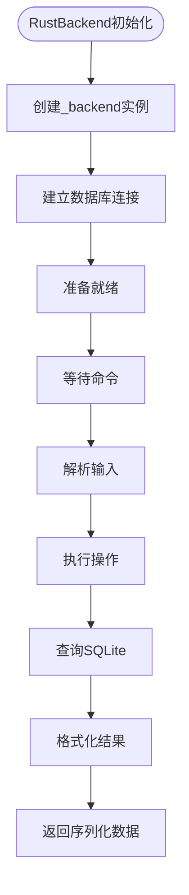
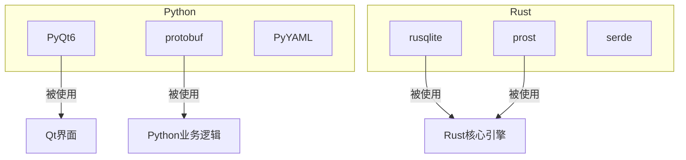

# 核心架构

<cite>
**本文档中引用的文件**  
- [main.py](file://qt/aqt/main.py)
- [_backend.py](file://pylib/anki/_backend.py)
- [rsbackend.py](file://pylib/anki/rsbackend.py)
- [lib.rs](file://rslib/src/lib.rs)
- [Cargo.toml](file://Cargo.toml)
- [pyproject.toml](file://pyproject.toml)
- [rust_interface.rs](file://rslib/rust_interface.rs)
</cite>

## 目录
1. [简介](#简介)
2. [项目结构](#项目结构)
3. [核心组件](#核心组件)
4. [架构概述](#架构概述)
5. [详细组件分析](#详细组件分析)
6. [依赖分析](#依赖分析)
7. [性能考虑](#性能考虑)
8. [故障排除指南](#故障排除指南)
9. [结论](#结论)

## 简介
Anki是一款基于间隔重复算法的记忆辅助软件，其核心架构采用分层设计，实现了界面层、业务逻辑层和核心引擎层的清晰分离。该系统通过Qt构建桌面用户界面，使用Python作为中间层业务逻辑的粘合语言，并将高性能计算和数据持久化任务委托给Rust编写的核心引擎。这种架构设计既保证了开发效率和跨平台兼容性，又确保了关键路径上的性能表现。

## 项目结构
Anki的项目结构体现了其多语言、分层的技术栈。主要目录包括：`qt`目录存放Qt界面层代码，`pylib`目录包含Python业务逻辑和Rust桥接代码，`rslib`目录存放Rust核心引擎实现，`proto`目录定义了跨语言通信的协议缓冲区（Protocol Buffers）消息格式。

**图示来源**
- [main.py](file://qt/aqt/main.py#L0-L10)
- [_backend.py](file://pylib/anki/_backend.py#L0-L10)
- [lib.rs](file://rslib/src/lib.rs#L0-L10)

**本节来源**
- [main.py](file://qt/aqt/main.py#L0-L50)
- [_backend.py](file://pylib/anki/_backend.py#L0-L50)

## 核心组件
Anki的核心组件包括Qt界面层、Python业务逻辑层和Rust核心引擎层。Qt界面层负责用户交互和UI渲染；Python层作为粘合层，协调界面与核心引擎的通信，并处理业务逻辑；Rust核心引擎负责数据存储、算法计算和持久化操作。这三层通过明确定义的接口进行交互，确保了系统的模块化和可维护性。

**本节来源**
- [main.py](file://qt/aqt/main.py#L55-L100)
- [_backend.py](file://pylib/anki/_backend.py#L55-L170)
- [rsbackend.py](file://pylib/anki/rsbackend.py#L0-L13)

## 架构概述
Anki采用清晰的分层架构，从用户操作到数据存储的完整路径如下：用户在Qt界面发起操作，事件被Python业务逻辑层捕获，Python层通过`_rsbridge`模块调用Rust核心引擎提供的功能，Rust引擎执行具体操作（如查询、更新）并直接与SQLite数据库交互。这种设计将计算密集型任务和数据访问逻辑从Python层剥离，提升了整体性能。

**图示来源**
- [main.py](file://qt/aqt/main.py#L100-L150)
- [_backend.py](file://pylib/anki/_backend.py#L100-L150)
- [lib.rs](file://rslib/src/lib.rs#L100-L150)

## 详细组件分析

### Qt界面层分析
Qt界面层是Anki的用户交互入口，使用PyQt6实现跨平台GUI。它负责渲染主窗口、卡片浏览器、复习界面等，并处理用户的鼠标和键盘事件。

**图示来源**
- [main.py](file://qt/aqt/main.py#L200-L400)

**本节来源**
- [main.py](file://qt/aqt/main.py#L150-L500)

### Python业务逻辑层分析
Python层是连接界面与核心引擎的桥梁。`_backend.py`文件中的`RustBackend`类是核心，它通过`_rsbridge`模块与Rust代码通信。该层负责序列化/反序列化数据、处理异常，并为上层提供更易用的API。

**图示来源**
- [_backend.py](file://pylib/anki/_backend.py#L55-L170)
- [rsbackend.py](file://pylib/anki/rsbackend.py#L0-L13)

**本节来源**
- [_backend.py](file://pylib/anki/_backend.py#L50-L200)

### Rust核心引擎层分析
Rust核心引擎是Anki的性能关键所在，负责实现所有核心算法和数据持久化。它通过`lib.rs`中的`RustBackendGenerated` trait暴露功能，并使用Protocol Buffers进行跨语言通信。引擎直接操作SQLite数据库，确保了数据访问的高效性。

**图示来源**
- [lib.rs](file://rslib/src/lib.rs#L0-L50)
- [rust_interface.rs](file://rslib/rust_interface.rs#L0-L50)

**本节来源**
- [lib.rs](file://rslib/src/lib.rs#L0-L100)
- [rust_interface.rs](file://rslib/rust_interface.rs#L0-L100)

## 依赖分析
Anki的依赖关系清晰地反映了其技术栈。Python层依赖于PyQt6用于GUI，依赖于`protobuf`用于序列化。Rust层依赖于`rusqlite`用于数据库操作，依赖于`prost`用于Protocol Buffers编解码。整个系统通过`Cargo.toml`和`pyproject.toml`文件进行依赖管理。

**图示来源**
- [Cargo.toml](file://Cargo.toml#L1-L20)
- [pyproject.toml](file://pyproject.toml#L1-L20)

**本节来源**
- [Cargo.toml](file://Cargo.toml#L1-L30)
- [pyproject.toml](file://pyproject.toml#L1-L30)

## 性能考虑
Anki的架构设计充分考虑了性能。通过将计算密集型任务（如调度算法、数据库查询）移至Rust层，避免了Python的GIL限制。Rust引擎直接与SQLite交互，减少了中间层的开销。此外，系统在主线程阻塞超过200ms时会打印警告，帮助开发者识别性能瓶颈。

## 故障排除指南
当遇到Anki启动失败或数据损坏时，应首先检查日志文件。核心引擎的异常会通过`backend_exception_to_pylib`函数转换为Python异常，并附带帮助页面链接。数据库问题可通过`db_check`工具诊断，备份文件位于`backupFolder()`指定的目录中。

**本节来源**
- [_backend.py](file://pylib/anki/_backend.py#L170-L263)
- [dbcheck.py](file://qt/aqt/dbcheck.py#L0-L50)

## 结论
Anki的核心架构是一个成功的多语言分层设计范例。通过将用户界面、业务逻辑和核心引擎分离，并利用每种语言的优势（Qt的跨平台GUI、Python的开发效率、Rust的性能和安全性），Anki实现了功能、性能和可维护性的良好平衡。这种架构为未来的功能扩展和性能优化提供了坚实的基础。