# 组件关系图

<cite>
**本文档中引用的文件**   
- [main.py](file://qt/aqt/main.py)
- [_backend.py](file://pylib/anki/_backend.py)
- [collection.py](file://pylib/anki/collection.py)
- [backend.proto](file://proto/anki/backend.proto)
- [frontend.proto](file://proto/anki/frontend.proto)
- [sync.proto](file://proto/anki/sync.proto)
- [lib.rs](file://rslib/src/lib.rs)
- [adding.rs](file://rslib/src/backend/adding.rs)
</cite>

## 目录
1. [引言](#引言)
2. [核心组件架构](#核心组件架构)
3. [Qt界面与Python桥接](#qt界面与python桥接)
4. [TypeScript前端与Protocol Buffers通信](#typescript前端与protocol-buffers通信)
5. [组件间通信机制](#组件间通信机制)
6. [解耦策略与接口设计](#解耦策略与接口设计)
7. [生命周期管理与错误传播](#生命周期管理与错误传播)
8. [开发者指南](#开发者指南)
9. [常见问题解决方案](#常见问题解决方案)

## 引言
Anki是一款功能强大的间隔重复记忆软件，其架构设计体现了现代软件工程的最佳实践。本文档深入探讨Anki的核心组件关系，重点分析Qt界面组件如何通过Python桥接调用Rust核心功能，以及TypeScript前端组件如何通过Protocol Buffers与后端通信。通过详细的UML组件图和代码示例，我们将揭示Anki复杂的组件交互机制，为开发者提供理解系统架构的实用指南。

## 核心组件架构
Anki的架构采用分层设计，将用户界面、业务逻辑和数据存储分离。系统主要由四个层次组成：Qt界面层、Python桥接层、Rust核心层和数据存储层。这种分层架构不仅提高了代码的可维护性，还允许不同技术栈的组件协同工作。

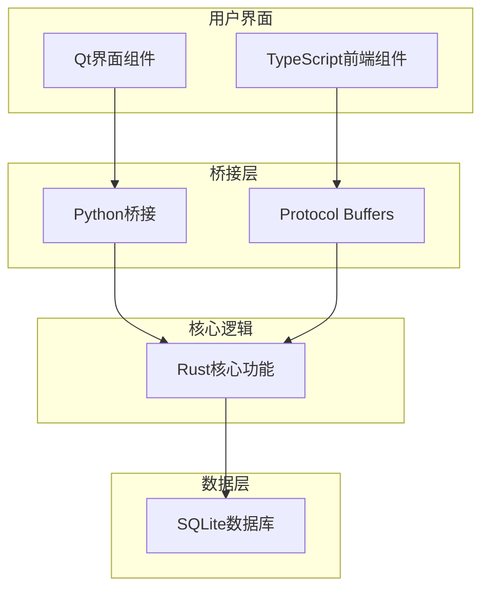

**图示来源**
- [main.py](file://qt/aqt/main.py#L179-L1882)
- [_backend.py](file://pylib/anki/_backend.py#L55-L170)
- [collection.py](file://pylib/anki/collection.py#L133-L1297)

**本节来源**
- [main.py](file://qt/aqt/main.py#L179-L1882)
- [_backend.py](file://pylib/anki/_backend.py#L55-L170)

## Qt界面与Python桥接
Qt界面组件通过Python桥接调用Rust核心功能，这一过程涉及多个关键组件的协同工作。`AnkiQt`类作为主窗口控制器，持有一个`RustBackend`实例的引用，通过这个引用与Rust核心进行通信。

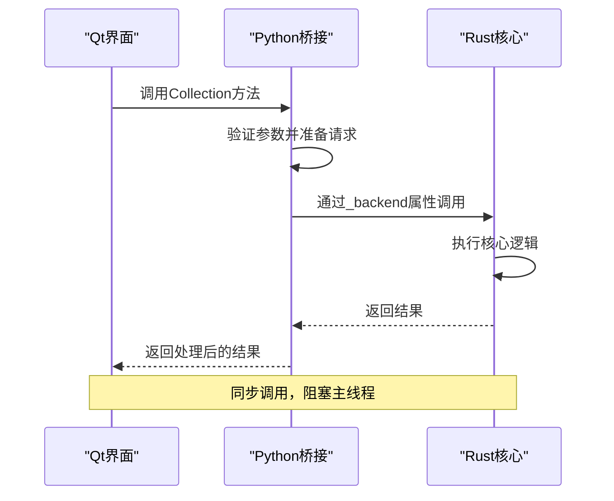

**图示来源**
- [main.py](file://qt/aqt/main.py#L194-L194)
- [_backend.py](file://pylib/anki/_backend.py#L88-L88)
- [collection.py](file://pylib/anki/collection.py#L170-L176)

`Collection`类作为Python桥接的核心，封装了对Rust后端的访问。它通过`_backend`属性持有`RustBackend`实例，并提供一系列公共方法供Qt界面调用。这些方法在调用底层Rust功能之前会进行参数验证和预处理，在接收到结果后会进行后处理和错误转换。

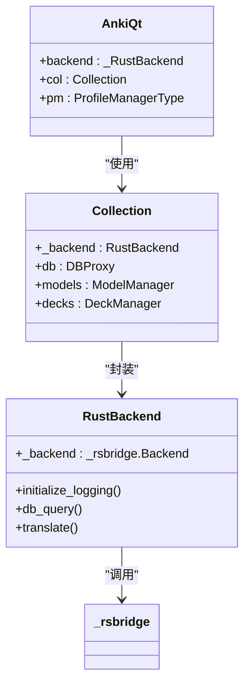

**图示来源**
- [main.py](file://qt/aqt/main.py#L179-L1882)
- [collection.py](file://pylib/anki/collection.py#L133-L1297)
- [_backend.py](file://pylib/anki/_backend.py#L55-L170)

**本节来源**
- [main.py](file://qt/aqt/main.py#L179-L1882)
- [collection.py](file://pylib/anki/collection.py#L133-L1297)
- [_backend.py](file://pylib/anki/_backend.py#L55-L170)

## TypeScript前端与Protocol Buffers通信
TypeScript前端组件通过Protocol Buffers与后端通信，这种设计实现了前后端的完全解耦。`frontend.proto`文件定义了前端服务的接口，包括获取调度状态、更新界面状态等操作。

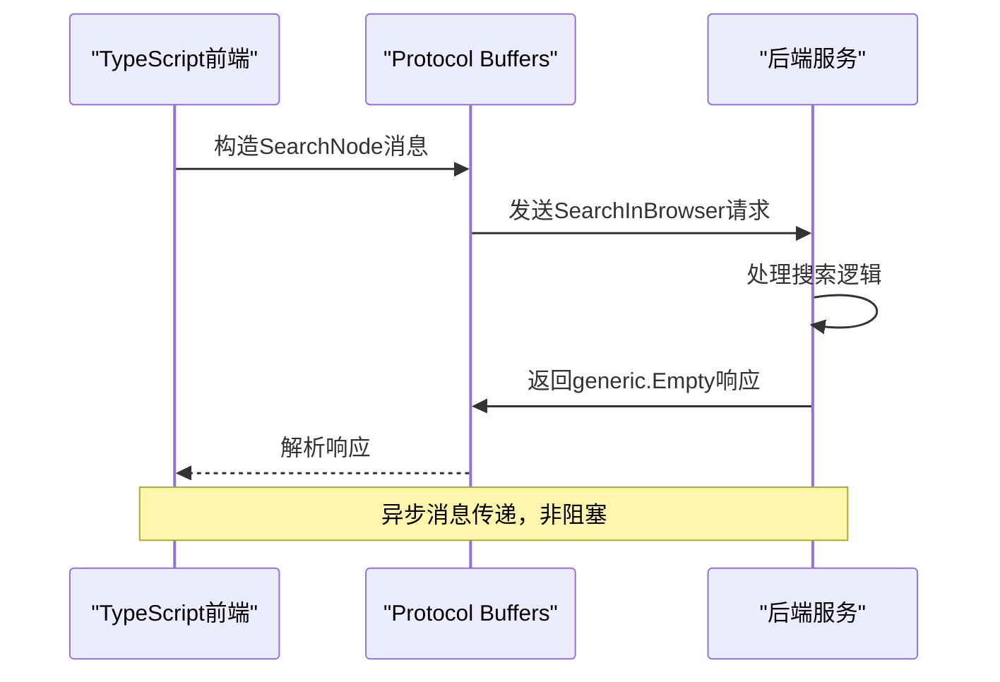

**图示来源**
- [frontend.proto](file://proto/anki/frontend.proto#L1-L45)
- [lib.rs](file://rslib/src/lib.rs#L1-L58)

`FrontendService`定义了前端可以调用的服务方法，如`GetSchedulingStatesWithContext`和`SetSchedulingStates`。这些方法通过Protocol Buffers序列化和反序列化消息，确保了跨语言通信的可靠性和效率。

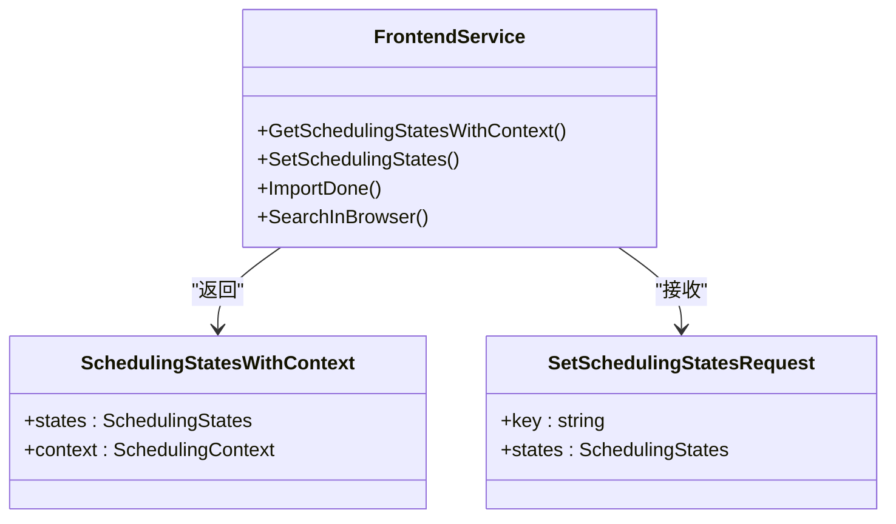

**图示来源**
- [frontend.proto](file://proto/anki/frontend.proto#L1-L45)

**本节来源**
- [frontend.proto](file://proto/anki/frontend.proto#L1-L45)
- [lib.rs](file://rslib/src/lib.rs#L1-L58)

## 组件间通信机制
Anki的组件间通信采用多种模式，包括同步调用、异步消息传递和事件驱动模式。这些模式的选择基于操作的性质和性能要求。

### 同步调用
对于需要立即响应的操作，如卡片查询和数据更新，系统采用同步调用模式。这种模式确保了操作的原子性和一致性，但可能阻塞主线程。

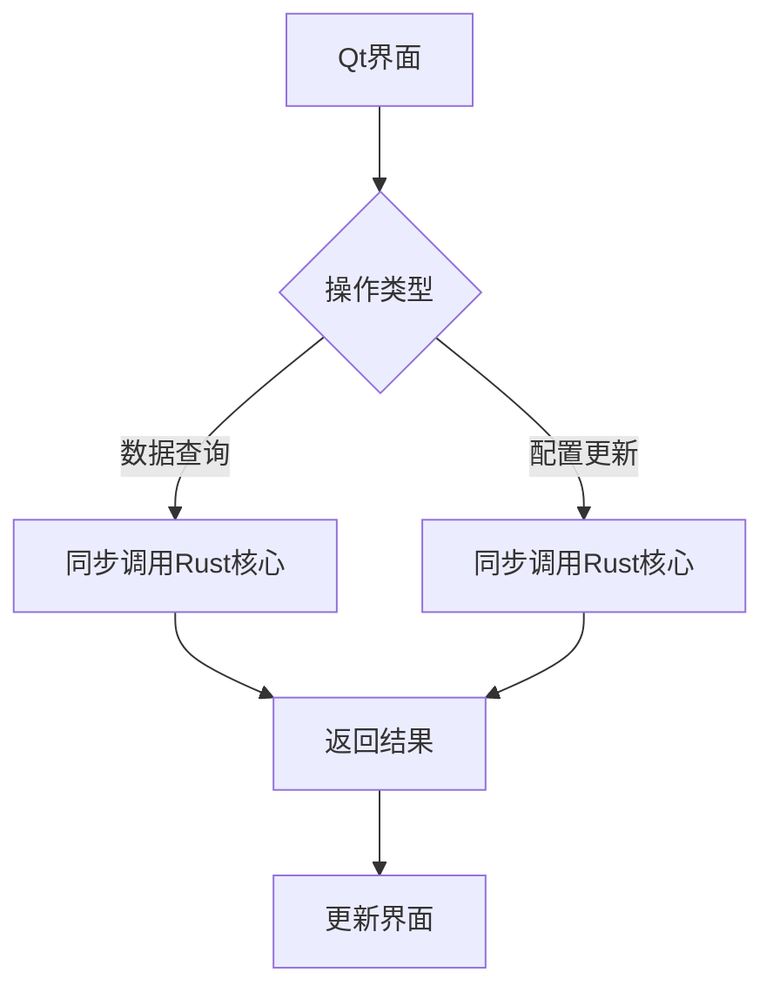

### 异步消息传递
对于耗时较长的操作，如媒体同步和全量同步，系统采用异步消息传递模式。这种模式通过后台任务执行操作，避免阻塞用户界面。

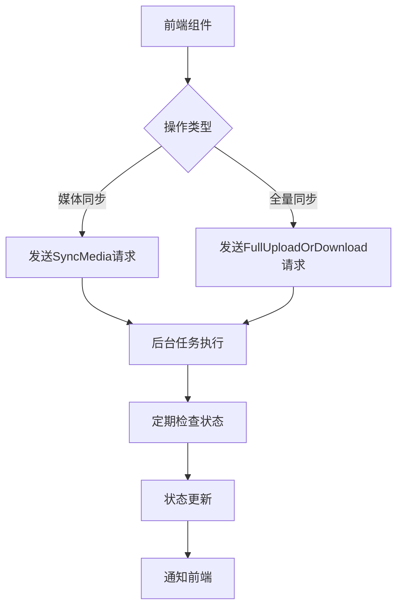

**图示来源**
- [sync.proto](file://proto/anki/sync.proto#L1-L90)

### 事件驱动模式
系统使用事件驱动模式来处理状态变化和用户交互。`gui_hooks`模块定义了一系列钩子，允许组件订阅和发布事件。

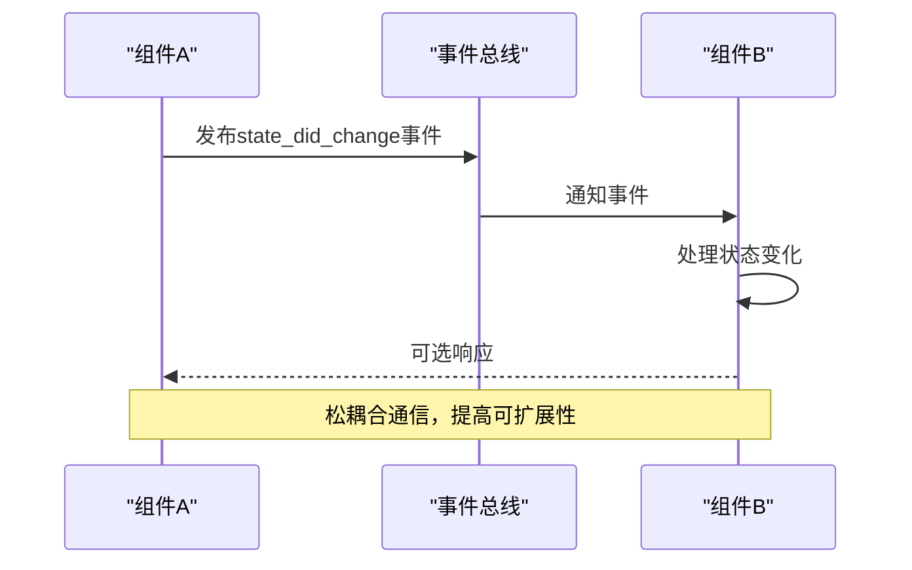

**本节来源**
- [sync.proto](file://proto/anki/sync.proto#L1-L90)
- [collection.py](file://pylib/anki/collection.py#L133-L1297)

## 解耦策略与接口设计
Anki采用多种解耦策略来提高系统的可维护性和可扩展性。接口设计遵循单一职责原则和依赖倒置原则，确保组件间的松耦合。

### 接口隔离
系统通过定义清晰的接口来隔离不同层次的组件。`RustBackend`类提供了与Rust核心交互的统一接口，而具体的实现细节对上层组件透明。

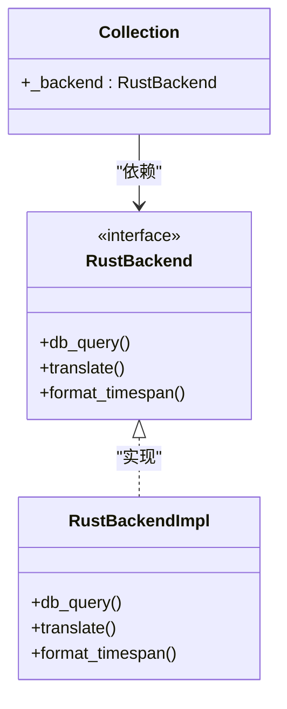

### 依赖注入
系统使用依赖注入来管理组件间的依赖关系。`Collection`类的构造函数接受一个可选的`backend`参数，允许在测试时注入模拟对象。

```python
def __init__(
    self,
    path: str,
    backend: RustBackend | None = None,
    server: bool = False,
) -> None:
    self._backend = backend or RustBackend(server=server)
```

### 协议优先
对于跨语言通信，系统优先使用Protocol Buffers定义的协议。这种设计确保了接口的稳定性和向后兼容性。

**本节来源**
- [collection.py](file://pylib/anki/collection.py#L141-L160)
- [_backend.py](file://pylib/anki/_backend.py#L73-L88)

## 生命周期管理与错误传播
Anki的组件生命周期管理严谨，确保资源的正确分配和释放。错误传播机制设计完善，能够提供详细的错误信息和上下文。

### 生命周期管理
`AnkiQt`类负责管理主窗口的生命周期，包括初始化、配置加载、集合打开和关闭、以及应用程序退出。

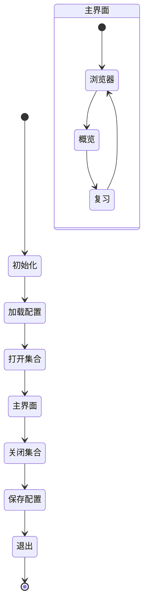

### 错误传播
系统使用`BackendError`消息来传播错误，包含错误类型、消息、帮助页面和上下文信息。

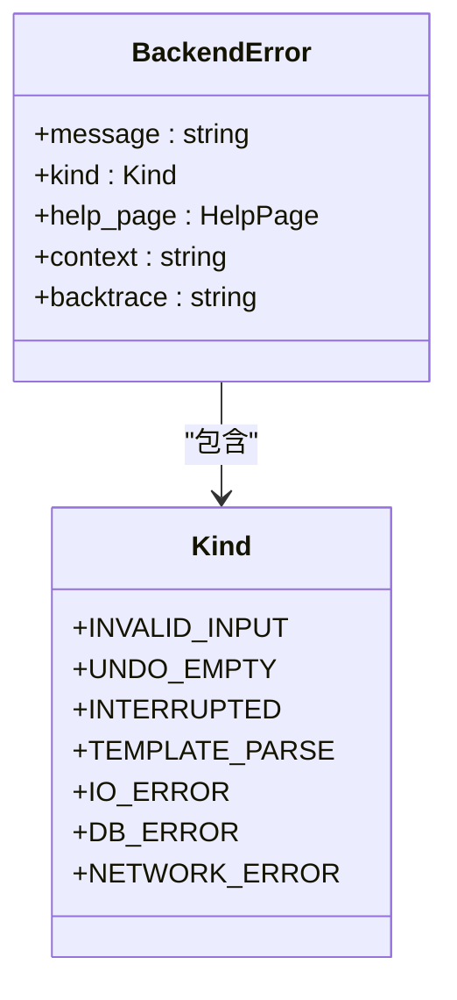

**图示来源**
- [backend.proto](file://proto/anki/backend.proto#L1-L62)

**本节来源**
- [main.py](file://qt/aqt/main.py#L179-L1882)
- [backend.proto](file://proto/anki/backend.proto#L1-L62)

## 开发者指南
本节为开发者提供理解Anki复杂组件交互的实用指南，包括最佳实践和常见陷阱。

### 最佳实践
1. **使用公共API**：避免直接访问`_backend`属性，应使用`Collection`类提供的公共方法。
2. **异步操作**：耗时操作应在后台线程执行，避免阻塞UI线程。
3. **错误处理**：正确处理`BackendError`，提供用户友好的错误信息。

### 调试技巧
1. **启用日志**：调用`Collection.initialize_backend_logging()`启用后端日志。
2. **使用钩子**：利用`gui_hooks`调试组件间的交互。
3. **单元测试**：为新功能编写单元测试，确保向后兼容性。

**本节来源**
- [collection.py](file://pylib/anki/collection.py#L137-L139)
- [main.py](file://qt/aqt/main.py#L179-L1882)

## 常见问题解决方案
本节列出开发者在集成Anki组件时可能遇到的常见问题及其解决方案。

### 问题1：主线程阻塞
**症状**：界面冻结，响应迟缓。
**原因**：在主线程执行耗时的Rust调用。
**解决方案**：使用`taskman.run_in_background()`在后台线程执行操作。

### 问题2：组件间通信失败
**症状**：状态不同步，界面更新不及时。
**原因**：未正确触发或监听`gui_hooks`事件。
**解决方案**：确保在状态变化时触发相应的钩子，并在组件初始化时注册事件监听器。

### 问题3：内存泄漏
**症状**：内存使用持续增长。
**原因**：未正确释放`weakref`引用或未清理事件监听器。
**解决方案**：在组件销毁时清理所有引用和监听器。

**本节来源**
- [main.py](file://qt/aqt/main.py#L179-L1882)
- [collection.py](file://pylib/anki/collection.py#L133-L1297)