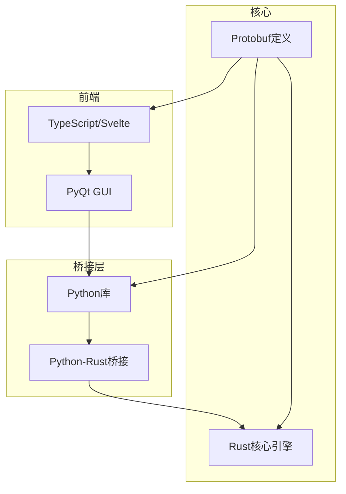
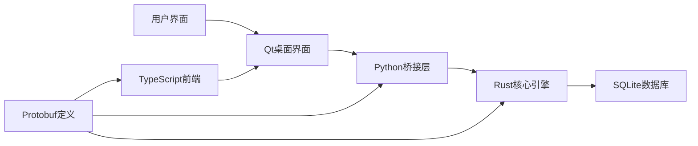
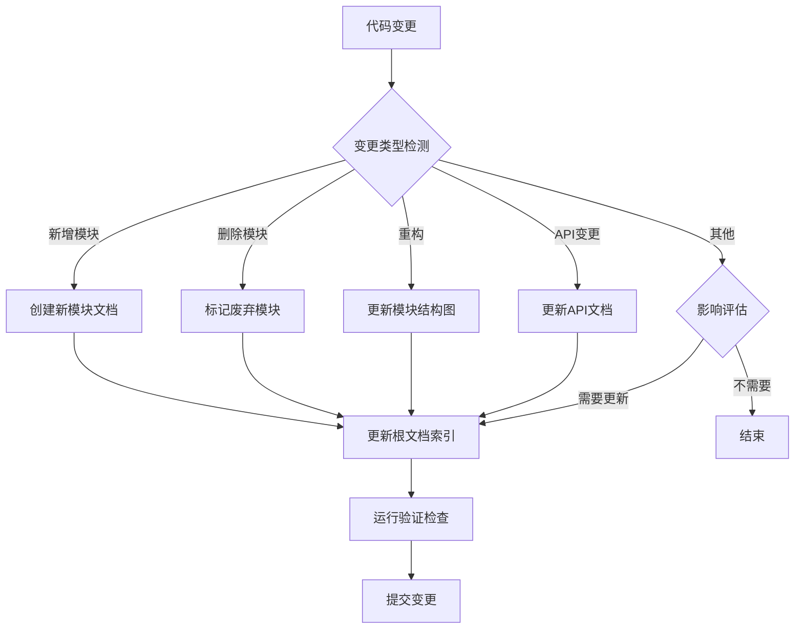
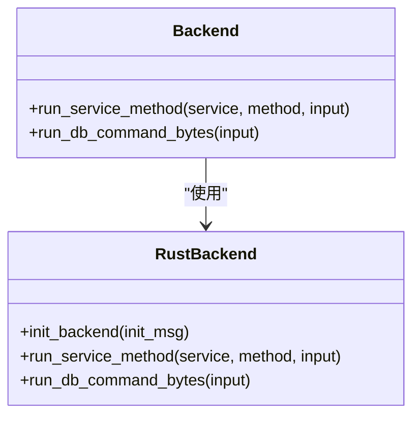
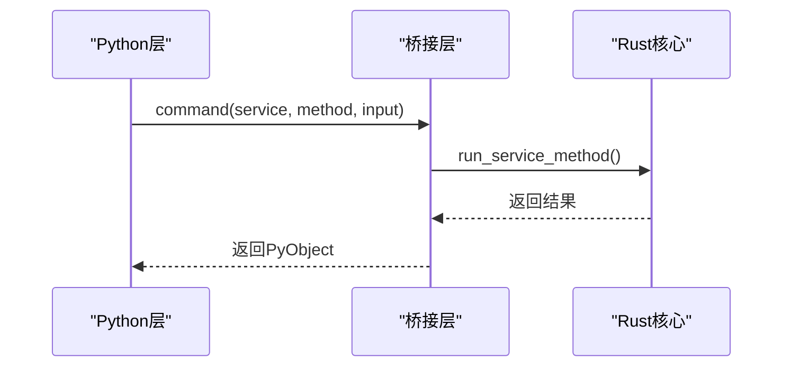
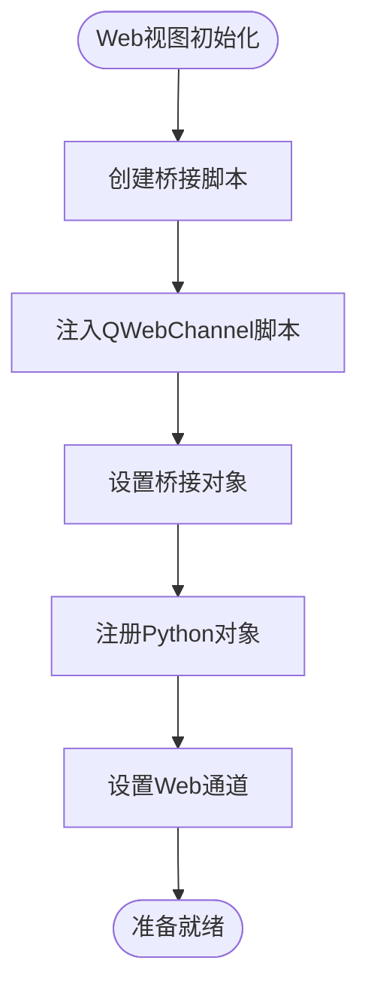
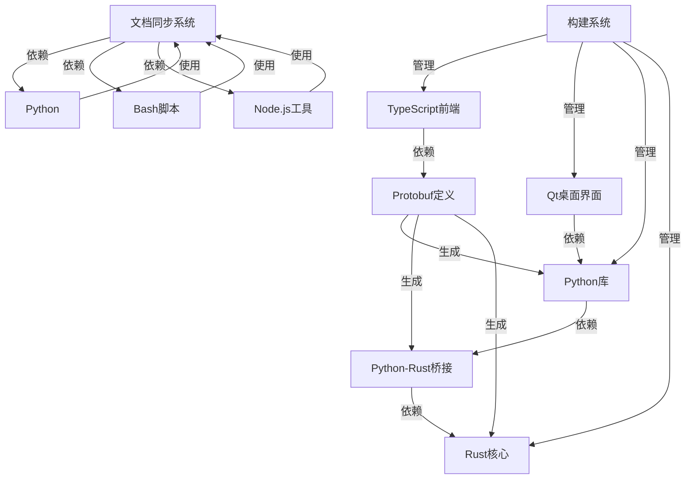

# 项目概述

<cite>
**本文档中引用的文件**  
- [rslib/README.md](file://rslib/README.md)
- [pylib/anki/rsbackend.py](file://pylib/anki/rsbackend.py)
- [pylib/rsbridge/lib.rs](file://pylib/rsbridge/lib.rs)
- [qt/aqt/webview.py](file://qt/aqt/webview.py)
- [ts/lib/tslib/bridgecommand.ts](file://ts/lib/tslib/bridgecommand.ts)
- [proto/README.md](file://proto/README.md)
- [CLAUDE.md](file://CLAUDE.md)
- [docs/context-document-sync-workflow.md](file://docs/context-document-sync-workflow.md)
- [docs/context-document-update-guide.md](file://docs/context-document-update-guide.md)
- [tools/sync-docs.py](file://tools/sync-docs.py)
- [tools/check-docs.sh](file://tools/check-docs.sh)
</cite>

## 更新摘要
**变更内容**  
- 更新了架构概述部分，新增了文档同步与质量保证系统的描述
- 添加了新的“文档同步与质量保证系统”章节，详细说明了自动化文档维护机制
- 更新了依赖分析图，包含了文档同步工具链
- 在性能考虑部分增加了文档质量保障的内容
- 更新了故障排除指南，包含了文档同步相关的问题处理

## 目录
1. [简介](#简介)
2. [项目结构](#项目结构)
3. [核心组件](#核心组件)
4. [架构概述](#架构概述)
5. [文档同步与质量保证系统](#文档同步与质量保证系统)
6. [详细组件分析](#详细组件分析)
7. [依赖分析](#依赖分析)
8. [性能考虑](#性能考虑)
9. [故障排除指南](#故障排除指南)
10. [结论](#结论)

## 简介
Anki是一款基于间隔重复算法的记忆训练软件，旨在帮助用户高效记忆各种信息。该项目采用多层架构设计，结合了Rust核心引擎、Python桥接层、Qt桌面界面和TypeScript前端组件，为语言学习、学术记忆和专业资格考试准备等常见用例提供了强大支持。

## 项目结构
Anki项目具有清晰的分层结构，主要包含以下目录：
- **cargo**: 包含Rust工具链配置
- **ftl**: 存放Fluent翻译文件
- **proto**: 包含Protobuf定义文件
- **pylib**: Python库代码
- **qt**: Qt桌面界面代码
- **rslib**: Rust核心代码
- **ts**: TypeScript前端组件



**图源**
- [CLAUDE.md](file://CLAUDE.md)
- [proto/README.md](file://proto/README.md)

**节源**
- [CLAUDE.md](file://CLAUDE.md)
- [project_structure](file://project_structure)

## 核心组件
Anki的核心组件包括Rust核心引擎、Python桥接层、Qt桌面界面和TypeScript前端组件。这些组件通过Protobuf定义的接口相互通信，形成了一个高效、可维护的系统架构。

**节源**
- [rslib/README.md](file://rslib/README.md)
- [pylib/anki/rsbackend.py](file://pylib/anki/rsbackend.py)

## 架构概述
Anki采用分层架构设计，各组件之间的关系和数据流如下：



**图源**
- [CLAUDE.md](file://CLAUDE.md)
- [rslib/README.md](file://rslib/README.md)

## 文档同步与质量保证系统
为了确保项目文档与代码保持同步，Anki引入了一套完整的文档同步与质量保证系统。这套系统通过自动化工具链确保文档的及时性、准确性和可维护性。



**图源**
- [docs/context-document-sync-workflow.md](file://docs/context-document-sync-workflow.md)
- [tools/sync-docs.py](file://tools/sync-docs.py)

**节源**
- [docs/context-document-sync-workflow.md](file://docs/context-document-sync-workflow.md)
- [docs/context-document-update-guide.md](file://docs/context-document-update-guide.md)

### 系统组成
文档同步与质量保证系统由以下几个核心组件构成：

1. **文档同步检测工具 (sync-docs.py)**
   - 检测代码变更并识别需要更新的文档
   - 支持CI模式和检查模式
   - 生成详细的更新计划

2. **自动更新脚本 (update-docs.sh)**
   - 执行完整的文档更新流程
   - 包括文档生成、质量检查和时间戳更新
   - 提供清晰的执行步骤和反馈

3. **文档质量检查脚本 (check-docs.sh)**
   - 检查Markdown语法
   - 验证链接有效性
   - 检查文档结构一致性
   - 验证Mermaid图表语法

### 开发流程集成
文档同步系统已深度集成到开发流程中，确保文档维护成为开发过程的自然组成部分。

#### 1. Pre-commit Hook
在 `.git/hooks/pre-commit` 中添加：
```bash
#!/bin/bash
# Pre-commit hook for documentation checks

echo "🔍 运行文档同步检查..."

# 检查是否需要更新文档
python3 tools/sync-docs.py --check-only

# 如果有文档变更，检查质量
if git diff --cached --name-only | grep -q "CLAUDE.md"; then
    tools/check-docs.sh
fi
```

#### 2. CI/CD 集成
在 `.github/workflows/docs.yml` 中：
```yaml
name: Documentation Checks

on:
  pull_request:
    paths:
      - '**/CLAUDE.md'
  push:
    branches:
      - main
    paths:
      - '**/CLAUDE.md'

jobs:
  doc-quality:
    runs-on: ubuntu-latest
    steps:
      - uses: actions/checkout@v3

      - name: Setup Python
        uses: actions/setup-python@v4
        with:
          python-version: '3.9'

      - name: Install dependencies
        run: |
          pip install markdownlint-cli markdown-link-check

      - name: Check documentation quality
        run: |
          ./tools/check-docs.sh

      - name: Check if docs need update
        run: |
          python3 tools/sync-docs.py --ci-mode
```

**节源**
- [docs/context-document-sync-workflow.md](file://docs/context-document-sync-workflow.md)
- [tools/check-docs.sh](file://tools/check-docs.sh)

## 详细组件分析

### Rust核心引擎分析
Rust核心引擎是Anki的性能关键部分，负责处理所有核心业务逻辑和数据存储。



**图源**
- [pylib/rsbridge/lib.rs](file://pylib/rsbridge/lib.rs)
- [rslib/src/lib.rs](file://rslib/src/lib.rs)

**节源**
- [pylib/rsbridge/lib.rs](file://pylib/rsbridge/lib.rs)
- [rslib/README.md](file://rslib/README.md)

### Python桥接层分析
Python桥接层作为Rust核心引擎和上层应用之间的桥梁，负责序列化和反序列化数据。



**图源**
- [pylib/rsbridge/lib.rs](file://pylib/rsbridge/lib.rs)
- [pylib/anki/rsbackend.py](file://pylib/anki/rsbackend.py)

**节源**
- [pylib/rsbridge/lib.rs](file://pylib/rsbridge/lib.rs)
- [pylib/anki/rsbackend.py](file://pylib/anki/rsbackend.py)

### Qt桌面界面分析
Qt桌面界面负责用户交互，通过WebEngine嵌入TypeScript前端组件。



**图源**
- [qt/aqt/webview.py](file://qt/aqt/webview.py)
- [ts/lib/tslib/bridgecommand.ts](file://ts/lib/tslib/bridgecommand.ts)

**节源**
- [qt/aqt/webview.py](file://qt/aqt/webview.py)
- [ts/lib/tslib/bridgecommand.ts](file://ts/lib/tslib/bridgecommand.ts)

## 依赖分析
Anki项目的依赖关系复杂但组织良好，各层之间的依赖清晰明确。



**图源**
- [CLAUDE.md](file://CLAUDE.md)
- [Cargo.toml](file://Cargo.toml)
- [pyproject.toml](file://pyproject.toml)
- [tools/sync-docs.py](file://tools/sync-docs.py)

**节源**
- [CLAUDE.md](file://CLAUDE.md)
- [Cargo.toml](file://Cargo.toml)
- [pyproject.toml](file://pyproject.toml)
- [tools/sync-docs.py](file://tools/sync-docs.py)

## 性能考虑
Anki在性能方面做了多项优化，包括使用Rust编写核心引擎以获得最佳性能，以及通过Protobuf高效序列化数据。此外，Python桥接层避免了Python原生protobuf编解码的性能瓶颈，直接使用字节流进行通信。

文档同步与质量保证系统也考虑了性能因素：
- **增量更新**: 只更新实际发生变更的部分，避免全量重建
- **缓存机制**: 缓存文档结构分析结果，减少重复计算
- **并行处理**: 在可能的情况下并行执行多个检查任务
- **智能检测**: 通过git日志分析精确识别需要更新的文档

## 故障排除指南
当遇到Anki相关问题时，可以按照以下步骤进行排查：

1. 检查日志输出，特别是Web引擎的JavaScript控制台消息
2. 确认各组件版本兼容性
3. 验证Protobuf定义文件是否最新
4. 检查桥接层的序列化/反序列化是否正确
5. 对于文档同步问题：
   - 运行 `python3 tools/sync-docs.py --check-only` 检查是否需要更新
   - 运行 `./tools/check-docs.sh` 验证文档质量
   - 检查 `.last-doc-sync` 文件的时间戳
   - 查看CI/CD流水线中的文档检查结果

**节源**
- [qt/aqt/webview.py](file://qt/aqt/webview.py)
- [pylib/rsbridge/lib.rs](file://pylib/rsbridge/lib.rs)
- [tools/sync-docs.py](file://tools/sync-docs.py)
- [tools/check-docs.sh](file://tools/check-docs.sh)

## 结论
Anki项目通过精心设计的分层架构，成功整合了多种技术栈的优势。Rust核心引擎保证了性能和安全性，Python桥接层提供了灵活性，Qt桌面界面确保了跨平台兼容性，而TypeScript前端组件则提供了现代化的用户界面。这种架构不仅满足了当前需求，也为未来的扩展和维护奠定了良好基础。

新增的文档同步与质量保证系统进一步增强了项目的可维护性，通过自动化工具链确保文档与代码的一致性。这套系统将文档维护从一个容易被忽视的任务转变为开发流程的有机组成部分，确保了项目文档的及时性、准确性和高质量。