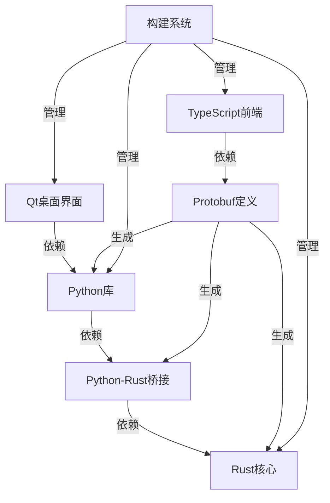

# 项目概述

<cite>
**本文档中引用的文件**  
- [rslib/README.md](file://rslib/README.md)
- [pylib/anki/rsbackend.py](file://pylib/anki/rsbackend.py)
- [pylib/rsbridge/lib.rs](file://pylib/rsbridge/lib.rs)
- [qt/aqt/webview.py](file://qt/aqt/webview.py)
- [ts/lib/tslib/bridgecommand.ts](file://ts/lib/tslib/bridgecommand.ts)
- [proto/README.md](file://proto/README.md)
- [CLAUDE.md](file://CLAUDE.md)
</cite>

## 目录
1. [简介](#简介)
2. [项目结构](#项目结构)
3. [核心组件](#核心组件)
4. [架构概述](#架构概述)
5. [详细组件分析](#详细组件分析)
6. [依赖分析](#依赖分析)
7. [性能考虑](#性能考虑)
8. [故障排除指南](#故障排除指南)
9. [结论](#结论)

## 简介
Anki是一款基于间隔重复算法的记忆训练软件，旨在帮助用户高效记忆各种信息。该项目采用多层架构设计，结合了Rust核心引擎、Python桥接层、Qt桌面界面和TypeScript前端组件，为语言学习、学术记忆和专业资格考试准备等常见用例提供了强大支持。

## 项目结构
Anki项目具有清晰的分层结构，主要包含以下目录：
- **cargo**: 包含Rust工具链配置
- **ftl**: 存放Fluent翻译文件
- **proto**: 包含Protobuf定义文件
- **pylib**: Python库代码
- **qt**: Qt桌面界面代码
- **rslib**: Rust核心代码
- **ts**: TypeScript前端组件

**图源**
- [CLAUDE.md](file://CLAUDE.md)
- [proto/README.md](file://proto/README.md)

**节源**
- [CLAUDE.md](file://CLAUDE.md)
- [project_structure](file://project_structure)

## 核心组件
Anki的核心组件包括Rust核心引擎、Python桥接层、Qt桌面界面和TypeScript前端组件。这些组件通过Protobuf定义的接口相互通信，形成了一个高效、可维护的系统架构。

**节源**
- [rslib/README.md](file://rslib/README.md)
- [pylib/anki/rsbackend.py](file://pylib/anki/rsbackend.py)

## 架构概述
Anki采用分层架构设计，各组件之间的关系和数据流如下：

**图源**
- [CLAUDE.md](file://CLAUDE.md)
- [rslib/README.md](file://rslib/README.md)

## 详细组件分析

### Rust核心引擎分析
Rust核心引擎是Anki的性能关键部分，负责处理所有核心业务逻辑和数据存储。

**图源**
- [pylib/rsbridge/lib.rs](file://pylib/rsbridge/lib.rs)
- [rslib/src/lib.rs](file://rslib/src/lib.rs)

**节源**
- [pylib/rsbridge/lib.rs](file://pylib/rsbridge/lib.rs)
- [rslib/README.md](file://rslib/README.md)

### Python桥接层分析
Python桥接层作为Rust核心引擎和上层应用之间的桥梁，负责序列化和反序列化数据。

**图源**
- [pylib/rsbridge/lib.rs](file://pylib/rsbridge/lib.rs)
- [pylib/anki/rsbackend.py](file://pylib/anki/rsbackend.py)

**节源**
- [pylib/rsbridge/lib.rs](file://pylib/rsbridge/lib.rs)
- [pylib/anki/rsbackend.py](file://pylib/anki/rsbackend.py)

### Qt桌面界面分析
Qt桌面界面负责用户交互，通过WebEngine嵌入TypeScript前端组件。

**图源**
- [qt/aqt/webview.py](file://qt/aqt/webview.py)
- [ts/lib/tslib/bridgecommand.ts](file://ts/lib/tslib/bridgecommand.ts)

**节源**
- [qt/aqt/webview.py](file://qt/aqt/webview.py)
- [ts/lib/tslib/bridgecommand.ts](file://ts/lib/tslib/bridgecommand.ts)

## 依赖分析
Anki项目的依赖关系复杂但组织良好，各层之间的依赖清晰明确。

**图源**
- [CLAUDE.md](file://CLAUDE.md)
- [pyproject.toml](file://pyproject.toml)
- [Cargo.toml](file://Cargo.toml)

**节源**
- [CLAUDE.md](file://CLAUDE.md)
- [Cargo.toml](file://Cargo.toml)
- [pyproject.toml](file://pyproject.toml)

## 性能考虑
Anki在性能方面做了多项优化，包括使用Rust编写核心引擎以获得最佳性能，以及通过Protobuf高效序列化数据。此外，Python桥接层避免了Python原生protobuf编解码的性能瓶颈，直接使用字节流进行通信。

## 故障排除指南
当遇到Anki相关问题时，可以按照以下步骤进行排查：
1. 检查日志输出，特别是Web引擎的JavaScript控制台消息
2. 确认各组件版本兼容性
3. 验证Protobuf定义文件是否最新
4. 检查桥接层的序列化/反序列化是否正确

**节源**
- [qt/aqt/webview.py](file://qt/aqt/webview.py)
- [pylib/rsbridge/lib.rs](file://pylib/rsbridge/lib.rs)

## 结论
Anki项目通过精心设计的分层架构，成功整合了多种技术栈的优势。Rust核心引擎保证了性能和安全性，Python桥接层提供了灵活性，Qt桌面界面确保了跨平台兼容性，而TypeScript前端组件则提供了现代化的用户界面。这种架构不仅满足了当前需求，也为未来的扩展和维护奠定了良好基础。