# Anki 项目 AI 上下文文档

## 更新日志 (Change Log)

- 2025-12-19: 添加文档同步管理系统，更新开发工作流程和质量保证机制
- 2025-11-17: 第三次深度补充更新，添加测试策略分析、性能优化指南、开发工作流程、生成代码结构分析
- 2025-11-17: 增量更新，添加 proto 和 launcher 模块文档，更新 Mermaid 结构图，补充后端服务和调度系统详细架构
- 2025-06-17: 初始化项目 AI 上下文，生成架构概览和模块结构图

## 项目愿景

Anki 是一个功能强大的间隔重复闪卡程序，采用多层架构设计，支持跨平台使用。项目致力于通过科学的学习算法（FSRS）帮助用户高效记忆和复习知识，同时提供丰富的插件系统和扩展能力。

## 架构概览

Anki 采用分层架构，主要包含以下组件：

- **Web 前端**: 使用 Svelte/TypeScript 开发，位于 `ts/` 目录，通过生成的类型绑定与后端通信
- **PyQt GUI**: 嵌入式 Web 组件的桌面应用界面，位于 `qt/aqt/` 目录，提供跨平台桌面体验
- **Python 库**: 封装 Rust 层的 Python 包装器，位于 `pylib/anki/` 目录，提供 Python API
- **Rust 核心层**: 核心业务逻辑和性能关键组件，位于 `rslib/` 目录，实现 FSRS 算法
- **Protobuf 定义**: 跨语言通信接口，位于 `proto/` 目录，确保类型安全的多语言集成
- **构建系统**: 基于 Ninja 的构建工具，位于 `build/` 目录，支持自动化构建和质量检查
- **国际化**: Fluent 翻译文件，位于 `ftl/` 目录，支持类型安全的多语言开发
- **启动器**: 跨平台应用启动器，位于 `qt/launcher/` 目录，提供安装和部署管理
- **文档管理系统**: 自动化文档同步和质量保证工具，位于 `tools/` 和 `docs/` 目录

## ✨ 模块结构图

```mermaid
graph TD
    A["(Root) Anki"] --> B["ts"];
    A --> C["qt"];
    A --> D["pylib"];
    A --> E["rslib"];
    A --> F["build"];
    A --> G["ftl"];
    A --> H["proto"];
    A --> I["docs"];
    A --> J["tools"];

    B --> B1["src"];
    B --> B2["lib"];
    B --> B3["routes"];
    B --> B4["reviewer"];
    B --> B5["generated"];

    B5 --> B5a["post.ts"];
    B5 --> B5b["ftl-helpers.ts"];
    B5 --> B5c["@generated/backend"];

    C --> C1["aqt"];
    C --> C2["launcher"];
    C3["aqt"] --> C3a["main.py"];
    C3["aqt"] --> C3b["reviewer.py"];
    C3["aqt"] --> C3c["editor.py"];
    C3["aqt"] --> C3d["webview.py"];

    C2 --> C2a["src/main.rs"];
    C2 --> C2b["platform"];
    C2 --> C2c["win"];
    C2 --> C2d["mac"];
    C2 --> C2e["lin"];

    D --> D1["anki"];
    D2["anki"] --> D2a["_backend.py"];
    D2["anki"] --> D2b["collection.py"];
    D2["anki"] --> D2c["cards.py"];
    D2["anki"] --> D2d["decks.py"];
    D2["anki"] --> D2e["rsbridge"];

    E --> E1["src"];
    E2["src"] --> E2a["lib.rs"];
    E2["src"] --> E2b["backend"];
    E2["src"] --> E2c["collection"];
    E2["src"] --> E2d["scheduler"];
    E2["src"] --> E2e["fsrs"];

    E2b["backend"] --> E2b1["adding.rs"];
    E2b["backend"] --> E2b2["sync.rs"];
    E2b["backend"] --> E2b3["card_rendering.rs"];
    E2b["backend"] --> E2b4["import_export.rs"];

    E2d["scheduler"] --> E2d1["answering"];
    E2d["scheduler"] --> E2d2["queue"];
    E2d["scheduler"] --> E2d3["states"];
    E2d["scheduler"] --> E2d4["service"];

    E2e["fsrs"] --> E2e1["memory_state.rs"];
    E2e["fsrs"] --> E2e2["params.rs"];
    E2e["fsrs"] --> E2e3["rescheduler.rs"];
    E2e["fsrs"] --> E2e4["simulator.rs"];

    F --> F1["configure"];
    F --> F2["ninja_gen"];
    F --> F3["runner"];
    F --> F4["archives"];

    G --> G1["core"];
    G --> G2["qt"];

    H --> H1["anki/backend.proto"];
    H --> H2["anki/collection.proto"];
    H --> H3["anki/scheduler.proto"];
    H --> H4["anki/cards.proto"];
    H --> H5["anki/sync.proto"];

    I --> I1["architecture.md"];
    I --> I2["development.md"];
    I --> I3["build.md"];
    I --> I4["protobuf.md"];
    I --> I5["context-document-sync-workflow.md"];
    I --> I6["context-document-update-guide.md"];

    J --> J1["sync-docs.py"];
    J --> J2["update-docs.sh"];
    J --> J3["check-docs.sh"];
    J --> J4["check-doc-structure.py"];
    J --> J5["check-mermaid-syntax.py"];

    click B "./ts/CLAUDE.md" "查看前端模块文档"
    click C "./qt/CLAUDE.md" "查看Qt界面模块文档"
    click C2 "./qt/launcher/CLAUDE.md" "查看启动器模块文档"
    click D "./pylib/CLAUDE.md" "查看Python库模块文档"
    click E "./rslib/CLAUDE.md" "查看Rust核心模块文档"
    click F "./build/CLAUDE.md" "查看构建系统模块文档"
    click G "./ftl/CLAUDE.md" "查看国际化模块文档"
    click H "./proto/CLAUDE.md" "查看Protobuf接口模块文档"
    click I "./docs/context-document-sync-workflow.md" "查看文档同步工作流程"
    click J "./tools/sync-docs.py" "查看文档同步工具"
```



## 模块索引

| 模块路径 | 语言/技术栈 | 主要职责 | 入口文件 | 文档状态 |
|---------|-------------|---------|---------|---------|
| `ts/` | TypeScript/Svelte | Web前端开发和组件库，跨语言通信绑定 | `ts/src/lib/` | ✅ 深度更新 |
| `qt/aqt/` | Python/PyQt6 | 桌面应用GUI界面，Web组件集成 | `qt/aqt/__init__.py` | ✅ 已更新 |
| `qt/launcher/` | Rust | 跨平台应用启动器，部署和安装管理 | `qt/launcher/src/main.rs` | ✅ 已更新 |
| `pylib/anki/` | Python | Python库和Rust包装层，跨语言桥接 | `pylib/anki/_backend.py` | ✅ 已更新 |
| `rslib/` | Rust | 核心业务逻辑，FSRS算法，数据处理 | `rslib/src/lib.rs` | ✅ 已更新 |
| `build/` | Python/Rust | 构建系统和工具链，自动化构建和质量检查 | `build/runner/src/main.rs` | ✅ 已更新 |
| `ftl/` | Fluent | 国际化和翻译文件，类型安全翻译API | `ftl/core/` | ✅ 已更新 |
| `proto/` | Protobuf | 跨语言通信接口定义，类型绑定生成 | `proto/anki/backend.proto` | ✅ 已更新 |
| `docs/` | Markdown | 项目文档和工作流程指南 | `docs/context-document-sync-workflow.md` | ✅ 新增 |
| `tools/` | Python/Shell | 文档同步和质量保证工具集 | `tools/sync-docs.py` | ✅ 新增 |

## 运行和开发

### 构建和检查
- `./check` 或 `check.bat`: 格式化代码并运行主要构建和检查
- `./ninja`: 调用构建系统
- `cargo check`: 仅构建 Rust 代码
- `./tools/dmypy`: 仅检查 Python 代码
- `./ninja check:svelte`: 仅检查 TypeScript/Svelte 代码

### 快速迭代开发
- 修改 `.proto` 文件需要完整构建 `./check`
- 大部分变更可以使用增量构建命令
- 构建产物位于 `out/` 目录（可忽略）
- 开发模式: `./run` 启动应用
- 优化模式: `./tools/runopt`

### 应用启动
- 使用启动器自动启动（推荐）
- 或直接运行 `python qt/runanki.py`
- 同步服务器模式: `--syncserver` 参数

## ✨ 测试策略

### 多语言测试覆盖

#### Python 测试 (`pylib/tests/`)
- **核心功能测试**: `test_collection.py`, `test_cards.py`, `test_decks.py`
- **数据处理**: `test_importing.py`, `test_exporting.py`, `test_media.py`
- **调度算法**: `test_schedv3.py` - 测试学习调度逻辑
- **搜索功能**: `test_find.py` - 验证搜索和过滤功能
- **模板处理**: `test_template.py` - 卡片模板渲染测试
- **工具函数**: `test_utils.py` - 通用工具函数测试

#### Rust 测试 (`rslib/src/`)
- **集成测试**: `src/tests.rs` - 核心集成测试套件
- **模块测试**: 各模块中的 `#[cfg(test)]` 单元测试
- **导入导出**: `import_export/*/tests.rs` - 数据格式转换测试
- **同步功能**: `sync/*/tests.rs` - 数据同步机制测试
- **性能测试**: `benches/benchmark.rs` - 基准测试套件

#### TypeScript 测试 (`ts/`)
- **组件测试**: 各组件目录下的 `*.test.ts` 文件
- **工具函数**: `lib/tslib/time.test.ts`, `lib/domlib/surround/*.test.ts`
- **核心逻辑**: `reviewer/lib.test.ts`, `routes/*/lib.test.ts`
- **HTML 处理**: `html-filter/index.test.ts`

#### Qt 测试 (`qt/tests/`)
- **插件系统**: `test_addons.py` - 插件管理和API测试
- **国际化**: `test_i18n.py` - 多语言支持测试

### 测试策略和最佳实践

#### 测试分层
1. **单元测试**: 验证单个函数和类的功能
2. **集成测试**: 验证模块间交互和数据流
3. **端到端测试**: 验证完整用户工作流程
4. **性能测试**: 验证关键路径性能指标

#### 跨语言集成测试
- **Protobuf 兼容性**: 确保各语言生成的绑定一致
- **数据序列化**: 验证跨语言数据传递正确性
- **错误处理**: 测试异常情况下的跨语言错误传播

#### 测试数据和环境
- **临时集合**: 使用 `getEmptyCol()` 创建测试环境
- **测试数据**: `tests/support/` 包含标准测试数据集
- **隔离环境**: 每个测试使用独立的临时数据库

## ✨ 性能优化指南

### Rust 层优化
- **基准测试**: `./rslib/bench.sh` 运行性能基准
- **FSRS 算法**: 高度优化的间隔重复算法实现
- **并行计算**: 使用 `rayon` 进行数据并行处理
- **内存管理**: 零拷贝数据结构和高效内存使用
- **SQLite 优化**: 编译时优化和连接池配置

### Python 层优化
- **类型提示**: `py.typed` 文件启用静态类型检查
- **延迟导入**: 减少启动时间和内存占用
- **缓存策略**: 频繁访问的数据缓存机制
- **异步处理**: 使用异步操作处理 I/O 密集型任务

### 前端优化
- **代码分割**: Vite 自动分割和懒加载
- **组件复用**: Svelte 组件的粒度优化
- **资源压缩**: 生产环境自动压缩和优化
- **缓存策略**: 长期缓存友好的资源命名

### 构建优化
- **增量构建**: 只重新编译变更的部分
- **并行构建**: 利用多核 CPU 进行并行编译
- **依赖缓存**: 减少重复下载和编译时间
- **链接时优化**: 发布模式的 LTO 优化

## ✨ 开发工作流程

### 新功能开发流程
1. **需求分析**: 明确功能需求和跨语言影响
2. **接口设计**: 在 `proto/` 定义 Protobuf 接口
3. **核心实现**: 在 Rust 层实现核心逻辑
4. **绑定生成**: 运行构建生成跨语言绑定
5. **前端集成**: 使用生成的类型实现前端界面
6. **Python 封装**: 添加必要的 Python 包装层
7. **测试编写**: 为各层编写相应的测试
8. **质量检查**: 运行 `./check` 验证代码质量
9. **文档更新**: 运行 `./tools/update-docs.sh` 同步文档

### 文档管理系统

#### 自动化文档同步
- **检测工具**: `tools/sync-docs.py` - 自动检测需要更新的文档
- **更新脚本**: `tools/update-docs.sh` - 自动更新文档并创建备份
- **质量检查**: `tools/check-docs.sh` - 综合文档质量验证
- **结构检查**: `tools/check-doc-structure.py` - 验证文档结构规范
- **语法检查**: `tools/check-mermaid-syntax.py` - Mermaid 图表语法验证

#### 文档同步工作流程
1. **代码变更触发**: 自动检测代码变更影响范围
2. **影响评估**: 分析变更对文档的影响程度
3. **自动更新**: 根据模板和规范自动生成文档内容
4. **质量验证**: 多层次检查确保文档质量
5. **备份管理**: 自动创建版本备份，支持回滚

#### 集成开发流程
- **Pre-commit 检查**: 在提交前自动检查文档是否需要更新
- **CI/CD 集成**: 在持续集成中验证文档质量
- **增量更新**: 只更新实际变更部分，保留历史记录

### 代码质量保障
- **类型安全**: 严格使用 TypeScript 和 Rust 类型系统
- **静态分析**: ESLint, Clippy, dmypy 等工具检查
- **代码格式**: 统一的代码格式化规则
- **测试覆盖**: 确保关键路径有测试覆盖
- **性能监控**: 定期运行基准测试
- **文档质量**: 自动化文档检查确保文档与代码同步

### 跨语言协作开发
- **接口优先**: 先定义 Protobuf 接口，再实现功能
- **类型一致性**: 依赖生成的类型绑定确保一致性
- **文档同步**: 使用自动化工具确保文档与代码保持同步
- **版本兼容**: 保持接口的向后兼容性

## 编码标准

### Rust
- 使用 `snafu` 进行错误处理，`error/mod.rs` 的 `AnkiError/Result`
- 优先使用 `workspace = true` 的依赖管理
- 使用 `rslib/{process,io}` 中的工具函数
- 严格的编译时检查和 lint 规则
- 性能关键代码使用 `#[inline]` 和 `#[cold]` 属性

### Python
- Python 3.9+ 要求，使用类型注解和 `py.typed` 文件
- 遵循 PEP 8 代码风格
- 错误处理使用 Python 异常机制
- 通过 rsbridge 与 Rust 层交互

### TypeScript/Svelte
- 使用 TypeScript 严格模式和类型检查
- ESLint 配置确保代码质量
- Svelte 组件遵循单一职责原则
- 使用生成的类型确保类型安全

### 跨语言通信
- 使用 Protobuf 定义接口，确保类型安全
- 通过 `postProto` 进行二进制通信
- 使用 Fluent 系统进行国际化
- 统一的错误处理和传播机制

## AI 使用指南

### 开发辅助
- 优先阅读现有的模块文档和代码结构
- 使用 `./check` 验证代码变更
- 遵循项目的编码标准和错误处理模式
- 利用启动器进行跨平台开发和测试
- **文档同步**: 代码变更后记得运行 `./tools/update-docs.sh`

### 构建问题处理
- 遇到构建错误时，先运行完整的 `./check`
- 不要尝试 `grep` 搜索错误，直接再次运行检查命令
- 查看 `out/` 目录了解生成的代码结构
- 使用 `./ninja -v` 查看详细构建过程

### 文档管理最佳实践
- **自动检测**: 使用 `./tools/sync-docs.py --check-only` 快速检查是否需要更新文档
- **自动更新**: 运行 `./tools/update-docs.sh` 进行完整的文档同步更新
- **质量检查**: 使用 `./tools/check-docs.sh` 验证文档质量
- **增量更新**: 文档系统支持增量更新，保留历史记录
- **备份管理**: 更新脚本会自动创建时间戳备份

#### 文档更新工作流程
1. **代码变更前**: 运行 `./tools/sync-docs.py` 了解当前文档状态
2. **开发过程中**: 关注变更对文档的影响
3. **提交前**: 运行 `./tools/update-docs.sh` 同步文档
4. **验证质量**: 运行 `./tools/check-docs.sh` 确保文档质量
5. **提交变更**: 包含代码和文档的完整变更

### 文档编写规范
- 模块级文档应包含导航面包屑
- 根文档应保持简洁的全局视图
- 使用 Mermaid 图表展示模块关系
- 遵循统一的文档结构和格式规范
- 自动化工具会检查 Markdown 语法、链接有效性和结构一致性

### 深度开发指导
- **后端服务开发**: 参考 `rslib/src/backend/` 模块架构
- **调度算法**: 了解 `rslib/src/scheduler/fsrs/` 的 FSRS 实现
- **Protobuf 接口**: 在 `proto/` 中定义跨语言服务接口
- **启动器开发**: 参考 `qt/launcher/` 的跨平台启动逻辑
- **前端开发**: 使用 `ts/lib/generated/` 中的类型绑定
- **测试编写**: 遵循现有的测试模式和多语言测试策略
- **文档同步**: 参考 `docs/context-document-sync-workflow.md` 了解详细工作流程

### 性能优化指导
- **基准测试**: 使用 `benches/benchmark.rs` 测量性能
- **内存优化**: 关注 Rust 层的内存使用模式
- **I/O 优化**: 使用异步操作和批量处理
- **前端优化**: 利用 Vite 的代码分割和懒加载

### 常见文档操作

#### 快速文档检查
```bash
# 检查是否需要更新文档
./tools/sync-docs.py --check-only

# 生成更新计划
./tools/sync-docs.py --output .doc-update-plan.md
```

#### 文档质量验证
```bash
# 完整质量检查
./tools/check-docs.sh

# 仅检查结构
python3 tools/check-doc-structure.py

# 仅检查 Mermaid 语法
python3 tools/check-mermaid-syntax.py
```

#### 文档同步更新
```bash
# 自动更新所有文档
./tools/update-docs.sh

# 查看帮助信息
./tools/update-docs.sh --help
```

## 相关资源

### 官方文档
- `docs/architecture.md` - 详细架构说明
- `docs/development.md` - 开发环境设置
- `docs/build.md` - 构建系统详解
- `docs/protobuf.md` - Protobuf 使用指南
- `docs/context-document-sync-workflow.md` - 文档同步工作流程
- `docs/context-document-update-guide.md` - 文档更新详细指南

### 文档管理工具
- `tools/sync-docs.py` - 文档同步检测工具
- `tools/update-docs.sh` - 自动文档更新脚本
- `tools/check-docs.sh` - 综合文档质量检查
- `tools/check-doc-structure.py` - 文档结构验证
- `tools/check-mermaid-syntax.py` - Mermaid 语法检查

### 生成的代码
- `ts/lib/generated/` - TypeScript 通信绑定
- `out/ts/lib/generated/` - 构建时生成的类型绑定
- `pylib/anki/_backend.py` - Python 后端接口

### 工具和配置
- `.eslintrc.cjs` - TypeScript/ESLint 配置
- `rslib/bench.sh` - 性能基准测试脚本
- `tools/ninja` - 构建工具包装器
- 各模块的测试配置和脚本

### 文档示例和模板
- `docs/.doc-update-example.md` - 文档更新示例
- `.last-doc-sync` - 最后同步时间记录
- 备份目录: `docs/.backup/` - 自动创建的文档备份

---

## 原有配置信息 (继承)

### Building/checking
./check (check.bat) will format the code and run the main build & checks.
Please do this as a final step before marking a task as completed.

### Quick iteration
During development, you can build/check subsections of our code:

- Rust: 'cargo check'
- Python: './tools/dmypy', and if wheel-related, './ninja wheels'
- TypeScript/Svelte: './ninja check:svelte'

Be mindful that some changes (such as modifications to .proto files) may need a full build with './check' first.

### Build tooling
'./check' and './ninja' invoke our build system, which is implemented in build/. It takes care of downloading required deps and invoking our build steps.

### Translations
ftl/ contains our Fluent translation files. We have scripts in rslib/i18n to auto-generate an API for Rust, TypeScript and Python so that our code can access the translations in a type-safe manner. Changes should be made to ftl/core or ftl/qt. Except for features specific to our Qt interface, prefer the core module. When adding new strings, confirm the appropriate ftl file first, and try to match the existing style.

### Protobuf and IPC
Our build scripts use the .proto files to define our Rust library's non-Rust API. pylib/rsbridge exposes that API, and _backend.py exposes snake_case methods for each protobuf RPC that call into the API. Similar tooling creates a @generated/backend TypeScript module for communicating with the Rust backend (which happens over POST requests).

### Fixing errors
When dealing with build errors or failing tests, invoke 'check' or one of the quick iteration commands regularly. This helps verify your changes are correct. To locate other instances of a problem, run the check again - don't attempt to grep the codebase.

### Ignores
The files in out/ are auto-generated. Mostly you should ignore that folder, though you may sometimes find it useful to view out/{pylib/anki,qt/_aqt,ts/lib/generated} when dealing with cross-language communication or our other generated sourcecode.

### Launcher/installer
The code for our launcher is in qt/launcher, with separate code for each platform.

### Rust dependencies
Prefer adding to the root workspace, and using dep.workspace = true in the individual Rust project.

### Rust utilities
rslib/{process,io} contain some helpers for file and process operations, which provide better error messages/context and some ergonomics. Use them when possible.

### Rust error handling
in rslib, use error/mod.rs's AnkiError/Result and snafu. In our other Rust modules, prefer anyhow + additional context where appropriate. Unwrapping in build scripts/tests is fine.