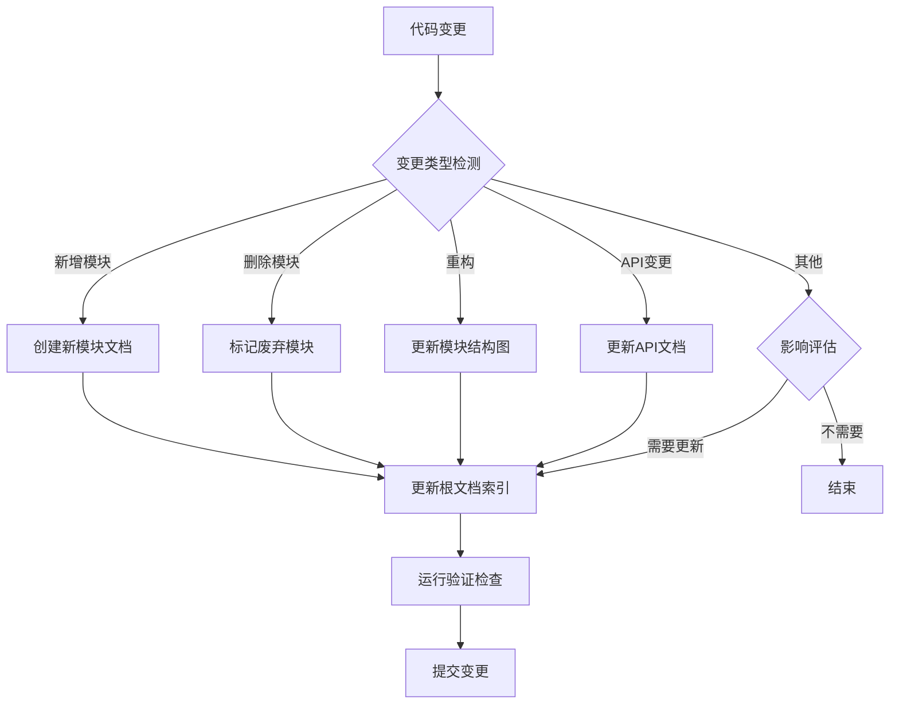

# Anki 上下文文档同步更新工作流程

## 概述

本文档定义了一套完整的上下文文档（CLAUDE.md）同步更新机制，确保代码变更后文档能够及时、准确地反映最新的项目状态。

## 核心原则

### 1. 文档即代码
- 所有 CLAUDE.md 文件都纳入版本控制
- 文档变更需要经过代码审查
- 使用自动化工具验证文档准确性

### 2. 增量更新
- 只更新实际发生变更的部分
- 保留历史变更记录
- 使用结构化的更新日志

### 3. 一致性保证
- 所有模块文档格式统一
- 导航链接保持有效
- 依赖关系准确反映

## 工作流程

### A. 代码变更触发文档更新

#### 1. 识别需要文档更新的场景

| 变更类型 | 文档更新需求 | 更新级别 |
|---------|-------------|---------|
| 新增模块/目录 | 需要创建新的模块文档 | 高 |
| 删除模块/目录 | 需要删除或标记为废弃 | 高 |
| 重构/重组 | 需要更新模块结构和依赖关系 | 高 |
| API 变更 | 需要更新接口文档和示例 | 中 |
| 新功能开发 | 需要更新功能描述和使用指南 | 中 |
| 配置变更 | 需要更新构建和运行说明 | 低 |
| Bug 修复 | 通常不需要文档更新 | 最低 |

#### 2. 文档更新检测流程



### B. 文档更新实施步骤

#### 1. 准备阶段
```bash
# 1. 确保代码是最新的
git checkout main
git pull upstream main

# 2. 运行完整构建确保代码正确
./check

# 3. 切换到新分支进行文档更新
git checkout -b docs/update-module-name
```

#### 2. 分析变更影响
```bash
# 查看自上次文档更新以来的变更
git log --since="<last-doc-update-date>" --name-only

# 分析变更的文件类型和范围
git diff --name-status <last-doc-commit> HEAD
```

#### 3. 更新文档内容

##### 根文档更新 (CLAUDE.md)
- 更新模块结构图（Mermaid）
- 更新模块索引表
- 更新统计信息
- 添加新的更新日志条目

##### 模块文档更新 (module/CLAUDE.md)
- 更新模块描述和职责
- 更新文件结构
- 更新 API 接口说明
- 更新使用示例
- 更新依赖关系

#### 4. 验证更新质量
```bash
# 检查 Markdown 语法
npx markdownlint-cli2 "**/*.md"

# 验证链接有效性
find . -name "CLAUDE.md" -exec markdown-link-check {} \;

# 确保文档格式一致
./tools/check-doc-format.sh
```

### C. 自动化工具支持

#### 1. 文档同步检测脚本

创建 `tools/sync-docs.py`：

```python
#!/usr/bin/env python3
"""
文档同步检测工具
检测代码变更并识别需要更新的文档
"""

import os
import subprocess
import json
from datetime import datetime
from pathlib import Path
from typing import Dict, List, Set

class DocSyncDetector:
    def __init__(self, repo_root: Path):
        self.repo_root = repo_root
        self.doc_files = self._find_doc_files()
        self.last_sync = self._get_last_sync_time()

    def _find_doc_files(self) -> Dict[str, Path]:
        """查找所有 CLAUDE.md 文件"""
        docs = {}
        for doc_file in self.repo_root.rglob("CLAUDE.md"):
            rel_path = doc_file.relative_to(self.repo_root)
            docs[str(rel_path.parent)] = doc_file
        return docs

    def _get_last_sync_time(self) -> datetime:
        """获取上次文档同步时间"""
        try:
            with open(self.repo_root / ".last-doc-sync", "r") as f:
                timestamp = f.read().strip()
                return datetime.fromisoformat(timestamp)
        except FileNotFoundError:
            # 默认返回一周前
            return datetime.now().replace(hour=0, minute=0, second=0, microsecond=0) - timedelta(days=7)

    def detect_changes(self) -> Dict[str, List[str]]:
        """检测需要更新的文档"""
        changes = subprocess.run(
            ["git", "diff", "--name-only", f"--since={self.last_sync.isoformat()}"],
            capture_output=True,
            text=True
        ).stdout.splitlines()

        affected_modules = self._analyze_changes(changes)
        return affected_modules

    def _analyze_changes(self, changes: List[str]) -> Dict[str, List[str]]:
        """分析变更影响的模块"""
        affected = {
            "root": [],  # 根文档
            "modules": {}  # 模块文档
        }

        for change in changes:
            # 确定变更的模块
            module = self._get_module_for_file(change)

            if module:
                if module not in affected["modules"]:
                    affected["modules"][module] = []
                affected["modules"][module].append(change)

            # 某些变更总是影响根文档
            if self._affects_root_doc(change):
                affected["root"].append(change)

        return affected

    def _get_module_for_file(self, file_path: str) -> str:
        """获取文件所属的模块"""
        path_parts = Path(file_path).parts
        if len(path_parts) >= 2:
            return path_parts[0]
        return None

    def _affects_root_doc(self, file_path: str) -> bool:
        """判断变更是否影响根文档"""
        indicators = [
            "CLAUDE.md",  # 文档本身
            "proto/",     # 接口变更
            "build/",     # 构建系统变更
            "Cargo.toml", # 依赖变更
            "package.json"
        ]
        return any(indicator in file_path for indicator in indicators)

def main():
    detector = DocSyncDetector(Path.cwd())
    changes = detector.detect_changes()

    print("🔍 检测到需要更新的文档：\n")

    if changes["root"]:
        print("📝 根文档 (CLAUDE.md) 需要更新")
        print(f"   原因: {len(changes['root'])} 个文件变更")

    for module, files in changes["modules"].items():
        print(f"📚 模块文档 ({module}/CLAUDE.md) 可能需要更新")
        print(f"   变更文件数: {len(files)}")

    # 生成更新建议
    print("\n💡 建议的更新操作：")
    print("1. 运行 ./tools/update-docs.sh 自动更新")
    print("2. 或手动运行 ./tools/generate-doc-updates.py")

if __name__ == "__main__":
    main()
```

#### 2. 自动更新脚本

创建 `tools/update-docs.sh`：

```bash
#!/bin/bash
# Anki 文档自动更新脚本

set -e

SCRIPT_DIR="$(cd "$(dirname "${BASH_SOURCE[0]}")" && pwd)"
REPO_ROOT="$(dirname "$SCRIPT_DIR")"

# 颜色输出
RED='\033[0;31m'
GREEN='\033[0;32m'
YELLOW='\033[1;33m'
NC='\033[0m'

echo -e "${GREEN}🚀 开始更新 Anki 上下文文档...${NC}"

# 1. 检查工作目录状态
if [[ -n $(git status --porcelain) ]]; then
    echo -e "${YELLOW}⚠️  工作目录有未提交的变更，请先提交或暂存${NC}"
    exit 1
fi

# 2. 运行文档同步检测
echo -e "${GREEN}📋 检测需要更新的文档...${NC}"
python3 "$SCRIPT_DIR/sync-docs.py"

# 3. 生成模块文档更新
echo -e "${GREEN}🔄 生成模块文档更新...${NC}"
python3 "$SCRIPT_DIR/generate-module-docs.py"

# 4. 更新根文档
echo -e "${GREEN}📊 更新根文档统计信息...${NC}"
python3 "$SCRIPT_DIR/update-root-doc.py"

# 5. 验证文档质量
echo -e "${GREEN}✅ 验证文档质量...${NC}"
"$SCRIPT_DIR/check-docs.sh"

# 6. 记录更新时间
echo "$(date -u +%Y-%m-%dT%H:%M:%S)" > "$REPO_ROOT/.last-doc-sync"

echo -e "${GREEN}✨ 文档更新完成！${NC}"
echo -e "${YELLOW}💡 请检查变更并提交：${NC}"
echo "   git add ."
echo "   git commit -m \"docs: 更新上下文文档 ($(date +%Y-%m-%d))\""
echo "   git push origin main"
```

#### 3. 文档质量检查脚本

创建 `tools/check-docs.sh`：

```bash
#!/bin/bash
# 文档质量检查脚本

set -e

SCRIPT_DIR="$(cd "$(dirname "${BASH_SOURCE[0]}")" && pwd)"
REPO_ROOT="$(dirname "$SCRIPT_DIR")"

# 颜色输出
RED='\033[0;31m'
GREEN='\033[0;32m'
YELLOW='\033[1;33m'
NC='\033[0m'

echo -e "${GREEN}🔍 检查文档质量...${NC}"

# 1. Markdown 语法检查
echo -e "${GREEN}   检查 Markdown 语法...${NC}"
if command -v markdownlint &> /dev/null; then
    markdownlint "$REPO_ROOT"/**/CLAUDE.md
else
    echo -e "${YELLOW}   ⚠️  markdownlint 未安装，跳过语法检查${NC}"
fi

# 2. 链接有效性检查
echo -e "${GREEN}   检查链接有效性...${NC}"
for doc in "$REPO_ROOT"/**/CLAUDE.md; do
    if [[ -f "$doc" ]]; then
        if command -v markdown-link-check &> /dev/null; then
            markdown-link-check "$doc"
        else
            echo -e "${YELLOW}   ⚠️  markdown-link-check 未安装，跳过链接检查${NC}"
        fi
    fi
done

# 3. 文档结构一致性检查
echo -e "${GREEN}   检查文档结构...${NC}"
python3 "$SCRIPT_DIR/check-doc-structure.py"

# 4. Mermaid 图表语法检查
echo -e "${GREEN}   检查 Mermaid 图表...${NC}"
python3 "$SCRIPT_DIR/check-mermaid-syntax.py"

echo -e "${GREEN}✅ 文档质量检查完成！${NC}"
```

### D. 集成到开发流程

#### 1. Pre-commit Hook

在 `.git/hooks/pre-commit` 中添加：

```bash
#!/bin/bash
# Pre-commit hook for documentation checks

echo "🔍 运行文档同步检查..."

# 检查是否需要更新文档
python3 tools/sync-docs.py --check-only

# 如果有文档变更，检查质量
if git diff --cached --name-only | grep -q "CLAUDE.md"; then
    tools/check-docs.sh
fi
```

#### 2. CI/CD 集成

在 `.github/workflows/docs.yml` 中：

```yaml
name: Documentation Checks

on:
  pull_request:
    paths:
      - '**/CLAUDE.md'
  push:
    branches:
      - main
    paths:
      - '**/CLAUDE.md'

jobs:
  doc-quality:
    runs-on: ubuntu-latest
    steps:
      - uses: actions/checkout@v3

      - name: Setup Python
        uses: actions/setup-python@v4
        with:
          python-version: '3.9'

      - name: Install dependencies
        run: |
          pip install markdownlint-cli markdown-link-check

      - name: Check documentation quality
        run: |
          ./tools/check-docs.sh

      - name: Check if docs need update
        run: |
          python3 tools/sync-docs.py --ci-mode
```

### E. 最佳实践

#### 1. 文档更新时机
- **功能开发**: 功能实现完成后立即更新文档
- **重构**: 重构完成后批量更新相关文档
- **API 变更**: 接口变更前先更新文档，作为设计评审的一部分
- **定期维护**: 每周运行一次完整的文档同步检查

#### 2. 文档内容原则
- **准确性优先**: 确保文档与实际代码一致
- **简洁明了**: 避免冗余，突出重点
- **保持更新**: 及时反映最新变化
- **易于导航**: 提供清晰的目录和链接

#### 3. 协作流程
- **文档审查**: 文档变更需要经过代码审查
- **专家评审**: 重要变更需要相关模块的专家审查
- **反馈收集**: 定期收集文档使用反馈并改进

### F. 故障处理

#### 常见问题及解决方案

1. **文档与代码不同步**
   - 原因: 代码变更后未更新文档
   - 解决: 运行 `tools/update-docs.sh` 重新同步

2. **链接失效**
   - 原因: 文件或章节被移动/删除
   - 解决: 运行 `tools/check-docs.sh` 定位并修复

3. **格式不一致**
   - 原因: 手动编辑导致格式差异
   - 解决: 使用自动化工具格式化文档

4. **Mermaid 图表渲染失败**
   - 原因: 语法错误或版本兼容问题
   - 解决: 使用 `tools/check-mermaid-syntax.py` 验证

## 总结

通过这套完整的文档同步更新工作流程，可以确保：

1. **及时性**: 代码变更后文档能够及时更新
2. **准确性**: 通过自动化工具保证文档与代码的一致性
3. **质量**: 通过检查机制保证文档质量
4. **可维护性**: 标准化的流程降低维护成本

建议将此工作流程集成到日常开发中，形成"代码-文档-测试"的完整闭环。